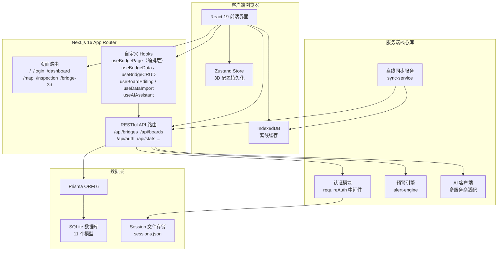
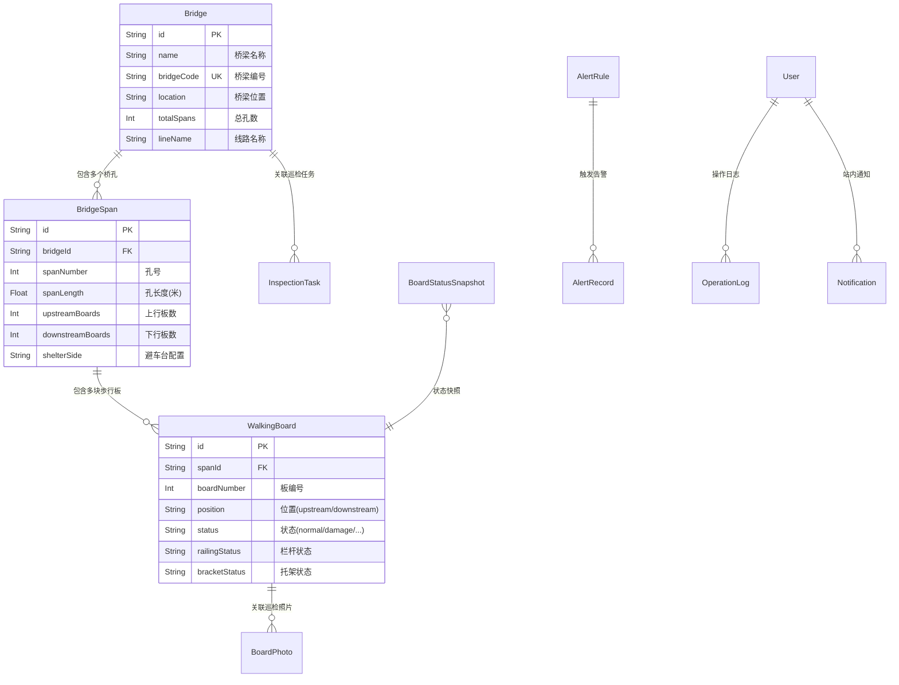

**铁路明桥面步行板可视化管理系统**（Railway Open-Deck Bridge Walking Board Visual Management System）是一套面向铁路一线工人的步行板安全巡检与隐患标注可视化平台。系统以 **桥梁 → 桥孔 → 步行板** 三级数据模型为核心，通过 2D 网格与 3D 桥梁模型直观展示每块步行板的健康状态，帮助作业人员快速定位隐患、预防安全事故发生。系统采用 Next.js 16 App Router 全栈架构，搭配 Prisma ORM + SQLite 持久层，Three.js 程序化 3D 渲染引擎，以及 Recharts 数据可视化图表，实现从数据采集、巡检标注到智能预警的全链路闭环管理。

Sources: [README.md](README.md#L1-L5), [src/app/layout.tsx](src/app/layout.tsx#L17-L19)

## 业务背景与核心概念

**明桥面**是铁路桥梁的一种常见结构形式，其桥面不铺设道砟和轨道板，钢轨直接固定在桥枕（木质或钢质枕木）上。行人通过时需要借助专用的**步行板**——一种铺设在桥梁两侧的金属或复合材料板材。由于长期承受自然侵蚀和列车振动，步行板可能出现裂纹、变形、锈蚀甚至断裂等安全隐患，需要定期巡检并记录状态。

本系统正是为解决这一业务痛点而设计：将传统的纸质巡检记录数字化，将抽象的损坏数据可视化为直观的颜色编码网格和三维模型，并通过预警规则引擎实现自动化的风险评估和通知推送。

Sources: [src/lib/bridge-constants.ts](src/lib/bridge-constants.ts#L18-L74)

## 系统架构总览

系统采用**单体全栈**架构，前端与后端 API 统一在 Next.js App Router 中实现。以下是核心架构关系图：

**前端**使用 React 19 + Tailwind CSS v4 + shadcn/ui（50+ 组件）构建，通过自定义 Hooks 架构实现关注点分离——最顶层的 `useBridgePage` 作为编排层（Orchestrator），组合 `useBridgeData`、`useBridgeCRUD`、`useBoardEditing`、`useDataImport`、`useAIAssistant` 五个子 Hook，各自管理独立的状态域和业务逻辑。

**后端**基于 Next.js Route Handler 实现 RESTful API，所有受保护路由通过 `requireAuth()` 统一鉴权中间件进行认证和 RBAC 权限校验。数据库层使用 Prisma ORM 操作 SQLite，共定义 11 个数据模型。

Sources: [src/hooks/useBridgePage.tsx](src/hooks/useBridgePage.tsx#L17-L61), [src/components/Providers.tsx](src/components/Providers.tsx#L1-L13), [src/lib/auth/index.ts](src/lib/auth/index.ts#L68-L80)

## 三级数据模型

系统的业务核心围绕 **桥梁 → 桥孔 → 步行板** 三级层级结构组织：

每座 **桥梁**（Bridge）包含若干 **桥孔**（BridgeSpan），每个桥孔内根据上行/下行方向排列多块 **步行板**（WalkingBoard）。步行板的 `position` 字段标识其物理位置（`upstream` 上行、`downstream` 下行、`shelter_left/shelter_right` 避车台），`columnIndex` 标识其所在列号，支持多列排列。

Sources: [prisma/schema.prisma](prisma/schema.prisma#L14-L98), [src/types/bridge.ts](src/types/bridge.ts#L1-L52)

## 核心功能模块

| 功能模块 | 说明 | 关键路由/文件 |
|---------|------|-------------|
| **2D 网格可视化** | 按孔位展示步行板颜色编码网格，支持单孔/整桥模式切换 | [src/components/bridge/Bridge2DView.tsx](src/components/bridge/Bridge2DView.tsx) |
| **3D 桥梁模型** | Three.js 程序化生成桥梁，PBR 材质、多渲染模式、可调参数 | [src/components/3d/HomeBridge3D.tsx](src/components/3d/HomeBridge3D.tsx) |
| **步行板编辑** | 单块编辑与批量编辑，覆盖状态/栏杆/托架/防滑等全属性 | [src/hooks/useBoardEditing.ts](src/hooks/useBoardEditing.ts) |
| **预警规则引擎** | 9 条内置规则，自动评估 + 去重 + 快照保存 | [src/lib/alert-engine.ts](src/lib/alert-engine.ts#L1-L39) |
| **AI 安全分析** | 多模型 AI 助手（GLM/OpenAI/Claude/DeepSeek 等） | [src/lib/ai-client.ts](src/lib/ai-client.ts#L1-L30) |
| **数据总览仪表盘** | 桥梁健康排名、损坏分布饼图、趋势分析图表 | [src/app/dashboard/page.tsx](src/app/dashboard/page.tsx#L1-L40) |
| **Excel 导入导出** | 多 Sheet 批量导入（事务保护）、高级导出（4 Sheet） | [src/hooks/useDataImport.ts](src/hooks/useDataImport.ts) |
| **离线支持** | IndexedDB 本地存储 + 网络恢复后自动同步 | [src/lib/offline-db.ts](src/lib/offline-db.ts#L1-L14), [src/lib/sync-service.ts](src/lib/sync-service.ts#L15-L38) |
| **巡检任务管理** | 任务创建、分配、状态流转（待处理 → 进行中 → 已完成） | [src/app/inspection/page.tsx](src/app/inspection/page.tsx) |
| **RBAC 权限控制** | 四级角色（admin/manager/user/viewer）前后端双重校验 | [src/lib/auth/index.ts](src/lib/auth/index.ts#L27-L48) |

Sources: [README.md](README.md#L16-L97)

## 步行板状态与颜色编码

步行板的健康状态是整个系统的核心数据维度，共有 6 种状态，每种状态对应特定的颜色编码和视觉反馈：

| 状态 | 标识 | 颜色 | 含义 | 视觉特效 |
|------|------|------|------|---------|
| 正常 | `normal` | 🟢 绿色 `#22c55e` | 无损坏，状态良好 | 柔和光晕 |
| 轻微损坏 | `minor_damage` | 🟡 黄色 `#eab308` | 表面磨损或轻微变形 | 霓虹黄光晕 |
| 严重损坏 | `severe_damage` | 🟠 橙色 `#f97316` | 明显变形、开裂 | 霓虹黄光晕 |
| 断裂风险 | `fracture_risk` | 🔴 红色 `#ef4444` | 存在断裂危险 | **红色闪烁边框** |
| 已更换 | `replaced` | 🔵 蓝色 `#3b82f6` | 已完成更换 | 无特效 |
| 缺失 | `missing` | ⚪ 灰色 `#6b7280` | 步行板不存在 | 无特效 |

其中 **断裂风险**（`fracture_risk`）状态使用 `danger-pulse` 和 `fracture-border-blink` CSS 动画类实现红色闪烁效果，在视觉上突出最高优先级的危险信号。

Sources: [src/lib/bridge-constants.ts](src/lib/bridge-constants.ts#L18-L74)

## 页面路由结构

系统采用 Next.js App Router 的基于文件系统的路由方案，共有 7 个主要页面：

| 路由 | 页面功能 | 布局特点 |
|------|---------|---------|
| `/` | **主应用页面** — 桥梁步行板可视化管理的核心工作台 | 桥梁选择器 + 2D/3D 视图 + 右侧边栏（AI 助手/预警中心） |
| `/login` | **用户登录** — 含账户锁定机制（5 次错误锁定 15 分钟） | 独立全屏布局 |
| `/dashboard` | **数据总览仪表盘** — 全局统计图表与健康排名 | 仪表盘布局 + Recharts 图表 |
| `/map` | **桥梁地图** — SVG 风格化地图展示桥梁位置 | 地图可视化布局 |
| `/inspection` | **巡检任务管理** — 任务看板与状态跟踪 | 看板布局 |
| `/bridge-3d` | **3D 查看器** — 独立全屏 3D 桥梁模型查看 | 全屏沉浸式布局 |
| `/users` | **用户管理** — 用户 CRUD（仅管理员可访问） | 管理表格布局 |

Sources: [README.md](README.md#L128-L139), [src/app/layout.tsx](src/app/layout.tsx#L32-L49)

## 技术栈概览

| 层级 | 技术选型 | 版本 | 职责 |
|------|---------|------|------|
| **全栈框架** | Next.js (App Router) | ^16.1.1 | SSR/CSR、路由、API Route Handler |
| **前端框架** | React | ^19.0.0 | 组件化 UI 构建 |
| **语言** | TypeScript | ^5 | 全栈类型安全 |
| **样式方案** | Tailwind CSS v4 + tw-animate-css | ^4 | 原子化 CSS + 动画 |
| **UI 组件库** | shadcn/ui (New York 风格) | — | 50+ 可复用组件 |
| **数据库** | SQLite (via Prisma ORM) | ^6.11.1 | 轻量级嵌入式数据库 |
| **3D 渲染** | Three.js | ^0.183.2 | 程序化桥梁模型 + PBR 材质 |
| **状态管理** | Zustand + React useState | ^5.0.6 | 3D 配置持久化 + 页面状态 |
| **数据请求** | @tanstack/react-query | ^5.82.0 | 服务端数据缓存与同步 |
| **图表** | Recharts | ^2.15.4 | 统计图表与趋势分析 |
| **Excel 处理** | xlsx (SheetJS) | ^0.18.5 | 批量导入导出 |
| **PDF 导出** | jspdf + html2canvas | — | 安全分析报告生成 |
| **表单验证** | react-hook-form + zod | — | 表单管理 + Schema 校验 |
| **动画** | Framer Motion | ^12.23.2 | 交互动效与过渡 |
| **离线存储** | IndexedDB（原生封装） | — | 离线编辑记录与数据缓存 |

Sources: [package.json](package.json#L15-L101), [README.md](README.md#L100-L125)

## 认证与权限体系

系统实现了基于 Session Token 的无状态认证和四级 RBAC 权限控制：

**认证流程**：用户登录后，服务端通过 PBKDF2（10000 次 SHA-512 迭代）验证密码，生成 64 字节随机 Token 并写入文件持久化的 Session 存储（7 天有效期）。客户端将 Token 存储在 `localStorage` 中，后续请求通过 `Authorization: Bearer <token>` 头部携带。

**权限模型**：采用 `resource:action` 格式的权限标识（如 `bridge:read`、`board:write`、`data:import`），由 `requireAuth()` 中间件在 API 层统一拦截，前端通过 `hasPermission()` 函数按权限条件渲染按钮和操作入口。

Sources: [src/lib/auth/index.ts](src/lib/auth/index.ts#L7-L80), [src/lib/session-store.ts](src/lib/session-store.ts#L1-L10), [src/lib/bridge-constants.ts](src/lib/bridge-constants.ts#L126-L136)

## 离线支持架构

系统具备完整的离线工作能力，通过 **IndexedDB + 自动同步服务** 实现：

**离线写入**：当网络不可用时，步行板和桥梁的编辑操作会被记录到 IndexedDB 的 `edits` 存储中，每条记录包含操作类型（`create/update/delete`）和完整数据载荷。

**自动同步**：`SyncService` 监听 `online/offline` 事件，网络恢复后自动遍历未同步记录，逐条调用对应 API 完成数据回传。同步完成后清理 7 天前的已同步记录。同步间隔默认 30 秒。

Sources: [src/lib/offline-db.ts](src/lib/offline-db.ts#L1-L14), [src/lib/sync-service.ts](src/lib/sync-service.ts#L15-L38)

## 推荐阅读路径

作为项目的入门文档，建议按照以下顺序深入了解系统的各个层面：

1. 🚀 **环境搭建** → [快速启动：环境配置与首次运行](2-kuai-su-qi-dong-huan-jing-pei-zhi-yu-shou-ci-yun-xing) — 在本地运行项目
2. 📁 **代码结构** → [项目目录结构与模块职责](3-xiang-mu-mu-lu-jie-gou-yu-mo-kuai-zhi-ze) — 理解文件组织方式
3. 🔧 **技术栈** → [技术栈总览：Next.js 16 + Prisma + Three.js](4-ji-zhu-zhan-zong-lan-next-js-16-prisma-three-js) — 掌握核心技术选型
4. 🎨 **状态体系** → [步行板状态体系与颜色编码规范](5-bu-xing-ban-zhuang-tai-ti-xi-yu-yan-se-bian-ma-gui-fan) — 理解核心业务概念
5. 📊 **数据模型** → [三级数据模型：桥梁 → 桥孔 → 步行板](6-san-ji-shu-ju-mo-xing-qiao-liang-qiao-kong-bu-xing-ban) — 深入数据架构设计