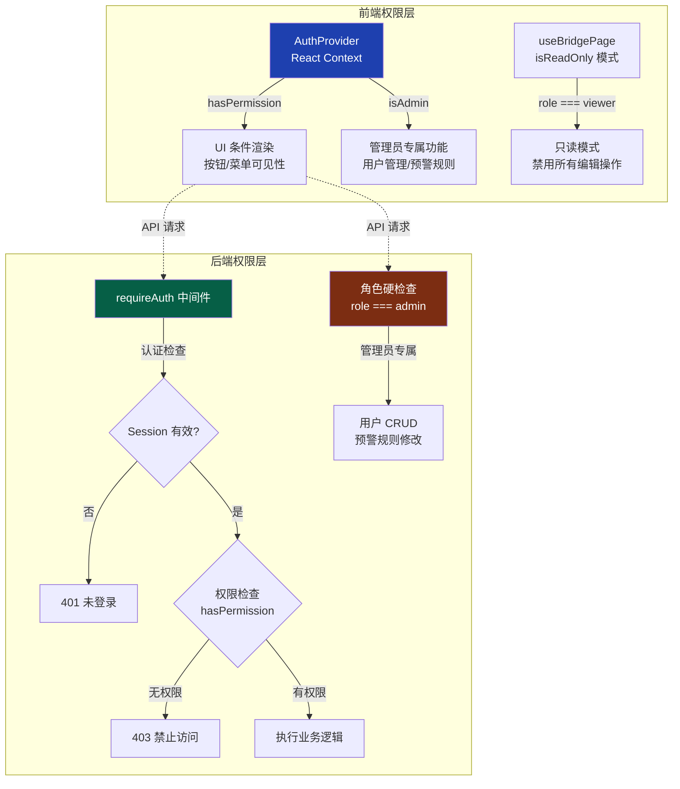
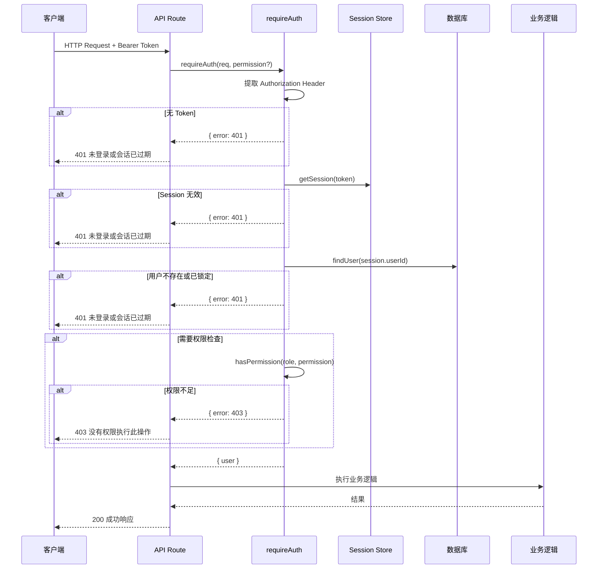

本系统采用经典的 **RBAC（Role-Based Access Control，基于角色的访问控制）** 模型，围绕铁路桥梁步行板管理的真实业务场景，定义了四个层级分明、权限递减的角色：**系统管理员** → **桥梁管理者** → **普通用户（user）** → **只读用户**。权限以 `module:action` 二段式字符串编码，贯穿前后端：服务端通过 `requireAuth` 中间件在 API 层强制校验，客户端通过 React Context 在 UI 层条件渲染——形成完整的双层权限防护。

Sources: [index.ts](src/lib/auth/index.ts#L27-L59), [schema.prisma](prisma/schema.prisma#L112-L129)

## 角色定义与权限矩阵

系统在 `ROLE_PERMISSIONS` 常量中集中声明了四个角色的权限配置。`admin` 角色使用通配符 `*` 表示全权限，其余角色逐级收缩可操作范围。下表完整呈现了每个角色在各权限维度上的能力：

| 权限标识 | 功能说明 | admin | manager | user | viewer |
|---|---|---|---|---|---|
| `bridge:read` | 查看桥梁列表与详情 | ✅ | ✅ | ✅ | ✅ |
| `bridge:write` | 创建/编辑桥梁信息 | ✅ | ✅ | ❌ | ❌ |
| `bridge:delete` | 删除桥梁及关联数据 | ✅ | ✅ | ❌ | ❌ |
| `span:read` | 查看桥孔配置 | ✅ | ✅ | ✅ | ✅ |
| `span:write` | 修改桥孔配置 | ✅ | ✅ | ❌ | ❌ |
| `board:read` | 查看步行板状态 | ✅ | ✅ | ✅ | ✅ |
| `board:write` | 编辑步行板状态 | ✅ | ✅ | ❌\* | ❌ |
| `log:read` | 查看操作日志 | ✅ | ✅ | ❌ | ❌ |
| `data:import` | 导入桥梁数据 | ✅ | ✅ | ❌ | ❌ |
| `data:export` | 导出桥梁数据/Excel | ✅ | ✅ | ❌ | ❌ |
| `ai:use` | 使用 AI 助手对话/分析 | ✅ | ✅ | ❌ | ❌ |
| `user:read` | 查看用户列表 | ✅ | ❌\*\* | ❌ | ❌ |
| `admin` (特殊) | 预警规则管理 | ✅ | ❌ | ❌ | ❌ |
| 用户 CRUD | 创建/删除/管理用户 | ✅ | ❌ | ❌ | ❌ |

> \* 注：前端 `usePermission` Hook（[context.tsx](src/lib/auth/context.tsx#L138-L143)）在 `user` 角色中额外声明了 `board:write`，允许普通用户更新步行板；但后端 `ROLE_PERMISSIONS`（[index.ts](src/lib/auth/index.ts#L39-L41)）中 `user` 角色仅包含 `board:read`。实际写入操作的放行由后端最终裁定。
>
> \*\* 前端 `usePermission` Hook 为 `manager` 额外声明了 `user:read`，允许管理者在弹窗中查看用户列表；后端通过 `hasPermission(user.role, 'user:read') || user.role === 'admin'` 做了兼容处理。

Sources: [index.ts](src/lib/auth/index.ts#L27-L48), [context.tsx](src/lib/auth/context.tsx#L130-L158), [AuthProvider.tsx](src/components/auth/AuthProvider.tsx#L119-L128)

## 架构总览：双层权限校验

系统采用**前后端双重校验**策略，前端负责 UI 层面的权限控制（隐藏无权操作的按钮/菜单），后端负责 API 层面的安全拦截（返回 401/403 错误码）。这种设计确保了即使客户端被绕过，服务端仍然是最终的安全屏障。



前端 `AuthProvider` 从 `localStorage` 读取用户信息后，将 `hasPermission` 函数注入 Context，供全应用消费。后端 `requireAuth` 中间件从请求头提取 Bearer Token，经由文件 Session 机制验证身份后再校验权限。

Sources: [AuthProvider.tsx](src/components/auth/AuthProvider.tsx#L65-L150), [index.ts](src/lib/auth/index.ts#L68-L80), [useBridgePage.tsx](src/hooks/useBridgePage.tsx#L100-L124)

## 后端权限校验机制

### requireAuth 统一中间件

后端 API 路由的核心权限入口是 `requireAuth` 函数。它接受 `Request` 对象和可选的 `permission` 字符串，返回认证成功的用户对象或错误响应。当不传 `permission` 参数时，仅验证登录状态。

```typescript
// 调用模式一：仅验证登录
const auth = await requireAuth(request)
if (auth.error) return auth.error

// 调用模式二：登录 + 权限校验
const auth = await requireAuth(request, 'bridge:write')
if (auth.error) return auth.error
```

`hasPermission` 内部实现了通配符优先逻辑：如果角色的权限列表包含 `*`，直接返回 `true`，不再逐一匹配。这一设计使 `admin` 角色自动获得未来新增的所有权限，无需手动维护。

Sources: [index.ts](src/lib/auth/index.ts#L52-L80)

### API 路由权限映射

下表梳理了所有 API 路由与所需权限的精确对应关系：

| API 路由 | HTTP 方法 | 所需权限 | 校验方式 |
|---|---|---|---|
| `/api/bridges` | GET | `bridge:read` | requireAuth |
| `/api/bridges` | POST | `bridge:write` | requireAuth |
| `/api/bridges` | PUT | `bridge:write` | requireAuth |
| `/api/bridges` | DELETE | `bridge:delete` | requireAuth |
| `/api/spans` | PUT | `span:write` | requireAuth |
| `/api/boards` | GET | `board:read` | requireAuth |
| `/api/boards` | PUT | `board:write` | requireAuth |
| `/api/boards` | POST（批量） | `board:write` | requireAuth |
| `/api/stats` | GET | `bridge:read` | requireAuth |
| `/api/inspection` | GET | `bridge:read` | requireAuth |
| `/api/inspection` | POST/PUT | `bridge:write` | requireAuth |
| `/api/inspection` | DELETE | `bridge:delete` | requireAuth |
| `/api/logs` | GET | `log:read` 或 admin | authenticateRequest + hasPermission |
| `/api/data` | GET | `data:export` | requireAuth |
| `/api/data` | POST | `data:import` | requireAuth |
| `/api/data/excel` | GET | `data:export` | requireAuth |
| `/api/data/excel` | POST | `data:import` | requireAuth |
| `/api/export` | GET | `data:export` | requireAuth |
| `/api/ai/chat` | POST | `ai:use` | requireAuth |
| `/api/ai/analyze` | POST | `ai:use` | requireAuth |
| `/api/alerts` | GET | `board:read` | requireAuth |
| `/api/alerts` | PUT | `board:write` | requireAuth |
| `/api/alert-rules` | GET | `board:read` | requireAuth |
| `/api/alert-rules` | PUT | `admin` (字符串) | requireAuth |
| `/api/notifications` | GET/PUT | 仅登录验证 | Session 直接校验 |
| `/api/users` | GET | `user:read` 或 admin | 手动校验 |
| `/api/users` | POST | `admin` 角色 | 角色硬编码 |
| `/api/users` | PUT | admin (角色/状态) / 自身 (基本信息) | 分层校验 |
| `/api/users` | DELETE | `admin` 角色 | 角色硬编码 |

Sources: [bridges/route.ts](src/app/api/bridges/route.ts#L8-L9), [boards/route.ts](src/app/api/boards/route.ts#L15-L16), [spans/route.ts](src/app/api/spans/route.ts#L83-L84), [users/route.ts](src/app/api/users/route.ts#L25-L26), [logs/route.ts](src/app/api/logs/route.ts#L17-L23), [data/route.ts](src/app/api/data/route.ts#L8-L9), [ai/chat/route.ts](src/app/api/ai/chat/route.ts#L7-L8), [inspection/route.ts](src/app/api/inspection/route.ts#L8-L9), [alert-rules/route.ts](src/app/api/alert-rules/route.ts#L10-L11), [alerts/route.ts](src/app/api/alerts/route.ts#L19-L20), [notifications/route.ts](src/app/api/notifications/route.ts#L8-L16)

### 用户管理的特殊权限逻辑

用户管理模块（`/api/users`）的权限控制比其他模块更为精细，采用了**分层授权**策略：

1. **用户列表查询（GET）**：admin 角色直接放行；manager 角色通过 `user:read` 权限检查（后端做了 `hasPermission(user.role, 'user:read') || user.role === 'admin'` 兼容判断）
2. **创建用户（POST）**：硬编码 `currentUser.role !== 'admin'` 判断，仅管理员可创建
3. **更新用户（PUT）**：非管理员只能修改自己的基本信息；只有 admin 才能修改其他用户的**角色**和**状态**字段
4. **删除用户（DELETE）**：硬编码 admin 判断，并增加**不能删除自己**的业务约束

```typescript
// 更新用户时的分层授权示例
// 只有管理员可以修改角色和状态
if (currentUser.role === 'admin') {
  if (role !== undefined) updateData.role = role
  if (status !== undefined) updateData.status = status
}
```

Sources: [users/route.ts](src/app/api/users/route.ts#L64-L80), [users/route.ts](src/app/api/users/route.ts#L180-L212), [users/route.ts](src/app/api/users/route.ts#L254-L289)

## 前端权限控制

### AuthProvider Context

`AuthProvider` 组件是前端权限的核心提供者。它在应用启动时从 `localStorage` 读取已登录用户的 `token` 和 `user` 信息，通过 React Context 向全应用暴露 `user`、`hasPermission`、`isAdmin` 等接口。

前端权限声明采用**独立映射表**模式——即前端在自己的代码中重新声明了角色-权限的对应关系，而非从后端拉取。这保证了 UI 响应的即时性（无需网络请求），但需与后端保持同步。

Sources: [AuthProvider.tsx](src/components/auth/AuthProvider.tsx#L65-L150)

### usePermission Hook

`src/lib/auth/context.tsx` 中额外导出了 `usePermission` Hook，提供了更丰富的角色判断工具：

| 方法 | 说明 | 实现逻辑 |
|---|---|---|
| `hasPermission(permission)` | 检查当前用户是否拥有指定权限 | admin 通配放行 + 角色映射表匹配 |
| `isAdmin()` | 判断是否为管理员角色 | `user.role === 'admin'` |
| `isManager()` | 判断是否为管理层级 | `role === 'admin' || role === 'manager'` |

`isManager()` 是一个**角色层级判断**方法，它将 admin 和 manager 归为同一管理层级，适用于需要同时向这两个角色展示的管理功能（如日志查看、数据导入导出）。

Sources: [context.tsx](src/lib/auth/context.tsx#L129-L158)

### 只读模式与 UI 条件渲染

前端通过两种机制控制 UI 的可操作性：

**1. isReadOnly 模式**：`useBridgePage` Hook 检测到 `viewer` 角色时，自动启用全局只读模式，禁用所有编辑操作按钮和表单控件。

```typescript
if (user.role === 'viewer') setIsReadOnly(true)
```

**2. hasPermission 条件渲染**：主页面通过 `hasPermission` 函数动态控制功能按钮的显示与隐藏。例如"新建桥梁"按钮需要 `bridge:write` 权限，"操作日志"按钮需要 `log:read` 权限。不具备权限的用户根本看不到对应入口。

Sources: [useBridgePage.tsx](src/hooks/useBridgePage.tsx#L100-L124)

### 用户管理页面的权限守卫

`/users` 页面采用**服务端驱动的权限校验**策略，而非前端本地判断。页面加载时直接请求 `/api/users` 接口：

- 如果 API 返回 **401**（未登录），自动跳转登录页
- 如果 API 返回 **403**（无权限），显示"您没有权限访问此页面"并跳转首页
- 如果 API 返回 **200**，正常渲染用户管理界面

这种设计避免了前端篡改 localStorage 中的角色字段来绕过权限检查的风险——真正的权限判定始终在服务端完成。

Sources: [users/page.tsx](src/app/users/page.tsx#L37-L49), [users/page.tsx](src/app/users/page.tsx#L79-L126)

## 角色徽章与前端展示

系统在多处 UI 组件中为角色分配了**语义化颜色徽章**，帮助管理员快速辨识用户权限级别。角色颜色配置在用户管理组件中定义如下：

| 角色 | 徽章颜色 | 标签文字 | 说明 |
|---|---|---|---|
| `admin` | 🟣 紫色 (`bg-purple-500`) | 管理员 | 拥有所有权限 |
| `manager` | 🔵 蓝色 (`bg-blue-500`) | 管理者 | 管理桥梁数据和日志 |
| `user` | 🔵 青色 (`bg-cyan-500`) | 用户 | 查看和更新步行板 |
| `viewer` | ⚫ 灰色 (`bg-gray-500`) | 访客 | 只能查看数据 |

Sources: [UserManagementDialog.tsx](src/components/user/UserManagementDialog.tsx#L163-L172), [users/page.tsx](src/app/users/page.tsx#L37-L42), [bridge-constants.ts](src/lib/bridge-constants.ts#L117-L123)

## 请求认证流程

每个 API 请求的认证和授权遵循统一的处理链路。下图描述了从客户端发起请求到最终返回结果的完整决策流程：



Sources: [index.ts](src/lib/auth/index.ts#L68-L80), [index.ts](src/lib/auth/index.ts#L159-L181)

## 默认管理员账户

系统通过 `createDefaultAdmin` 函数在首次启动时自动创建默认管理员账户，确保系统初始化后即可登录管理。该函数检查 `admin` 用户名是否已存在，仅在不存在时创建。

| 字段 | 值 |
|---|---|
| 用户名 | `admin` |
| 默认密码 | `admin123` |
| 角色 | `admin` |
| 状态 | `active` |

> ⚠️ **安全提示**：默认密码 `admin123` 仅用于初始部署，生产环境中应立即通过密码修改功能更新为强密码。更多安全策略请参考 [登录安全：密码哈希与账户锁定策略](11-deng-lu-an-quan-mi-ma-ha-xi-yu-zhang-hu-suo-ding-ce-lue)。

Sources: [index.ts](src/lib/auth/index.ts#L136-L153)

## 设计特点与架构决策

本系统的 RBAC 实现体现了几个关键的架构决策：

**1. 权限粒度选择 `module:action` 模式**：采用 `bridge:read`、`board:write` 这种二段式编码，既保持了可读性，又为未来扩展提供了清晰的命名空间。新增权限（如 `task:write`）只需在 `ROLE_PERMISSIONS` 中追加即可。

**2. 前后端独立声明，后端为权威**：前端和后端各自维护一份角色-权限映射表。前端声明用于 UI 响应速度，后端声明用于安全屏障。两者需要手动保持同步，这是该架构的主要维护成本。

**3. admin 通配符设计**：`admin` 角色使用 `*` 通配符，使其自动获得所有新增权限，避免了每次扩展权限时都需要更新管理员配置的问题。同时，部分 API（如用户删除、预警规则修改）采用 `role === 'admin'` 硬编码判断，即使通配符匹配逻辑被修改，这些关键操作仍然仅限管理员。

**4. 操作日志审计**：所有涉及数据变更的操作（创建用户、删除桥梁、更新步行板等）都通过 `logOperation` 函数记录到 `OperationLog` 表中，包含操作人、操作类型、变更前后的数据快照、IP 地址等信息，为权限审计提供了完整的追溯链。

Sources: [index.ts](src/lib/auth/index.ts#L97-L133)

## 相关阅读

- [基于文件的 Session 会话管理机制](9-ji-yu-wen-jian-de-session-hui-hua-guan-li-ji-zhi) — 了解 `requireAuth` 依赖的底层会话存储实现
- [requireAuth 统一鉴权中间件](13-requireauth-tong-jian-quan-zhong-jian-jian) — 深入理解中间件的参数签名与使用规范
- [登录安全：密码哈希与账户锁定策略](11-deng-lu-an-quan-mi-ma-ha-xi-yu-zhang-hu-suo-ding-ce-lue) — 认证安全相关的密码哈希与防暴力破解机制