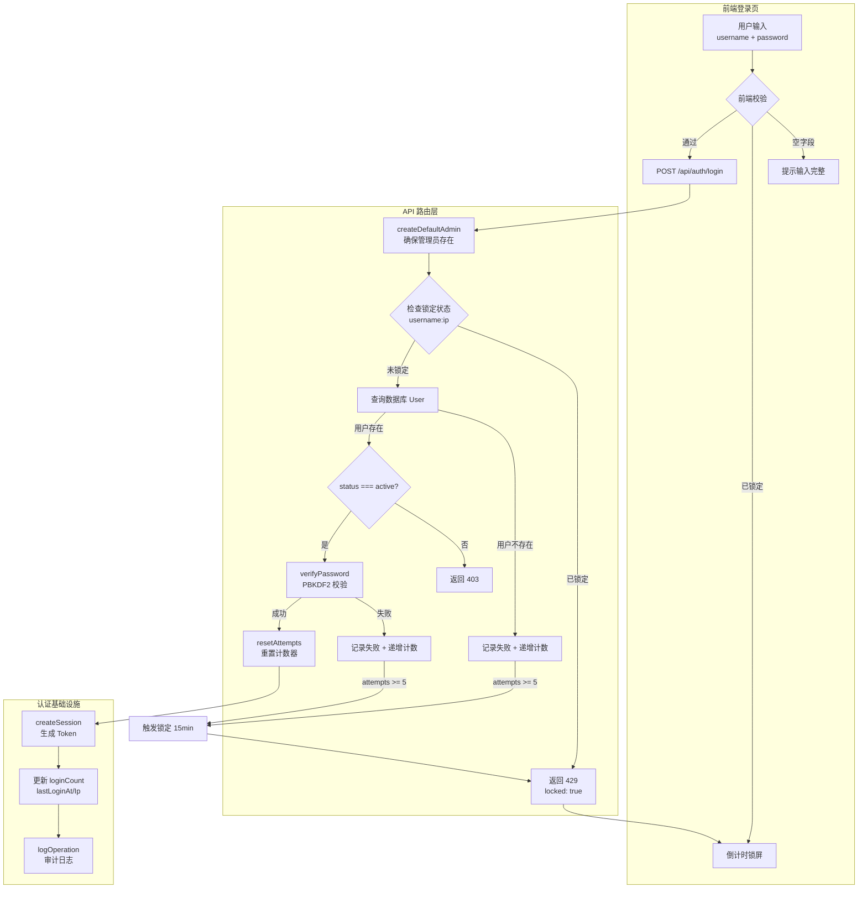
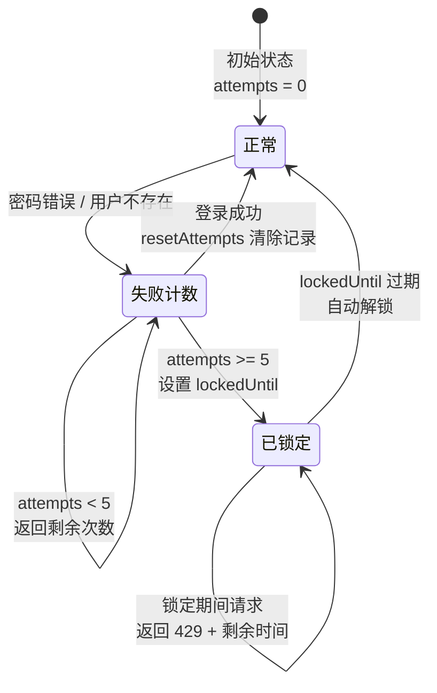
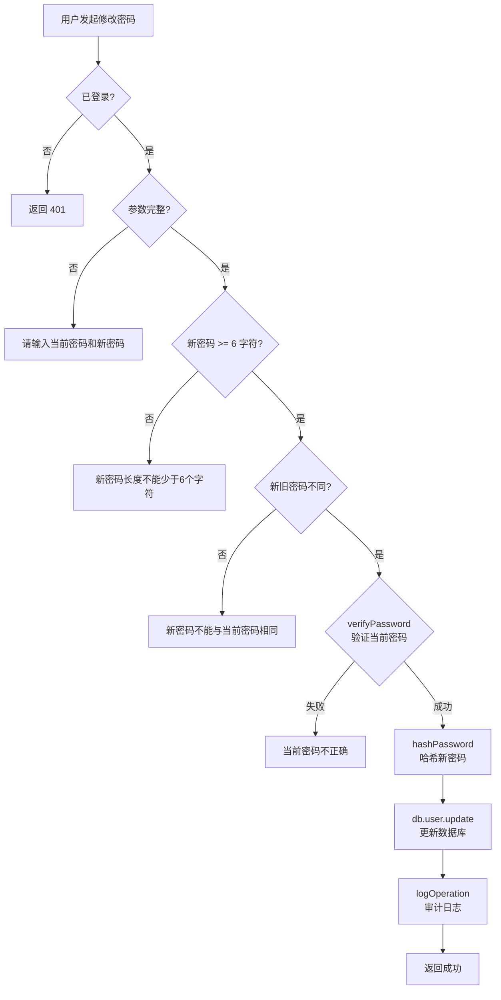

本页深入解析系统的登录安全架构，涵盖 **密码哈希算法选型与实现**、**基于 IP+用户名的双重维度账户锁定机制**、**密码修改的安全校验流程**，以及前端如何配合后端构建完整的防暴力破解防线。这些策略共同构成了系统认证层的第一道安全屏障，确保即使在低安全性密码场景下，也能有效遏制暴力破解和撞库攻击。

Sources: [index.ts](src/lib/auth/index.ts#L1-L11), [login/route.ts](src/app/api/auth/login/route.ts#L1-L62)

## 安全架构总览

登录安全并非单一技术点，而是一条从前端表单到后端校验、再到日志审计的完整防御链路。以下架构图展示了各模块在登录流程中的协同关系：



整个安全体系由三个核心模块支撑：`src/lib/auth/index.ts` 提供密码哈希与验证的基础函数，`src/app/api/auth/login/route.ts` 实现锁定逻辑与登录流程编排，`src/app/login/page.tsx` 在前端呈现锁定倒计时与剩余尝试次数的实时反馈。

Sources: [index.ts](src/lib/auth/index.ts#L1-L182), [login/route.ts](src/app/api/auth/login/route.ts#L1-L254), [page.tsx](src/app/login/page.tsx#L1-L244)

## PBKDF2 密码哈希：加盐 + 迭代的单向变换

系统采用 **PBKDF2-HMAC-SHA512** 算法对用户密码进行不可逆哈希，而非存储明文或使用简单哈希（如 MD5/SHA-256 直接哈希）。这一选择基于以下安全考量：

| 安全属性 | 实现方式 | 对抗的威胁 |
|---------|---------|-----------|
| **不可逆** | SHA-512 单向哈希 | 数据库泄露后无法反推密码 |
| **加盐（Salt）** | 每次哈希生成 16 字节随机盐 | 阻止彩虹表攻击 |
| **迭代（Iterations）** | 10,000 次迭代计算 | 增加暴力破解的计算成本 |
| **密钥长度** | 64 字节派生密钥 | 提供足够的密钥空间 |

### 哈希与验证的核心实现

```
// 存储格式: salt:hash
// 示例: a3f2b8c1...:9e7d4f2a...
```

**哈希函数** `hashPassword` 接收明文密码，生成 16 字节随机盐值，经 PBKDF2 算法迭代 10,000 次后输出 64 字节的 SHA-512 派生密钥，最终以 `salt:hash` 格式拼接存储。这意味着即使两个用户使用相同密码，由于盐值不同，存储的哈希值也完全不同。

Sources: [index.ts](src/lib/auth/index.ts#L7-L11)

**验证函数** `verifyPassword` 从存储的 `salt:hash` 中拆分出盐值，使用相同参数（迭代次数 10,000、密钥长度 64、算法 SHA-512）对用户输入的密码重新派生哈希，然后通过恒定时间比较（`===`）判断是否匹配。盐值缺失时直接返回 `false`，防止格式异常导致的误判。

Sources: [index.ts](src/lib/auth/index.ts#L14-L19)

### 密码哈希在系统中的应用场景

密码哈希函数在三个关键场景中被调用：

| 场景 | 调用位置 | 说明 |
|------|---------|------|
| **用户登录** | `login/route.ts` → `verifyPassword` | 验证输入密码与存储哈希是否匹配 |
| **创建用户** | `users/route.ts` → `hashPassword` | 管理员创建新用户时哈希初始密码 |
| **修改密码** | `change-password/route.ts` → `verifyPassword` + `hashPassword` | 先验证旧密码，再哈希新密码存储 |

默认管理员账户的创建也使用此函数：系统首次启动时 `createDefaultAdmin` 以 `hashPassword('admin123')` 生成初始管理员的密码哈希，确保数据库中不出现明文密码。

Sources: [index.ts](src/lib/auth/index.ts#L136-L153), [users/route.ts](src/app/api/users/route.ts#L111-L122), [change-password/route.ts](src/app/api/auth/change-password/route.ts#L49-L60)

## 账户锁定策略：IP + 用户名的双维度追踪

系统的账户锁定机制并非简单的全局计数器，而是以 **`username:clientIP`** 复合键追踪每个登录组合的失败次数。这一设计意味着同一用户在不同 IP 上的失败互不影响，同一 IP 对不同用户的试探也独立计算，从而在防暴力破解与防误锁之间取得平衡。

### 锁定参数配置

| 参数 | 值 | 说明 |
|------|---|------|
| `MAX_ATTEMPTS` | 5 | 最大允许连续失败次数 |
| `LOCKOUT_DURATION` | 15 × 60 × 1000 ms（15 分钟） | 锁定持续时间 |
| 追踪键 | `username:clientIP` | 复合维度的锁定粒度 |
| 存储方式 | 内存 `Map<string, LockoutInfo>` | 进程级非持久化 |

Sources: [login/route.ts](src/app/api/auth/login/route.ts#L14-L23)

### 锁定状态的四步流转



**第一步：前置检查** — 每次登录请求首先通过 `getLockoutKey(username, clientIP)` 构建追踪键，调用 `getLockoutInfo` 获取当前锁定状态。`isLockedOut` 函数检查 `lockedUntil` 时间戳是否仍在未来，若已过期则视为未锁定。

Sources: [login/route.ts](src/app/api/auth/login/route.ts#L83-L109)

**第二步：失败记录** — 当用户不存在或密码错误时，`recordFailure` 函数递增 `attempts` 计数器。关键逻辑在于：如果之前的锁定已过期，会先重置计数器再递增，避免过期后的失败次数叠加到旧的锁定周期上。一旦 `attempts` 达到 `MAX_ATTEMPTS`（5 次），立即设置 `lockedUntil = Date.now() + 15分钟`。

Sources: [login/route.ts](src/app/api/auth/login/route.ts#L44-L57)

**第三步：成功重置** — 登录成功时调用 `resetAttempts`，直接从 Map 中删除该键，清除所有失败记录。这确保了用户成功登录后不会遗留过时的失败计数。

Sources: [login/route.ts](src/app/api/auth/login/route.ts#L59-L61), [login/route.ts](src/app/api/auth/login/route.ts#L202-L203)

**第四步：信息泄露防护** — 值得注意的是，即使用户名不存在，系统也调用 `recordFailure` 递增失败计数并返回"密码错误"而非"用户不存在"的提示，这是防止攻击者通过错误信息差异枚举有效用户名的标准做法。

Sources: [login/route.ts](src/app/api/auth/login/route.ts#L116-L146)

## 登录流程的完整执行路径

登录接口 `POST /api/auth/login` 的执行路径包含了从初始化到响应的完整安全检查链：

| 阶段 | 操作 | 失败响应 |
|------|------|---------|
| ① 初始化 | `createDefaultAdmin()` + `seedAlertRules()` | — |
| ② 参数校验 | 检查 username / password 非空 | 400: `请输入用户名和密码` |
| ③ 锁定检查 | `isLockedOut(lockoutInfo)` | 429: `账户已锁定，请 15 分钟后重试` |
| ④ 用户查询 | `db.user.findUnique({ username })` | 401: `密码错误...`（隐匿用户不存在） |
| ⑤ 状态检查 | `user.status !== 'active'` | 403: `账户已被禁用或锁定` |
| ⑥ 密码验证 | `verifyPassword(password, user.password)` | 401: `密码错误，还剩 N 次尝试机会` |
| ⑦ 成功处理 | 重置计数 → 创建会话 → 更新登录信息 → 审计日志 | 200: `{ token, user }` |

每个失败阶段都会调用 `logOperation` 记录详细的操作日志，包括客户端 IP、User-Agent 和错误原因，为后续安全审计提供完整的追踪数据。

Sources: [login/route.ts](src/app/api/auth/login/route.ts#L64-L253)

## 密码修改的五重校验防线

密码修改接口 `POST /api/auth/change-password` 在前后端均实现了多层验证，确保密码变更过程的安全性：



**后端校验规则**（`change-password/route.ts`）按严格顺序执行：① 认证检查 → ② 参数非空检查 → ③ 新密码长度 ≥ 6 字符 → ④ 新旧密码不能相同 → ⑤ 当前密码正确性验证。任何一步失败都会中止操作并返回明确的错误信息。

Sources: [change-password/route.ts](src/app/api/auth/change-password/route.ts#L13-L85)

**前端密码强度检测** — `ChangePasswordDialog` 组件实现了基于多维度评分的密码强度指示器，通过五项评分标准（长度 ≥ 6、长度 ≥ 10、包含大写字母、包含数字、包含特殊字符）将密码强度划分为弱（红）、中（黄）、强（绿）三级：

| 评分分值 | 强度等级 | 颜色标识 | 满足条件 |
|---------|---------|---------|---------|
| 0-2 分 | 弱 | 🔴 红色 | 仅满足 1-2 项标准 |
| 3 分 | 中 | 🟡 黄色 | 满足 3 项标准 |
| 4-5 分 | 强 | 🟢 绿色 | 满足 4-5 项标准 |

前端提交按钮通过 `canSubmit` 综合条件控制：当前密码已输入、新密码 ≥ 6 字符、确认密码已输入且匹配、新旧密码不同、且不在加载状态时才可提交。

Sources: [ChangePasswordDialog.tsx](src/components/auth/ChangePasswordDialog.tsx#L17-L50), [ChangePasswordDialog.tsx](src/components/auth/ChangePasswordDialog.tsx#L67-L96)

## 前端锁定状态的用户体验设计

登录页面 `src/app/login/page.tsx` 在接收到后端锁定响应后，实现了完整的客户端倒计时与视觉反馈机制，确保用户在锁定期间获得清晰的状态感知而非困惑的报错。

### 状态管理模型

前端通过四个状态变量追踪锁定相关的 UI 表现：

| 状态变量 | 类型 | 用途 |
|---------|------|------|
| `locked` | `boolean` | 是否处于锁定状态 |
| `lockedUntil` | `number \| null` | 锁定到期的时间戳（ms） |
| `remainingSeconds` | `number` | 剩余锁定秒数（实时递减） |
| `remainingAttempts` | `number \| null` | 剩余尝试次数 |

Sources: [page.tsx](src/app/login/page.tsx#L25-L28)

### 倒计时实现机制

锁定状态的倒计时通过 `useEffect` + `setInterval` 实现，每秒调用 `updateCountdown` 重新计算 `lockedUntil - Date.now()` 的差值。当倒计时归零时，自动清除 `locked` 和 `lockedUntil` 状态，恢复表单可用性。`formatCountdown` 函数将秒数格式化为 `MM:SS` 的可读格式（如 `14:30`）。

Sources: [page.tsx](src/app/login/page.tsx#L31-L56)

### 锁定期间的视觉反馈

锁定激活时，登录页呈现三重视觉信号：

- **红色警告卡片**：包含 `ShieldAlert` 图标和"账户已锁定"标题，配有 `MM:SS` 格式的实时倒计时，以及"连续 5 次登录失败"的原因说明。
- **按钮状态切换**：提交按钮从"登 录"变为"已锁定 MM:SS"，并显示 `ShieldAlert` 图标，同时表单输入框和按钮均被 `disabled`。
- **琥珀色剩余次数提示**：非锁定状态下密码错误时，显示剩余尝试次数的琥珀色警告条，提示用户谨慎输入。

Sources: [page.tsx](src/app/login/page.tsx#L192-L236)

## 安全特性与架构限制

### 已实现的安全特性

| 特性 | 实现方式 | 安全效果 |
|------|---------|---------|
| 密码不可逆存储 | PBKDF2-SHA512 加盐哈希 | 数据库泄露后无法反推密码 |
| 防暴力破解 | 5 次失败锁定 15 分钟 | 每个组合每小时最多尝试 20 次 |
| 防用户枚举 | 用户不存在时返回"密码错误" | 阻止攻击者探测有效账户 |
| 审计追踪 | 每次登录/修改密码写入 OperationLog | 事后可追溯异常行为 |
| 密码修改鉴权 | 需验证当前密码 + 长度 + 新旧不同 | 防止未授权密码变更 |
| IP 维度追踪 | username:IP 复合键锁定 | 减少共享 IP 场景下的误锁影响 |

Sources: [index.ts](src/lib/auth/index.ts#L7-L19), [login/route.ts](src/app/api/auth/login/route.ts#L13-L61)

### 架构限制与改进方向

当前实现采用**进程内存 Map** 存储锁定信息，这在单进程部署（如本系统的 PM2 单实例模式）下工作正常，但存在以下已知限制：

| 限制 | 影响 | 潜在改进方案 |
|------|------|------------|
| **进程重启丢失** | 锁定状态在服务重启后清零 | 迁移至 Redis 或数据库持久化 |
| **多实例不共享** | PM2 集群模式下各实例独立计数 | 使用分布式缓存（Redis） |
| **内存无上限** | 大量 IP 攻击可能导致 Map 增长 | 添加 LRU 淘汰或定期清理机制 |
| **最小密码长度 6 位** | 强度要求偏低 | 前端强制 8 位 + 复杂度要求 |

Sources: [login/route.ts](src/app/api/auth/login/route.ts#L22-L23)

这些限制源于系统的轻量化部署定位（SQLite + 单进程），对于内网或受控环境下的铁路桥梁管理场景，当前的内存锁定策略在性能与安全性之间取得了合理的平衡。

---

**关联阅读**：

- 了解密码哈希验证后如何管理会话生命周期，请参阅 [基于文件的 Session 会话管理机制](9-ji-yu-wen-jian-de-session-hui-hua-guan-li-ji-zhi)
- 了解登录后的权限控制体系，请参阅 [RBAC 四级角色权限控制体系](10-rbac-si-ji-jiao-se-quan-xian-kong-zhi-ti-xi)
- 了解统一鉴权中间件如何校验每次请求，请参阅 [requireAuth 统一鉴权中间件](13-requireauth-tong-jian-quan-zhong-jian-jian)