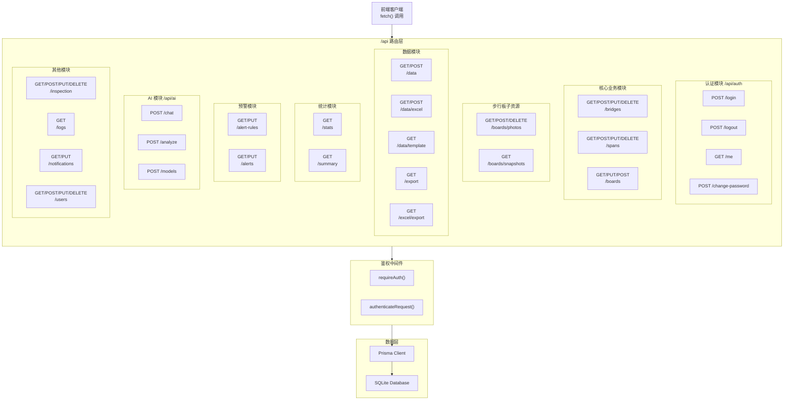
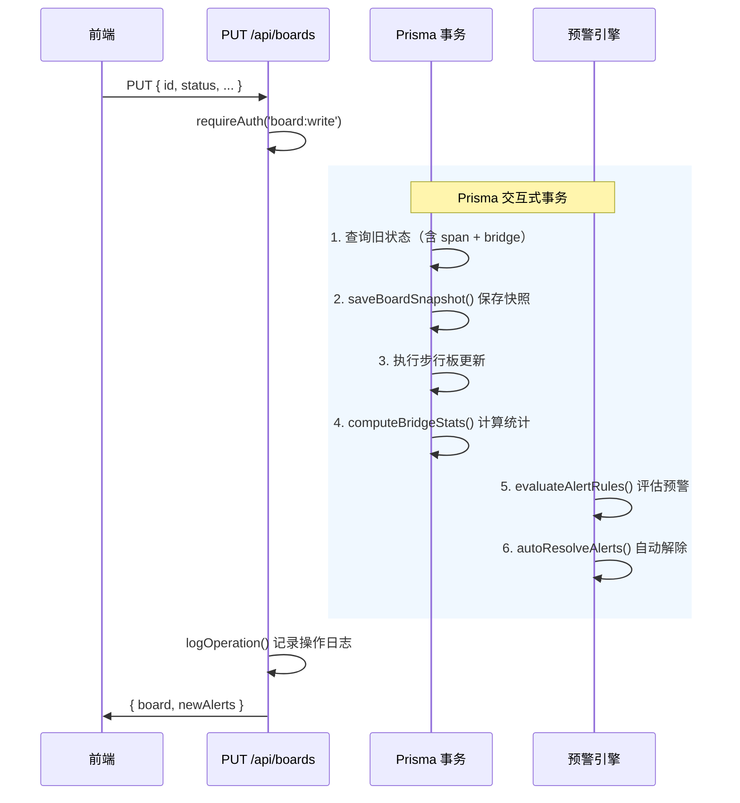

本文档系统性地解析铁路明桥面步行板可视化管理系统中的 **RESTful API 路由架构**。项目基于 Next.js App Router 的文件系统路由机制，在 `src/app/api/` 目录下组织了 20 个独立的路由端点，覆盖认证、桥梁管理、步行板操作、数据导入导出、AI 集成、预警引擎和巡检任务等核心业务模块。你将了解到路由的组织逻辑、HTTP 语义映射规范、统一鉴权模式、响应格式约定以及每个端点的职责边界。

Sources: [route.ts](src/app/api/route.ts#L1-L5)

## 路由架构总览

Next.js App Router 采用**基于文件系统的约定式路由**——每个 `route.ts` 文件即一个独立的 API 端点，通过导出名为 `GET`、`POST`、`PUT`、`DELETE` 的异步函数来声明该端点支持的 HTTP 方法。这种设计使得路由结构与业务领域直接对齐，无需手动注册路由表。



上图展示了从客户端请求到数据库的完整请求链路。每个 API 端点在执行业务逻辑前，必须经过 **鉴权中间件**（`requireAuth` 或 `authenticateRequest`）的身份校验和权限检查，随后通过 Prisma Client 与底层数据库交互。

Sources: [auth/index.ts](src/lib/auth/index.ts#L68-L80)

## 目录结构与路由映射

`src/app/api/` 下的每个目录对应一个 API 端点，子目录表达**资源嵌套关系**。以下是完整的目录结构与其路由映射关系：

```
src/app/api/
├── route.ts                          →  GET  /api                      (健康检查)
├── auth/                             →  认证模块
│   ├── login/route.ts                →  POST /api/auth/login
│   ├── logout/route.ts               →  POST /api/auth/logout
│   ├── me/route.ts                   →  GET  /api/auth/me
│   └── change-password/route.ts      →  POST /api/auth/change-password
├── bridges/route.ts                  →  GET/POST/PUT/DELETE /api/bridges
├── spans/route.ts                    →  GET/POST/PUT/DELETE /api/spans
├── boards/                           →  步行板资源（含子资源）
│   ├── route.ts                      →  GET/PUT/POST /api/boards
│   ├── photos/route.ts               →  GET/POST/DELETE /api/boards/photos
│   └── snapshots/route.ts            →  GET /api/boards/snapshots
├── data/                             →  数据导入导出（JSON）
│   ├── route.ts                      →  GET/POST /api/data
│   ├── excel/route.ts                →  GET/POST /api/data/excel
│   └── template/route.ts             →  GET /api/data/template
├── export/route.ts                   →  GET /api/export
├── excel/export/route.ts             →  GET /api/excel/export
├── stats/route.ts                    →  GET /api/stats
├── summary/route.ts                  →  GET /api/summary
├── alert-rules/route.ts              →  GET/PUT /api/alert-rules
├── alerts/route.ts                   →  GET/PUT /api/alerts
├── ai/                               →  AI 集成模块
│   ├── chat/route.ts                 →  POST /api/ai/chat
│   ├── analyze/route.ts              →  POST /api/ai/analyze
│   └── models/route.ts               →  POST /api/ai/models
├── inspection/route.ts               →  GET/POST/PUT/DELETE /api/inspection
├── logs/route.ts                     →  GET /api/logs
├── notifications/route.ts            →  GET/PUT /api/notifications
└── users/route.ts                    →  GET/POST/PUT/DELETE/OPTIONS /api/users
```

需要注意一个设计细节：**数据导出功能分布在多个端点中**。`/api/data`（JSON 格式）、`/api/data/excel`（Excel 格式）、`/api/export`（JSON 精简格式）和 `/api/excel/export`（Excel 增强格式）提供了不同粒度和格式的导出能力，它们分别服务于不同的前端使用场景。

Sources: [api directory structure](src/app/api)

## HTTP 方法语义与资源操作映射

本系统严格遵循 **RESTful 语义约定**，将 HTTP 方法与 CRUD 操作一一映射。下表汇总了各端点支持的方法及其语义：

| HTTP 方法 | CRUD 语义 | 请求体来源 | ID 定位方式 | 典型端点 |
|-----------|-----------|-----------|------------|---------|
| **GET** | 读取/查询 | URL `searchParams` | `?id=xxx` 或 `?bridgeId=xxx` | `/bridges`, `/boards`, `/stats` |
| **POST** | 创建/操作 | `request.json()` 或 `formData` | 不需要（新建） | `/bridges`, `/auth/login`, `/boards` |
| **PUT** | 更新/修改 | `request.json()` | Body 中 `id` 字段 | `/bridges`, `/boards`, `/users` |
| **DELETE** | 删除 | URL `searchParams` | `?id=xxx` | `/bridges`, `/spans`, `/inspection` |
| **OPTIONS** | 元数据 | 无 | 无 | `/users`（权限配置查询） |

一个值得注意的**设计偏差**是 `DELETE` 方法的参数传递——标准 RESTful 实践通常将资源 ID 编码在 URL 路径中（如 `DELETE /bridges/:id`），而本系统统一采用 Query String 方式（`DELETE /bridges?id=xxx`）。这是 Next.js App Router 文件系统路由的固有约束：要实现路径参数，需要引入动态路由段 `[id]/route.ts`，会增加文件数量和管理复杂度。当前方案在文件组织简洁性与 REST 纯度之间选择了前者。

Sources: [bridges/route.ts](src/app/api/bridges/route.ts#L309-L331), [inspection/route.ts](src/app/api/inspection/route.ts#L155-L176), [boards/photos/route.ts](src/app/api/boards/photos/route.ts#L104-L130)

## 统一鉴权模式

系统存在两种鉴权模式，形成了一个**渐进式权限校验体系**：

### 模式一：`requireAuth` —— 权限级鉴权（推荐）

```typescript
// 标准用法：校验登录状态 + 特定权限
const auth = await requireAuth(request, 'bridge:write')
if (auth.error) return auth.error
// auth.user 可用
```

`requireAuth` 是系统推荐的统一鉴权入口。它内部执行两步校验：首先通过 `authenticateRequest` 从 `Authorization: Bearer <token>` 头部提取并验证 Session Token；然后调用 `hasPermission` 检查当前用户角色是否拥有指定的权限字符串。任一环节失败，直接返回 401 或 403 错误响应。

这种模式被**绝大多数业务端点**采用，包括 `/bridges`、`/boards`、`/spans`、`/alert-rules`、`/inspection`、`/ai/*` 等。

Sources: [auth/index.ts](src/lib/auth/index.ts#L68-L80)

### 模式二：`authenticateRequest` + 手动权限检查（遗留模式）

```typescript
// 仅校验登录，手动检查角色
const user = await authenticateRequest(request)
if (!user) return NextResponse.json({ error: '...' }, { status: 401 })
if (user.role !== 'admin') return NextResponse.json({ error: '...' }, { status: 403 })
```

此模式仅在 `/users` 和 `/logs` 端点中使用。这些端点的权限逻辑较为特殊——需要直接检查角色（如 `admin`）而非细粒度权限字符串，因此保留了手动判断方式。两种模式返回的错误响应结构也略有不同：`requireAuth` 返回 `{ success: false, error: '...' }`，而手动模式在某些端点中直接返回 `{ error: '...' }`。

Sources: [users/route.ts](src/app/api/users/route.ts#L14-L30), [logs/route.ts](src/app/api/logs/route.ts#L7-L23)

### 权限矩阵总览

下表展示了各端点所需的权限字符串与角色对应关系：

| 权限字符串 | 允许的角色 | 使用的端点 |
|-----------|-----------|-----------|
| `bridge:read` | admin, manager, user, viewer | `/bridges` GET, `/spans` GET, `/stats`, `/summary`, `/inspection` GET |
| `bridge:write` | admin, manager | `/bridges` POST/PUT, `/spans` POST/PUT/DELETE, `/inspection` POST/PUT |
| `bridge:delete` | admin, manager | `/bridges` DELETE, `/inspection` DELETE |
| `board:read` | admin, manager, user, viewer | `/boards` GET, `/boards/snapshots`, `/boards/photos` GET, `/alert-rules` GET, `/alerts` GET |
| `board:write` | admin, manager | `/boards` PUT/POST, `/boards/photos` POST/DELETE, `/alerts` PUT |
| `data:export` | admin, manager | `/data` GET, `/data/excel` GET, `/data/template`, `/export`, `/excel/export` |
| `data:import` | admin, manager | `/data` POST, `/data/excel` POST |
| `ai:use` | admin, manager | `/ai/chat`, `/ai/analyze`, `/ai/models` |
| `admin`（特殊） | admin only | `/alert-rules` PUT |
| 无权限（仅登录） | 所有已登录用户 | `/auth/me`, `/auth/logout`, `/auth/change-password` |

Sources: [auth/index.ts](src/lib/auth/index.ts#L27-L48)

## 响应格式约定

系统中的 API 端点存在**两种响应格式风格**，这与端点的实现时间线和鉴权模式选择有关：

### 风格一：直接数据返回

```json
// GET /api/bridges → 直接返回 Prisma 查询结果数组
[{ "id": "...", "name": "黄河大桥", "spans": [...] }]
```

这种风格在早期实现的核心业务端点中使用：`/bridges`、`/boards`、`/spans`、`/stats`、`/summary`、`/inspection`。其特点是返回值直接是 Prisma 查询结果，不包裹额外的信封层。

Sources: [bridges/route.ts](src/app/api/bridges/route.ts#L10-L21)

### 风格二：信封包裹返回

```json
{
  "success": true,
  "data": { ... },
  "pagination": { "page": 1, "pageSize": 30, "total": 100, "totalPages": 4 }
}
```

这种风格在后实现的端点中使用：`/users`、`/logs`、`/alerts`、`/alert-rules`、`/notifications`、`/export`。其特点是始终包含 `success` 字段，有效数据放在 `data` 中，支持分页的端点还会附加 `pagination` 对象。

Sources: [alerts/route.ts](src/app/api/alerts/route.ts#L64-L69), [logs/route.ts](src/app/api/logs/route.ts#L98-L107)

### 错误响应格式

错误响应在两种风格中也有所不同，但核心字段一致：

| HTTP 状态码 | 触发条件 | 响应示例 |
|------------|---------|---------|
| **400** | 参数缺失/无效 | `{ "error": "桥梁名称和编号为必填项" }` |
| **401** | 未登录或 Token 过期 | `{ "success": false, "error": "未登录或会话已过期" }` |
| **403** | 权限不足 | `{ "success": false, "error": "没有权限执行此操作" }` |
| **404** | 资源不存在 | `{ "error": "桥梁不存在" }` |
| **429** | 登录锁定 | `{ "success": false, "error": "账户已锁定", "locked": true, "remainingMinutes": 15 }` |
| **500** | 服务器内部错误 | `{ "error": "获取桥梁列表失败" }` |

Sources: [bridges/route.ts](src/app/api/bridges/route.ts#L38-L48), [auth/login/route.ts](src/app/api/auth/login/route.ts#L102-L108)

## 完整 API 端点参考

下表是系统全部 20 个 API 端点的方法、功能与参数的完整索引：

| 端点 | 方法 | 功能 | 关键参数 | 权限 |
|------|------|------|---------|------|
| `/api` | GET | 健康检查 | 无 | 无 |
| `/api/auth/login` | POST | 用户登录 | `username`, `password` | 无 |
| `/api/auth/logout` | POST | 用户登出 | Bearer Token | 已登录 |
| `/api/auth/me` | GET | 获取当前用户信息 | Bearer Token | 已登录 |
| `/api/auth/change-password` | POST | 修改密码 | `currentPassword`, `newPassword` | 已登录 |
| `/api/bridges` | GET | 获取所有桥梁（含桥孔和步行板） | 无 | `bridge:read` |
| `/api/bridges` | POST | 创建新桥梁（支持复制模式） | `name`, `bridgeCode`, `spans[]`, `copyFromBridgeId?` | `bridge:write` |
| `/api/bridges` | PUT | 更新桥梁基本信息 | `id`, `name?`, `bridgeCode?`, `location?`, `lineName?` | `bridge:write` |
| `/api/bridges` | DELETE | 删除桥梁 | `?id=xxx` | `bridge:delete` |
| `/api/spans` | PUT | 更新孔位配置（可重新生成步行板） | `id`, 各配置字段, `regenerateBoards?` | `span:write` |
| `/api/spans` | POST | 添加新孔位（自动编号移位） | `bridgeId`, `insertPosition?`, 各配置字段 | `span:write` |
| `/api/spans` | DELETE | 删除孔位（自动重新编号） | `?id=xxx` | `span:write` |
| `/api/boards` | GET | 查询步行板（按孔位或桥梁） | `?spanId=xxx` 或 `?bridgeId=xxx` | `board:read` |
| `/api/boards` | PUT | 单板更新（含快照+预警评估事务） | `id`, 各状态字段 | `board:write` |
| `/api/boards` | POST | 批量操作（三种模式） | 见下方详细说明 | `board:write` |
| `/api/boards/photos` | GET | 获取步行板照片列表 | `?boardId=xxx` | `board:read` |
| `/api/boards/photos` | POST | 上传步行板照片（FormData） | `boardId`, `photo`(File), `description?` | `board:write` |
| `/api/boards/photos` | DELETE | 删除步行板照片 | `?photoId=xxx` | `board:write` |
| `/api/boards/snapshots` | GET | 状态历史快照（趋势图数据） | `?bridgeId=xxx`, `?groupBy=month/week/day` | `board:read` |
| `/api/data` | GET | 导出全部桥梁 JSON 数据 | 无 | `data:export` |
| `/api/data` | POST | 导入桥梁 JSON 数据 | `bridges[]`, `mode=merge/replace` | `data:import` |
| `/api/data/excel` | GET | 导出 Excel（三表结构） | 无 | `data:export` |
| `/api/data/excel` | POST | 导入 Excel（FormData） | `file`(File), `mode=merge/replace` | `data:import` |
| `/api/data/template` | GET | 下载导入模板 Excel | 无 | `data:export` |
| `/api/export` | GET | 精简 JSON 导出 | `?bridgeId=xxx`（可选） | `data:export` |
| `/api/excel/export` | GET | 增强 Excel 导出（四表结构+统计汇总） | `?bridgeId=xxx`（可选） | `data:export` |
| `/api/stats` | GET | 单桥统计数据 | `?bridgeId=xxx` | `bridge:read` |
| `/api/summary` | GET | 全桥汇总统计 | 无 | `bridge:read` |
| `/api/alert-rules` | GET | 列出预警规则（含活跃告警数） | 无 | `board:read` |
| `/api/alert-rules` | PUT | 更新规则（启用/禁用/修改等级） | `id`, `enabled?`, `severity?` | `admin` |
| `/api/alerts` | GET | 查询告警记录（分页+过滤+统计） | `?severity=`, `?status=`, `?bridgeId=`, `?page=`, `?pageSize=` | `board:read` |
| `/api/alerts` | PUT | 解决/忽略告警 | `id`, `status=resolved/dismissed`, `resolveNote?` | `board:write` |
| `/api/ai/chat` | POST | AI 对话（含桥梁上下文） | `message`, `bridgeId?`, `history?`, `config` | `ai:use` |
| `/api/ai/analyze` | POST | AI 桥梁安全分析报告 | `bridgeId`, `config` | `ai:use` |
| `/api/ai/models` | POST | 获取 AI 服务商可用模型列表 | `provider`, `apiKey`, `baseUrl?` | `ai:use` |
| `/api/inspection` | GET | 获取巡检任务列表 | `?bridgeId=`, `?status=` | `bridge:read` |
| `/api/inspection` | POST | 创建巡检任务 | `bridgeId`, `dueDate`, `assignedTo?`, `priority?` | `bridge:write` |
| `/api/inspection` | PUT | 更新巡检任务状态 | `id`, `status?`, `assignedTo?`, `priority?` | `bridge:write` |
| `/api/inspection` | DELETE | 删除巡检任务 | `?id=xxx` | `bridge:delete` |
| `/api/logs` | GET | 查询操作日志（分页+过滤） | `?action=`, `?module=`, `?username=`, `?startDate=`, `?endDate=`, `?page=`, `?pageSize=` | admin / `log:read` |
| `/api/notifications` | GET | 获取当前用户通知 | `?unreadOnly=true`, `?limit=50` | 已登录 |
| `/api/notifications` | PUT | 标记通知已读 | `action=markRead/markAllRead`, `ids?` | 已登录 |
| `/api/users` | GET | 获取用户列表 | 无 | admin / `user:read` |
| `/api/users` | POST | 创建新用户 | `username`, `password`, `name?`, `email?`, `role?` | admin |
| `/api/users` | PUT | 更新用户信息 | `id`, 各字段 | admin / 本人 |
| `/api/users` | DELETE | 删除用户 | `?id=xxx` | admin |
| `/api/users` | OPTIONS | 获取角色权限配置 | 无 | 无 |

Sources: [bridges/route.ts](src/app/api/bridges/route.ts#L1-L332), [boards/route.ts](src/app/api/boards/route.ts#L1-L494), [spans/route.ts](src/app/api/spans/route.ts#L1-L411), [users/route.ts](src/app/api/users/route.ts#L1-L342)

## 核心设计模式

### 模式一：事务化操作 + 快照 + 预警评估联动

步行板更新操作（`PUT /api/boards` 和 `POST /api/boards`）是系统中**最复杂的 API 逻辑**。它不是简单的 CRUD 更新，而是一个 6 步事务化流程：



这种设计确保了**数据变更 → 历史快照 → 预警触发 → 告警自动解除**的完整链路在一个数据库事务中原子完成，避免了状态不一致的风险。

Sources: [boards/route.ts](src/app/api/boards/route.ts#L55-L199)

### 模式二：批量操作的多模式分发

`POST /api/boards` 通过请求体结构判断操作模式，实现了三种批量操作在同一个端点中共存：

| 模式 | 请求体特征 | 行为 |
|------|-----------|------|
| **指定板批量更新** | `{ updates: [{ id, status, ... }] }` | 逐个更新指定 ID 的步行板 |
| **按孔位+位置批量** | `{ spanId, position?, status }` | `updateMany` 更新该孔位特定位置的所有板 |
| **整孔批量更新** | `{ spanId, status }`（无 position） | `updateMany` 更新该孔位全部板 |

这种 **Body-driven routing** 模式虽然不是严格的 RESTful 风格，但在 Next.js App Router 的文件系统约束下，提供了一种灵活的批量操作方案。

Sources: [boards/route.ts](src/app/api/boards/route.ts#L202-L493)

### 模式三：桥孔编号的事务化自动重排

`/api/spans` 的 POST（添加孔位）和 DELETE（删除孔位）操作都会触发**桥孔编号的自动重排**。以添加为例：

```
原有编号: [1] [2] [3] [4]
在第 2 孔位插入: [1] [NEW→2] [原2→3] [原3→4] [原4→5]
```

实现上采用**从后向前递减更新**的策略，避免唯一约束冲突。整个过程封装在 Prisma 交互式事务中，确保原子性。

Sources: [spans/route.ts](src/app/api/spans/route.ts#L250-L325), [spans/route.ts](src/app/api/spans/route.ts#L362-L384)

### 模式四：查询参数驱动的条件过滤

GET 端点广泛使用 URL Query String 作为过滤和分页参数。系统形成了一套统一的参数约定：

| 参数类型 | 典型参数 | 约定 |
|---------|---------|------|
| 资源过滤 | `bridgeId`, `spanId`, `status`, `severity` | 缺失时不过滤 |
| 分页控制 | `page`（默认 1）, `pageSize`（默认 30-50，上限 100） | `Math.min()` 限制上限 |
| 时间范围 | `startDate`, `endDate`（`YYYY-MM-DD` 格式） | 结束日期自动补全到 `23:59:59` |
| 聚合粒度 | `groupBy`（`day/week/month`） | 默认 `month` |

Sources: [alerts/route.ts](src/app/api/alerts/route.ts#L17-L69), [logs/route.ts](src/app/api/logs/route.ts#L26-L69), [boards/snapshots/route.ts](src/app/api/boards/snapshots/route.ts#L18-L43)

## 文件上传的 FormData 处理

涉及文件上传的端点（`/api/boards/photos` POST、`/api/data/excel` POST）使用 `request.formData()` 解析 `multipart/form-data` 请求，而非标准 JSON：

```typescript
// 照片上传端点
const formData = await request.formData()
const boardId = formData.get('boardId') as string
const photo = formData.get('photo') as File

// 文件验证
if (!ALLOWED_TYPES.includes(photo.type)) return ... // 类型检查
if (photo.size > MAX_FILE_SIZE) return ...            // 大小限制（5MB）
```

照片以 Base64 编码直接存入数据库（`data:image/jpeg;base64,...`），这是一个适合小型部署的简化方案——生产环境中可考虑迁移至对象存储服务。

Sources: [boards/photos/route.ts](src/app/api/boards/photos/route.ts#L5-L68)

## AI 端点的上下文注入模式

`/api/ai/chat` 和 `/api/ai/analyze` 采用**服务端上下文注入**模式——AI 调用时不在前端传递桥梁原始数据，而是仅传递 `bridgeId`，由服务端从数据库查询完整数据后构建结构化的 system prompt：

```
当前桥梁信息：
- 名称：黄河大桥
- 编号：BR001
- 总孔数：5

当前孔详情（第2孔）：
- 上行步行板：10块
- 下行步行板：10块
步行板状态列表：
  上行 第1列 1号: normal
  上行 第1列 2号: severe_damage (大面积锈蚀)
  ...
```

这种设计避免了前端组装 prompt 可能带来的数据篡改风险，也使得 AI 始终基于最新的数据库状态进行分析。

Sources: [ai/chat/route.ts](src/app/api/ai/chat/route.ts#L29-L113)

## 后续阅读

- 了解鉴权中间件的完整实现细节，参见 [requireAuth 统一鉴权中间件](13-requireauth-tong-jian-quan-zhong-jian-jian)
- 了解步行板编辑与批量操作的完整流程，参见 [步行板单块编辑与批量操作流程](15-bu-xing-ban-dan-kuai-bian-ji-yu-pi-liang-cao-zuo-liu-cheng)
- 了解预警引擎如何与 API 联动触发，参见 [预警规则引擎：快照保存、条件评估与自动去重](16-yu-jing-gui-ze-yin-qing-kuai-zhao-bao-cun-tiao-jian-ping-gu-yu-zi-dong-qu-zhong)
- 了解 Excel 导入导出的完整实现，参见 [Excel 批量导入导出与事务保护](19-excel-pi-liang-dao-ru-dao-chu-yu-shi-wu-bao-hu)