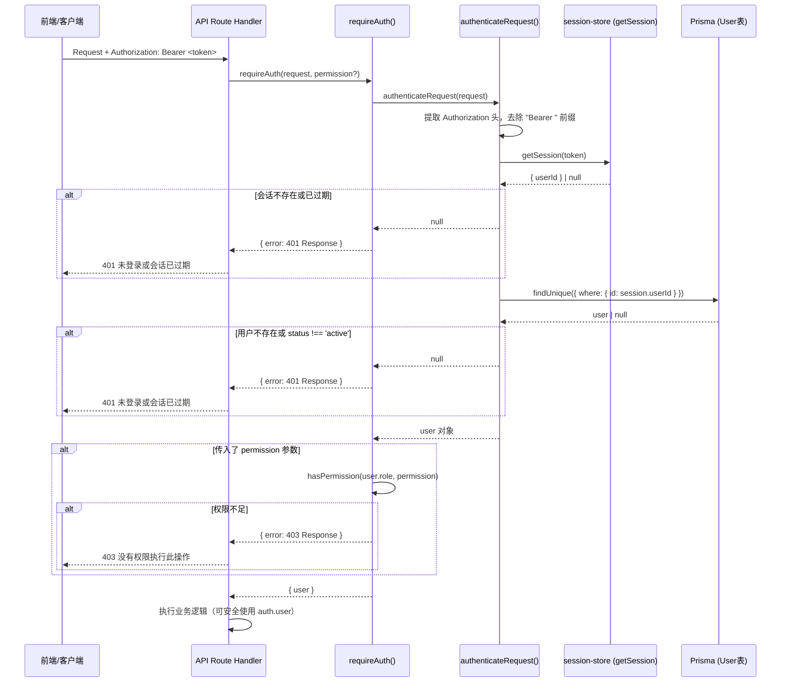
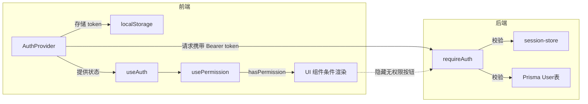

`requireAuth` 是整个系统中所有 API 路由的第一道安全关卡——它将"提取会话 → 查询用户 → 校验权限"三步合并为一个函数调用，使得路由处理函数只需两行代码即可完成完整的认证与授权。本文将从调用链拆解、权限字符串体系、实际使用模式、以及与前端的协作四个维度，深入解析这一中间件的设计与运作。

Sources: [index.ts](src/lib/auth/index.ts#L68-L80)

## 认证调用链全景

一次 API 请求从到达路由到获得用户身份，经历以下四层处理。每一层都承担明确且单一的职责，任何一环失败即终止请求并返回对应的 HTTP 错误状态码。



理解这个流程的关键在于：**`requireAuth` 的返回值类型是联合类型** `Promise<{ user: any } | { error: NextResponse }>`，调用方通过检查 `auth.error` 是否存在来决定是否提前终止。这是一种"错误即返回值"的防御性编程模式，避免了异常捕获带来的隐式控制流。

Sources: [index.ts](src/lib/auth/index.ts#L68-L80), [session-store.ts](src/lib/session-store.ts#L110-L135)

## 函数签名与参数详解

`requireAuth` 的设计哲学是**参数越少越好**——仅接受两个参数，第二个参数可选，不传则只检查登录状态而不检查具体权限。

| 参数 | 类型 | 必填 | 说明 |
|------|------|------|------|
| `request` | `Request` | ✅ | Next.js 路由收到的原始请求对象，用于提取 `Authorization` 请求头 |
| `permission` | `string` | ❌ | 权限标识符，如 `'bridge:read'`。**省略时仅验证登录状态**，不检查具体权限 |

| 返回值分支 | 结构 | HTTP 状态码 | 含义 |
|------------|------|-------------|------|
| 认证成功 | `{ user: User }` | — | 用户身份有效，`user` 包含完整的数据库用户记录 |
| 未登录 / 会话过期 | `{ error: NextResponse }` | `401` | Token 缺失、无效或过期 |
| 权限不足 | `{ error: NextResponse }` | `403` | 已登录但角色不具备所需权限 |

下面是核心函数体的完整实现，逻辑极为精炼——仅 12 行代码覆盖了两个拦截点：

```typescript
export async function requireAuth(
  request: Request,
  permission?: string
): Promise<{ user: any } | { error: NextResponse }> {
  const user = await authenticateRequest(request)        // 第一关：认证
  if (!user) {
    return { error: NextResponse.json(
      { success: false, error: '未登录或会话已过期' }, { status: 401 }
    )}
  }
  if (permission && !hasPermission(user.role, permission)) { // 第二关：授权
    return { error: NextResponse.json(
      { success: false, error: '没有权限执行此操作' }, { status: 403 }
    )}
  }
  return { user }                                         // 两关通过
}
```

Sources: [index.ts](src/lib/auth/index.ts#L68-L80)

## 认证底层：authenticateRequest 的三步校验

`requireAuth` 内部调用的 `authenticateRequest` 是真正的认证引擎，它执行三个原子步骤：

**第一步：提取 Token。** 从请求头 `Authorization` 中去除 `Bearer ` 前缀，提取裸 Token 字符串。如果请求头不存在或格式不正确，直接返回 `null`。

**第二步：查询会话。** 调用 `getSession(token)` 从基于文件的会话存储中查找对应会话。会话存储通过 `globalThis` 在内存中缓存所有活跃会话，未命中时会回退到磁盘文件重新加载。如果会话不存在或已超过 7 天有效期，返回 `null`。

**第三步：验证用户状态。** 即使会话有效，还需要确认对应用户确实存在且账户状态为 `active`。这防止了"用户被禁用后会话仍然有效"的安全漏洞。

```typescript
export async function authenticateRequest(request: Request) {
  const authHeader = request.headers.get('authorization')
  const token = authHeader?.replace('Bearer ', '')
  if (!token) return null

  const session = getSession(token)
  if (!session) return null

  const user = await db.user.findUnique({ where: { id: session.userId } })
  if (!user || user.status !== 'active') return null

  return user
}
```

Sources: [index.ts](src/lib/auth/index.ts#L159-L181), [session-store.ts](src/lib/session-store.ts#L110-L135)

## 权限体系：ROLE_PERMISSIONS 与 hasPermission

系统的 RBAC 权限模型定义在 `ROLE_PERMISSIONS` 常量中，采用**白名单 + 通配符**的混合模式。四种角色各自携带不同的权限列表，其中 `admin` 角色拥有通配符 `'*'`，自动通过所有权限检查。

| 角色 | 标签 | 权限范围 |
|------|------|----------|
| `admin` | 系统管理员 | `['*']` — 全部权限，无条件通过 |
| `manager` | 桥梁管理者 | 12 项权限 — 可读写桥梁/桥孔/步行板、查看日志、导入导出数据、使用 AI |
| `user` | 普通用户 | 3 项权限 — 仅可查看桥梁/桥孔/步行板 |
| `viewer` | 只读用户 | 3 项权限 — 与 `user` 相同，仅可查看 |

`hasPermission` 函数的实现遵循短路逻辑：如果角色拥有 `'*'` 通配符则直接返回 `true`，否则检查权限列表中是否包含目标权限字符串。这意味着新增权限标识符时，只需在 `ROLE_PERMISSIONS` 的对应角色中添加即可，无需修改判断函数。

```typescript
export function hasPermission(role: string, permission: string): boolean {
  const roleConfig = ROLE_PERMISSIONS[role as Role]
  if (!roleConfig) return false           // 未知角色 → 拒绝
  const perms = roleConfig.permissions as readonly string[]
  if (perms.includes('*')) return true    // 通配符 → 放行
  return perms.includes(permission)       // 精确匹配
}
```

Sources: [index.ts](src/lib/auth/index.ts#L27-L59)

## API 路由中的三种鉴权模式

通过审查项目中所有 API 路由的实现，可以归纳出三种与鉴权相关的编码模式。推荐使用 **模式 A**，它在简洁性和一致性之间取得了最佳平衡。

### 模式 A：requireAuth 简洁模式（推荐）

这是系统中最主流的模式，被 `bridges`、`boards`、`spans`、`stats`、`summary`、`data`、`alerts`、`alert-rules`、`inspection`、`export`、`data/excel`、`ai/chat` 等超过 12 个路由文件采用。其标志是两行固定代码完成鉴权：

```typescript
const auth = await requireAuth(request, 'bridge:read')
if (auth.error) return auth.error
// 此后 auth.user 类型安全可用
```

下面是从项目实际路由中提取的典型示例，展示了不同 HTTP 方法和权限的组合：

**只读接口（GET + 读权限）：**

```typescript
// src/app/api/bridges/route.ts — GET
const auth = await requireAuth(request, 'bridge:read')
if (auth.error) return auth.error
const bridges = await db.bridge.findMany({ ... })
```

**写入接口（POST/PUT/DELETE + 写权限）：**

```typescript
// src/app/api/boards/route.ts — PUT
const auth = await requireAuth(request, 'board:write')
if (auth.error) return auth.error
// ... 后续可安全使用 auth.user.id 记录操作日志
await logOperation({ userId: auth.user?.id, ... })
```

**仅登录检查（不传 permission 参数）：**

```typescript
// 当你只需要确认"这个人登录了"，而不关心具体权限时
const auth = await requireAuth(request)
if (auth.error) return auth.error
```

### 模式 B：authenticateRequest + hasPermission 手动模式

这种模式出现在 `users` 和 `logs` 两个路由文件中。它将认证和授权拆开执行，适用于需要**自定义错误消息**或**复杂权限判断**（如角色+ID双重校验）的场景。

```typescript
// src/app/api/users/route.ts — GET
const user = await authenticateRequest(request)
if (!user) {
  return NextResponse.json({ success: false, error: '未登录或会话已过期' }, { status: 401 })
}
if (!hasPermission(user.role, 'user:read') && user.role !== 'admin') {
  return NextResponse.json({ success: false, error: '没有权限执行此操作' }, { status: 403 })
}
```

**模式 B 的适用场景：** 当你的权限判断逻辑不是简单的"有/无"二元判定，而是涉及多种条件组合时（例如"只有管理员可以查看所有人，普通用户只能查看自己"），手动模式提供了更大的灵活性。

### 模式 C：直接操作 Session（特殊场景）

`notifications` 路由直接使用 `getSession` 从 Token 获取用户 ID，完全绕过了 `requireAuth`。这种模式仅适用于不需要 RBAC 权限校验、只需要确认"这是哪个用户"的场景（通知系统天然按用户隔离，无需角色权限）。

```typescript
// src/app/api/notifications/route.ts — GET
const token = request.headers.get('authorization')?.replace('Bearer ', '')
if (!token) return NextResponse.json({ error: '未登录' }, { status: 401 })
const session = getSession(token)
if (!session) return NextResponse.json({ error: '登录已过期' }, { status: 401 })
// 使用 session.userId 查询该用户的通知
```

**三种模式的对比总结：**

| 维度 | 模式 A (requireAuth) | 模式 B (手动拆分) | 模式 C (仅 Session) |
|------|---------------------|-------------------|---------------------|
| 代码行数 | 2 行 | 6-8 行 | 4-5 行 |
| 认证检查 | ✅ 自动 | ✅ 手动 | ✅ 手动 |
| RBAC 权限检查 | ✅ 自动 | ✅ 手动 | ❌ 无 |
| 自定义错误消息 | ❌ 统一消息 | ✅ 完全自定义 | ⚠️ 部分 |
| 用户状态检查 | ✅ 含 active 校验 | ✅ 含 active 校验 | ❌ 无 |
| 适用场景 | **绝大多数路由** | 复杂权限逻辑 | 用户级数据隔离 |
| 使用频率 | 12+ 路由文件 | 2 个路由文件 | 1 个路由文件 |

Sources: [index.ts](src/lib/auth/index.ts#L53-L80), [route.ts (bridges)](src/app/api/bridges/route.ts#L1-L9), [route.ts (boards)](src/app/api/boards/route.ts#L1-L16), [route.ts (users)](src/app/api/users/route.ts#L1-L30), [route.ts (notifications)](src/app/api/notifications/route.ts#L1-L16), [route.ts (alerts)](src/app/api/alerts/route.ts#L17-L20)

## 权限字符串与 API 路由的映射关系

项目中使用的权限标识符遵循 `{资源}:{动作}` 的命名规范。下表列出了所有 API 路由与所需权限的完整映射，可作为新增 API 接口时的权限配置参考。

| API 路由 | HTTP 方法 | 权限字符串 | 允许的角色 |
|----------|-----------|-----------|-----------|
| `/api/bridges` | GET | `bridge:read` | admin, manager, user, viewer |
| `/api/bridges` | POST | `bridge:write` | admin, manager |
| `/api/spans` | POST / PUT | `span:write` | admin, manager |
| `/api/spans` | DELETE | `span:write` | admin, manager |
| `/api/boards` | GET | `board:read` | admin, manager, user, viewer |
| `/api/boards` | PUT | `board:write` | admin, manager |
| `/api/boards` | DELETE | `bridge:delete` | admin, manager |
| `/api/stats` | GET | `bridge:read` | admin, manager, user, viewer |
| `/api/summary` | GET | `bridge:read` | admin, manager, user, viewer |
| `/api/data` | GET | `data:export` | admin, manager |
| `/api/data` | POST | `data:import` | admin, manager |
| `/api/data/excel` | GET | `data:export` | admin, manager |
| `/api/data/excel` | POST | `data:import` | admin, manager |
| `/api/export` | GET | `data:export` | admin, manager |
| `/api/alerts` | GET | `board:read` | admin, manager, user, viewer |
| `/api/alerts` | PUT | `board:write` | admin, manager |
| `/api/alert-rules` | GET | `board:read` | admin, manager, user, viewer |
| `/api/alert-rules` | PUT | `admin` | 仅 admin |
| `/api/inspection` | GET | `bridge:read` | admin, manager, user, viewer |
| `/api/inspection` | POST / PUT | `bridge:write` | admin, manager |
| `/api/inspection` | DELETE | `bridge:delete` | admin, manager |
| `/api/ai/chat` | POST | `ai:use` | admin, manager |
| `/api/logs` | GET | `log:read` | admin, manager |
| `/api/users` | GET | 手动校验 | 仅 admin |
| `/api/notifications` | GET/PUT | 无 RBAC | 所有登录用户 |

一个值得注意的设计细节：`alert-rules` 的 PUT 方法使用 `'admin'` 作为权限字符串。这不是一个标准的权限标识符，但在 `hasPermission` 的实现中，admin 角色拥有 `'*'` 通配符，因此只有 admin 角色能通过此检查——这实际上是一种"仅管理员"的快捷表达方式。

Sources: [index.ts](src/lib/auth/index.ts#L27-L48), [route.ts (bridges)](src/app/api/bridges/route.ts#L8-L31), [route.ts (alert-rules)](src/app/api/alert-rules/route.ts#L10-L50), [route.ts (ai/chat)](src/app/api/ai/chat/route.ts#L7-L8)

## 前端协作：AuthContext 与 usePermission

`requireAuth` 是服务端的守门人，而前端通过 [context.tsx](src/lib/auth/context.tsx) 中的 `useAuth` 和 `usePermission` 两个 Hook 实现了对应的客户端权限体系。两者的协作关系如下：



**前端 `usePermission`** 在客户端做第一层过滤（隐藏无权限的 UI 按钮），**后端 `requireAuth`** 在服务端做第二层拦截（拒绝越权请求）。这种双层防御确保了即使前端被绕过（如直接调用 API），后端仍然安全。

前端的 `rolePermissions` 定义与后端的 `ROLE_PERMISSIONS` **保持同步但独立维护**。这种设计牺牲了一些 DRY 原则，但换来了前后端解耦——后端新增权限不需要前端发版，反之亦然。

Sources: [context.tsx](src/lib/auth/context.tsx#L130-L158), [index.ts](src/lib/auth/index.ts#L27-L48)

## 新增 API 路由的鉴权接入指南

当你需要新增一个 API 路由时，按以下三个步骤接入鉴权体系：

**第一步：确定所需权限。** 根据接口的读写性质选择权限字符串。如果是新资源类型，需要同时在后端 `ROLE_PERMISSIONS` 和前端 `usePermission` 中添加对应的权限标识。

**第二步：在路由函数头部插入两行代码。** 

```typescript
import { requireAuth } from '@/lib/auth/index'

export async function GET(request: NextRequest) {
  const auth = await requireAuth(request, 'your:permission')
  if (auth.error) return auth.error
  
  // auth.user 现在可以安全使用
  // ... 你的业务逻辑
}
```

**第三步：在操作日志中记录用户身份。** 如果路由执行了写操作，使用 `logOperation` 记录操作者信息，其中 `userId` 和 `username` 来自 `auth.user`。

Sources: [index.ts](src/lib/auth/index.ts#L68-L80), [route.ts (boards)](src/app/api/boards/route.ts#L55-L58)

## 相关阅读

- 认证底层的会话管理机制详见 [基于文件的 Session 会话管理机制](9-ji-yu-wen-jian-de-session-hui-hua-guan-li-ji-zhi)
- 四级角色体系的详细设计参见 [RBAC 四级角色权限控制体系](10-rbac-si-ji-jiao-se-quan-xian-kong-zhi-ti-xi)
- 登录时的密码验证与锁定策略参见 [登录安全：密码哈希与账户锁定策略](11-deng-lu-an-quan-mi-ma-ha-xi-yu-zhang-hu-suo-ding-ce-lue)
- 所有使用 `requireAuth` 的路由结构参见 [RESTful API 路由结构与设计规范](12-restful-api-lu-you-jie-gou-yu-she-ji-gui-fan)