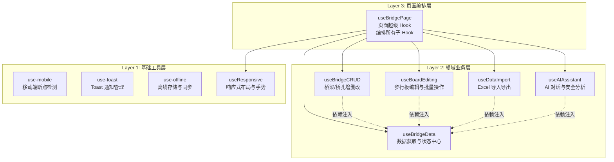
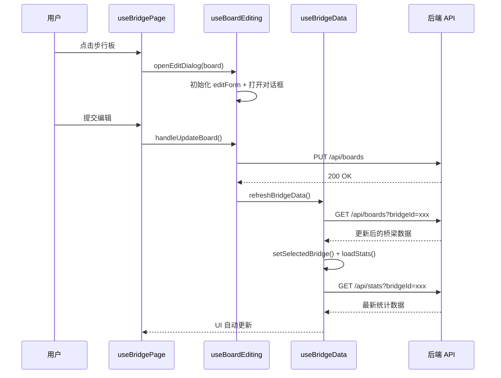

本页深入解析项目中 `src/hooks` 目录下的 10 个自定义 React Hooks 的架构设计。这些 Hooks 并非孤立存在，而是遵循一套**分层组合、依赖注入、类型契约**的设计范式——从底层基础能力到顶层页面编排，构成一个清晰的金字塔式职责体系。理解这套架构是掌握整个前端业务逻辑组织方式的关键。

Sources: [use-mobile.ts](src/hooks/use-mobile.ts#L1-L20), [use-toast.ts](src/hooks/use-toast.ts#L1-L194), [use-offline.ts](src/hooks/use-offline.ts#L1-L75), [useResponsive.ts](src/hooks/useResponsive.ts#L1-L156), [useBridgeData.ts](src/hooks/useBridgeData.ts#L1-L184), [useBoardEditing.ts](src/hooks/useBoardEditing.ts#L1-L286), [useBridgeCRUD.ts](src/hooks/useBridgeCRUD.ts#L1-L514), [useDataImport.ts](src/hooks/useDataImport.ts#L1-L224), [useAIAssistant.ts](src/hooks/useAIAssistant.ts#L1-L267), [useBridgePage.tsx](src/hooks/useBridgePage.tsx#L1-L540)

## 整体架构：三层分明的 Hooks 金字塔

在理解每个 Hook 的具体实现之前，先从宏观视角把握它们的层次关系。项目的 Hooks 按照职责抽象程度分为三层：**基础工具层**、**领域业务层**、**页面编排层**。每一层只依赖其下层提供的能力，绝不出现反向依赖。

下方的 Mermaid 图展示了这三层架构的完整依赖关系。在阅读图之前，需要理解一个核心概念：**依赖注入式组合**——上层 Hook 并非直接 import 下层 Hook 的内部状态，而是通过函数参数接收下层已经实例化的返回值，从而实现松耦合。



Sources: [useBridgePage.tsx](src/hooks/useBridgePage.tsx#L57-L81), [useBridgeData.ts](src/hooks/useBridgeData.ts#L8-L27), [useBridgeCRUD.ts](src/hooks/useBridgeCRUD.ts#L73-L82), [useBoardEditing.ts](src/hooks/useBoardEditing.ts#L52-L56), [useDataImport.ts](src/hooks/useDataImport.ts#L15-L17), [useAIAssistant.ts](src/hooks/useAIAssistant.ts#L8-L12)

## 设计原则：四个核心模式

### 模式一：接口契约优先（Interface-First Contract）

每一个业务 Hook 都严格定义了 `UseXxxParams` 和 `UseXxxReturn` 两个 TypeScript 接口。这不仅是类型安全的需要，更是一种**契约式设计**——参数接口声明了该 Hook 的前置依赖，返回接口声明了它对外暴露的能力。消费者无需阅读实现代码，仅凭接口定义即可完成集成。

以 `useBridgeCRUD` 为例，其参数接口明确要求 8 个依赖项：选中的桥梁、桥孔索引、对应的 setState 函数、以及数据加载回调。返回接口则暴露了 17 个属性和方法，涵盖 4 个对话框的开关状态、3 个表单的受控状态、以及 8 个操作方法。

```typescript
// 参数接口 —— 声明"我需要什么"
interface UseBridgeCRUDParams {
  selectedBridge: Bridge | null
  selectedSpanIndex: number
  setSelectedBridge: React.Dispatch<React.SetStateAction<Bridge | null>>
  setBridges: React.Dispatch<React.SetStateAction<Bridge[]>>
  setSelectedSpanIndex: React.Dispatch<React.SetStateAction<number>>
  loadBridges: () => Promise<void>
  loadSummary: () => Promise<void>
  refreshAllData: (targetBridgeId?: string) => Promise<void>
}

// 返回接口 —— 声明"我提供什么"
interface UseBridgeCRUDReturn {
  createDialogOpen: boolean
  // ... 4 个对话框状态 + 3 个表单状态 + 8 个操作方法
  handleCreateBridge: () => Promise<void>
  handleDeleteBridge: (id: string) => Promise<void>
  handleSaveBridgeEdit: () => Promise<void>
  handleSaveSpanEdit: (forceRegenerate?: boolean) => Promise<void>
  // ...
}
```

Sources: [useBridgeCRUD.ts](src/hooks/useBridgeCRUD.ts#L73-L111)

### 模式二：依赖注入而非直接引用（Dependency Injection）

这是本架构最核心的设计决策。领域层的 Hooks 之间**不直接相互 import 或调用**，而是通过参数注入实现协作。以 `useBridgeCRUD` 为例，它需要刷新桥梁列表的能力，但不会自己调用 `useBridgeData()`，而是在参数中接收 `loadBridges` 和 `loadSummary` 函数。

这种设计带来了三个关键优势：**可测试性**——单元测试时可以注入 mock 函数；**灵活性**——同一个 Hook 可以连接到不同的数据源；**避免 Hook 调用顺序耦合**——React 要求 Hooks 必须在组件顶层调用，依赖注入避免了子 Hook 需要感知父 Hook 调用位置的问题。

在 `useBridgePage` 中，这种注入关系被具象化为一个精确的组装过程：先将 `useBridgeData()` 实例化获取 `bridgeData`，然后将 `bridgeData.selectedBridge`、`bridgeData.refreshBridgeData` 等作为参数传递给 `useBoardEditing`、`useAIAssistant` 等下游 Hook。

```typescript
// useBridgePage 中的依赖注入组装
const bridgeData = useBridgeData()                    // ← 数据中心先实例化

const bridgeCRUD = useBridgeCRUD({                    // ← 注入 bridgeData 的能力
  selectedBridge: bridgeData.selectedBridge,
  setSelectedBridge: bridgeData.setSelectedBridge,
  setBridges: bridgeData.setBridges,
  loadBridges: bridgeData.loadBridges,
  refreshAllData: bridgeData.refreshAllData,
  // ...
})

const boardEditing = useBoardEditing({                // ← 同样注入 bridgeData 的能力
  selectedBridge: bridgeData.selectedBridge,
  refreshBridgeData: bridgeData.refreshBridgeData,
})
```

Sources: [useBridgePage.tsx](src/hooks/useBridgePage.tsx#L57-L81)

### 模式三：数据获取集中化（Centralized Data Fetching）

`useBridgeData` 是整个 Hooks 体系的**数据中枢**。它集中管理了桥梁列表、统计数据、全局摘要三类核心数据的获取与缓存逻辑，并通过 `refreshAllData` 和 `refreshBridgeData` 两个方法为所有下游 Hook 提供统一的数据刷新入口。

这种集中化避免了多个 Hook 各自发起重复请求的问题。当 `useBridgeCRUD` 保存一次桥梁编辑后，它调用注入的 `refreshAllData` 方法；当 `useBoardEditing` 更新一块步行板后，它调用注入的 `refreshBridgeData` 方法。无论哪个操作触发了数据变更，刷新逻辑都汇聚在 `useBridgeData` 的 `useCallback` 实现中，确保数据一致性。

`refreshAllData` 的实现体现了精细化的刷新策略：它接受可选的 `targetBridgeId` 参数，优先刷新指定桥梁的完整数据（通过 `/api/boards` 获取包含步行板的桥孔详情），其次回退到当前选中桥梁，最后回退到桥梁列表中的第一座。这种渐进式降级确保了任何场景下用户都能看到有效数据。

Sources: [useBridgeData.ts](src/hooks/useBridgeData.ts#L85-L148)

### 模式四：UI 状态与业务逻辑同构封装（State-Business Co-encapsulation）

每个业务 Hook 不仅封装了操作逻辑，还**同构地封装了与之关联的 UI 状态**——对话框开关、表单数据、加载状态等。这意味着组件层只需要关心"何时触发"，而"触发后的一切状态变化"都由 Hook 内部自动管理。

以 `useBoardEditing` 为例，它同时管理着单块编辑对话框（`editDialogOpen` + `editForm` + `editingBoard`）和批量编辑对话框（`batchEditDialogOpen` + `batchEditForm` + `selectedBoards`）两套完整的 UI 状态链。当调用 `openEditDialog(board)` 时，Hook 内部自动完成三件事：设置编辑目标、根据步行板当前状态初始化表单、打开对话框。消费者无需关心这些步骤的顺序。

Sources: [useBoardEditing.ts](src/hooks/useBoardEditing.ts#L82-L114), [useBoardEditing.ts](src/hooks/useBoardEditing.ts#L232-L253)

## Hooks 逐一解析

### 基础工具层

基础工具层的 4 个 Hook 职责单一、无业务依赖，可被项目中任何组件直接使用。

#### use-mobile — 移动端断点检测

这是一个极简的响应式检测 Hook，使用 `window.matchMedia` API 监听 768px 断点变化。它通过 `matchMedia` 的 `change` 事件而非 `resize` 事件实现监听，这意味着它不会在每次像素变化时触发，仅在跨越断点时响应，性能开销更低。返回值为 `boolean`，组件可直接用于条件渲染。

| 属性 | 值 |
|------|-----|
| 断点值 | 768px |
| 监听方式 | `matchMedia` change 事件 |
| 返回值 | `boolean`（`true` = 移动端） |
| 代码行数 | 20 行 |

Sources: [use-mobile.ts](src/hooks/use-mobile.ts#L1-L20)

#### use-toast — Toast 通知状态管理

这是一个基于**外部存储模式（External Store Pattern）** 实现的 Toast 管理器，灵感来源于 `react-hot-toast`。它没有使用 React Context，而是在模块级别维护一个 `memoryState` 和 `listeners` 数组，通过 `dispatch → reducer → 通知所有 listener` 的流程实现跨组件的 Toast 共享。

这种设计意味着任何代码（包括 Hook 内部的 `useCallback` 回调）都可以直接调用 `dispatch` 发起 Toast，无需通过组件树传递。项目中各业务 Hook 内部大量使用 `sonner` 的 `toast` 函数进行操作反馈，而 `use-toast` 则是为 shadcn/ui 的 Toast 组件提供状态订阅能力。

Sources: [use-toast.ts](src/hooks/use-toast.ts#L59-L141)

#### use-offline — 离线存储与同步

封装了 `offlineDB`（IndexedDB）和 `syncService`（同步服务）两个底层模块的能力。初始化时完成 IndexedDB 打开、待同步计数刷新、30 秒自动同步启动三个步骤。返回的 `sync`、`recordEdit`、`getCachedBridges` 等方法为离线场景提供完整的 CRUD 桥接。

其订阅模式值得注意：通过 `syncService.subscribe(setStatus)` 将 React 的 `setState` 注册为同步服务的状态监听器，使得 IndexedDB 中的数据变更能自动反映到组件状态中。

Sources: [use-offline.ts](src/hooks/use-offline.ts#L1-L74)

#### useResponsive — 响应式布局与手势

整合了移动端检测（`resize` + `orientationchange` 事件）、网络状态监听（`online`/`offline` 事件）、以及移动端双指缩放手势处理三大能力。与 `use-mobile` 不同的是，它管理了更丰富的状态集（侧边栏折叠、移动 Tab、3D 全屏、缩放比例等），专为桥梁管理页面的复杂布局场景设计。

双指缩放的实现采用了 `window` 对象临时存储上一帧触摸距离的技巧，通过 `Math.min(Math.max(prev * scale, 0.5), 3))` 将缩放范围限制在 0.5x ~ 3x 之间。

Sources: [useResponsive.ts](src/hooks/useResponsive.ts#L53-L124)

### 领域业务层

领域业务层的 5 个 Hook 是业务逻辑的核心载体，每个都聚焦于一个完整的业务领域。

#### useBridgeData — 数据获取与状态中心

**这是整个 Hooks 体系的枢纽**。它管理三类核心数据（桥梁列表、单桥统计、全局摘要）和多个视图状态（高风险筛选、视图模式、右侧面板），并通过 `useEffect` 实现初始加载和桥联选择联动的自动化。

| 数据/状态 | 类型 | 加载时机 |
|-----------|------|----------|
| `bridges` | `Bridge[]` | 初始加载 + 刷新时 |
| `selectedBridge` | `Bridge \| null` | 桥梁列表加载后自动选中首个 |
| `bridgeStats` | `BridgeStats \| null` | `selectedBridge` 变化时自动加载 |
| `overallSummary` | `OverallSummary \| null` | 初始加载 + 刷新时 |
| `loading` | `boolean` | 数据请求期间 |

`loadStats` 的自动触发通过一个 `useEffect` 实现——当 `selectedBridge` 发生变化时，自动调用 `loadStats(selectedBridge.id)` 获取最新的统计数据。这种**响应式数据联动**避免了消费者手动触发统计刷新的遗漏风险。

Sources: [useBridgeData.ts](src/hooks/useBridgeData.ts#L29-L183)

#### useBridgeCRUD — 桥梁与桥孔的增删改操作

这是代码量最大的业务 Hook（514 行），负责桥梁和桥孔两个层级的完整 CRUD 操作。它管理了 4 个对话框状态和 3 个表单状态，对应 4 个核心业务场景：

| 操作 | API 端点 | 方法 | 数据刷新策略 |
|------|----------|------|-------------|
| 创建桥梁 | `/api/bridges` | POST | `loadBridges()` + `loadSummary()` |
| 编辑桥梁信息 | `/api/bridges` | PUT | `setSelectedBridge()` + `setBridges()` 列表更新 |
| 编辑桥孔参数 | `/api/spans` | PUT | `refreshAllData()` 完整刷新 |
| 添加桥孔 | `/api/spans` | POST | `setSelectedBridge()` + `refreshAllData()` |
| 删除桥孔 | `/api/spans` | DELETE | 索引修正 + `refreshAllData()` |

值得注意的是**数据刷新的精细化控制**：创建桥梁只需刷新列表和摘要（新桥还没有步行板数据），编辑桥孔则需要 `refreshAllData` 完整刷新（因为可能触发了步行板重新生成）。这种按需刷新策略在保证数据一致性的同时避免了不必要的网络请求。

桥孔编辑还支持 `forceRegenerate` 参数，当设为 `true` 时会触发后端的步行板重新生成逻辑——这在桥孔的板数、列数等结构参数发生变化时非常有用。

Sources: [useBridgeCRUD.ts](src/hooks/useBridgeCRUD.ts#L113-L514)

#### useBoardEditing — 步行板单块编辑与批量操作

管理两套并行的编辑流程：**单块编辑**和**批量编辑**。两套流程各自拥有独立的对话框状态和表单数据，但共享 `refreshBridgeData` 刷新回调。

单块编辑的 `openEditDialog` 方法体现了**表单初始化模式**——在打开对话框时，根据目标步行板的当前状态初始化整个表单，包括 16 个字段的映射。这确保用户看到的表单始终反映了步行板的最新状态。

批量操作的 `toggleSelectAll` 方法实现了一个智能的全选/全不选切换：它检查当前桥孔的所有步行板是否都已被选中，如果已全选则取消全选，否则将当前桥孔的所有板加入已选列表。注意它使用了 `new Set()` 去重，防止重复选择。

Sources: [useBoardEditing.ts](src/hooks/useBoardEditing.ts#L82-L286)

#### useDataImport — Excel 导入导出

封装了 Excel 文件的导入导出全流程，包括：数据导出（`handleExportData`）、模板下载（`handleDownloadTemplate`）、文件选择校验（`handleSelectImportFile`）、配置化导入（`handleExecuteImport`）、快速导入（`handleQuickImportData`）。

文件校验采用了双重验证策略：同时检查 MIME 类型和文件扩展名，这是因为不同操作系统和浏览器对 Excel 文件的 MIME 类型报告可能不一致。导入配置支持 5 个维度的精细控制：

| 配置项 | 类型 | 说明 |
|--------|------|------|
| `mode` | `'merge' \| 'replace'` | 合并或替换现有数据 |
| `importBridges` | `boolean` | 是否导入桥梁数据 |
| `importSpans` | `boolean` | 是否导入桥孔数据 |
| `importBoards` | `boolean` | 是否导入步行板数据 |
| `skipExisting` | `boolean` | 是否跳过已存在记录 |

导入成功后，Hook 会自动从结果中提取第一个导入的桥梁 ID，调用 `refreshAllData(firstImportedBridgeId)` 将视图定位到新导入的数据上——这是一个精心设计的用户体验优化。

Sources: [useDataImport.ts](src/hooks/useDataImport.ts#L1-L224)

#### useAIAssistant — AI 对话与桥梁安全分析

管理 AI 助手的完整交互状态，包括对话消息历史、加载状态、模型配置、分析报告等。它的核心亮点在于**AI 操作闭环**：当 AI 对话返回 `updateAction` 时，Hook 会自动调用步行板更新 API，将 AI 建议的状态变更直接应用到数据中，实现"对话即操作"的体验。

```typescript
// AI 对话中的自动操作闭环
if (data.updateAction && data.updateAction.boardId) {
  const action = data.updateAction
  const updateResponse = await authFetch('/api/boards', {
    method: 'PUT',
    body: JSON.stringify({
      id: data.updateAction.boardId,
      status: action.status,
      inspectedBy: 'AI助手',
      damageDesc: `AI标注: ${action.status}`,
    }),
  })
  if (updateResponse.ok) {
    toast.success(`已更新第${action.spanNumber}孔...${action.boardNumber}号板状态`)
    refreshBridgeData()
  }
}
```

AI 配置持久化使用 `localStorage` 存储，在 Hook 初始化时通过 `useEffect` 加载已保存的配置（provider、model、apiKey、baseUrl），确保用户切换页面后配置不丢失。

Sources: [useAIAssistant.ts](src/hooks/useAIAssistant.ts#L46-L267), [useAIAssistant.ts](src/hooks/useAIAssistant.ts#L211-L231)

### 页面编排层

#### useBridgePage — 页面超级 Hook

**`useBridgePage` 是整个 Hooks 体系的顶层编排者**，也是唯一一个被页面组件直接调用的 Hook。它在内部实例化了 `useBridgeData`、`useAIAssistant`、`useBridgeCRUD`、`useBoardEditing`、`useDataImport` 五个业务 Hook，并通过依赖注入将它们连接起来。

除了组合子 Hook，它还承担了四项页面级独有职责：

| 职责 | 实现方式 |
|------|----------|
| **认证与路由守卫** | `useEffect` 检查 localStorage 中的 token，无效则重定向到 `/login` |
| **虚拟滚动** | 使用 `@tanstack/react-virtual` 的 `useVirtualizer` 处理步行板列表的长列表渲染 |
| **整桥模式滚动监听** | `IntersectionObserver` 监听桥孔元素的可见性，自动更新 `visibleSpanIndex` |
| **安全报告生成** | 纯前端 Markdown 报告模板，根据统计数据动态生成各级风险提示 |

它的返回值被导出为 `UseBridgePageReturn` 类型，供页面组件使用。通过将 5 个子 Hook 的返回值作为嵌套对象（`bridgeData`、`aiAssistant`、`bridgeCRUD`、`boardEditing`、`dataImport`）暴露出去，既保持了命名空间的清晰性，又避免了顶层属性爆炸。

Sources: [useBridgePage.tsx](src/hooks/useBridgePage.tsx#L17-L540)

## Hooks 间数据流全景

下方的流程图展示了用户一次典型操作（编辑步行板状态）的完整数据流向。注意观察 `useBridgePage` 如何作为中枢，协调各层 Hook 的协作：



Sources: [useBoardEditing.ts](src/hooks/useBoardEditing.ts#L116-L157), [useBridgeData.ts](src/hooks/useBridgeData.ts#L140-L148)

## 架构设计对比

| 设计维度 | 本项目的实践 | 常见替代方案 | 选择理由 |
|----------|-------------|-------------|----------|
| 状态管理 | Hooks 内 `useState` + 依赖注入 | Redux / Zustand 全局 Store | 业务状态与页面强绑定，无需跨页面共享 |
| 数据获取 | Hook 内 `authFetch` + `useCallback` | SWR / React Query | 数据变更频繁且需要精细控制刷新时机 |
| Hook 间通信 | 参数注入回调函数 | Context / EventEmitter | 显式依赖关系，类型安全，避免隐式耦合 |
| UI 状态归属 | 与业务逻辑同 Hook 共存 | 单独的 UI Store | 对话框-表单-操作三位一体，分离反而增加复杂度 |
| 表单管理 | `useState` 受控表单 | React Hook Form / Formik | 表单字段固定且简单，无需引入额外抽象 |

Sources: [useBridgeData.ts](src/hooks/useBridgeData.ts#L29-L37), [useBoardEditing.ts](src/hooks/useBoardEditing.ts#L87-L113), [useBridgeCRUD.ts](src/hooks/useBridgeCRUD.ts#L123-L150)

## 新增 Hook 的集成指南

当需要为系统添加新的业务功能（例如巡检任务管理）时，遵循以下步骤可确保新 Hook 无缝融入现有架构：

**第一步：创建 Hook 文件**，定义 `UseXxxParams` 和 `UseXxxReturn` 接口。参数接口中需要从 `useBridgeData` 获取的能力（如 `refreshBridgeData`），必须声明为参数而非自行调用 `useBridgeData()`。

**第二步：在 `useBridgePage` 中实例化**。在 `useBridgePage` 的 Hook 组合区域添加新 Hook 的调用，将 `bridgeData` 中相关的状态和方法通过参数注入。

**第三步：在返回值中暴露**。将新 Hook 的返回值作为命名属性添加到 `useBridgePage` 的返回对象中，并更新 `UseBridgePageReturn` 类型。

这种集成方式确保了新功能自动获得类型检查、数据刷新联动、以及与其他 Hook 的互操作能力，而无需修改任何已有 Hook 的内部实现。

Sources: [useBridgePage.tsx](src/hooks/useBridgePage.tsx#L57-L81), [useBridgePage.tsx](src/hooks/useBridgePage.tsx#L462-L536)

## 延伸阅读

- **步行板编辑的具体交互流程**：详见 [步行板单块编辑与批量操作流程](15-bu-xing-ban-dan-kuai-bian-ji-yu-pi-liang-cao-zuo-liu-cheng)
- **AI 助手的对话与安全分析能力**：详见 [AI 助手对话与桥梁安全分析](18-ai-zhu-shou-dui-hua-yu-qiao-liang-an-quan-fen-xi)
- **Excel 导入导出的完整事务保护机制**：详见 [Excel 批量导入导出与事务保护](19-excel-pi-liang-dao-ru-dao-chu-yu-shi-wu-bao-hu)
- **离线存储与自动同步的底层实现**：详见 [离线支持：IndexedDB 本地存储与自动同步服务](25-chi-xian-zhi-chi-indexeddb-ben-di-cun-chu-yu-zi-dong-tong-bu-fu-wu)