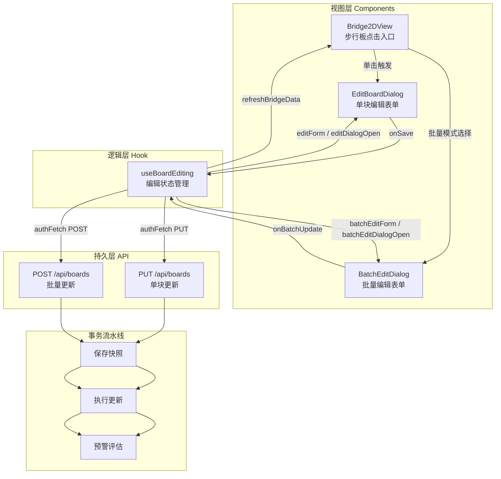
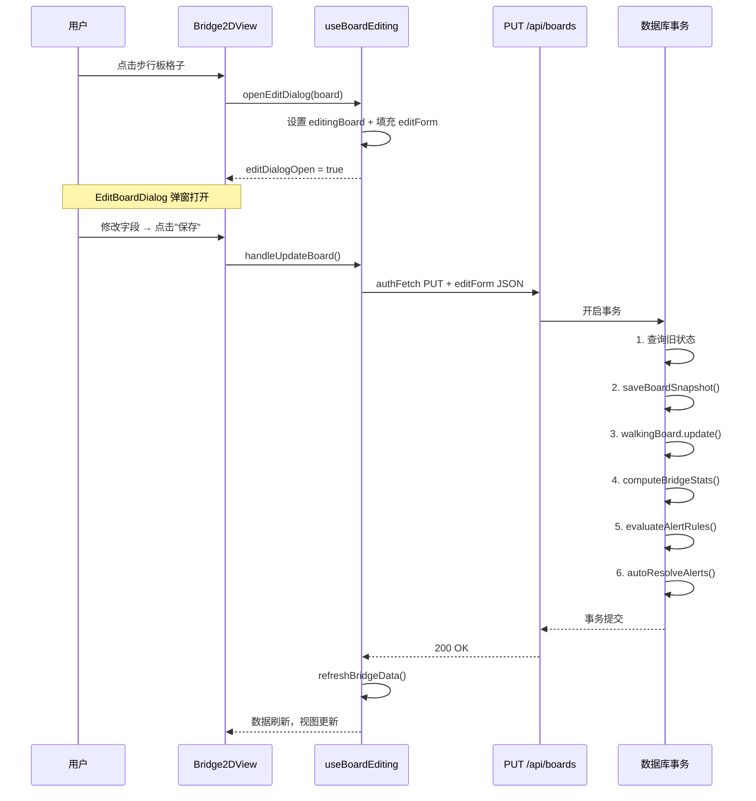

步行板编辑是铁路明桥面管理系统的核心业务操作，承载着巡检数据录入、状态变更追踪和预警触发三大职责。本文深入解析从用户界面交互到服务端事务处理的全链路实现——涵盖 `useBoardEditing` Hook 的状态管理架构、`EditBoardDialog` / `BatchEditDialog` 的表单设计模式，以及 API 层事务化的"快照→更新→预警评估"三段式流水线。理解此流程是掌握系统数据写入路径的关键入口。

Sources: [useBoardEditing.ts](src/hooks/useBoardEditing.ts#L1-L286), [route.ts](src/app/api/boards/route.ts#L1-L494)

## 架构总览：三层分离的编辑流水线

步行板编辑采用 **Hook 逻辑层 → Dialog 视图层 → API 持久层** 的三层分离架构。这种设计将业务状态管理、UI 呈现和数据持久化解耦为独立关注点，使得每一层都可以独立测试和演进。



`useBridgePage` 作为页面级组合 Hook，将 `useBoardEditing` 与其他业务 Hook（`useBridgeData`、`useBridgeCRUD` 等）组装在一起，形成了完整的页面状态管理网络。`Bridge2DView` 是用户交互的起点——用户点击步行板格子时，根据当前是否处于批量模式（`batchMode`），决定走单块编辑还是多选路径。

Sources: [useBridgePage.tsx](src/hooks/useBridgePage.tsx#L74-L78), [Bridge2DView.tsx](src/components/bridge/Bridge2DView.tsx#L75-L134)

## 单块编辑流程

### 状态管理与表单初始化

`useBoardEditing` Hook 维护两个核心状态集合：**编辑目标**（`editingBoard` + `editDialogOpen`）和 **编辑数据**（`editForm`）。当用户在 2D 视图中点击某块步行板时，`openEditDialog` 方法被调用，它完成两个动作：将目标步行板实例存入 `editingBoard`，同时以该板的当前属性作为初始值填充 `editForm`。

`EditForm` 接口定义了 17 个可编辑字段，覆盖步行板巡检的全部数据维度。关键字段及其默认值策略如下表所示：

| 字段分组 | 字段名 | 类型 | 默认值 | 说明 |
|---------|--------|------|--------|------|
| **基础状态** | `status` | `string` | `'normal'` | 6 种步行板状态 |
| **基础状态** | `damageDesc` | `string` | `''` | 损坏描述文本 |
| **基础状态** | `inspectedBy` | `string` | `''` | 检查人姓名 |
| **安全指标** | `antiSlipLevel` | `number` | `100` | 防滑等级百分比 |
| **安全指标** | `connectionStatus` | `string` | `'normal'` | 连接状态：normal/loose/gap_large |
| **环境条件** | `weatherCondition` | `string` | `'normal'` | 天气：normal/rain/snow/fog/ice |
| **环境条件** | `visibility` | `number` | `100` | 能见度百分比 |
| **附属设施** | `railingStatus` | `string` | `'normal'` | 栏杆：normal/loose/damaged |
| **附属设施** | `bracketStatus` | `string` | `'normal'` | 托架：normal/loose/damaged/corrosion |
| **异常标记** | `hasObstacle` | `boolean` | `false` | 是否有杂物 |
| **异常标记** | `hasWaterAccum` | `boolean` | `false` | 是否有积水 |
| **尺寸数据** | `boardLength/Width/Thickness` | `number` | `100/50/5` | 步行板物理尺寸（cm） |

初始化时，`openEditDialog` 对可能为 `null` 的字段执行空值合并（`||` 运算符），确保表单始终获得有效初始值。例如 `board.antiSlipLevel || 100`、`board.damageDesc || ''`，这样 Dialog 组件不需要处理 null 状态。

Sources: [useBoardEditing.ts](src/hooks/useBoardEditing.ts#L8-L26), [useBoardEditing.ts](src/hooks/useBoardEditing.ts#L232-L254)

### 表单 UI 结构：EditBoardDialog

`EditBoardDialog` 是一个受控表单组件，接收外部注入的 `form` 和 `setForm`，自身不持有任何状态。它采用 Dialog 弹窗布局，以分区卡片方式组织 17 个字段。其核心设计模式包括：

**条件渲染的字段联动**：`hasObstacle` 勾选后展开"杂物描述"输入框，`hasWaterAccum` 勾选后展开"积水深度"输入框。这种按需展开的模式减少了表单视觉复杂度。

**状态选择器的色彩锚定**：`status` 下拉框中的每个选项都从 `BOARD_STATUS_CONFIG` 中读取对应的颜色圆点，用户在选择时可以直观地将状态值与步行板格子的颜色对应起来。

**附属设施的分区标记**：栏杆和托架状态被包裹在一个蓝色虚线边框的卡片区域中，标签明确标注"附属设施状态（选填）"，引导用户按优先级填写。

**尺寸与照片分区**：表单底部以分割线为界，分别放置步行板尺寸（长/宽/厚三栏网格）和 `PhotoUpload` 照片上传组件，将物理属性与巡检凭证组织在一起。

Sources: [EditBoardDialog.tsx](src/components/bridge/EditBoardDialog.tsx#L1-L254)

### 提交流程：handleUpdateBoard

单块编辑的提交由 `handleUpdateBoard` 回调驱动。它执行以下步骤：

1. **前置校验**：检查 `editingBoard` 是否存在，不存在则直接返回
2. **构建请求体**：将 `editForm` 的 17 个字段完整序列化为 JSON
3. **发起 PUT 请求**：通过 `authFetch('/api/boards', { method: 'PUT', ... })` 发送
4. **响应处理**：成功时关闭 Dialog、清空编辑状态、调用 `refreshBridgeData()` 刷新数据；失败时展示错误提示

值得注意的设计细节是：`authFetch` 会自动从 `localStorage` 中读取 `token` 并注入到 `Authorization` 请求头中，这确保了编辑操作的鉴权一致性。



Sources: [useBoardEditing.ts](src/hooks/useBoardEditing.ts#L116-L157), [bridge-constants.ts](src/lib/bridge-constants.ts#L126-L136)

## 批量操作流程

### 批量模式的激活与选择机制

批量操作通过 `batchMode` 布尔状态控制。当用户在工具栏激活批量模式后，`Bridge2DView` 中步行板格子的点击行为从"打开编辑弹窗"切换为"切换选中状态"。选中状态通过 `selectedBoards`（`string[]`）数组管理，包含所有被选中步行板的 ID。

选择机制提供两个操作入口：

- **逐块切换**（`toggleBoardSelection`）：将指定 ID 在数组中添加或移除，实现单块复选
- **全选/全不选**（`toggleSelectAll`）：针对当前桥孔（`selectedSpanIndex`）的全部步行板，判断是否已全部选中，若是则全部移除，否则全部添加。使用 `new Set([...prev, ...allBoardIds])` 确保去重

在 2D 视图中，批量模式下的步行板格子左上角会渲染 `CheckSquare`（已选中）或 `Square`（未选中）图标，同时选中的格子会有紫色光环（`ring-2 ring-purple-500`），提供清晰的视觉反馈。

Sources: [useBoardEditing.ts](src/hooks/useBoardEditing.ts#L206-L229), [Bridge2DView.tsx](src/components/bridge/Bridge2DView.tsx#L91-L105)

### 批量表单：BatchEditDialog 与稀疏更新策略

批量编辑的核心设计原则是 **稀疏更新**（Sparse Update）：用户只需填写希望修改的字段，留空的字段不会覆盖原有值。`BatchEditForm` 接口相比 `EditForm` 大幅精简，仅保留 6 个常用字段加一个尺寸开关：

| 字段 | 类型 | 默认值 | 更新策略 |
|------|------|--------|----------|
| `status` | `string` | `''` | 空值时发送 `undefined`，服务端跳过 |
| `railingStatus` | `string` | `''` | 同上 |
| `bracketStatus` | `string` | `''` | 同上 |
| `remarks` | `string` | `''` | 同上 |
| `inspectedBy` | `string` | `''` | 空值时默认填充 `'批量编辑'` |
| `editSize` | `boolean` | `false` | 开关控制是否更新尺寸三字段 |

Dialog 中的状态/栏杆/托架下拉框都额外提供了"保持不变"选项（值为 `'keep'`），选中时将字段重置为空字符串，明确表达"不修改此字段"的语义。备注和检查人输入框则通过占位符文本提示"留空保持不变"。

尺寸编辑是一个受 `editSize` 开关控制的条件面板。开关关闭时，`boardLength`/`boardWidth`/`boardThickness` 不会被包含在更新数据中，从而避免意外覆盖已有尺寸数据。

Sources: [useBoardEditing.ts](src/hooks/useBoardEditing.ts#L28-L50), [BatchEditDialog.tsx](src/components/bridge/BatchEditDialog.tsx#L1-L210)

### 提交流程：handleBatchUpdateBoards

批量提交的入口是 `handleBatchUpdateBoards` 回调，它构建一个包含 `updates` 数组的 POST 请求体。每个数组元素对应一块被选中的步行板，结构为：

```typescript
{
  id: string,
  status: string | undefined,
  railingStatus: string | undefined,
  bracketStatus: string | undefined,
  remarks: string | undefined,
  inspectedBy: string,
  boardLength?: number,    // 仅 editSize 开启时
  boardWidth?: number,     // 仅 editSize 开启时
  boardThickness?: number, // 仅 editSize 开启时
}
```

提交成功后的清理工作包括：关闭批量编辑弹窗、退出批量模式、清空选中列表、重置批量表单为默认值，并触发数据刷新。

Sources: [useBoardEditing.ts](src/hooks/useBoardEditing.ts#L160-L204)

## API 层事务化流水线

### 单块更新（PUT）的六步事务

PUT 端点处理单个步行板更新时，在 `db.$transaction` 中执行一个完整的六步流水线：

| 步骤 | 操作 | 目的 |
|------|------|------|
| 1 | `tx.walkingBoard.findUnique` + include span.bridge | 获取旧状态及关联上下文 |
| 2 | `saveBoardSnapshot(tx, ...)` | 保存变更前快照，用于审计和趋势分析 |
| 3 | `tx.walkingBoard.update` | 执行实际数据更新 |
| 4 | `tx.walkingBoard.findMany` + `computeBridgeStats` | 重新计算整桥统计指标 |
| 5 | `evaluateAlertRules(tx, ...)` | 评估预警规则，生成新告警 |
| 6 | `autoResolveAlerts(tx, ...)` | 自动解决不再触发的告警 |

这个事务的关键设计在于：**快照保存在更新之前**。这意味着每次编辑操作都会留下完整的变更前记录，使得状态回溯和历史趋势分析成为可能。同时，预警评估使用更新后的整桥统计，确保告警决策基于最新数据。

更新数据的构建采用显式字段映射（`if (body.status !== undefined) updateData.status = body.status`），而非直接展开 `body`，这是一种防御性编程——避免客户端传入意料之外的字段导致数据污染。`inspectedAt` 字段在每次更新时强制设为 `new Date()`，自动记录最后巡检时间。

Sources: [route.ts](src/app/api/boards/route.ts#L55-L199)

### 批量更新（POST）的三种模式

POST 端点支持三种批量操作模式，通过请求体结构自动区分：

**模式 1：指定 ID 数组更新**（`body.updates` 存在且为数组）

这是前端批量编辑使用的模式。事务流程为：预查询所有目标板的旧状态 → 批量保存快照（`saveBoardSnapshots`）→ 逐个执行更新 → 获取整桥统计 → 预警评估（取第一块板作为 board 级别规则的代表）→ 评估桥梁级别规则 → 自动解决告警。

逐个更新的选择（而非 `updateMany`）是因为每块板可能需要不同的字段组合——虽然当前批量表单统一了字段，但架构预留了差异化更新的可能性。

**模式 2：指定孔位+位置更新**（`body.spanId` + `body.position` + `body.status`）

针对指定桥孔的指定侧（上行/下行）统一设置状态，使用 `updateMany` 进行批量更新。

**模式 3：整孔更新**（`body.spanId` + `body.status`，无 `body.position`）

针对整孔所有步行板统一设置状态，同样使用 `updateMany`。

模式 2 和 3 的流程简化为：查询目标板 → 批量保存快照 → `updateMany` → 统计 → 预警评估。它们不涉及逐板差异化处理，因此采用更高效的 `updateMany` 操作。

Sources: [route.ts](src/app/api/boards/route.ts#L202-L493)

### 预警评估的集成方式

编辑操作完成后，预警引擎在同一个事务内被触发。这意味着如果更新导致桥梁状态恶化（如损坏率超过阈值），预警记录会在事务提交前就创建好。如果事务回滚（例如后续步骤出错），预警记录也会一同回滚，保证了数据一致性。

对于批量更新，预警评估使用"第一块更新板"作为 board 级别规则的评估样本，同时额外执行独立的桥梁级别规则评估循环——逐条检查所有启用的桥梁级别规则，比对统计指标是否触发阈值条件。这种"先更新后评估"的机制确保了告警的实时性。

Sources: [route.ts](src/app/api/boards/route.ts#L291-L380), [route.ts](src/app/api/boards/route.ts#L456-L482)

## 编辑流程中的权限控制

编辑操作的权限控制贯穿三个层级：

**UI 层**：`Bridge2DView` 的步行板点击处理中包含 `hasPermission('board:write')` 守卫。无写入权限的用户点击步行板不会触发任何编辑操作。`useBridgePage` 在初始化时会检查用户角色，`viewer` 角色会设置 `isReadOnly` 状态。

**API 层**：PUT 和 POST 端点的第一行都是 `await requireAuth(request, 'board:write')`，未通过鉴权的请求会直接返回 401/403 错误。

**操作日志**：单块更新成功后，服务端通过 `logOperation` 记录操作审计信息，包含用户 ID、操作类型（`'update'`）、目标模块（`'board'`）和目标 ID。

Sources: [Bridge2DView.tsx](src/components/bridge/Bridge2DView.tsx#L91), [route.ts](src/app/api/boards/route.ts#L57-L58), [route.ts](src/app/api/boards/route.ts#L182-L190)

## 设计模式总结

| 设计维度 | 单块编辑 | 批量操作 |
|----------|---------|---------|
| **HTTP 方法** | `PUT` | `POST` |
| **更新粒度** | 17 字段全覆盖 | 6 字段稀疏更新 |
| **请求体结构** | `{ id, ...fields }` | `{ updates: [{ id, ...fields }] }` |
| **更新策略** | 全字段写入 | undefined 字段跳过 |
| **快照原因标记** | `'update'` | `'batch_update'` |
| **inspectedBy 默认** | 必填 | 未填时默认 `'批量编辑'` |
| **照片上传** | 支持（内嵌组件） | 不支持 |
| **尺寸编辑** | 始终可编辑 | 需要开关启用 |
| **事务范围** | 单板六步流水线 | 多板快照+逐个更新+统计+预警 |

这种"单块完整编辑 + 批量稀疏更新"的双轨设计，在数据完整性和操作效率之间取得了平衡——单块编辑确保巡检数据的细粒度记录，批量操作则为大范围状态变更提供了高效的快捷路径。

Sources: [useBoardEditing.ts](src/hooks/useBoardEditing.ts#L1-L286), [route.ts](src/app/api/boards/route.ts#L1-L494)

## 延伸阅读

- [自定义 Hooks 架构设计模式](14-zi-ding-yi-hooks-jia-gou-she-ji-mo-shi) — 理解 `useBoardEditing` 在 Hook 体系中的定位
- [步行板状态体系与颜色编码规范](5-bu-xing-ban-zhuang-tai-ti-xi-yu-yan-se-bian-ma-gui-fan) — `BOARD_STATUS_CONFIG` 状态枚举的完整定义
- [预警规则引擎：快照保存、条件评估与自动去重](16-yu-jing-gui-ze-yin-qing-kuai-zhao-bao-cun-tiao-jian-ping-gu-yu-zi-dong-qu-zhong) — 快照保存与预警评估的引擎实现细节
- [2D 网格视图与整桥模式](22-2d-wang-ge-shi-tu-yu-zheng-qiao-mo-shi) — Bridge2DView 的完整渲染机制