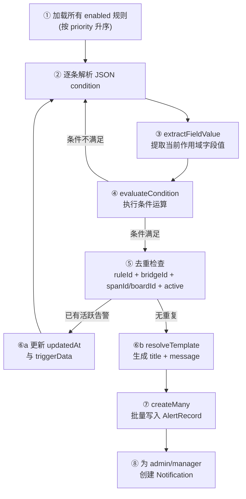

预警规则引擎是本系统安全监控的核心组件，负责在步行板状态发生变更时执行三项关键任务：**变更前快照保存**、**基于规则的实时条件评估**、以及**告警记录的自动去重与生命周期管理**。引擎以 `src/lib/alert-engine.ts` 为核心实现，配合 Prisma 的三个数据模型（`BoardStatusSnapshot`、`AlertRule`、`AlertRecord`）和 9 条预设规则，构建了一套完整的"变更捕获 → 规则匹配 → 告警生成 → 通知推送"管道。所有核心操作均在 Prisma 事务内完成，确保快照、评估与告警创建的原子性。

Sources: [alert-engine.ts](src/lib/alert-engine.ts#L1-L10), [schema.prisma](prisma/schema.prisma#L166-L232)

## 架构总览：三层模型与数据流

预警引擎围绕三个 Prisma 模型展开，各自承担不同职责：

```
┌──────────────────────────────────────────────────────────────────────────┐
│                        预警规则引擎数据流                                 │
│                                                                          │
│  步行板状态变更 ──→ ┌─────────────┐   ┌──────────────┐   ┌────────────┐ │
│  (PUT/POST/Import) │   快照保存   │──→│  规则评估     │──→│ 告警去重    │ │
│                    │ Snapshot     │   │ Evaluate      │   │ Deduplicate │ │
│                    └─────────────┘   └──────────────┘   └──────┬─────┘ │
│                          │                   │                  │        │
│                          ▼                   ▼                  ▼        │
│                   BoardStatusSnapshot   AlertRule          AlertRecord   │
│                   (变更前状态快照)       (规则定义)         (告警实例)    │
│                                                                │        │
│                                                                ▼        │
│                                                          Notification   │
│                                                          (站内通知)     │
└──────────────────────────────────────────────────────────────────────────┘
```

**BoardStatusSnapshot** 负责记录每次步行板更新前的完整状态，包含 18 个字段的深拷贝快照，是历史趋势分析和状态回溯的数据基础。**AlertRule** 定义预警规则的条件表达式、严重等级、作用范围和消息模板。**AlertRecord** 是规则触发后生成的告警实例，包含完整的生命周期状态（active → resolved/dismissed），并通过关联查询链接到对应的规则。

Sources: [schema.prisma](prisma/schema.prisma#L166-L232), [alert-engine.ts](src/lib/alert-engine.ts#L106-L183)

### 三模型字段职责对比

| 模型 | 核心职责 | 关键字段 | 数据生命周期 |
|------|---------|---------|------------|
| `BoardStatusSnapshot` | 变更前状态归档 | `boardId`、`status`、18个状态字段、`snapshotReason` | 永久保留，用于趋势分析 |
| `AlertRule` | 规则配置 | `scope`、`condition`(JSON)、`severity`、`messageTemplate`、`isSystem` | 系统级不可删除，自定义可管理 |
| `AlertRecord` | 告警实例 | `ruleId`、`bridgeId`/`spanId`/`boardId`、`status`、`triggerData` | 手动/自动解决后归档 |

Sources: [schema.prisma](prisma/schema.prisma#L166-L232)

## 快照保存机制：变更前的完整状态归档

快照保存是预警流程的第一步，在步行板状态被实际修改之前，将当前的全部 18 个状态字段以独立记录的形式写入 `BoardStatusSnapshot` 表。这一设计确保了无论后续操作成功或失败，历史状态都不会丢失。

引擎提供两个快照保存函数：**`saveBoardSnapshot`** 处理单块步行板的快照（用于单板编辑场景），**`saveBoardSnapshots`** 通过 `createMany` 批量写入（用于批量更新和导入场景）。两者均要求传入 `Prisma.TransactionClient` 参数，强制在事务上下文中执行，保证快照与后续更新操作的原子性。

`SnapshotContext` 接口定义了快照所需的完整上下文，包含 `boardId`、`spanId`、`bridgeId` 三级定位信息，以及 `oldBoard` 对象中的 18 个状态字段和 `reason` 字段（取值 `update`、`batch_update` 或 `import`，标识变更来源）。

Sources: [alert-engine.ts](src/lib/alert-engine.ts#L12-L183), [schema.prisma](prisma/schema.prisma#L166-L195)

### 快照字段与 WalkingBoard 模型的映射

快照中 `status` 字段有默认值回退逻辑：当 `oldBoard.status` 为 `null` 时自动设为 `"normal"`，避免空值问题。`snapshotReason` 字段默认为 `"update"`，用于区分以下三种变更场景：

| `snapshotReason` 值 | 触发场景 | API 路由 |
|---------------------|---------|---------|
| `update` | 单块步行板编辑 | `PUT /api/boards` (body.id) |
| `batch_update` | 批量状态更新 / 整孔更新 | `POST /api/boards` (body.updates 或 body.spanId) |
| `import` | Excel 数据导入 | `POST /api/data/excel` |

Sources: [alert-engine.ts](src/lib/alert-engine.ts#L115-L183), [boards/route.ts](src/app/api/boards/route.ts#L95-L179)

## 条件评估引擎：七种运算符与三级作用域

条件评估是引擎的核心逻辑，通过 `evaluateCondition` 函数实现了 7 种比较运算符，配合 `extractFieldValue` 函数从评估上下文中提取对应作用域的字段值，实现了规则与数据的解耦。

### 运算符体系

| 运算符 | 语义 | 类型处理 | 典型用法 |
|--------|-----|---------|---------|
| `>` | 大于 | `Number()` 转换后比较 | `damageRate > 30` |
| `<` | 小于 | `Number()` 转换后比较 | `antiSlipLevel < 50` |
| `>=` | 大于等于 | `Number()` 转换后比较 | 数值阈值 |
| `<=` | 小于等于 | `Number()` 转换后比较 | 数值阈值 |
| `==` | 等于 | `String()` 转换后严格比较 | `bracketStatus == "corrosion"` |
| `!=` | 不等于 | `String()` 转换后严格比较 | 排除特定状态 |
| `in` | 包含于 | 数组 `includes()` 检查 | `status in ["fracture_risk"]` |
| `changed` | 是否变更 | 新旧值字符串比较 | 检测字段变化 |

值得注意的是，`>`、`<`、`>=`、`<=` 四种运算符统一使用 `Number()` 进行类型转换，适用于数值型字段的阈值比较；`==`、`!=` 使用 `String()` 转换，确保枚举值的精确匹配；`in` 运算符要求 `value` 为数组，通过 `Array.includes()` 实现多值匹配；`changed` 运算符是唯一需要 `oldValue` 参数的运算符，用于 board 级别规则中检测字段是否发生了实际变化。

Sources: [alert-engine.ts](src/lib/alert-engine.ts#L185-L215)

### 三级作用域与字段提取

`extractFieldValue` 函数根据规则的 `scope` 属性（bridge / span / board）从 `EvaluateContext` 中提取不同层级的字段值：

**Bridge 作用域** — 提取桥梁级别的聚合统计数据，包括 `damageRate`、`highRiskRate`、`totalBoards`、`effectiveBoards`、`fractureRiskBoards`、`severeDamageBoards`、`minorDamageBoards` 共 7 个字段，所有值均由 `computeBridgeStats` 函数实时计算。

**Board 作用域** — 提取单块步行板的属性值，支持 `status`、`antiSlipLevel`、`railingStatus`、`bracketStatus` 四个字段，同时提供 `value`（新值）和 `oldValue`（旧值）的对比，用于 `changed` 运算符的判断。

**Span 作用域** — 在孔位级别取所有孔位的最大值（`Math.max`）用于比较，当前支持 `fractureRiskBoards` 和 `severeDamageBoards` 两个字段。

Sources: [alert-engine.ts](src/lib/alert-engine.ts#L217-L268)

### 消息模板解析

`resolveTemplate` 函数负责将告警消息模板中的占位符替换为实际值。支持 15 个模板变量，其中桥梁级变量包括 `{bridgeName}`、`{damageRate}`、`{highRiskRate}`、`{totalBoards}`、`{fractureRiskBoards}`、`{severeDamageBoards}`、`{minorDamageBoards}`、`{count}`；步行板级变量包括 `{spanNumber}`、`{boardNumber}`、`{positionLabel}`、`{status}`、`{antiSlipLevel}`、`{railingStatus}`、`{bracketStatus}`。`{positionLabel}` 和 `{status}` 通过 `getPositionLabel` 和 `getStatusLabel` 辅助函数转为中文标签。

Sources: [alert-engine.ts](src/lib/alert-engine.ts#L270-L318)

## 规则评估主流程：八步管道

`evaluateAlertRules` 是引擎的主入口函数，其执行流程可以分解为以下八个步骤：



**步骤①**：加载所有 `enabled=true` 的规则，按 `priority` 升序排列，确保高优先级规则先被处理。**步骤②**：对每条规则的 `condition` 字段进行 `JSON.parse`，解析失败时跳过该规则（`continue`）。**步骤③**：调用 `extractFieldValue` 根据 `scope` 提取对应的字段值和旧值。**步骤④**：调用 `evaluateCondition` 执行条件运算，不满足则跳过。**步骤⑤-⑥**：这是去重的核心——查询是否存在相同规则、相同桥梁、相同孔位/步行板的活跃告警，若存在则仅更新 `updatedAt` 时间戳和 `triggerData` 而不创建新记录。**步骤⑦**：收集所有通过去重检查的新告警，通过 `createMany` 批量写入。**步骤⑧**：为所有 `active` 状态的 `admin` 和 `manager` 用户创建站内通知。

Sources: [alert-engine.ts](src/lib/alert-engine.ts#L329-L448)

## 自动去重策略：基于多维键的活跃告警合并

去重机制是防止告警轰炸的关键设计。引擎使用四元组作为去重键：`{ruleId, bridgeId, spanId, boardId}` + `status=active`，确保同一规则对同一目标对象只保留一条活跃告警。

去重查询的逻辑根据规则作用域动态构建：当 `scope === "bridge"` 时，`spanId` 和 `boardId` 均设为 `null`，实现桥梁级别的全局去重；当 `scope === "span"` 时，`spanId` 取当前更新的孔位 ID；当 `scope === "board"` 时，`boardId` 取当前更新的步行板 ID。这一设计确保了"桥梁损坏率超30%"这类规则在整桥范围内只产生一条告警，而"步行板出现断裂风险"这类规则可以针对不同步行板分别告警。

当检测到重复告警时，引擎执行的是**更新而非忽略**：更新 `updatedAt` 为当前时间，同时更新 `triggerData` 为最新的桥梁统计数据快照（包含 `damageRate`、`fractureRiskBoards`、`severeDamageBoards`），使得运维人员可以看到最新的触发数据。

Sources: [alert-engine.ts](src/lib/alert-engine.ts#L364-L410)

## 自动解决机制：修复后的告警状态同步

`autoResolveAlerts` 函数在每次评估后执行，负责检测并自动解决不再满足触发条件的活跃告警。其工作原理是：

1. 获取指定桥梁的所有活跃告警（`status="active"`），包含关联的规则定义
2. 对每条告警重新解析规则条件
3. 用当前的桥梁统计数据重新评估条件
4. 若条件不再满足，将告警状态更新为 `resolved`，记录 `resolvedBy="system"` 和 `resolveNote="系统自动解决：触发条件不再满足"`

这一机制确保了一个重要特性：当损坏的步行板被修复后，相关联的告警会自动关闭，而无需人工干预。例如，当桥梁损坏率从 35% 降至 10% 时，"桥梁损坏率超30%"的告警会被自动标记为已解决。

Sources: [alert-engine.ts](src/lib/alert-engine.ts#L450-L498)

## 预设规则体系：9 条内置安全规则

系统通过 `seedAlertRules` 函数初始化 9 条预设规则，覆盖桥梁级和步行板级两个维度的安全隐患检测。该函数采用**幂等设计**：通过模块级 `seeded` 标志和数据库 `findFirst` 查询双重保障，重复调用不会创建重复规则。

Sources: [seed-alert-rules.ts](src/lib/seed-alert-rules.ts#L147-L170)

### 规则详情一览

| 规则名称 | 严重等级 | 作用域 | 条件 | 优先级 |
|---------|---------|-------|------|-------|
| 存在断裂风险步行板 | `critical` | bridge | `fractureRiskBoards > 0` | 5 |
| 步行板出现断裂风险 | `critical` | board | `status in ["fracture_risk"]` | 6 |
| 步行板缺失 | `critical` | board | `status in ["missing"]` | 7 |
| 桥梁损坏率超30% | `critical` | bridge | `damageRate > 30` | 10 |
| 步行板严重损坏 | `warning` | board | `status in ["severe_damage"]` | 15 |
| 桥梁损坏率超15% | `warning` | bridge | `damageRate > 15` | 20 |
| 栏杆状态异常 | `warning` | board | `railingStatus in ["loose","damaged","missing"]` | 25 |
| 防滑等级过低 | `warning` | board | `antiSlipLevel < 50` | 30 |
| 托架锈蚀 | `info` | board | `bracketStatus == "corrosion"` | 40 |

优先级数值越小代表越紧急，`critical` 级规则（优先级 5-10）会在评估时优先处理。规则的 `isSystem=true` 标记使其成为系统内置不可删除的规则。

Sources: [seed-alert-rules.ts](src/lib/seed-alert-rules.ts#L9-L145)

## 桥梁统计数据计算：computeBridgeStats

`computeBridgeStats` 是预警评估的统计基础函数，接收步行板数组，计算以下关键指标：

- **`effectiveBoards`**：有效步行板数 = 总数 - `replaced` - `missing`，排除已更换和缺失的板
- **`damageRate`**：损坏率 = `(轻微 + 严重 + 断裂) / 有效板数 × 100`，精确到小数点后两位
- **`highRiskRate`**：高风险率 = `断裂 / 有效板数 × 100`，精确到小数点后两位

计算公式中对 `effective > 0` 进行了防零除保护。该函数在每次步行板更新后被调用，通过 `db.walkingBoard.findMany({ where: { span: { bridgeId } } })` 获取全桥所有步行板数据，确保统计结果的实时性。

Sources: [alert-engine.ts](src/lib/alert-engine.ts#L500-L542)

## 事务化集成：三种变更场景的统一管道

引擎通过三个 API 入口点被调用，均采用 `db.$transaction` 包裹完整的"快照→更新→评估→自动解决"流程：

### 单板更新（PUT /api/boards）

最标准的调用路径。在事务中依次执行：查询旧状态（含 span → bridge 关联）→ `saveBoardSnapshot` → `walkingBoard.update` → `computeBridgeStats` → `evaluateAlertRules` → `autoResolveAlerts`。事务外额外调用 `logOperation` 记录操作日志。

Sources: [boards/route.ts](src/app/api/boards/route.ts#L95-L192)

### 批量更新（POST /api/boards）

支持两种批量模式：**指定步行板数组**（`body.updates`）和**指定孔位+位置**（`body.spanId + body.status`）。前者预查询所有目标步行板，通过 `saveBoardSnapshots` 批量保存快照后逐个更新，评估时取第一块板的上下文用于 board 级别规则，并额外单独评估桥梁级别规则。后者使用 `updateMany` 批量更新，同样遵循快照→更新→评估→自动解决的完整流程。

Sources: [boards/route.ts](src/app/api/boards/route.ts#L202-L486)

### 统一事务流程对比

| 步骤 | 单板更新 | 批量更新(数组) | 批量更新(孔位) |
|------|---------|--------------|--------------|
| 查询旧状态 | `findUnique` + include | `findMany` + include | `findMany` + include |
| 保存快照 | `saveBoardSnapshot` | `saveBoardSnapshots` (createMany) | `saveBoardSnapshots` (createMany) |
| 执行更新 | `update` 单条 | 逐个 `update` | `updateMany` 批量 |
| 统计计算 | `computeBridgeStats` | `computeBridgeStats` | `computeBridgeStats` |
| 规则评估 | `evaluateAlertRules` | 评估 + 额外 bridge 级规则 | `evaluateAlertRules` |
| 自动解决 | `autoResolveAlerts` | `autoResolveAlerts` | `autoResolveAlerts` |

Sources: [boards/route.ts](src/app/api/boards/route.ts#L54-L486)

## 告警管理与通知推送

告警记录通过 `GET /api/alerts` 支持按 `severity`、`status`、`bridgeId` 过滤和分页查询，返回结果同时包含活跃告警的分级统计摘要（`activeCritical`、`activeWarning`、`activeInfo`、`activeTotal`）。`PUT /api/alerts` 支持手动解决（`resolved`）或忽略（`dismissed`）告警，记录操作人和说明。

预警规则管理通过 `GET /api/alert-rules` 列出所有规则并附带每条规则的活跃告警数统计，`PUT /api/alert-rules` 仅管理员可用，支持启用/禁用规则和修改严重等级。

通知推送在 `evaluateAlertRules` 的步骤⑧中完成：当产生新告警时，查询所有 `active` 状态的 `admin` 和 `manager` 用户，为每个用户对每条新告警创建一条 `Notification` 记录（`type="alert"`）。通知创建失败不影响告警流程本身（try-catch 包裹），这一容错设计确保了核心告警功能的可靠性。

Sources: [alerts/route.ts](src/app/api/alerts/route.ts#L1-L114), [alert-rules/route.ts](src/app/api/alert-rules/route.ts#L1-L74), [alert-engine.ts](src/lib/alert-engine.ts#L418-L445)

## 快照趋势分析接口

`GET /api/boards/snapshots` 提供快照数据的时间序列聚合查询能力，支持按 `bridgeId`、`spanId`、`boardId` 过滤，按 `month`/`week`/`day` 三种粒度分组。每个时间分组计算 `totalBoards`、各状态计数以及 `damageRate`/`highRiskRate`，返回 `SnapshotTrendPoint[]` 数组用于前端趋势图表渲染。这一接口是 [数据总览仪表盘与趋势分析图表](23-shu-ju-zong-lan-yi-biao-pan-yu-qu-shi-fen-xi-tu-biao) 的数据来源。

Sources: [snapshots/route.ts](src/app/api/boards/snapshots/route.ts#L1-L127), [bridge.ts](src/types/bridge.ts#L166-L177)

## 延伸阅读

- 规则引擎的告警触发与 [站内通知系统：自动推送与实时轮询](27-zhan-nei-tong-zhi-xi-tong-zi-dong-tui-song-yu-shi-shi-lun-xun) 紧密关联
- 快照数据的消费方式参见 [数据总览仪表盘与趋势分析图表](23-shu-ju-zong-lan-yi-biao-pan-yu-qu-shi-fen-xi-tu-biao)
- 步行板状态的定义体系参见 [步行板状态体系与颜色编码规范](5-bu-xing-ban-zhuang-tai-ti-xi-yu-yan-se-bian-ma-gui-fan)
- 批量操作触发预警的完整流程参见 [步行板单块编辑与批量操作流程](15-bu-xing-ban-dan-kuai-bian-ji-yu-pi-liang-cao-zuo-liu-cheng)