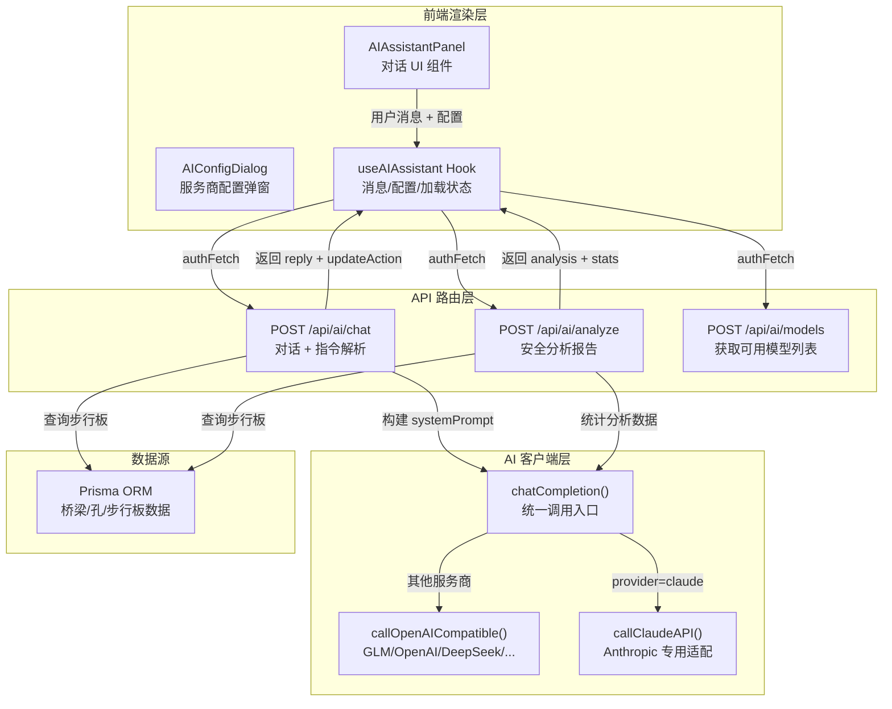
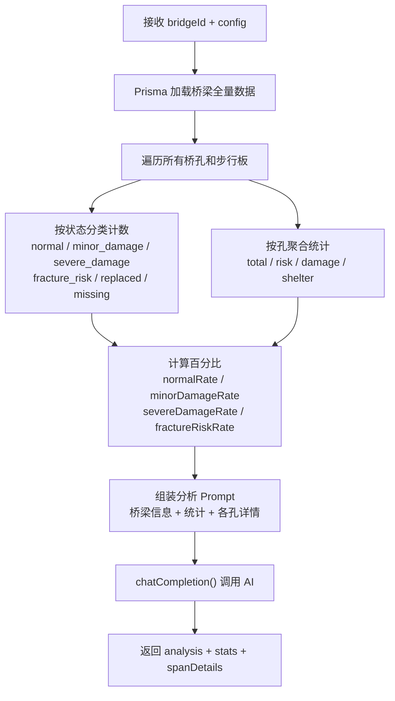
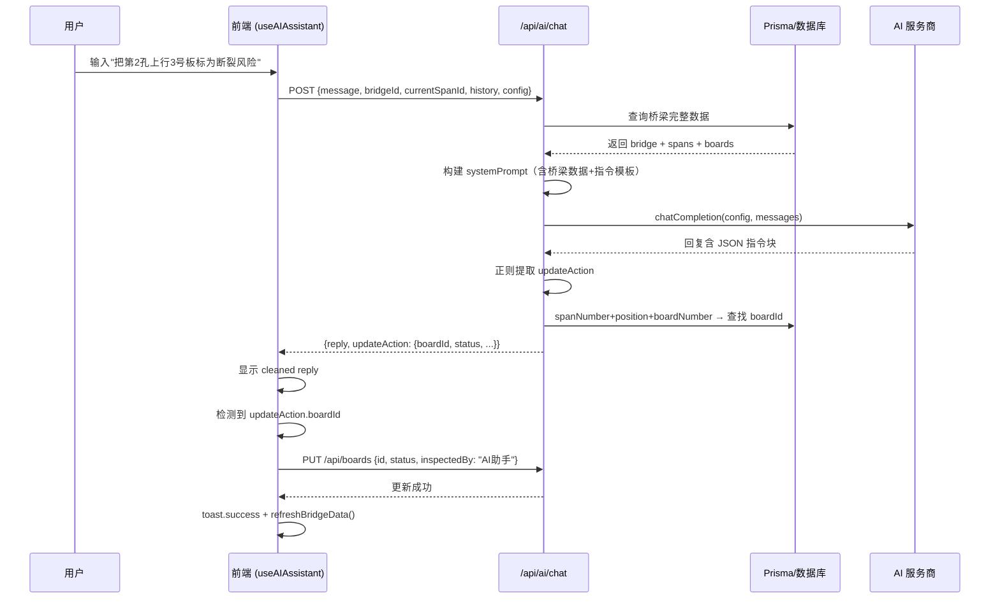

本页深入解析系统中 AI 助手的完整架构——从多服务商客户端层、三个后端 API 端点、前端 Hook 状态管理，到右侧面板中的对话式交互界面和一键安全分析功能。读者将理解 AI 如何与桥梁步行板数据深度集成，实现自然语言查询、智能状态修改指令解析，以及专业级安全评估报告生成。

Sources: [useAIAssistant.ts](src/hooks/useAIAssistant.ts#L1-L267), [ai-client.ts](src/lib/ai-client.ts#L1-L147), [chat/route.ts](src/app/api/ai/chat/route.ts#L1-L165), [analyze/route.ts](src/app/api/ai/analyze/route.ts#L1-L181)

## 整体架构概览

AI 助手系统采用经典的**三层分离**设计：**客户端渲染层**（React Hook + UI 组件）负责交互状态管理与消息展示；**API 路由层**（Next.js Route Handlers）负责上下文构建、指令解析与数据聚合；**AI 客户端层**（`ai-client.ts`）负责屏蔽多服务商差异，提供统一的 `chatCompletion` 调用接口。这种分层确保了每一层职责单一，且后端永远控制发送给 AI 的上下文内容——前端仅传递用户原始消息和配置信息，敏感数据不在客户端暴露。

Sources: [useBridgePage.tsx](src/hooks/useBridgePage.tsx#L57-L63), [ai-client.ts](src/lib/ai-client.ts#L122-L146)



## 权限控制：谁可以使用 AI

所有三个 AI API 端点均通过 `requireAuth(request, 'ai:use')` 进行鉴权，这是系统 RBAC 体系中的一个专属权限标识。当前权限分配如下：

| 角色 | `ai:use` 权限 | 说明 |
|------|:---:|------|
| **admin**（系统管理员） | ✅ | 通配符权限 `*` 包含所有操作 |
| **manager**（桥梁管理者） | ✅ | 显式授予 `ai:use` |
| **user**（普通用户） | ❌ | 仅查看权限 |
| **viewer**（只读用户） | ❌ | 仅查看权限 |

前端通过 `hasPermission('ai:use')` 控制三个入口的可见性：桌面端右侧面板的 AI 助手 Tab、移动端底部导航的 AI 入口、以及 AI 配置对话框。未授权用户完全看不到 AI 相关 UI 元素。

Sources: [index.ts](src/lib/auth/index.ts#L27-L48), [page.tsx](src/app/page.tsx#L749-L756), [page.tsx](src/app/page.tsx#L1481-L1485)

## AI 客户端抽象层

`ai-client.ts` 是整个 AI 功能的基石，它将 7 个服务商的 API 差异封装为单一 `chatCompletion()` 函数。核心设计决策是：**除 Claude 外，所有服务商均遵循 OpenAI 兼容协议**（即 `/chat/completions` 端点 + Bearer Token 认证），这使得新增服务商只需在 `PROVIDER_BASE_URLS` 映射表中添加一行配置。

| 服务商 | 默认 Base URL | API 协议 | 默认模型 |
|--------|--------------|---------|---------|
| GLM（智谱） | `open.bigmodel.cn/api/paas/v4` | OpenAI 兼容 | `glm-4` |
| OpenAI | `api.openai.com/v1` | OpenAI 原生 | `gpt-4o` |
| Claude（Anthropic） | `api.anthropic.com/v1` | **Messages API（专用）** | `claude-3-sonnet` |
| DeepSeek | `api.deepseek.com/v1` | OpenAI 兼容 | `deepseek-chat` |
| MiniMax（海螺 AI） | `api.minimax.chat/v1` | OpenAI 兼容 | `abab6.5-chat` |
| Kimi（月之暗面） | `api.moonshot.cn/v1` | OpenAI 兼容 | `moonshot-v1-8k` |
| custom | 用户自定义 | OpenAI 兼容 | 用户自定义 |

Claude 是唯一需要专用适配的服务商。其差异体现在三点：认证头使用 `x-api-key` 而非 `Authorization: Bearer`；`system` 角色消息必须从 `messages` 数组中提取为独立的 `system` 参数；返回格式为 `{ content: [{ type: "text", text: "..." }] }` 而非 OpenAI 的 `{ choices: [{ message: { content: "..." } }] }`。`callClaudeAPI` 函数完整处理了这些差异。

所有 API 调用统一设置 120 秒超时（`AbortSignal.timeout(120000)`），并在失败时截断错误响应前 300 个字符以避免日志膨胀。

Sources: [ai-client.ts](src/lib/ai-client.ts#L1-L147)

## 对话功能：上下文构建与指令解析

`POST /api/ai/chat` 是 AI 助手的核心端点，它的工作不仅是转发消息——而是在后端实时组装桥梁上下文，注入系统提示，并从 AI 回复中提取**结构化操作指令**。

### 上下文注入策略

每次对话请求到达时，后端执行以下步骤：

1. **加载桥梁数据**：若请求携带 `bridgeId`，通过 Prisma 一次性加载桥梁及其所有桥孔、步行板的完整树形数据（使用嵌套 `include`）
2. **定位当前桥孔**：若携带 `currentSpanId`，从中提取当前孔的步行板详情（位置、列号、板号、状态、损坏描述）
3. **构建系统提示**：将桥梁基本信息、当前孔步行板列表（最多 20 块）、六种状态枚举说明、以及修改指令的 JSON 格式模板一并注入 `system` 角色消息

这种设计的核心原则是：**用户无需手动描述桥梁状态**，AI 自动感知当前选中桥梁和桥孔的实时数据。例如，当用户问"第 2 孔有多少块损坏的板"时，AI 可以直接从 system prompt 中获取完整数据来回答，无需额外查询。

Sources: [chat/route.ts](src/app/api/ai/chat/route.ts#L28-L113)

### 操作指令提取机制

系统提示中明确定义了一种 JSON 指令协议——当 AI 判断用户意图是修改步行板状态时，在回复末尾嵌入一个 `json` 代码块：

```json
{"action": "update", "spanNumber": 2, "position": "upstream", "boardNumber": 3, "status": "fracture_risk"}
```

后端通过正则表达式 `regex: /```json\s*(\{[\s\S]*?"action"[\s\S]*?\})\s*```/` 提取该 JSON 块，随后在数据库中查找对应的步行板记录（通过 `spanNumber + position + boardNumber` 三元组定位），将 `boardId` 附加到返回的 `updateAction` 对象中。前端收到响应后，若 `updateAction.boardId` 存在，自动调用 `PUT /api/boards` 执行状态更新，标注巡检人为"AI助手"。

回复中嵌入的 JSON 代码块会在返回给前端前被清除（`cleanReply`），确保用户看到的是纯自然语言回复。

Sources: [chat/route.ts](src/app/api/ai/chat/route.ts#L126-L158), [useAIAssistant.ts](src/hooks/useAIAssistant.ts#L211-L231)

### 对话历史管理

前端维护完整的 `aiMessages` 数组，但发送给后端的仅是最近 10 条消息（`aiMessages.slice(-10)`）。这个滑动窗口策略在**上下文连贯性**与**Token 消耗控制**之间取得平衡。初始消息列表包含一条系统欢迎语，引导用户了解 AI 的四项核心能力：分析安全状态、查询信息、修改状态、提供建议。

Sources: [useAIAssistant.ts](src/hooks/useAIAssistant.ts#L38-L44), [useAIAssistant.ts](src/hooks/useAIAssistant.ts#L192-L193)

## 安全分析功能：一键生成专业报告

`POST /api/ai/analyze` 提供了与对话不同的另一条交互路径——**无需用户输入任何文字**，一键生成完整的桥梁安全分析报告。

### 数据聚合流程

后端接收 `bridgeId` 后，执行全量步行板数据加载，然后在内存中进行六维度统计聚合：



构建的分析提示要求 AI 从五个维度输出报告：**安全等级评估**（安全/注意/警告/危险四级）、**主要风险点分析**、**各孔安全建议**、**优先整改建议**、**作业注意事项**。这些维度直接面向一线作业人员，语言风格定位为"专业但易懂"。

Sources: [analyze/route.ts](src/app/api/ai/analyze/route.ts#L42-L174)

### 分析结果的呈现

分析结果以 `aiAnalysis` 状态存储，同时自动追加到对话消息列表中（角色为 `assistant`，内容前缀 `## 桥梁安全分析报告`），这使得用户可以在对话上下文中查看和追问分析结果。分析报告通过 `renderMarkdownText` 函数进行轻量级 Markdown 渲染，支持二级/三级标题、列表项、粗体文本等格式。

Sources: [useAIAssistant.ts](src/hooks/useAIAssistant.ts#L134-L172), [useBridgePage.tsx](src/hooks/useBridgePage.tsx#L438-L460)

## 前端状态管理与 Hook 架构

`useAIAssistant` Hook 是前端 AI 功能的**完整状态容器**，它管理着 12 个状态变量和 5 个核心方法，通过 `UseAIAssistantReturn` 接口向外暴露类型安全的 API。

### 状态矩阵

| 状态变量 | 类型 | 用途 | 持久化 |
|----------|------|------|--------|
| `aiMessages` | `ChatMessage[]` | 对话消息列表 | ❌ 页面刷新重置 |
| `aiInput` | `string` | 输入框当前值 | ❌ |
| `aiLoading` | `boolean` | 对话请求进行中 | ❌ |
| `aiAnalyzing` | `boolean` | 分析请求进行中 | ❌ |
| `aiAnalysis` | `string \| null` | 最新分析报告内容 | ❌ |
| `rightPanelTab` | `'info' \| 'ai'` | 右侧面板活动 Tab | ❌ |
| `aiConfig` | `AIConfig` | 服务商/模型/密钥/URL | ✅ **localStorage** |
| `fetchedModels` | `{id, name?}[]` | 动态获取的模型列表 | ❌ |
| `fetchingModels` | `boolean` | 模型列表请求中 | ❌ |
| `settingsOpen` | `boolean` | 配置对话框开关 | ❌ |

AI 配置的持久化策略采用 `localStorage.setItem('ai-config', JSON.stringify(config))`，在 Hook 初始化时通过 `useEffect` 从 localStorage 读取并恢复。这种设计确保用户在配置完服务商和密钥后，刷新页面无需重新配置，同时密钥仅存储在用户浏览器本地，不会发送到服务器持久化存储。

Sources: [useAIAssistant.ts](src/hooks/useAIAssistant.ts#L46-L131)

### Hook 组合关系

`useAIAssistant` 并非孤立存在，它在 `useBridgePage` 这个**页面级 Hook 编排器**中被实例化，接收三个关键依赖：

```
useBridgePage
  ├── useBridgeData()          → 提供 selectedBridge、refreshBridgeData
  ├── useAIAssistant({         → 消费 selectedBridge、selectedSpanIndex
  │     selectedBridge,           和 refreshBridgeData
  │     selectedSpanIndex,
  │     refreshBridgeData
  │   })
  ├── useBridgeCRUD(...)
  ├── useBoardEditing(...)
  └── useDataImport(...)
```

`selectedBridge` 和 `selectedSpanIndex` 使 AI 助手感知当前的桥梁上下文；`refreshBridgeData` 则在 AI 成功修改步行板状态后被调用，立即刷新界面数据以反映变更。

Sources: [useBridgePage.tsx](src/hooks/useBridgePage.tsx#L57-L63)

## UI 集成：桌面端与移动端双轨布局

AI 助手在两种设备形态下有截然不同的呈现方式，但共享同一个 `AIAssistantPanel` 组件实例。

### 桌面端：右侧面板 Tab 切换

在桌面端（`md:` 断点以上），AI 助手位于三栏布局的**右侧面板**中，通过 `Tabs` 组件与"孔信息"Tab 并列。用户点击 `Bot` 图标的"AI助手"Tab 即可切换到对话界面。面板结构自上而下为：

1. **AI 分析按钮**：渐变色（cyan → purple）的全宽按钮，点击触发 `handleAIAnalyze`
2. **对话滚动区域**：`ScrollArea` 组件承载消息列表，每条消息根据角色区分对齐方向和配色——用户消息靠右（蓝色系），AI 回复靠左（灰色系，带 Bot 图标标识）
3. **快捷命令按钮**：两个预设按钮——"分析安全状态"和"显示高危板"，一键填入输入框并发送
4. **输入区域**：`Input` 组件 + 发送按钮，支持 Enter 键快捷发送

消息列表底部有一个 `messagesEndRef` 引用的空 `div`，配合 `useEffect` 监听 `aiMessages` 变化自动滚动到底部，确保新消息始终可见。

Sources: [page.tsx](src/app/page.tsx#L630-L721), [page.tsx](src/app/page.tsx#L1474-L1677)

### 移动端：底部 Sheet 面板

在移动端，AI 助手通过底部导航栏的 `Bot` 图标入口触发，以 `Sheet`（底部抽屉）形式弹出，高度占屏幕 80%（`h-[80vh]`）。内部复用完全相同的 `AIAssistantPanel` 组件，实现一套代码双端适配。Sheet 的开关状态由 `mobileTab === 'ai' && mobilePanelOpen` 联合控制。

Sources: [page.tsx](src/app/page.tsx#L1686-L1698)

## AI 配置对话框

`AIConfigDialog` 组件提供了服务商选择、模型配置、API 密钥输入的完整配置界面。其关键设计特征如下：

**服务商联动**：当用户切换服务商时，自动重置模型为该服务商的默认模型（如选择 `glm` → `glm-4`，选择 `openai` → `gpt-4o`），减少用户配置负担。

**动态模型获取**：点击"获取可用模型"按钮后，调用 `POST /api/ai/models` 从服务商 API 拉取真实可用模型列表。`/api/ai/models` 端点兼容三种返回格式：`data.data[]`（OpenAI 标准格式）、`data.models[]`（部分服务商变体）、以及 Claude 等其他格式，统一提取 `id` 字段后按字母排序返回。获取成功后，模型选择下拉框从**静态预设列表**切换为**动态获取列表**。

**Base URL 可选显示**：仅在 `deepseek`、`minimax`、`kimi` 和 `custom` 四个服务商时显示 Base URL 输入框，因为 GLM、OpenAI、Claude 的地址是固定的，避免不必要的 UI 噪声。

Sources: [AIConfigDialog.tsx](src/components/bridge/AIConfigDialog.tsx#L1-L224), [models/route.ts](src/app/api/ai/models/route.ts#L1-L96)

## 数据流闭环：从对话到数据更新

以下是用户通过 AI 修改步行板状态的完整数据流，展示了从前端到后端再回到前端的闭环：



这个闭环的关键安全设计在于：**AI 不直接操作数据库**。它仅返回结构化的操作意图，后端负责将意图解析为具体的数据库记录 ID，前端再发起独立的 PUT 请求执行更新。这意味着即使 AI 产生错误的指令格式，也不会造成数据损坏——正则解析失败时 `updateAction` 为 `null`，前端会跳过更新步骤。

Sources: [chat/route.ts](src/app/api/ai/chat/route.ts#L126-L158), [useAIAssistant.ts](src/hooks/useAIAssistant.ts#L176-L241)

## 关键设计决策与权衡

| 决策点 | 选择 | 权衡考量 |
|--------|------|---------|
| **AI 配置存储位置** | 浏览器 localStorage | 避免服务器存储用户 API 密钥的安全风险；代价是无法跨设备同步 |
| **上下文窗口** | 最近 10 条消息 | 平衡连贯性与 Token 消耗；对于复杂多轮对话可能丢失早期上下文 |
| **当前孔步行板展示上限** | 20 块 | 控制 system prompt 长度，避免超出模型上下文窗口 |
| **指令格式** | JSON 嵌入 Markdown 代码块 | 利用 AI 对结构化输出的能力；正则提取虽不如 Function Calling 精确，但兼容所有服务商 |
| **分析报告温度** | 0.7（默认） | 对话场景保持创造性，分析场景可通过 system prompt 约束输出格式 |
| **API 超时** | 120 秒 | 适应不同服务商和模型规模的响应时间差异 |

Sources: [ai-client.ts](src/lib/ai-client.ts#L59-L59), [useAIAssistant.ts](src/hooks/useAIAssistant.ts#L192-L193), [chat/route.ts](src/app/api/ai/chat/route.ts#L75-L79)

## 延伸阅读

- 关于 AI 客户端的多服务商适配细节，参见 [多服务商 AI 客户端（GLM/OpenAI/Claude/DeepSeek 等）](17-duo-fu-wu-shang-ai-ke-hu-duan-glm-openai-claude-deepseek-deng)
- 关于步行板状态定义与颜色编码，参见 [步行板状态体系与颜色编码规范](5-bu-xing-ban-zhuang-tai-ti-xi-yu-yan-se-bian-ma-gui-fan)
- 关于 `requireAuth` 鉴权中间件的实现原理，参见 [requireAuth 统一鉴权中间件](13-requireauth-tong-jian-quan-zhong-jian-jian)
- 关于 RBAC 四级角色权限体系的完整说明，参见 [RBAC 四级角色权限控制体系](10-rbac-si-ji-jiao-se-quan-xian-kong-zhi-ti-xi)
- 关于 PDF 安全分析报告导出的后续流程，参见 [PDF 安全分析报告导出](20-pdf-an-quan-fen-xi-bao-gao-dao-chu)
- 关于自定义 Hook 的整体编排模式，参见 [自定义 Hooks 架构设计模式](14-zi-ding-yi-hooks-jia-gou-she-ji-mo-shi)