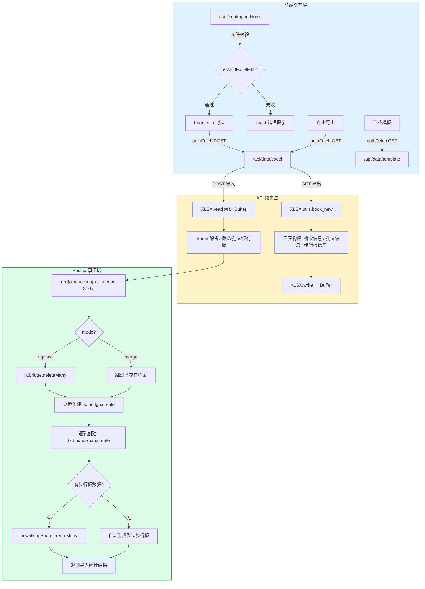
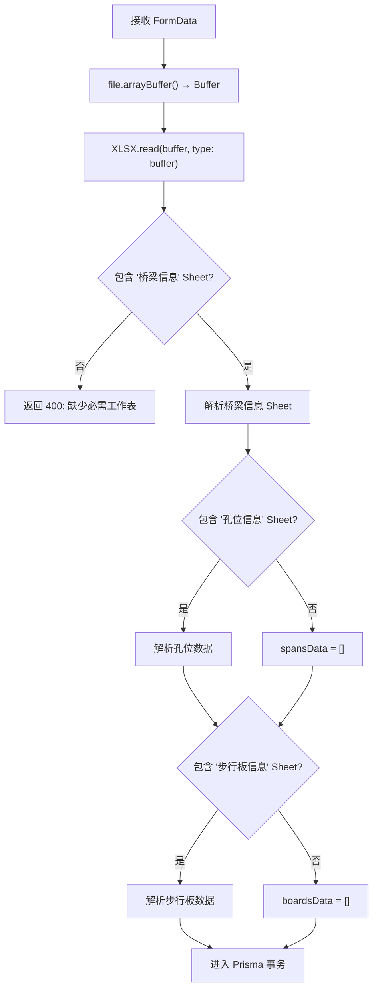
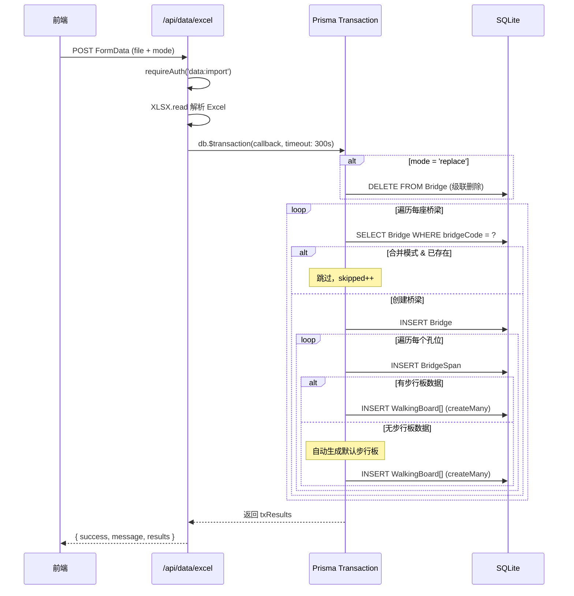

本系统围绕 **SheetJS（xlsx 库）** 构建了一套完整的三级数据（桥梁 → 桥孔 → 步行板）Excel 批量导入导出机制，并在导入侧通过 **Prisma 交互式事务** 确保操作的原子性与数据一致性。本文将从前端交互层、API 路由层到事务保护层逐一解析其设计模式与实现细节。

Sources: [package.json](package.json#L84-L84), [src/hooks/useDataImport.ts](src/hooks/useDataImport.ts#L1-L224), [src/app/api/data/excel/route.ts](src/app/api/data/excel/route.ts#L1-L576)

## 整体架构概览

Excel 导入导出的数据流贯穿三层架构：**前端 Hook 层**负责文件选择、格式校验和用户反馈；**API 路由层**负责 Excel 二进制解析与工作簿构建；**数据库事务层**负责多表级联写入的原子性保障。三端通过 `FormData`（上传）和 `ArrayBuffer`（下载）进行二进制数据交换，避免 JSON 序列化带来的编码开销。



Sources: [src/hooks/useDataImport.ts](src/hooks/useDataImport.ts#L54-L163), [src/app/api/data/excel/route.ts](src/app/api/data/excel/route.ts#L1-L425)

## API 路由结构

系统围绕 `/api/data` 路径族构建了完整的 Excel 数据交换端点，其中核心的主路由承担导入导出的全部职责，模板路由提供标准化的填写指南：

| 路由 | 方法 | 功能 | 权限标识 | 关键技术 |
|------|------|------|----------|----------|
| `/api/data/excel` | GET | 导出全量桥梁数据为 `.xlsx` | `data:export` | XLSX.write → Buffer 响应 |
| `/api/data/excel` | POST | 从 Excel 文件批量导入 | `data:import` | XLSX.read + Prisma 事务 |
| `/api/data/template` | GET | 下载标准导入模板 | `data:export` | 含 4 个 Sheet（含填写说明） |
| `/api/excel/export` | GET | 按 bridgeId 导出单桥/全量 | `data:export` | 额外含「统计汇总」Sheet |
| `/api/data` | GET | JSON 格式全量导出 | `data:export` | 结构化 JSON 响应 |
| `/api/data` | POST | JSON 格式批量导入 | `data:import` | 同样使用 Prisma 事务 |

Sources: [src/app/api/data/excel/route.ts](src/app/api/data/excel/route.ts#L1-L425), [src/app/api/data/template/route.ts](src/app/api/data/template/route.ts#L1-L214), [src/app/api/data/route.ts](src/app/api/data/route.ts#L1-L319), [src/app/api/excel/export/route.ts](src/app/api/excel/export/route.ts#L1-L267)

## 前端交互层：useDataImport Hook

**`useDataImport`** 是封装了导入导出全部用户交互逻辑的自定义 Hook。它接收一个 `refreshAllData` 回调（来自 `useBridgeData`），在导入成功后自动刷新页面数据并定位到第一座导入的桥梁。Hook 暴露了五个核心操作方法：

| 方法 | 职责 | API 调用 | 用户反馈 |
|------|------|----------|----------|
| `handleExportData` | 导出全部桥梁为 Excel | `GET /api/data/excel` | Toast 加载/成功/失败 |
| `handleDownloadTemplate` | 下载标准导入模板 | `GET /api/data/template` | Toast 加载/成功/失败 |
| `handleSelectImportFile` | 选择并校验文件格式 | — | 文件类型校验失败时 Toast 提示 |
| `handleExecuteImport` | 带配置对话框的导入 | `POST /api/data/excel` | 完整导入结果反馈 |
| `handleQuickImportData` | 无配置的快速导入（合并模式） | `POST /api/data/excel` | 简化反馈流程 |

文件校验逻辑采用**双重验证策略**：同时检查 `file.type`（MIME 类型）和文件扩展名（`.xlsx` / `.xls`），兼容不同浏览器对 MIME 类型的识别差异：

```typescript
function isValidExcelFile(file: File): boolean {
  const validTypes = [
    'application/vnd.openxmlformats-officedocument.spreadsheetml.sheet',
    'application/vnd.ms-excel',
  ]
  const fileExtension = file.name.split('.').pop()?.toLowerCase()
  return validTypes.includes(file.type) || ['xlsx', 'xls'].includes(fileExtension || '')
}
```

下载逻辑通过通用的 `downloadBlob` 辅助函数实现，它将 Response 转换为 Blob 后创建临时 `<a>` 元素触发浏览器下载，下载完成后立即通过 `URL.revokeObjectURL` 释放内存，避免资源泄漏。

Sources: [src/hooks/useDataImport.ts](src/hooks/useDataImport.ts#L33-L52), [src/hooks/useDataImport.ts](src/hooks/useDataImport.ts#L54-L224)

## 导入配置对话框：ImportDialog

`ImportDialog` 组件为用户提供了可视化的导入参数配置界面。它通过四个维度控制导入行为：

**导入模式**（`mode`）是核心配置项，决定数据冲突时的处理策略：
- **合并模式**（`merge`）：保留现有数据，遇到相同 `bridgeCode` 的桥梁自动跳过
- **替换模式**（`replace`）：先执行 `deleteMany` 清空所有桥梁数据，再导入新数据

**导入范围**通过三个独立开关（`importBridges`、`importSpans`、`importBoards`）控制是否导入对应层级的数据。在合并模式下还会显示「跳过已存在的桥梁」开关。组件底部集成了模板下载入口，引导用户使用标准格式。

Sources: [src/components/bridge/ImportDialog.tsx](src/components/bridge/ImportDialog.tsx#L1-L150)

## Excel 导出：三表结构与列宽优化

导出流程（`GET /api/data/excel`）通过 Prisma 的 `include` 嵌套查询一次性加载 **桥梁 → 孔位 → 步行板** 三级数据，然后将其扁平化为三个工作表：

| 工作表名称 | 数据来源 | 核心字段 | 列宽配置 |
|------------|----------|----------|----------|
| **桥梁信息** | `Bridge` | 序号、名称、编号、线路、位置、总孔数、创建时间 | 7 列，6-30 字符 |
| **孔位信息** | `BridgeSpan` | 桥梁关联、孔号、尺寸、板数/列数、避车台配置、材质 | 12 列，6-30 字符 |
| **步行板信息** | `WalkingBoard` | 桥梁/孔位关联、编号、位置、状态、检查信息、环境数据、物理尺寸 | 25 列，6-20 字符 |

导出过程中，所有枚举值都通过 `getXxxLabel` 系列辅助函数转换为中文标签（如 `normal` → `正常`，`galvanized_steel` → `镀锌钢`），确保非技术人员也能直接阅读导出文件。每个工作表都通过 `!cols` 属性预设了列宽，避免 Excel 打开时内容被截断。

最终通过 `XLSX.write(workbook, { type: 'buffer', bookType: 'xlsx' })` 生成二进制 Buffer，以 `Content-Type: application/vnd.openxmlformats-officedocument.spreadsheetml.sheet` 直接返回文件流，文件名包含导出日期（如 `桥梁步行板数据_2026-04-02.xlsx`）。

Sources: [src/app/api/data/excel/route.ts](src/app/api/data/excel/route.ts#L8-L173)

## Excel 导入：解析流程与数据重建

导入流程（`POST /api/data/excel`）接收 `FormData`（包含 `file` 和 `mode` 两个字段），通过 `XLSX.read` 将二进制 Buffer 解析为工作簿对象，然后按层级逐表提取数据：



在事务内部，数据重建遵循**桥梁驱动**的遍历模式：外层循环遍历 `bridgesData` 的每一行，对每座桥梁：
1. 校验必填字段（`桥梁名称` 和 `桥梁编号`）
2. 在合并模式下检查 `bridgeCode` 是否已存在，存在则跳过
3. 关联查询该桥梁对应的孔位数据（`spansData.filter(桥梁编号 === bridgeCode)`）
4. 创建桥梁记录后，按 `totalSpans` 循环创建每个孔位
5. 对每个孔位，查找关联的步行板数据，有则批量导入，无则自动生成

**步行板自动生成逻辑**是一个重要的容错设计：当 Excel 中不包含「步行板信息」Sheet 或某孔位没有对应的步行板数据时，系统会根据孔位配置（上行/下行板数、列数、避车台设置）自动计算并生成默认步行板。生成规则为：每列步行板数 = `Math.ceil(总板数 / 列数)`，逐列逐行填充，所有自动生成的步行板状态默认为 `normal`。

Sources: [src/app/api/data/excel/route.ts](src/app/api/data/excel/route.ts#L176-L425), [src/app/api/data/excel/route.ts](src/app/api/data/excel/route.ts#L294-L401)

## 中英文枚举双向映射

系统在数据库中存储英文枚举值（如 `normal`、`upstream`、`galvanized_steel`），而在 Excel 中使用中文标签。导入导出过程依赖一组 `parseXxx` / `getXxxLabel` 辅助函数实现双向转换：

| 枚举域 | 英文值（DB） | 中文标签 | 解析函数 | 回退默认值 |
|--------|------------|---------|---------|------------|
| 步行板状态 | `normal` / `minor_damage` / `severe_damage` / `fracture_risk` / `replaced` / `missing` | 正常 / 轻微损坏 / 严重损坏 / 断裂风险 / 已更换 / 缺失 | `parseStatus` | `normal` |
| 位置 | `upstream` / `downstream` / `shelter` / `shelter_left` / `shelter_right` | 上行 / 下行 / 避车台 / 避车台左侧 / 避车台右侧 | `parsePosition` | `upstream` |
| 材质 | `galvanized_steel` / `composite` / `aluminum` / `steel_grating` | 镀锌钢 / 复合材料 / 铝合金 / 钢格栅 | `parseMaterial` | `galvanized_steel` |
| 避车台侧 | `none` / `single` / `double` | 无 / 单侧 / 双侧 | `parseShelterSide` | `none` |
| 天气状况 | `normal` / `rain` / `snow` / `fog` / `ice` | 正常 / 雨天 / 雪天 / 雾天 / 冰冻 | `parseWeather` | `null` |
| 栏杆状态 | `normal` / `loose` / `damaged` / `missing` | 正常 / 松动 / 损坏 / 缺失 | `parseRailing` | `null` |
| 托架状态 | `normal` / `loose` / `damaged` / `corrosion` / `missing` | 正常 / 松动 / 损坏 / 锈蚀 / 缺失 | `parseBracket` | `null` |

这种设计模式的关键优势在于：**导出时数据库枚举值转为可读中文，导入时中文标签无损还原为系统枚举**，两端映射字典保持一一对应关系，且每个解析函数都设有合理的默认值兜底，确保即使 Excel 中存在非标准填写也不会导致导入失败。

Sources: [src/app/api/data/excel/route.ts](src/app/api/data/excel/route.ts#L427-L576)

## 事务保护机制

### 交互式事务与原子性保证

导入操作的核心保护层是 **Prisma 交互式事务**（`db.$transaction(async (tx) => {...}, { timeout: 300_000 })`）。这意味着整个导入过程——从替换模式下的 `deleteMany` 到最后一座桥梁的最后一块步行板的 `createMany`——全部在同一个数据库事务中执行。任何一步失败，所有已执行的写操作都会自动回滚。

事务的超时时间设置为 **300 秒**（5 分钟），远超 Prisma 默认的 5 秒超时，这是为了应对大规模数据导入场景。在 SQLite 后端下，事务通过独占锁实现序列化隔离级别，天然避免了并发导入时的数据竞争。



### 级联删除与数据完整性

Prisma Schema 中 `BridgeSpan` 到 `Bridge` 的关系定义了 `onDelete: Cascade`，这意味着在替换模式下执行 `tx.bridge.deleteMany({})` 时，所有关联的孔位和步行板记录会被数据库自动级联删除，无需手动清理子表数据。这种设计简化了替换模式的实现，也避免了因遗漏删除而导致的孤立记录。

Sources: [src/app/api/data/excel/route.ts](src/app/api/data/excel/route.ts#L217-L414), [prisma/schema.prisma](prisma/schema.prisma#L48-L48)

## 导入模板设计

`GET /api/data/template` 端点生成的标准导入模板包含 **4 个工作表**，不仅提供了数据填写的占位示例，还内建了完整的填写说明文档：

| 工作表 | 行数 | 功能定位 |
|--------|------|----------|
| **桥梁信息** | 2 行示例 | 含「说明_填写后删除此列」辅助列，标注必填项 |
| **孔位信息** | 2 行示例 | 展示避车台配置（双侧 vs 无）的差异写法 |
| **步行板信息** | 3 行示例 | 覆盖上行正常、上行轻微损坏、下行严重损坏三种典型场景 |
| **填写说明** | 17 行规则 | 逐字段说明必填性、可选值范围和格式要求 |

模板中的每个示例行都刻意设置了不同的值组合（如避车台的「双侧」与「无」、状态的「正常」「轻微损坏」「严重损坏」），目的是通过**正例教学**让用户理解所有可选值的写法。步行板示例中的第三行还展示了「紧急维修」这类 `remarks` 字段的用法，引导用户填写有实际业务意义的备注信息。

Sources: [src/app/api/data/template/route.ts](src/app/api/data/template/route.ts#L1-L214)

## 导入结果反馈与错误处理

导入完成后，事务回调返回的 `txResults` 对象包含精确到每座桥梁的执行统计：

```typescript
{
  success: number,      // 成功导入的桥梁数量
  failed: number,       // 导入失败的桥梁数量
  skipped: number,      // 跳过的桥梁数量（合并模式下已存在）
  errors: string[],     // 每座失败桥梁的具体错误信息
  importedBridgeIds: string[]  // 成功导入的桥梁 ID 列表
}
```

前端接收到响应后，首先通过 `result.results?.importedBridgeIds?.[0]` 获取第一座成功导入的桥梁 ID，传递给 `refreshAllData(firstImportedBridgeId)` 实现自动定位——用户导入完成后无需手动翻找，系统直接跳转到导入的第一座桥梁。

错误处理采用**分层捕获**策略：外层 `try-catch` 捕获事务级别的致命错误（如数据库连接失败），内层每座桥梁独立的 `try-catch` 捕获单条记录的业务错误（如数据格式不合法），单条失败不影响其余桥梁的导入，但最终会在 `errors` 数组中报告每条失败的具体原因。

Sources: [src/hooks/useDataImport.ts](src/hooks/useDataImport.ts#L127-L163), [src/app/api/data/excel/route.ts](src/app/api/data/excel/route.ts#L223-L424)

## 权限控制

所有导入导出端点都通过 `requireAuth` 中间件进行鉴权，分别要求 `data:export` 和 `data:import` 权限。这意味着只读用户（`viewer` 角色）无法执行导入操作，但可以导出数据和下载模板。详细的权限体系请参阅 [RBAC 四级角色权限控制体系](10-rbac-si-ji-jiao-se-quan-xian-kong-zhi-ti-xi) 和 [requireAuth 统一鉴权中间件](13-requireauth-tong-jian-quan-zhong-jian-jian)。

Sources: [src/app/api/data/excel/route.ts](src/app/api/data/excel/route.ts#L9-L10), [src/app/api/data/excel/route.ts](src/app/api/data/excel/route.ts#L177-L178)

## 补充导出端点

除主路由外，系统还提供了两个辅助导出端点：

**`/api/excel/export`** 支持通过 `?bridgeId=` 查询参数导出单座桥梁数据，并额外生成第四个「统计汇总」Sheet，包含每座桥梁的步行板总数、各状态计数和损坏率/高风险率计算。当不传 `bridgeId` 时导出全部桥梁。

**`/api/export`** 提供 JSON 格式的导出，返回扁平化的步行板数据数组，适用于前端脚本消费或与其他系统集成。JSON 导出不需要 xlsx 库参与，响应体积更小。

Sources: [src/app/api/excel/export/route.ts](src/app/api/excel/export/route.ts#L1-L267), [src/app/api/export/route.ts](src/app/api/export/route.ts#L1-L113)

## 延伸阅读

- [三级数据模型：桥梁 → 桥孔 → 步行板](6-san-ji-shu-ju-mo-xing-qiao-liang-qiao-kong-bu-xing-ban) — 理解导入导出的三层数据结构基础
- [步行板单块编辑与批量操作流程](15-bu-xing-ban-dan-kuai-bian-ji-yu-pi-liang-cao-zuo-liu-cheng) — 了解 Excel 批量导入之外的步行板编辑方式
- [PDF 安全分析报告导出](20-pdf-an-quan-fen-xi-bao-gao-dao-chu) — 另一种数据导出形式的技术实现
- [离线支持：IndexedDB 本地存储与自动同步服务](25-chi-xian-zhi-chi-indexeddb-ben-di-cun-chu-yu-zi-dong-tong-bu-fu-wu) — 离线场景下的数据持久化与同步机制