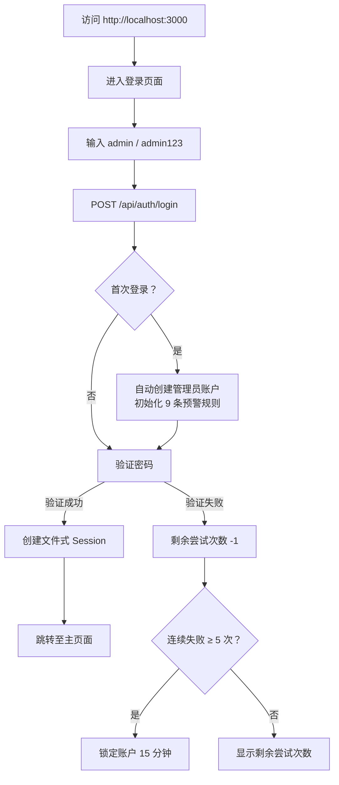

本文档是**铁路明桥面步行板可视化管理系统**的环境搭建指南。你将从零开始，在本地完成所有依赖安装、数据库初始化和首次登录验证，最终在浏览器中看到完整运行的系统。整个过程不涉及任何外部数据库服务或云平台——项目使用 **SQLite** 作为本地数据库，开箱即用。

---

## 前置条件

在开始之前，请确认你的开发环境满足以下最低要求：

| 工具 | 最低版本 | 推荐版本 | 验证命令 |
|------|---------|---------|---------|
| **Node.js** | 18.17+ | 20.x LTS | `node -v` |
| **npm** | 9.0+ | 随 Node.js 附带 | `npm -v` |
| **Git** | 2.0+ | 最新稳定版 | `git --version` |

**关键说明**：项目基于 **Next.js 16**（App Router 模式）和 **React 19**，对 Node.js 运行时有较高要求。推荐使用 Node.js 20.x LTS 版本以确保完整兼容性。项目采用 **SQLite** 作为数据库引擎，无需额外安装 MySQL、PostgreSQL 等外部数据库服务——Prisma ORM 会在项目目录下自动创建和管理 SQLite 数据库文件。

Sources: [package.json](package.json#L64-L71), [prisma/schema.prisma](prisma/schema.prisma#L8-L11)

---

## 第一步：获取项目代码

通过 Git 将项目克隆到本地工作目录：

```bash
git clone <repository-url> bridge-board-system
cd bridge-board-system
```

如果你已经拥有项目代码（例如通过压缩包方式获取），只需进入项目根目录即可。项目根目录的特征是包含 `package.json`、`next.config.ts` 和 `prisma/schema.prisma` 等核心配置文件。

Sources: [package.json](package.json#L1-L4)

---

## 第二步：安装依赖

项目使用 npm 作为包管理器。在项目根目录执行以下命令完成所有依赖安装：

```bash
npm install
```

这将安装约 **70+ 个生产依赖**和若干开发依赖，涵盖以下核心类别：

| 依赖类别 | 核心包 | 用途 |
|---------|-------|------|
| **框架层** | `next`, `react`, `react-dom` | Next.js 16 + React 19 运行时 |
| **数据库** | `@prisma/client`, `prisma` | Prisma ORM + SQLite |
| **UI 组件** | `@radix-ui/*` (20+ 包) | shadcn/ui 底层无障碍组件 |
| **3D 渲染** | `three`, `@types/three` | Three.js 程序化桥梁模型 |
| **数据请求** | `@tanstack/react-query`, `@tanstack/react-table` | 服务端状态管理 + 数据表格 |
| **表单校验** | `react-hook-form`, `zod` | 表单处理 + Schema 验证 |
| **文件处理** | `xlsx`, `jspdf`, `html2canvas` | Excel 导入导出 + PDF 报告 |
| **样式动画** | `tailwindcss`, `framer-motion` | Tailwind CSS 4 + 动画库 |

安装完成后，项目根目录会生成 `node_modules/` 文件夹。由于 `.gitignore` 已配置忽略该目录，这些依赖不会被提交到版本库。

Sources: [package.json](package.json#L15-L101), [.gitignore](.gitignore#L1-L5)

---

## 第三步：配置环境变量

项目仅需要一个环境变量——**数据库连接字符串**。在项目根目录创建 `.env` 文件：

```bash
# 复制示例配置文件
copy .env.example .env
```

`.env` 文件内容如下（无需修改）：

```env
# 数据库路径 (SQLite)
DATABASE_URL="file:./prisma/dev.db"
```

**关键说明**：`DATABASE_URL` 指向 Prisma 目录下的 `dev.db` 文件。这是一个相对路径，Prisma 会在首次运行时自动创建该 SQLite 数据库文件。`.gitignore` 已配置忽略 `*.db` 和 `.env` 文件，确保本地数据库和敏感配置不会被意外提交到版本库。

Sources: [.env.example](.env.example#L1-L3), [.gitignore](.gitignore#L27-L42)

---

## 第四步：初始化数据库

数据库初始化分为两个关键步骤——**生成 Prisma 客户端**和**推送 Schema 到数据库**：

```bash
# 生成 Prisma 客户端（基于 schema.prisma 生成 TypeScript 类型）
npm run db:generate

# 推送 Schema 到数据库（创建 SQLite 文件和数据表）
npm run db:push
```

执行 `db:push` 后，Prisma 会在 `prisma/` 目录下自动创建 `dev.db` 文件，并根据 `schema.prisma` 中定义的 **11 个数据模型**生成对应的数据表。该 Schema 定义了系统完整的三级数据结构（桥梁 → 桥孔 → 步行板）以及用户、权限、预警、通知等支撑模块。

**可用的数据库管理命令**：

| 命令 | 作用 | 使用场景 |
|------|------|---------|
| `npm run db:generate` | 生成 Prisma Client 类型代码 | 修改 Schema 后执行 |
| `npm run db:push` | 推送 Schema 到数据库（无迁移文件） | 开发环境快速迭代 |
| `npm run db:migrate` | 创建迁移文件并应用 | 正式版本迭代（推荐） |
| `npm run db:reset` | 重置数据库（清空所有数据） | 开发调试需要重置时 |

Sources: [package.json](package.json#L10-L13), [prisma/schema.prisma](prisma/schema.prisma#L1-L11)

---

## 第五步：启动开发服务器

一切就绪后，启动 Next.js 开发服务器：

```bash
npm run dev
```

终端将显示类似以下输出：

```
▲ Next.js 16.x.x
- Local:        http://localhost:3000
- Environments: .env

 ✓ Starting...
 ✓ Ready in 2s
```

开发服务器默认运行在 **3000 端口**（由 `package.json` 中的 `dev` 脚本指定：`next dev -p 3000`）。打开浏览器访问 `http://localhost:3000`，你将看到系统的登录页面。

Sources: [package.json](package.json#L6)

---

## 第六步：首次登录

系统采用**惰性初始化**策略——默认管理员账户不会在数据库创建时自动生成，而是在**首次登录请求**时自动创建。

### 默认管理员凭据

| 字段 | 值 |
|------|-----|
| 用户名 | `admin` |
| 密码 | `admin123` |

### 登录流程



登录接口 `POST /api/auth/login` 在处理请求时会依次执行三个自动初始化操作：

1. **`createDefaultAdmin()`** —— 检查数据库中是否存在 `admin` 用户，若不存在则自动创建，密码通过 PBKDF2（10000 次迭代 + SHA-512）哈希存储
2. **`seedAlertRules()`** —— 幂等地检查 9 条内置预警规则是否已存在，若缺失则自动补充
3. **会话创建** —— 生成 64 字符的随机 Token，存储到 `prisma/db/sessions.json` 文件中，有效期 7 天

Sources: [src/app/api/auth/login/route.ts](src/app/api/auth/login/route.ts#L64-L70), [src/lib/auth/index.ts](src/lib/auth/index.ts#L136-L153), [src/lib/seed-alert-rules.ts](src/lib/seed-alert-rules.ts#L147-L170), [src/lib/session-store.ts](src/lib/session-store.ts#L77-L107)

---

## 第七步：验证系统运行

登录成功后，你将进入系统的主页面——桥梁步行板可视化管理界面。以下功能可帮助你快速验证系统是否正常运行：

### 首页健康检查清单

| 验证项 | 操作方式 | 预期结果 |
|--------|---------|---------|
| **页面加载** | 查看首页是否正常渲染 | 显示空状态引导界面，提示"创建第一座桥梁" |
| **API 健康检查** | 浏览器访问 `http://localhost:3000/api` | 返回 `{"message":"Hello, world!"}` |
| **创建桥梁** | 点击「新建桥梁」按钮，填写表单 | 成功创建桥梁并自动生成桥孔和步行板 |
| **步行板编辑** | 点击任意步行板格子 | 弹出编辑对话框，可修改状态 |
| **3D 视图** | 切换至 3D 模式 | Three.js 渲染桥梁三维模型 |
| **主题切换** | 页面右上角主题切换按钮 | 深色/浅色主题正常切换 |
| **仪表盘** | 访问 `/dashboard` | 数据总览仪表盘正常展示 |

Sources: [src/app/api/route.ts](src/app/api/route.ts#L1-L5), [src/app/layout.tsx](src/app/layout.tsx#L17-L30)

---

## 项目目录速览

以下是项目核心目录结构，帮助你快速定位关键文件：

```
bridge-board-system/
├── prisma/
│   ├── schema.prisma          # 数据库 Schema（11 个模型）
│   └── db/
│       ├── dev.db             # SQLite 数据库（运行后生成）
│       └── sessions.json      # 文件式会话存储（运行后生成）
├── src/
│   ├── app/                   # Next.js App Router 页面和 API
│   │   ├── layout.tsx         # 根布局（字体、Provider、元数据）
│   │   ├── page.tsx           # 主应用页面
│   │   ├── login/             # 登录页
│   │   ├── dashboard/         # 数据总览仪表盘
│   │   └── api/               # RESTful API 路由
│   ├── components/            # UI 组件
│   │   ├── ui/                # 50+ shadcn/ui 基础组件
│   │   ├── auth/              # 认证相关组件
│   │   ├── bridge/            # 桥梁业务组件
│   │   └── 3d/                # Three.js 3D 渲染组件
│   ├── hooks/                 # 自定义 React Hooks
│   ├── lib/                   # 核心工具库
│   │   ├── db.ts              # Prisma 单例客户端
│   │   ├── auth/              # 认证、RBAC、密码哈希
│   │   └── session-store.ts   # 文件式会话管理
│   └── types/                 # TypeScript 类型定义
├── .env                       # 环境变量（需手动创建）
├── package.json               # 项目配置和脚本
├── next.config.ts             # Next.js 配置
├── tailwind.config.ts         # Tailwind CSS 配置
└── tsconfig.json              # TypeScript 配置（路径别名 @/ → src/）
```

Sources: [tsconfig.json](tsconfig.json#L26-L29), [src/lib/db.ts](src/lib/db.ts#L1-L13)

---

## 常见问题排查

| 问题现象 | 可能原因 | 解决方案 |
|---------|---------|---------|
| `npm install` 报错依赖冲突 | npm 版本过低 | 升级 Node.js 至 20.x LTS |
| `db:push` 报错 `DATABASE_URL` 未定义 | `.env` 文件缺失 | 执行 `copy .env.example .env` |
| 启动后页面空白 | Prisma Client 未生成 | 执行 `npm run db:generate` |
| 登录报错"用户不存在" | 数据库未初始化 | 执行 `npm run db:push` |
| 端口 3000 被占用 | 其他服务占用 | 修改 `package.json` 中 dev 脚本的端口号 |
| 3D 模型不显示 | WebGL 不支持 | 使用 Chrome/Firefox 最新版，检查 GPU 加速是否开启 |
| 登录页面"账户已锁定" | 连续 5 次输错密码 | 等待 15 分钟，或删除 `prisma/db/sessions.json` 并重启 |

Sources: [src/app/api/auth/login/route.ts](src/app/api/auth/login/route.ts#L19-L20), [.env.example](.env.example#L1-L3)

---

## 推荐阅读顺序

系统已成功运行，接下来建议按以下顺序深入了解项目架构：

1. **[项目目录结构与模块职责](3-xiang-mu-mu-lu-jie-gou-yu-mo-kuai-zhi-ze)** —— 理解每个目录和文件的具体职责，建立全局架构认知
2. **[技术栈总览：Next.js 16 + Prisma + Three.js](4-ji-zhu-zhan-zong-lan-next-js-16-prisma-three-js)** —— 深入了解每项技术选型的理由和集成方式
3. **[三级数据模型：桥梁 → 桥孔 → 步行板](6-san-ji-shu-ju-mo-xing-qiao-liang-qiao-kong-bu-xing-ban)** —— 理解核心业务数据的层级关系和设计思路