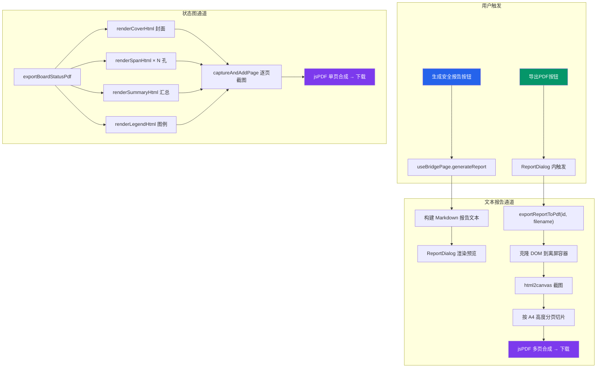
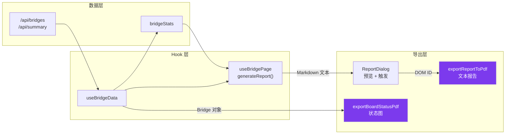

本系统实现了**双通道 PDF 导出架构**：一条通道用于生成结构化的安全分析文本报告（基于 DOM 截图），另一条通道用于生成可视化的步行板状态网格图（基于离屏 HTML 渲染）。两条通道均依赖 `html2canvas` + `jsPDF` 的纯前端方案，无需后端参与文档生成，所有 PDF 渲染计算均在浏览器端完成。

## 整体架构

系统围绕 [pdf-export.ts](src/lib/pdf-export.ts) 这一核心库构建了两个独立的导出函数，分别服务于不同的业务场景。`exportBoardStatusPdf` 接收完整的桥梁层级数据，通过离屏 HTML 模板逐页渲染封面、各孔网格、汇总统计和图例说明；`exportReportToPdf` 则更加通用，接收任意 DOM 元素的 ID，将其克隆到离屏容器后截图转换为多页 PDF。



Sources: [pdf-export.ts](src/lib/pdf-export.ts#L1-L484), [useBridgePage.tsx](src/hooks/useBridgePage.tsx#L262-L401), [ReportDialog.tsx](src/components/bridge/ReportDialog.tsx#L1-L117)

## 核心技术选型

PDF 生成选择了纯前端渲染方案，而非后端 LaTeX 或 Puppeteer 路线。这一决策的根本原因是中文排版兼容性——`jsPDF` 原生不支持中文字体内嵌，而通过 `html2canvas` 先将 HTML 渲染为位图再嵌入 PDF，天然绕过了字体问题，浏览器自身的文本渲染引擎确保了中文内容的完整呈现。

| 技术依赖 | 版本 | 职责 |
|---------|------|------|
| `html2canvas` | ^1.4.1 | 将 DOM 元素截图为 Canvas 位图，支持 CSS 样式完整还原 |
| `jsPDF` | ^4.2.1 | 在浏览器端构建 PDF 文档对象，管理页面、图片嵌入和文件下载 |
| 浏览器离屏容器 | — | 以 `position: fixed; left: -9999px` 创建不可见渲染区域，确保截图不影响用户界面 |

这种方案的关键限制在于**输出为位图而非矢量**——`html2canvas` 以 `scale: 2` 的采样率截图，保证 A4 纸尺寸下（794px 宽度）的文字清晰度可接受，但放大后仍会出现像素化。

Sources: [package.json](package.json#L60-L62), [pdf-export.ts](src/lib/pdf-export.ts#L330-L363)

## 通道一：安全分析文本报告

### 报告内容生成

安全分析报告的文本内容由 `useBridgePage` 中的 `generateReport` 函数动态构建。该函数以当前选中的桥梁数据和统计指标为输入，生成一份结构化的 Markdown 格式报告，涵盖五个核心章节：基本信息、整体状况、各孔详细状态、人员作业走行建议和安全提示。

报告生成逻辑的关键在于**风险分级判断**。系统将各孔步行板按 `fracture_risk`（断裂风险）和 `severe_damage`（严重损坏）状态划分为三个等级：

| 风险标记 | 判定条件 | 报告中显示 |
|---------|---------|-----------|
| 🔴 高风险 | 存在任意 `fracture_risk` 步行板 | 禁止通行区域，红色标注 |
| 🟡 需关注 | 存在 `severe_damage` 但无 `fracture_risk` | 谨慎通行区域，黄色标注 |
| 🟢 正常 | 无上述两种状态 | 可正常通行，绿色标注 |

整体损坏率同样驱动着走行建议的生成逻辑——超过 30% 建议限制通行，15%-30% 建议优先维修，5%-15% 建议日常维护，5% 以下评定为状况优秀。此外，系统还会检查栏杆和托架附属设施的问题数量，以及避车台配置情况，将这些信息一并纳入报告。

Sources: [useBridgePage.tsx](src/hooks/useBridgePage.tsx#L267-L401)

### 报告预览与导出流程

生成的 Markdown 文本通过 `ReportDialog` 组件进行预览。该组件实现了一个简易的 Markdown 渲染器，通过逐行匹配 `#`、`##`、`###`、`- `、`|`、`---`、`**...**` 等 Markdown 标记，将文本转换为带样式的 HTML 元素。渲染后的内容挂载在一个 `id="report-content"` 的 `div` 下，为后续 PDF 导出提供截图目标。

```mermaid
flowchart LR
    A[Markdown 文本] --> B[逐行解析]
    B --> C{行首标记判断}
    C -->|# | D[h1 标题]
    C -->|## | E[h2 标题]
    C -->|### | F[h3 标题]
    C -->|'- ' | G[列表项]
    C -->|'\|' | H[表格行]
    C -->|'---' | I[分隔线]
    C -->|'**...**' | J[粗体段落]
    C -->|其他 | K[普通段落]

    style A fill:#1e3a8a,color:#fff
    style K fill:#f1f5f9,color:#1e293b
```

用户在对话框中可以选择三种操作：**复制报告**（将 Markdown 原文写入剪贴板）、**导出 PDF**（调用 `exportReportToPdf`）。导出 PDF 时，函数通过 `document.getElementById('report-content')` 定位到预览区域的 DOM 节点，执行后续截图流程。

Sources: [ReportDialog.tsx](src/components/bridge/ReportDialog.tsx#L40-L117)

### DOM 截图转多页 PDF

`exportReportToPdf` 函数实现了完整的 DOM 到多页 PDF 转换管线。其核心算法是**长图分页切片**——将整个报告内容作为一张完整截图，然后按 A4 页面高度切分为多个 Canvas 片段，逐页嵌入 PDF 文档。

处理流程分为以下关键步骤：

1. **克隆到离屏容器**：将目标 DOM 元素 `cloneNode(true)` 复制到固定宽度 794px 的离屏 `div` 中，设置白色背景和适当的字体、行高样式，确保渲染结果与预览一致
2. **截图**：调用 `html2canvas(clone, { scale: 2, width: 794 })` 以 2 倍分辨率渲染
3. **计算分页**：根据 `scaledHeight / pageContentHeight` 向上取整计算总页数
4. **逐页切片**：对每一页，通过 `canvas.drawImage()` 从完整截图中裁剪出对应区域，生成独立的 Canvas 片段
5. **嵌入 PDF**：将每个切片以 PNG 格式添加到 jsPDF 的对应页面，并在页面底部居中添加 `当前页/总页数` 格式的页码
6. **触发下载**：调用 `pdf.save(filename)` 生成并下载文件，文件名格式为 `桥梁报告_{桥梁名}_{日期}.pdf`

Sources: [pdf-export.ts](src/lib/pdf-export.ts#L398-L483)

## 通道二：步行板状态图 PDF

### 离屏 HTML 模板渲染

`exportBoardStatusPdf` 采用与文本报告不同的策略——不是截图已有 DOM，而是在内存中动态构建完整的 HTML 模板字符串，注入离屏容器后截图。这种方式的灵活性更高，可以实现精确的页面布局控制。

整个 PDF 由四种页面模板组成，每页宽度统一为 794px（对应 A4 纸 210mm 宽度在 96dpi 下的像素值）：

| 页面类型 | 渲染函数 | 内容说明 |
|---------|---------|---------|
| 封面 | `renderCoverHtml` | 桥梁名称、编号、位置、总孔数、步行板总数、损坏率、报告日期 |
| 各孔详情 | `renderSpanHtml` | 上行/下行步行板网格、避车台、单孔统计概览、损坏率进度条 |
| 汇总页 | `renderSummaryHtml` | 全桥各孔统计数据表格、整体损坏率汇总 |
| 图例页 | `renderLegendHtml` | 六种状态颜色含义、布局说明、生成时间戳 |

Sources: [pdf-export.ts](src/lib/pdf-export.ts#L123-L328)

### 步行板分组与网格布局

各孔详情页的核心是步行板网格的渲染。`groupBoardsByPosition` 函数将步行板按 `position` 字段分为五组：`upstream`（上行）、`downstream`（下行）、`shelter_left`（左避车台）、`shelter_right`（右避车台）和 `shelter`（旧版避车台）。上行和下行组内再按 `columnIndex` 进一步分组为列，每列内的步行板按 `boardNumber` 升序排列。

渲染时采用三列布局结构：**上行步行板列 | 铁路线路（灰色竖线）| 下行步行板列**。每个步行板以一个 44×36px 的色块表示，颜色和边框由 `STATUS_COLORS` 配置决定，色块内显示步行板编号。避车台步行板显示在主网格下方，以紫色虚线边框和半透明紫底进行视觉区分。

Sources: [pdf-export.ts](src/lib/pdf-export.ts#L53-L236)

### 统计计算与损坏率分级

`calcSpanStats` 函数对每个桥孔的步行板进行六类状态计数，并计算两个关键比率：**损坏率** = (`minor_damage` + `severe_damage` + `fracture_risk`) / 总数 × 100%，**高风险率** = `fracture_risk` / 总数 × 100%。这两个指标在 PDF 中以进度条和百分比文字的形式呈现，颜色根据损坏率自动分级：

| 损坏率范围 | 颜色 | 含义 |
|-----------|------|------|
| ≥ 30% | `#ef4444` 红色 | 严重，需立即维修 |
| 15% - 30% | `#f97316` 橙色 | 较严重，需优先处理 |
| 5% - 15% | `#eab308` 黄色 | 轻度，需日常关注 |
| < 5% | `#22c55e` 绿色 | 正常，状况良好 |

在汇总页中，如果某孔存在断裂风险步行板（`fracture > 0`），整行会添加 `#fef2f2` 红色底纹进行醒目标注。

Sources: [pdf-export.ts](src/lib/pdf-export.ts#L88-L102), [pdf-export.ts](src/lib/pdf-export.ts#L239-L283)

### 逐页截图与合成

`captureAndAddPage` 函数封装了单页的截图-嵌入流程。每页的处理遵循统一模式：创建离屏容器 → 注入 HTML 字符串 → 等待 100ms 渲染 → `html2canvas` 截图 → 计算图片在 A4 页面内的等比缩放尺寸 → `pdf.addImage` 嵌入。首页复用 `jsPDF` 构造时自动创建的页面，后续每页调用 `pdf.addPage()` 新增。

主函数 `exportBoardStatusPdf` 按顺序调用：封面 → 各孔循环 → 汇总 → 图例，最终以 `步行板状态_{桥梁名}_{日期}.pdf` 格式下载。

Sources: [pdf-export.ts](src/lib/pdf-export.ts#L330-L396)

## 离屏渲染容器机制

两个导出通道共享同一套离屏容器管理机制。`createOffscreenContainer` 在 `document.body` 上创建一个 `position: fixed; left: -9999px; z-index: -1` 的 `div`，设置为白色背景和中文字体栈（PingFang SC、Microsoft YaHei 等），确保 HTML 模板在截图前获得完整的浏览器渲染。

关键的设计考量是**容器的生命周期管理**。每次截图操作都在 `try/finally` 块中执行，`finally` 分支调用 `removeContainer` 确保离屏节点被清理，避免内存泄漏。这一模式在 `captureAndAddPage` 和 `exportReportToPdf` 中均严格遵循。

Sources: [pdf-export.ts](src/lib/pdf-export.ts#L104-L121)

## 数据流关系

PDF 导出功能位于整个数据管线的末端。上游数据来自 [useBridgeData](src/hooks/useBridgeData.ts) 通过 `/api/bridges` 和 `/api/summary` 获取的桥梁层级数据（Bridge → BridgeSpan → WalkingBoard 三级嵌套），以及 `bridgeStats` 统计指标。导出时不需要额外的 API 请求，完全基于客户端已有的数据快照生成。



值得注意的是，`/api/export` 路由提供了 JSON 格式的数据导出能力（受 `requireAuth(request, 'data:export')` 权限保护），但该接口返回的是结构化的步行板数据列表，而非 PDF 文件。PDF 生成完全在客户端完成，不经过此接口。

Sources: [export/route.ts](src/app/api/export/route.ts#L1-L113), [useBridgeData.ts](src/hooks/useBridgeData.ts#L1-L50)

## 扩展与维护要点

**添加新的状态类型**：若步行板状态体系扩展（如[步行板状态体系与颜色编码规范](5-bu-xing-ban-zhuang-tai-ti-xi-yu-yan-se-bian-ma-gui-fan)中定义的类型发生变化），需同步更新 `pdf-export.ts` 中的 `STATUS_COLORS` 常量（第 44-51 行）和 `renderLegendHtml` 中的 `descriptions` 字典（第 288-295 行）。该文件内的颜色定义与 `bridge-constants.ts` 中的 `BOARD_STATUS_CONFIG` 保持独立，需要手动对齐。

**性能优化方向**：当前方案对 N 孔桥梁需要创建 N+3 个离屏容器并执行 N+3 次 `html2canvas` 截图。对于孔数较多（如超过 20 孔）的桥梁，可以考虑将所有页面 HTML 合并到单个容器中，利用 CSS `page-break-after: always` 进行逻辑分页后一次性截图，再按固定高度切片。

**跨页内容截断问题**：`exportReportToPdf` 的分页切片算法按固定像素高度机械切割，如果某行文本正好跨越页面边界，会出现文字被截断的情况。未来可考虑基于 DOM 元素边界的智能分页策略。

Sources: [pdf-export.ts](src/lib/pdf-export.ts#L44-L51), [pdf-export.ts](src/lib/pdf-export.ts#L288-L295)

## 相关页面

- [Excel 批量导入导出与事务保护](19-excel-pi-liang-dao-ru-dao-chu-yu-shi-wu-bao-hu) — 系统的另一种数据导出方式，基于 xlsx 库实现结构化数据表导出
- [步行板状态体系与颜色编码规范](5-bu-xing-ban-zhuang-tai-ti-xi-yu-yan-se-bian-ma-gui-fan) — PDF 中颜色映射的上游定义
- [AI 助手对话与桥梁安全分析](18-ai-zhu-shou-dui-hua-yu-qiao-liang-an-quan-fen-xi) — AI 分析结果可通过同一 ReportDialog 导出为 PDF
- [自定义 Hooks 架构设计模式](14-zi-ding-yi-hooks-jia-gou-she-ji-mo-shi) — `useBridgePage` 的架构设计解析