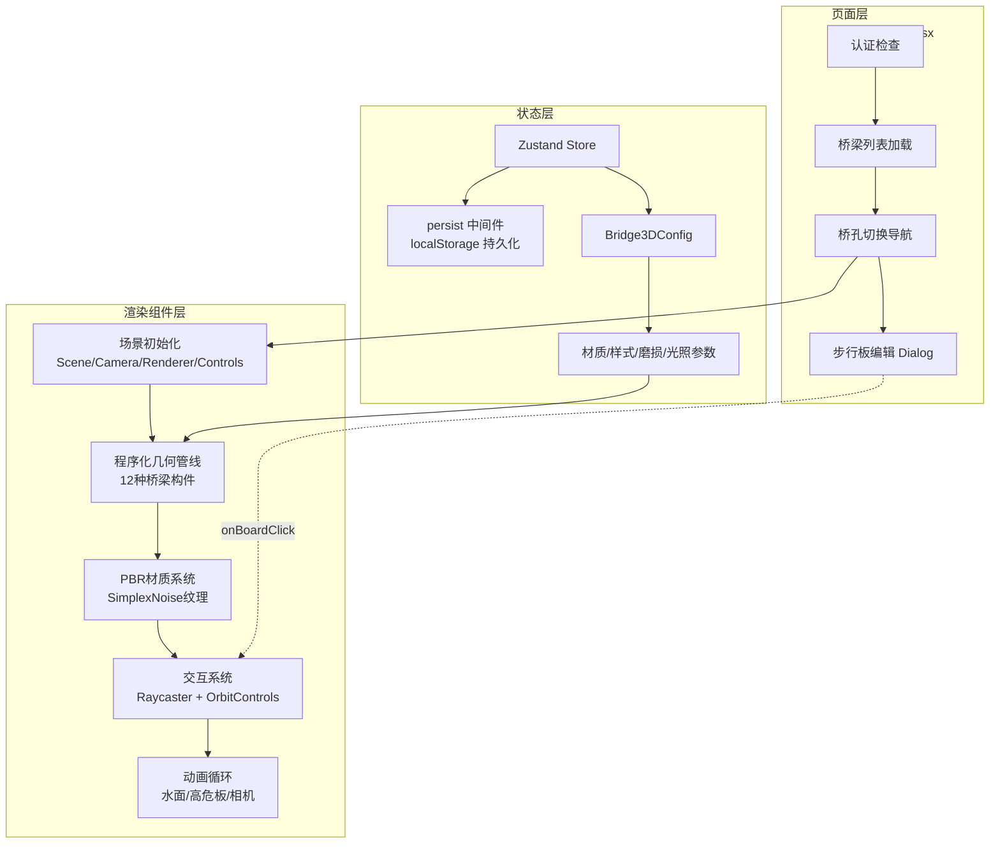
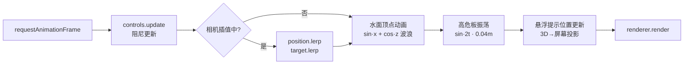

本系统使用 Three.js 实现了铁路明桥面步行板的 **程序化 3D 实时渲染**，无需加载外部模型文件——整座桥梁的所有几何体（桥墩、主梁、钢轨、步行板、道砟、护栏、避车台、水面）均根据数据库中的桥孔参数与步行板状态数据在运行时动态构建。系统支持三种渲染模式（照片级真实感、线框结构图、施工安全检测）、四种材质切换、以及基于 Raycaster 的步行板点击编辑与悬浮提示。本文档将深入剖析其架构分层、程序化几何管线、PBR 材质体系、交互系统与动画循环。

Sources: [HomeBridge3D.tsx](src/components/3d/HomeBridge3D.tsx#L1-L1494), [bridge3d-store.ts](src/lib/bridge3d-store.ts#L1-L166), [bridge-3d/page.tsx](src/app/bridge-3d/page.tsx#L1-L703)

## 架构分层与职责划分

3D 桥梁渲染系统采用 **三层架构**：页面层负责数据获取与鉴权控制，状态层提供持久化的场景配置管理，渲染组件层封装全部 Three.js 场景构建与交互逻辑。



页面层（`bridge-3d/page.tsx`）通过 `dynamic()` 以 `ssr: false` 方式懒加载 `HomeBridge3D` 组件，避免 Three.js 在服务端渲染时报错。页面负责鉴权校验、桥梁/桥孔数据加载与切换、以及步行板状态编辑的 Dialog 交互。渲染组件（`HomeBridge3D.tsx`）被 `memo()` 包裹以避免不必要的重渲染，它接收单个 `BridgeSpanData` 作为 prop，从 Zustand store 读取全局配置，独立管理 Three.js 场景的完整生命周期。

Sources: [bridge-3d/page.tsx](src/app/bridge-3d/page.tsx#L46-L56), [HomeBridge3D.tsx](src/components/3d/HomeBridge3D.tsx#L144-L163), [bridge3d-store.ts](src/lib/bridge3d-store.ts#L78-L113)

## 程序化几何管线：12 种桥梁构件

桥梁场景的所有几何体通过独立的 `useCallback` 工厂函数创建，最终在 `bridgeGroup` 中按序组装。这种设计使每种构件可以独立测试和复用，同时通过依赖数组精确控制重建时机。

### 构件创建顺序与参数依赖

下表列出了全部 12 种桥梁构件的创建函数、所用几何类型及关键参数：

| 序号 | 构件 | 工厂函数 | 几何类型 | 关键参数 |
|------|------|----------|----------|----------|
| 1 | 桥墩 | `createBridgePiers` | `BoxGeometry` | 高 2.5m，顶宽 1.8m，墩帽加宽 0.4m |
| 2 | 主梁 | `createMainBeams` | `BoxGeometry` | 高 0.5m，宽 0.25m，位置跟随 `railGauge` |
| 3 | 横梁 | `createCrossBeams` | `BoxGeometry` | 高 0.35m，间距 1.5m，长度 = 轨距×2+1.5 |
| 4 | 道砟 | `createBallast` | `InstancedMesh` + `BoxGeometry` | 移动端 100 颗 / 桌面端 600 颗碎石 |
| 5 | 挡砟墙 | `createBallastWall` | `BoxGeometry` | 高 0.25m，厚 0.12m，偏移 ±1.8m |
| 6 | 桥枕 | `createSleepers` | `BoxGeometry` | 宽 2.5m，间距 0.6m，木枕有噪声色差 |
| 7 | 正轨 | `createRail` | `ExtrudeGeometry` | 工字钢断面（轨高 176mm），沿 Z 轴拉伸 |
| 8 | 护轨 | 同正轨 `clone` | `ExtrudeGeometry` | 缩放 0.85，偏移至正轨内侧 |
| 9 | 步行板 | `createWalkingBoards` | `BoxGeometry` | 由 span 数据驱动，状态着色 |
| 10 | 护栏 | `createRailing` | `CylinderGeometry` | 立柱 + 上下横杆，间距 2.0m |
| 11 | 避车台 | `createShelterPlatform` | `BoxGeometry` 组合 | 平台 + 背板 + 侧栏 + 顶棚 |
| 12 | 水面 | `createWaterSurface` | `PlaneGeometry` | 顶点动画模拟波浪，透明度脉动 |

Sources: [HomeBridge3D.tsx](src/components/3d/HomeBridge3D.tsx#L336-L512), [HomeBridge3D.tsx](src/components/3d/HomeBridge3D.tsx#L540-L743), [HomeBridge3D.tsx](src/components/3d/HomeBridge3D.tsx#L745-L834)

### 工字钢轨的精确断面建模

正轨采用 `ExtrudeGeometry` 按真实铁路钢轨的工字钢断面尺寸建模，参数精确到毫米级并转换为米制单位。断面通过 `THREE.Shape` 绘制，包含轨底（150mm 宽）、腰部（17mm 宽 × 116mm 高）、轨头（73mm 宽 × 30mm 高）三段，随后沿 Z 轴负方向拉伸（`depth: length`），步进精度为每米 5 段以兼顾性能与曲线平滑度。

```
Shape 绘制路径（左下角出发顺时针）：
  (-baseW/2, 0) → (baseW/2, 0) → (baseW/2, baseH) → (-webW/2, baseH)
  → (-webW/2, baseH+webH) → (-headW/2, baseH+webH) → (-headW/2, railH)
  → (headW/2, railH) → (headW/2, baseH+webH) → (webW/2, baseH+webH)
  → (webW/2, baseH) → (-baseW/2, baseH) → 闭合
```

护轨复用同一几何体（`clone()`），施加 0.85 的等比缩放后放置在正轨内侧（偏移量 = `railGauge/2 - 0.25`）。

Sources: [HomeBridge3D.tsx](src/components/3d/HomeBridge3D.tsx#L291-L333), [HomeBridge3D.tsx](src/components/3d/HomeBridge3D.tsx#L1195-L1219)

### 步行板数据驱动布局

步行板的 3D 排布逻辑完全匹配 2D 网格视图的 `getBoardsByPosition` 函数。核心流程为：先将所有步行板按 `position` 字段分组（upstream / downstream / shelter_left / shelter_right / shelter），再按 `columnIndex` 和 `boardNumber` 排序后按列聚合。每列的步行板沿 Z 轴负方向等距排列，各列沿 X 轴从轨道外侧向两侧展开。

关键的空间计算参数：

- **轨道外侧基准线**：`railOuterEdge = railGauge / 2 + 0.2`（米）
- **步行板宽度**：0.6m，板间间隙 0.05m
- **步行板长度**：`spanLength / maxRows`（自动根据最大列板数均分孔跨长度）
- **上行侧起点 X**：`railOuterEdge + 0.3`，列方向为 +X
- **下行侧起点 X**：`-railOuterEdge - 0.3 - boardWidth`，列方向为 -X
- **避车台步行板**：固定宽度 0.5m、长度 0.8m，放置在 x = ±3.0 的避车台平台上

Sources: [HomeBridge3D.tsx](src/components/3d/HomeBridge3D.tsx#L540-L743), [bridge-constants.ts](src/lib/bridge-constants.ts#L148-L183)

### 道砟的 InstancedMesh 性能优化

道砟（碎石）使用 `InstancedMesh` 实现，将数百个 `DodecahedronGeometry`（十二面体）实例合并为一次绘制调用。每个碎石的位置、旋转和缩放通过 `Matrix4.compose()` 随机生成，移动端仅 100 个实例以降低 GPU 负载，桌面端为 600 个。底部还铺设一层 `BoxGeometry` 作为道砟基础层。这种实例化渲染策略将 draw call 从数百次降至仅 2 次。

Sources: [HomeBridge3D.tsx](src/components/3d/HomeBridge3D.tsx#L460-L512)

## PBR 材质系统与程序化纹理

### 四种材质的物理参数

系统为步行板提供四种材质选项，每种材质基于 `MeshStandardMaterial` 的 PBR 参数精确定义了视觉特征：

| 材质类型 | 基础色 (RGB) | 金属度 | 粗糙度 | 环境贴图强度 | 视觉特征 |
|----------|-------------|--------|--------|-------------|---------|
| `galvanized_steel` 镀锌钢 | (0.65, 0.67, 0.70) | 0.95 | 0.25 | 1.5 | 高反射、银灰色、金属质感 |
| `treated_wood` 防腐木 | (0.35, 0.25, 0.15) | 0.0 | 0.8 | 0.4 | 低反射、暖棕色、木质感 |
| `composite` 复合材料 | (0.3, 0.32, 0.35) | 0.1 | 0.6 | 0.5 | 微反射、深灰色、工业感 |
| `aluminum` 铝合金 | (0.75, 0.77, 0.80) | 0.95 | 0.15 | 1.8 | 极高反射、亮银色、镜面感 |

Sources: [bridge3d-store.ts](src/lib/bridge3d-store.ts#L116-L151)

### SimplexNoise 程序化纹理生成

纹理不依赖外部图片资源，而是通过内嵌的 `SimplexNoise` 类在 512×512 的 Canvas 上程序化生成。噪声算法支持分形叠加（`fractal` 方法），通过 `octaves` 和 `persistence` 参数控制细节层次。颜色纹理的生成流程为：

1. **基础色填充**：从 `MATERIAL_CONFIGS` 获取 RGB 基础值并映射到 0-255 范围
2. **划痕叠加**：高频 2D 噪声 (`noise2D(x/100, y/10)`) × `scratchLevel`，产生沿 Y 轴方向的线性划痕
3. **污渍叠加**：低频分形噪声 (`fractal(x/40, y/40, 3, 0.5)`) × `dirtLevel`，产生不规则污渍斑块
4. **颜色偏移**：划痕影响亮度变化，污渍降低 RGB 三通道（尤其蓝色通道衰减最大，模拟油污效果）

噪声种子存储在 `config.seed` 中，通过 `regenerate()` 随机化种子值即可重新生成全新的纹理细节。桥枕木纹也采用同样的噪声机制，每个枕木的材质色相通过 `offsetHSL` 进行微调以产生自然色差。

Sources: [HomeBridge3D.tsx](src/components/3d/HomeBridge3D.tsx#L16-L83), [HomeBridge3D.tsx](src/components/3d/HomeBridge3D.tsx#L194-L231), [HomeBridge3D.tsx](src/components/3d/HomeBridge3D.tsx#L449-L452)

### 环境贴图程序化生成

系统通过 `createHDREnvironmentMap` 生成 256×256 的 `DataTexture` 作为环境反射贴图（`EquirectangularReflectionMapping`），无需加载 HDR 文件。其原理是根据球面坐标 (theta, phi) 计算天空亮度和地面反射分量，为 R/G/B 三通道赋予带有正弦波微扰的渐变色值。该贴图同时作为 `scene.environment` 提供全局 PBR 照明，以及步行板材质的 `envMap` 提供局部反射。

Sources: [HomeBridge3D.tsx](src/components/3d/HomeBridge3D.tsx#L172-L192)

## 状态着色与损伤可视化

### 六种状态的视觉映射

步行板的状态通过颜色和几何变换在 3D 场景中直观呈现。`STATUS_COLORS` 定义了六种状态到 `THREE.Color` 的映射：

| 状态 | 颜色 | 十六进制 | 可视化效果 |
|------|------|---------|-----------|
| `normal` 正常 | 绿色 | `0x22c55e` | 无额外效果 |
| `minor_damage` 轻微损坏 | 琥珀色 | `0xf59e0b` | 板面着色 + 自发光 |
| `severe_damage` 严重损坏 | 橙色 | `0xf97316` | 板面着色 + 自发光 + 裂纹线条 |
| `fracture_risk` 断裂风险 | 红色 | `0xef4444` | 板面着色 + 强自发光 + 倾斜 0.05rad + 振荡动画 + ⚠ 警告 |
| `missing` 缺失 | 灰色 | `0x6b7280` | 半透明 (opacity 0.3) + 线框 + ⚠ 警告 |
| `replaced` 已更换 | 蓝色 | `0x3b82f6` | 板面着色 + 自发光 |

对于非正常状态的步行板，系统通过 `applyDamageVisuals` 函数施加差异化的视觉效果：`fracture_risk` 状态的板绕 Z 轴微旋转 0.05 弧度；`severe_damage` 状态通过 `BufferGeometry.setFromPoints` 随机生成 3 条裂纹线段并添加为 `LineSegments` 子对象；`missing` 状态将材质切换为半透明线框模式。高危状态（`fracture_risk`、`severe_damage`、`missing`）还会在其上方附加一个 Canvas 绘制的 ⚠ 警告 Sprite。

Sources: [HomeBridge3D.tsx](src/components/3d/HomeBridge3D.tsx#L85-L92), [HomeBridge3D.tsx](src/components/3d/HomeBridge3D.tsx#L584-L608)

### 三种渲染模式的材质遍历

`applyRenderMode` 通过 `group.traverse()` 遍历 bridgeGroup 中的所有 Mesh，根据当前渲染模式切换材质参数：

- **照片级真实感（photorealistic）**：关闭线框，清除非步行板对象的 emissive，保持 PBR 物理渲染
- **线框结构图（wireframe）**：开启线框，为所有对象施加青色 (`0x00ffff`) 自发光强度 0.3
- **施工安全检测（safety_inspection）**：步行板按状态施加差异发光（红/橙/黄/绿），非步行板结构施加深蓝 (`0x0044aa`) 发光，高亮全部安全关注点

Sources: [HomeBridge3D.tsx](src/components/3d/HomeBridge3D.tsx#L837-L879)

## 交互系统：Raycaster 拾取与 OrbitControls

### 步行板点击与悬浮检测

交互系统基于 Three.js 的 `Raycaster` 实现 3D 场景中的步行板拾取。所有步行板 Mesh 的 `userData` 中存储了完整的 `boardData` 对象，Mesh 的 `name` 字段设置为 `board-${board.id}` 以便于调试。两个关键事件处理器注册在 `renderer.domElement` 上：

**点击处理（handleClick）**：将鼠标屏幕坐标转换为 NDC 坐标后，通过 `raycaster.intersectObjects(meshes, true)` 检测命中。由于步行板 Mesh 包含边框和标签等子对象，命中后需要沿 `parent` 链向上回溯直到找到含有 `boardData` 的节点。命中的步行板数据通过 `onBoardClick` 回调传递给页面层，触发编辑 Dialog。

**悬浮处理（handleMouseMove）**：同样使用 Raycaster 检测命中，命中时通过 `obj.getWorldPosition()` 获取世界坐标并使用 `camera.project()` 投影到屏幕坐标，驱动 React state 中的 `hoveredBoardInfo` 更新悬浮提示框位置。为了避免穿透子对象边框导致的闪烁，命中检测也采用了 parent 链回溯策略。

Sources: [HomeBridge3D.tsx](src/components/3d/HomeBridge3D.tsx#L976-L1029)

### 相机控制与视角预设

`OrbitControls` 提供旋转、平移、缩放功能，配置了以下约束：极角上限 `maxPolarAngle = π/2 - 0.1`（防止穿过地面）、距离范围 `[3, 50]`、阻尼系数 0.05。四种视角预设通过相机位置的 **线性插值（lerp）** 平滑过渡：

| 预设 | 相机位置 | 目标点 |
|------|---------|--------|
| 正面 (front) | (0, 2, 15) | 场景中心 |
| 侧面 (side) | (20, 5, -5) | 场景中心 |
| 俯视 (top) | (0, 25, -5) | 场景中心 |
| 巡检 (inspection) | (3, 1.5, -3) | (0, 0.4, 场景中心 Z) |

切换预设时，目标位置写入 `cameraTargetRef`，动画循环中每帧以 0.05 的插值系数执行 `camera.position.lerp()` 和 `controls.target.lerp()`，当距离小于 0.1 时停止插值。目标点会根据当前桥孔长度自动偏移至场景视觉中心。

Sources: [HomeBridge3D.tsx](src/components/3d/HomeBridge3D.tsx#L128-L133), [HomeBridge3D.tsx](src/components/3d/HomeBridge3D.tsx#L922-L929), [HomeBridge3D.tsx](src/components/3d/HomeBridge3D.tsx#L1041-L1049), [HomeBridge3D.tsx](src/components/3d/HomeBridge3D.tsx#L1272-L1281)

## 场景初始化与光照体系

### WebGL 渲染器配置

渲染器在组件首次挂载时初始化，关键配置包括：

- **抗锯齿**：桌面端开启，移动端关闭以提升性能
- **像素比**：`Math.min(devicePixelRatio, 2)`（桌面）或 `1.5`（移动端），防止高 DPI 屏幕下过度渲染
- **阴影映射**：`PCFSoftShadowMap`，桌面端 2048×2048 阴影贴图，移动端降至 512×512
- **色调映射**：`ACESFilmicToneMapping`，曝光度 = `1.0 + lightIntensity × 0.5`
- **功率偏好**：移动端 `low-power`，桌面端 `high-performance`

场景背景色根据主题切换：夜间模式使用深蓝黑色 (`0x0a0f1a`) 配合近距离雾效（20-80m），日间模式使用灰蓝色 (`0x8899aa`) 配合远距离雾效（40-150m）。

Sources: [HomeBridge3D.tsx](src/components/3d/HomeBridge3D.tsx#L882-L920), [HomeBridge3D.tsx](src/components/3d/HomeBridge3D.tsx#L1098-L1113)

### 四层光照系统

| 光源 | 类型 | 颜色 | 强度系数 | 用途 |
|------|------|------|---------|------|
| AmbientLight | 环境光 | `0xb0c4de` | 0.4 × `lightIntensity` | 基础均匀照明 |
| HemisphereLight | 半球光 | 天空: 夜 `0x4466aa` / 日 `0x87ceeb`<br>地面: 夜 `0x080820` / 日 `0x4a4a3a` | 0.6 × `lightIntensity` | 天地色差照明 |
| DirectionalLight (main) | 平行光 | `0xffeedd` | 1.2 × `lightIntensity` | 主光源，投射阴影 |
| DirectionalLight (fill) | 填充光 | `0xadd8e6` | 0.3 × `lightIntensity` | 背面补光，减少硬阴影 |

`lightIntensity` 参数（范围 0.5-3.0）同时影响四种光源的强度和色调映射曝光度，实现全局亮度一致性调节。主光源位于 (15, 30, 20)，模拟高空日光方向。

Sources: [HomeBridge3D.tsx](src/components/3d/HomeBridge3D.tsx#L931-L951)

## 动画循环

动画循环通过 `requestAnimationFrame` 驱动，每帧执行以下任务：



1. **OrbitControls 阻尼更新**：`controls.update()` 处理惯性阻尼
2. **相机插值**：当 `lerping` 标志为 true 时，以 0.05 系数执行位置和目标的线性插值
3. **水面波浪**：遍历水面几何体的 `position` 属性，按 `sin(x × 0.3 + t × 0.8) × 0.05 + cos(z × 0.2 + t × 0.6) × 0.04` 公式更新 Y 坐标，同时以 `sin(t × 0.5) × 0.1` 脉动透明度
4. **高危板振荡**：`fracture_risk` 和 `missing` 状态的步行板以 `sin(2t + x) × 0.04` 在 Y 轴上微幅振动，提供视觉警示
5. **悬浮提示跟踪**：持续将悬浮中步行板的 3D 世界坐标投影到屏幕坐标，确保提示框随相机移动实时跟随

组件卸载时执行完整清理：取消动画帧、移除事件监听、调用 `renderer.dispose()` 释放 WebGL 资源、移除 DOM 节点。

Sources: [HomeBridge3D.tsx](src/components/3d/HomeBridge3D.tsx#L1036-L1113)

## Zustand 持久化配置管理

3D 场景配置通过 Zustand store（`useBridge3DStore`）管理，使用 `persist` 中间件将用户偏好持久化到 localStorage（key: `bridge-3d-config`）。`Bridge3DConfig` 接口定义了 18 个配置参数，分为六个类别：

| 类别 | 参数 | 类型 | 默认值 |
|------|------|------|--------|
| 步行板 | boardCount, boardWidth, boardLength, boardThickness | number | 8, 0.8, 3.0, 0.06 |
| 格栅 | gratingHoleSize, gratingSpacing | number | 0.025, 0.04 |
| 材质样式 | material, railingStyle, renderMode, sleeperType | enum | galvanized_steel / industrial / photorealistic / wood |
| 轨道 | railGauge | number | 1435 (mm) |
| 环境 | lightIntensity | number | 1.5 |
| 磨损 | scratchLevel, dirtLevel, rustLevel | number | 0.3, 0.2, 0.1 |
| 随机 | seed | number | 随机 |
| 相机 | cameraPosition, cameraTarget | {x,y,z} | (10,5,12) / (0,0,-5) |

`partialize` 函数选择性持久化 9 个核心参数（排除 seed、相机位置等会话级数据）。`regenerate()` 仅更新 `seed` 值以触发纹理重新生成，`resetConfig()` 恢复全部默认值并赋予新种子。

Sources: [bridge3d-store.ts](src/lib/bridge3d-store.ts#L11-L67), [bridge3d-store.ts](src/lib/bridge3d-store.ts#L96-L112)

## 场景重建策略与资源管理

桥梁场景通过 `useEffect` 依赖链实现精确的重建控制。当 `span` 数据、`isReady` 状态或 `config` 参数变化时，触发完整重建：

1. **旧场景清理**：通过 `scene.getObjectByName('bridgeGroup')` 获取旧 Group，递归 `traverse` 遍历所有 Mesh 调用 `geometry.dispose()` 和 `material.dispose()` 释放 GPU 资源
2. **新场景构建**：按序创建 12 种构件并添加到新的 `bridgeGroup`
3. **渲染模式应用**：通过 `applyRenderMode` 遍历新 Group 设置材质参数
4. **注册到场景**：`scene.add(bridgeGroup)`

`isReady` 状态标志确保只在场景基础设施（Scene/Camera/Renderer/Controls）初始化完成后才开始构建桥梁几何体。光照更新通过独立的 `useEffect` 监听 `config.lightIntensity` 变化，仅修改主光源强度和色调映射曝光度而不重建整个场景。

Sources: [HomeBridge3D.tsx](src/components/3d/HomeBridge3D.tsx#L1126-L1268), [HomeBridge3D.tsx](src/components/3d/HomeBridge3D.tsx#L1115-L1124)

## 控制面板与 UI 叠加层

3D 视口上叠加了四个 UI 层，全部使用 `absolute` 定位浮于 Canvas 之上：

1. **左侧控制面板**：包含重新生成按钮、4 种视角预设、板号显示开关、材质/护栏/渲染模式/桥枕类型选择器、轨距滑块（1000-1700mm）、光照强度滑块（0.5-3.0x）、以及磨损参数（划痕/污渍/锈蚀 0-100%）滑块组。移动端宽度缩减为 10rem，最大高度 50vh。
2. **悬浮提示框**：跟随鼠标显示步行板的区域/列号/板号、状态颜色、损坏描述、巡检人员信息，高危状态额外显示"⚠ 禁止踩踏!"警示。位置通过屏幕边界钳位防止溢出。
3. **右上角孔号标签**：显示当前桥孔编号与跨度。
4. **右下角渲染模式指示器**：显示当前渲染模式名称及对应图标。
5. **左下角操作提示**：鼠标操作说明（左键旋转、右键平移、滚轮缩放、点击编辑）。

Sources: [HomeBridge3D.tsx](src/components/3d/HomeBridge3D.tsx#L1289-L1489)

## 延伸阅读

- [2D 网格视图与整桥模式](22-2d-wang-ge-shi-tu-yu-zheng-qiao-mo-shi) — 了解 3D 步行板布局如何与 2D 网格视图的 `getBoardsByPosition` 逻辑保持一致
- [步行板状态体系与颜色编码规范](5-bu-xing-ban-zhuang-tai-ti-xi-yu-yan-se-bian-ma-gui-fan) — 状态着色在 3D 场景中的完整映射基础
- [三级数据模型：桥梁 → 桥孔 → 步行板](6-san-ji-shu-ju-mo-xing-qiao-liang-qiao-kong-bu-xing-ban) — `BridgeSpan` 与 `WalkingBoard` 的数据结构定义
- [移动端适配与手势交互引导](24-yi-dong-duan-gua-pei-yu-shou-shi-jiao-hu-yin-dao) — 3D 场景在移动端的性能降级策略