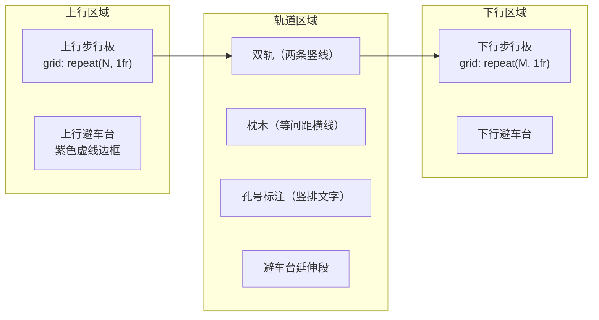
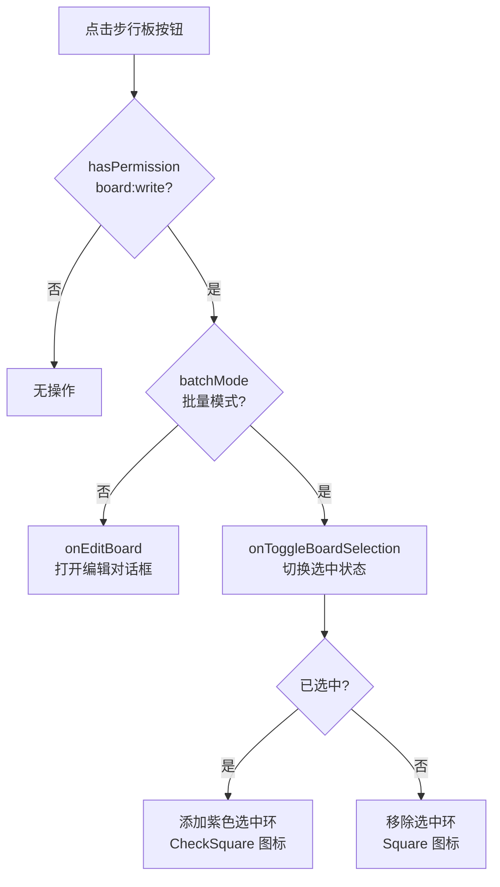
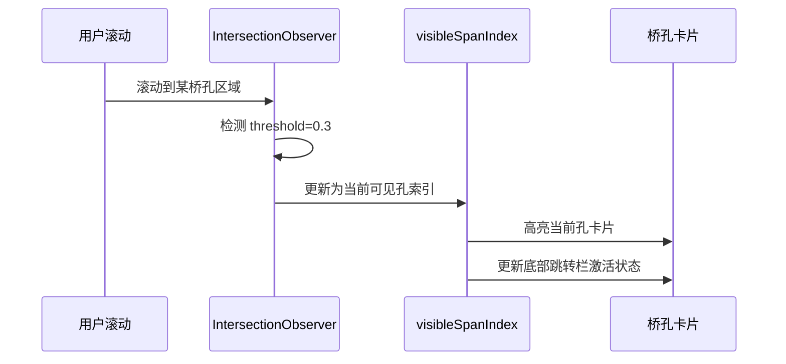

2D 网格视图是铁路明桥面步行板可视化管理系统中最核心的交互界面，它以**俯视网格**的方式精确还原铁路桥梁横截面的步行板分布。系统提供两种互补的视图模式——**单孔模式**（聚焦单个桥孔的精细布局）与**整桥模式**（纵览全桥所有桥孔的宏观状态）。通过 `Bridge2DView` 组件、`getBoardsByPosition` 数据分组算法、`IntersectionObserver` 可见性检测三大核心机制的协作，实现了从微观编辑到宏观巡检的无缝工作流。

Sources: [Bridge2DView.tsx](src/components/bridge/Bridge2DView.tsx#L1-L44), [bridge-constants.ts](src/lib/bridge-constants.ts#L148-L183), [useBridgePage.tsx](src/hooks/useBridgePage.tsx#L172-L198)

## 架构总览

2D 视图的渲染管线遵循"数据分组 → 布局计算 → 状态着色 → 交互绑定"的四阶段流水线。以下架构图展示了各模块之间的协作关系：

```mermaid
flowchart TB
    subgraph 数据层
        A[useBridgeData<br/>桥梁数据状态管理] --> B[bridgeViewMode<br/>single | full]
        A --> C[selectedBridge<br/>含全部 spans + boards]
    end

    subgraph 数据变换层
        C --> D[getBoardsByPosition<br/>按位置与列分组]
        D --> E["upstreamColumns[]<br/>上行列数组"]
        D --> F["downstreamColumns[]<br/>下行列数组"]
        D --> G["shelterLeft / shelterRight<br/>避车台板"]
    end

    subgraph 渲染层
        B -->|single| H[单孔模式渲染]
        B -->|full| I[整桥模式渲染]
        E --> H
        F --> H
        E --> I
        F --> I
        G --> H
        G --> I
        I --> J[风险热力图]
        I --> K[孔位快速跳转]
    end

    subgraph 交互层
        H --> L[HoverCard 悬停详情]
        H --> M[单块编辑 / 批量选择]
        I --> N[IntersectionObserver<br/>可见孔位检测]
        N --> O[scrollToSpan<br/>平滑滚动定位]
    end

    style A fill:#0e7490,color:#fff
    style D fill:#7c3aed,color:#fff
    style H fill:#2563eb,color:#fff
    style I fill:#d97706,color:#fff
    style N fill:#dc2626,color:#fff
```

Sources: [useBridgeData.ts](src/hooks/useBridgeData.ts#L29-L37), [Bridge2DView.tsx](src/components/bridge/Bridge2DView.tsx#L263-L504)

## 核心数据分组算法：getBoardsByPosition

`getBoardsByPosition` 是 2D 视图的数据基石，它将一个 `BridgeSpan` 内的平面步行板数组，转化为按**物理位置**和**纵向列号**组织的二维结构，使渲染层可以直接映射到网格布局。

算法逻辑分两步：

**第一步：位置筛选**。将 `span.walkingBoards` 数组按 `position` 字段拆分为 `upstream`（上行）、`downstream`（下行）、`shelter_left`（上行避车台）、`shelter_right`（下行避车台）和 `shelter`（旧格式兼容）五个子集，每个子集按 `columnIndex` 和 `boardNumber` 排序。

**第二步：列分组**。对上行和下行子集分别调用 `groupByColumn`，按 `columnIndex` 值（1 到 `span.upstreamColumns` / `span.downstreamColumns`）将步行板归入对应的列数组，形成 `WalkingBoard[][]` 结构——外层数组代表列，内层数组代表该列从上到下排列的步行板。

| 返回字段 | 类型 | 含义 |
|---|---|---|
| `upstreamColumns` | `WalkingBoard[][]` | 上行步行板按列分组，长度 = `span.upstreamColumns` |
| `downstreamColumns` | `WalkingBoard[][]` | 下行步行板按列分组，长度 = `span.downstreamColumns` |
| `shelterLeft` | `WalkingBoard[]` | 上行侧避车台步行板 |
| `shelterRight` | `WalkingBoard[]` | 下行侧避车台步行板 |
| `shelterOld` | `WalkingBoard[]` | 旧格式避车台（position='shelter'） |

Sources: [bridge-constants.ts](src/lib/bridge-constants.ts#L148-L183)

## 三栏布局与网格渲染

无论是单孔模式还是整桥模式，每个桥孔的渲染都采用**三栏布局**：上行步行板 | 轨道可视化 | 下行步行板。这精确模拟了铁路明桥面的真实横截面结构。



**步行板网格**：使用 CSS Grid 实现，`gridTemplateColumns` 设置为 `repeat(${span.upstreamColumns}, 1fr)`，即每列等宽分配。每列内部按 `maxRows`（取上行/下行各列最大长度）渲染，空位用占位 `<div>` 补齐，确保网格整齐对齐。每个步行板渲染为 44px × 36px 的圆角按钮，显示板号。

**轨道栏**：宽度固定为容器的 18%，绘制两条深色竖线模拟钢轨，等间距（19px）绘制棕色横线模拟枕木。如果桥孔存在断裂风险步行板，枕木颜色加深以示警告。中央竖排显示孔号标注。

**避车台区域**：位于步行板网格下方，用紫色虚线边框和浅紫背景区分，标注限乘人数。避车台的显示逻辑是——`shelterLeft` 归上行侧，`shelterRight` 归下行侧；若只有旧格式 `shelter` 且无 `shelterRight`，则默认显示在上行侧。

Sources: [Bridge2DView.tsx](src/components/bridge/Bridge2DView.tsx#L184-L260), [Bridge2DView.tsx](src/components/bridge/Bridge2DView.tsx#L392-L436), [Bridge2DView.tsx](src/components/bridge/Bridge2DView.tsx#L563-L621)

## 步行板单元：状态着色与动画系统

每个步行板按钮的视觉呈现由**状态配置**和**动画特效**两个维度决定。

### 状态颜色映射

步行板颜色由 `BOARD_STATUS_CONFIG` 和 `getStatusColorClass` 共同驱动，六种状态对应三组视觉属性（背景色、边框色、文字色）：

| 状态 | 标签 | 背景色 | 边框色 | 文字色 | CSS 动画类 |
|---|---|---|---|---|---|
| `normal` | 正常 | `rgba(34, 197, 94, 0.2)` | `rgba(34, 197, 94, 0.5)` | `#22c55e` | `normal-glow`（绿色微光呼吸） |
| `minor_damage` | 轻微损坏 | `rgba(234, 179, 8, 0.25)` | `rgba(234, 179, 8, 0.6)` | `#eab308` | `neon-glow-yellow`（黄色霓虹） |
| `severe_damage` | 严重损坏 | `rgba(249, 115, 22, 0.2)` | `rgba(249, 115, 22, 0.5)` | `#f97316` | `neon-glow-yellow`（黄色霓虹） |
| `fracture_risk` | 断裂风险 | `rgba(239, 68, 68, 0.3)` | `rgba(239, 68, 68, 0.8)` | `#ef4444` | `danger-pulse` + `fracture-border-blink` |
| `replaced` | 已更换 | `rgba(59, 130, 246, 0.2)` | `rgba(59, 130, 246, 0.5)` | `#3b82f6` | 无 |
| `missing` | 缺失 | `rgba(107, 114, 128, 0.3)` | `rgba(107, 114, 128, 0.6)` | `#6b7280` | 无 |

### 关键 CSS 动画

**`fracture-border-blink`**（断裂风险闪烁）：边框颜色在 `rgba(239,68,68,0.8)` 和全红之间以 1.2s 周期脉冲，同时 `box-shadow` 从 8px 扩展到 20px 红色光晕，确保断裂风险步行板在视觉上无法被忽略。

**`danger-pulse`**（危险脉冲）：背景透明度在 0.2 到 0.4 之间以 0.8s 周期变化，配合 10px-25px 的红色阴影扩展。

**`normal-glow`**（正常微光）：绿色光晕在 5px 到 15px 之间以 3s 周期缓慢呼吸，传达"状态健康"的静默信号。

Sources: [bridge-constants.ts](src/lib/bridge-constants.ts#L18-L74), [bridge-constants.ts](src/lib/bridge-constants.ts#L139-L146), [globals.css](src/app/globals.css#L507-L551)

## 交互机制

### 悬停气泡（HoverCard）

每个步行板按钮外层包裹了 `HoverCard` 组件（200ms 延迟触发），悬停后展示以下信息面板：

- **位置标签**：如"上行 3列 12号"，附带状态 Badge
- **巡检人员**：`inspectedBy` 字段（如有）
- **巡检时间**：`inspectedAt` 格式化为中文本地时间（如有）
- **损坏描述**：`damageDesc` 字段，以橙色文字分隔显示（如有）

Sources: [Bridge2DView.tsx](src/components/bridge/Bridge2DView.tsx#L75-L134)

### 点击行为分流

步行板按钮的点击行为根据当前**操作模式**和**用户权限**进行分流：



批量模式下选中的步行板会显示紫色 `ring-2` 外环和左上角的 `CheckSquare` 图标，未选中的显示灰色 `Square` 图标。选中的板 ID 存入 `selectedBoards` 数组，后续通过 `BatchEditDialog` 进行批量状态更新。

Sources: [Bridge2DView.tsx](src/components/bridge/Bridge2DView.tsx#L88-L106), [useBoardEditing.ts](src/hooks/useBoardEditing.ts#L207-L229)

### 高风险过滤器

单孔模式下提供一个"仅显示高危"按钮，激活后 `highRiskFilter` 为 `true`，非 `severe_damage` 和非 `fracture_risk` 状态的步行板将被降低视觉权重：背景变为 `rgba(107,114,128,0.2)`，透明度降至 0.3，文字变灰，使高风险板在视觉上突出。

Sources: [Bridge2DView.tsx](src/components/bridge/Bridge2DView.tsx#L84-L93), [Bridge2DView.tsx](src/components/bridge/Bridge2DView.tsx#L552-L558)

## 单孔模式

单孔模式是默认视图，聚焦渲染 `selectedBridge.spans[selectedSpanIndex]` 这一个桥孔。它的结构层次为：

1. **标题栏**：显示"第N孔"和孔长（如"30m"）
2. **材质与统计面板**：显示步行板尺寸规格、材质信息、总板数、损坏数、损坏率百分比，以及高风险过滤器按钮。损坏率超过 10% 时显示红色"高危"标签和 AlertTriangle 图标
3. **三栏网格区**：上行步行板 | 轨道 | 下行步行板，含避车台
4. **高危红色遮罩**：若本孔损坏率 >10%，在整个网格区覆盖半透明红色边框和"损坏率 >10% 注意安全"的固定标签
5. **底部图例**：遍历 `BOARD_STATUS_CONFIG` 展示所有状态的颜色示例

Sources: [Bridge2DView.tsx](src/components/bridge/Bridge2DView.tsx#L506-L634)

## 整桥模式

整桥模式将所有桥孔纵向堆叠，提供全桥的宏观视角。这是通过 `bridgeViewMode` 状态从 `'single'` 切换到 `'full'` 触发的。其核心特征如下：

### 整体统计头部

顶部 sticky 定位显示桥梁名称和总孔数，下方固定面板展示全桥总板数、损坏数和损坏率。损坏率阈值分级：超过 10% 为红色高危，大于 0 但 ≤10% 为橙色警告，0% 为绿色正常。

### 风险热力图

这是整桥模式最具辨识度的可视化组件。它将每个桥孔映射为一个可点击的热力色块：

| 损坏率区间 | 是否含断裂风险 | 热力色 | 颜色公式 |
|---|---|---|---|
| 0% | 否 | `rgba(34, 197, 94, 0.2)` 绿色 | 固定色 |
| (0%, 10%] | 否 | `rgba(234, 179, 8, ...)` 黄色 | 透明度 = 0.1 + rate × 0.5 |
| (10%, 100%] | 否 | `rgba(249, 115, 22, ...)` 橙色 | 透明度 = 0.2 + rate × 0.6 |
| 任意 | 是 | `rgba(239, 68, 68, ...)` 红色 | 透明度 = 0.3 + rate × 0.7，断裂风险优先 |

热力色块内居中显示孔号，悬停时弹出 tooltip 显示精确损坏率百分比。点击色块触发 `onScrollToSpan`，平滑滚动到对应桥孔。

右侧配有四色图例：正常（绿）、轻微（黄）、严重（橙）、断裂（红）。

### 桥孔纵向堆叠

每个桥孔渲染为一个独立的圆角卡片，内部结构与单孔模式相同（三栏布局），但额外增加了：

- **孔标题栏**：显示"第N孔"、孔长、断裂风险警告标识、本孔统计（总板数、损坏率）
- **活跃状态高亮**：当前可见的桥孔卡片获得 `ring-2` 蓝色边框高亮（暗夜模式为 cyan 色）
- **高危遮罩**：单孔损坏率 >10% 时覆盖红色半透明边框和"损坏率 >10%"角标

### IntersectionObserver 可见性检测

整桥模式使用 `IntersectionObserver` 来追踪当前可见的桥孔，这是实现"滚动即选中"交互的核心。在 `useBridgePage` 中，当 `bridgeViewMode` 变为 `'full'` 时，为每个桥孔 DOM 元素（通过 `spanRefs` 引用）注册观察器，`threshold` 设为 0.3（即 30% 可见即触发）。回调函数取 `boundingClientRect.top` 最小的可见元素，提取其 `data-span-index` 属性，更新 `visibleSpanIndex` 状态。



### 底部孔位快速跳转栏

sticky 定位在容器底部，提供双层导航：

**快捷按钮层**：固定显示"第1孔"、"第5孔"（仅当桥孔 ≥5 时显示）和"最后1孔"三个快捷跳转按钮。

**完整孔号层**：遍历所有桥孔，每个按钮根据状态显示不同颜色——当前可见孔高亮（蓝色/cyan）、含断裂风险的孔标红、含损坏的孔标橙、正常孔为默认灰色。

Sources: [Bridge2DView.tsx](src/components/bridge/Bridge2DView.tsx#L262-L504), [useBridgePage.tsx](src/hooks/useBridgePage.tsx#L172-L198), [useBridgePage.tsx](src/hooks/useBridgePage.tsx#L201-L207)

## 视图模式切换与状态管理

2D 视图的完整状态管理分布在三个 Hooks 中，形成清晰的职责分层：

| Hook | 职责 | 关键状态 |
|---|---|---|
| `useBridgeData` | 数据获取与视图模式 | `bridgeViewMode`、`highRiskFilter`、`selectedBridge` |
| `useBridgePage` | 交互协调与 UI 状态 | `visibleSpanIndex`、`scrollToSpan`、`fullBridgeScrollRef` |
| `useBoardEditing` | 编辑与批量操作 | `batchMode`、`selectedBoards`、`editForm` |

在主页面 `page.tsx` 中，视图模式的切换通过工具栏按钮实现：

- **2D/3D 切换**：`viewMode` 状态（`'2d'` | `'3d'`），切换时决定渲染 `Bridge2DView` 还是 `HomeBridge3D`
- **单孔/整桥切换**：`bridgeViewMode` 状态（`'single'` | `'full'`），仅在 2D 模式下显示切换按钮，按钮标签根据当前模式动态变化
- **批量编辑切换**：`batchMode` 状态，激活后步行板点击行为从编辑变为选择

Sources: [page.tsx](src/app/page.tsx#L1212-L1227), [useBridgeData.ts](src/hooks/useBridgeData.ts#L35-L37), [useBoardEditing.ts](src/hooks/useBoardEditing.ts#L110-L113)

## 组件 Props 接口

`Bridge2DView` 组件通过 14 个 Props 接收外部状态和回调，实现了渲染逻辑与业务逻辑的完全解耦：

| Prop | 类型 | 来源 | 用途 |
|---|---|---|---|
| `selectedBridge` | `Bridge` | `useBridgeData` | 当前选中桥梁的完整数据 |
| `selectedSpanIndex` | `number` | `useBridgePage` | 单孔模式下的当前孔索引 |
| `bridgeViewMode` | `'single' \| 'full'` | `useBridgeData` | 决定渲染单孔还是整桥 |
| `highRiskFilter` | `boolean` | `useBridgeData` | 是否过滤非高危步行板 |
| `theme` | `string` | `ThemeProvider` | 日间/夜间主题 |
| `batchMode` | `boolean` | `useBoardEditing` | 是否处于批量编辑模式 |
| `selectedBoards` | `string[]` | `useBoardEditing` | 已选中批量编辑的板 ID |
| `visibleSpanIndex` | `number` | `useBridgePage` | 整桥模式下当前可见的孔索引 |
| `fullBridgeScrollRef` | `RefObject<HTMLDivElement>` | `useBridgePage` | 整桥模式滚动容器引用 |
| `spanRefs` | `MutableRefObject<(HTMLDivElement \| null)[]>` | `useBridgePage` | 各桥孔 DOM 引用数组 |
| `hasPermission` | `(perm: string) => boolean` | `AuthProvider` | 权限检查函数 |
| `onEditBoard` | `(board) => void` | `useBoardEditing` | 打开编辑对话框回调 |
| `onToggleBoardSelection` | `(id: string) => void` | `useBoardEditing` | 切换批量选中回调 |
| `onScrollToSpan` / `onSetSelectedSpanIndex` / `onSetHighRiskFilter` | 各回调函数 | 对应 Hook | 状态更新回调 |

Sources: [Bridge2DView.tsx](src/components/bridge/Bridge2DView.tsx#L26-L43)

## 主题适配

2D 视图全面支持**夜间模式**（`theme === 'night'`）和**日间模式**两种视觉风格，几乎所有颜色和背景都通过三元表达式动态切换：

| 视觉元素 | 夜间模式 | 日间模式 |
|---|---|---|
| 容器背景 | 透明（深色继承） | `bg-gray-50` 浅灰 |
| 标题文字 | `text-cyan-400` + `text-glow-cyan` 发光 | `text-blue-600` |
| 统计面板 | `bg-slate-800/50` + `border-slate-700/50` | `bg-white` + `border-gray-200` |
| 轨道枕木 | `rgba(139,69,19,0.4)` | `rgba(139,69,19,0.35)` |
| 活跃孔高亮 | `ring-cyan-500/50` + `bg-slate-800/60` | `ring-blue-300` + `bg-blue-50` |
| HoverCard 面板 | `bg-slate-800` + `border-slate-600` | `bg-white` + `border-gray-200` |
| 跳转栏 | `bg-slate-800/90` + `backdrop-blur-sm` | `bg-white/90` + `backdrop-blur-sm` |

Sources: [Bridge2DView.tsx](src/components/bridge/Bridge2DView.tsx#L107-L131), [Bridge2DView.tsx](src/components/bridge/Bridge2DView.tsx#L276-L280), [Bridge2DView.tsx](src/components/bridge/Bridge2DView.tsx#L452)

## 延伸阅读

- [步行板状态体系与颜色编码规范](5-bu-xing-ban-zhuang-tai-ti-xi-yu-yan-se-bian-ma-gui-fan) — 理解六种步行板状态的业务语义与完整颜色系统
- [自定义 Hooks 架构设计模式](14-zi-ding-yi-hooks-jia-gou-she-ji-mo-shi) — 深入了解 `useBridgeData`、`useBoardEditing`、`useBridgePage` 的组合式设计
- [步行板单块编辑与批量操作流程](15-bu-xing-ban-dan-kuai-bian-ji-yu-pi-liang-cao-zuo-liu-cheng) — 编辑对话框与批量编辑的完整数据流
- [Three.js 程序化 3D 桥梁模型渲染](21-three-js-cheng-xu-hua-3d-qiao-liang-mo-xing-xuan-ran) — 与 2D 视图互补的 3D 可视化方案
- [移动端适配与手势交互引导](24-yi-dong-duan-gua-pei-yu-shou-shi-jiao-hu-yin-dao) — 2D 视图在移动端的响应式适配策略