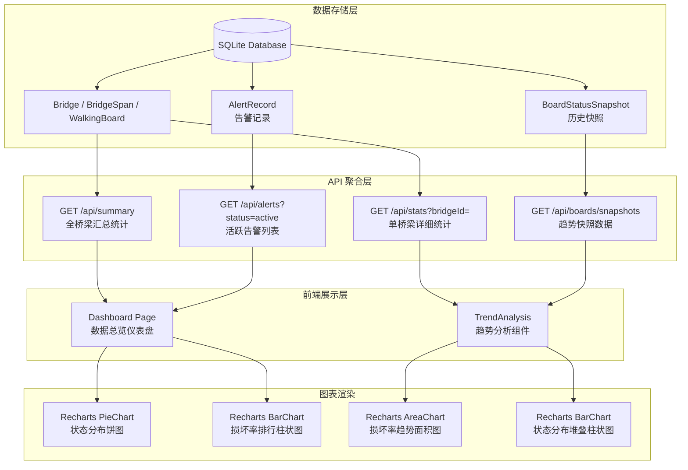
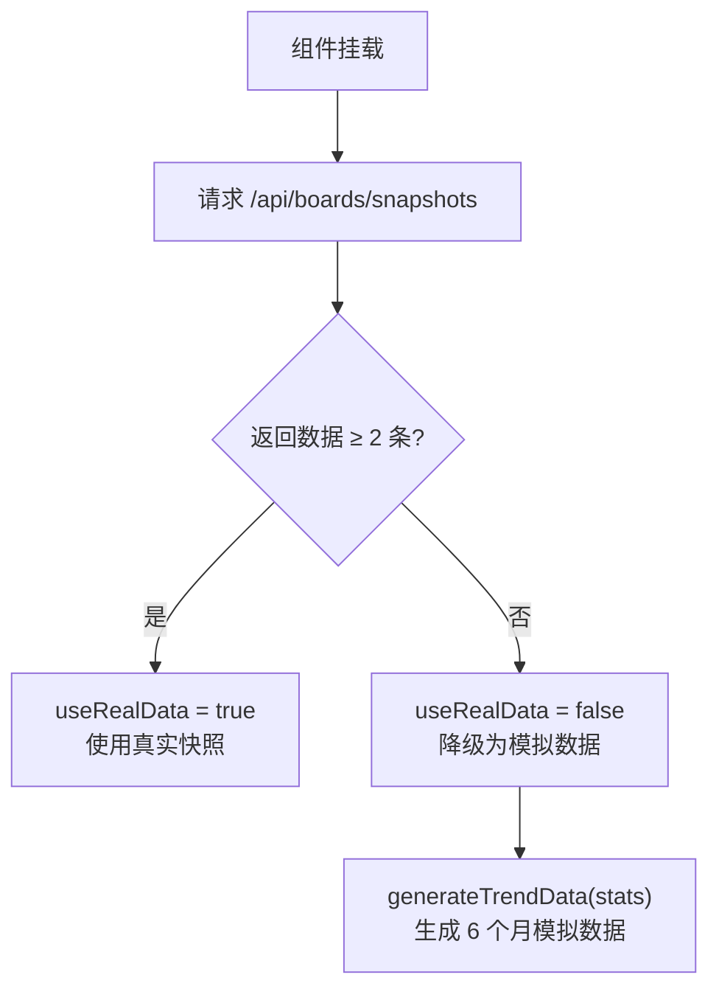

本文档深入解析系统的**数据总览仪表盘**页面架构与**趋势分析**组件的实现细节，涵盖从后端统计 API 到前端 Recharts 可视化图表的完整数据流，以及基于线性回归的损坏率预测机制。该模块是管理者快速掌握全局桥梁健康态势的核心入口，将分散的步行板状态数据聚合为直观的统计卡片、分布饼图、排行柱状图与趋势面积图。

Sources: [page.tsx](src/app/dashboard/page.tsx#L1-L51), [TrendAnalysis.tsx](src/components/bridge/TrendAnalysis.tsx#L1-L36)

## 架构总览：从数据源到可视化

仪表盘与趋势分析的数据流遵循"查询 → 聚合 → 渲染"三阶段管线。后端 API 层负责从 Prisma ORM 查询原始数据并执行统计聚合计算，前端组件层接收结构化的 JSON 响应后，通过 Recharts 声明式图表完成可视化渲染。整个管线可由以下架构图说明：



Sources: [summary/route.ts](src/app/api/summary/route.ts#L1-L20), [stats/route.ts](src/app/api/stats/route.ts#L1-L17), [alerts/route.ts](src/app/api/alerts/route.ts#L1-L16), [snapshots/route.ts](src/app/api/boards/snapshots/route.ts#L1-L30)

## 仪表盘页面结构

仪表盘页面 (`/dashboard`) 是一个独立的路由页面，采用客户端渲染 (`'use client'`)，通过 `useEffect` 在认证校验后自动拉取汇总数据与告警数据。页面整体布局分为四大区域：

| 区域 | 位置 | 核心内容 | 数据来源 |
|------|------|----------|----------|
| 顶部统计栏 | 5 列网格 | 6 张统计卡片 | `/api/summary` |
| 图表区域 | 2 列网格 | 状态分布饼图 + 损坏率排行柱状图 | `/api/summary` |
| 桥梁健康排行 | 左侧 2/3 宽度 | 按损坏率降序的桥梁列表 | `/api/summary` |
| 右侧面板 | 右侧 1/3 宽度 | 高风险预警 + 预警中心 + 快速操作 + 状态统计 | `/api/alerts` + `/api/summary` |

页面加载时执行两个并行请求：先通过 `localStorage.getItem('token')` 校验认证状态，认证通过后同时发起 `/api/summary` 和 `/api/alerts` 请求。如果认证失败（401），自动跳转至 `/login` 登录页。

Sources: [page.tsx](src/app/dashboard/page.tsx#L117-L197), [page.tsx](src/app/dashboard/page.tsx#L419-L533)

### 顶部统计卡片

顶部统计栏采用响应式网格布局（`grid-cols-2 md:grid-cols-3 lg:grid-cols-5`），展示 6 张核心指标卡片：

| 卡片 | 图标 | 数值字段 | 阈值色彩逻辑 |
|------|------|----------|-------------|
| 桥梁总数 | `Building2` (青色) | `totalBridges` | 无阈值 |
| 孔位总数 | `Hash` (蓝色) | `totalSpans` | 无阈值 |
| 步行板总数 | `Layers` (紫色) | `totalBoards` | 无阈值 |
| 整体损坏率 | `Gauge` (橙色) | `overallDamageRate%` | ≥30% 红色高危、≥15% 橙色关注、≥5% 黄色一般、<5% 绿色良好 |
| 高风险率 | `AlertTriangle` (红色) | `overallHighRiskRate%` | >5% 红色、>0% 橙色、0% 绿色 |
| 活跃预警 | `Bell` (动态) | `activeTotal` | >0 橙色、0 绿色 |

损坏率卡片同时显示一个标签徽章，标签文案由 `getDamageRateBg()` 函数根据阈值决定——"高危"、"关注"、"一般"或"良好"。活跃预警卡片额外展示三个分级徽章（严重/警告/提示），分别对应 `alertSummary` 中的 `activeCritical`、`activeWarning`、`activeInfo` 字段。

Sources: [page.tsx](src/app/dashboard/page.tsx#L420-L533), [page.tsx](src/app/dashboard/page.tsx#L244-L256)

### 状态分布饼图

饼图（实际上是环形饼图/Donut Chart）展示所有桥梁步行板按状态的总体分布情况。图表使用 Recharts 的 `PieChart` + `Pie` 组件，配置 `innerRadius={60}` 和 `outerRadius={100}` 形成环形效果，并设置 `paddingAngle={3}` 在各扇区间留出间隙。

数据准备函数 `getPieChartData()` 将 summary 中的六种状态计数映射为图表数据数组，并过滤掉值为 0 的状态（避免渲染空扇区）：

```typescript
// 状态颜色配置与图表数据映射
const STATUS_COLORS = {
  normal:       { label: '正常',     chartColor: '#22c55e' },  // 绿色
  minor_damage: { label: '轻微损坏', chartColor: '#eab308' },  // 黄色
  severe_damage:{ label: '严重损坏', chartColor: '#f97316' },  // 橙色
  fracture_risk:{ label: '断裂风险', chartColor: '#ef4444' },  // 红色
  replaced:     { label: '已更换',   chartColor: '#3b82f6' },  // 蓝色
  missing:      { label: '缺失',     chartColor: '#6b7280' },  // 灰色
}
```

自定义 Tooltip（`PieTooltip`）显示状态名称、绝对数量和占总数的百分比。图表轴线和文字颜色根据日夜主题动态调整——夜间模式使用 `#94a3b8` (slate-400)，日间模式使用 `#64748b` (slate-500)。

Sources: [page.tsx](src/app/dashboard/page.tsx#L98-L105), [page.tsx](src/app/dashboard/page.tsx#L218-L228), [page.tsx](src/app/dashboard/page.tsx#L537-L580), [page.tsx](src/app/dashboard/page.tsx#L284-L323)

### 桥梁损坏率排行柱状图

柱状图展示损坏率最高的 Top 10 桥梁，采用水平布局（`layout="vertical"`）以便在有限高度下清晰展示桥梁名称。数据由 `getBarChartData()` 函数准备，逻辑为：按 `damageRate` 降序排序 → 截取前 10 → 将桥梁名称截断为最多 6 个字符。

图表同时展示两个维度：
- **损坏率**（橙色 `#f97316`）：包含轻微损坏 + 严重损坏 + 断裂风险的总损坏率
- **高风险率**（红色 `#ef4444`）：仅断裂风险占比

X 轴以百分比格式显示（`tickFormatter={(v) => `${v}%`}`），Y 轴展示桥梁名称（宽度 80px），Tooltip 通过自定义组件 `CustomTooltip` 渲染，高亮显示数值与百分比单位。

Sources: [page.tsx](src/app/dashboard/page.tsx#L230-L241), [page.tsx](src/app/dashboard/page.tsx#L582-L624)

### 桥梁健康排行列表

健康排行区域占据页面左侧 2/3 宽度，以列表形式展示所有桥梁按损坏率降序排列的健康状况。每条记录包含以下信息层级：

**第一行**：排名序号（前三名使用红/橙/黄高亮色）、桥梁名称、桥梁编号徽章、高风险标记（当 `fractureRiskBoards > 0` 时显示红色"高危"徽章）

**第二行**：元信息——孔位数、步行板总数、线路名称

**右侧**：损坏率数值（带 `getDamageRateColor()` 阈值着色）、高风险板数量（仅断裂风险 > 0 时显示）、以及一个 24px 宽的进度条（`<Progress value={damageRate} />`）

列表包裹在 `<ScrollArea maxHeight="480px">` 中，支持大量桥梁时的滚动浏览。每条记录是一个可点击的链接（`href="/"`），点击后跳转回主管理页面。

Sources: [page.tsx](src/app/dashboard/page.tsx#L258-L264), [page.tsx](src/app/dashboard/page.tsx#L627-L710)

### 右侧面板

右侧面板包含四个功能卡片：

**高风险预警卡片**：筛选出 `fractureRiskBoards > 0` 的桥梁，以红色告警样式展示。每条预警包含桥梁名称、断裂风险步行板数量、严重损坏步行板数量，以及检修建议（"建议：立即安排检修，设置禁行区域"）。当没有高风险桥梁时，显示绿色"暂无高风险桥梁"的安全状态。

**预警中心卡片**：直接从 `/api/alerts` 接口加载活跃告警数据，支持按严重等级（全部/严重/警告/提示）筛选。每条告警展示标题、描述、时间，并提供两个操作按钮——"标记为已解决"（调用 `PUT /api/alerts`，status 设为 `resolved`）和"忽略"（status 设为 `dismissed`）。

**快速操作卡片**：提供"返回管理系统"和"用户管理"（仅 admin 角色可见）两个导航按钮。

**状态统计卡片**：以 2×3 网格展示六种步行板状态的绝对数量和百分比占比，颜色与全局状态颜色配置一致。

Sources: [page.tsx](src/app/dashboard/page.tsx#L712-L956), [page.tsx](src/app/dashboard/page.tsx#L199-L215)

## Summary API：全量桥梁统计聚合

`GET /api/summary` 是仪表盘的核心数据端点，负责从数据库查询所有桥梁及其关联的桥孔和步行板，计算全局和单桥维度的统计指标。

### 查询与聚合流程

该接口首先通过 `requireAuth(request, 'bridge:read')` 校验权限，然后执行一次 `db.bridge.findMany` 查询（带 `include: { spans: { include: { walkingBoards: true } } }` 嵌套预加载），获取完整的桥梁-桥孔-步行板三级数据。随后通过双重循环完成聚合：

**外层循环**遍历每座桥梁，创建 `bridgeSummary` 对象；**内层循环**遍历该桥的每个桥孔和每块步行板，通过 `switch (board.status)` 累加六种状态的计数。每座桥梁的损坏率计算公式为：

```
effectiveBoards = totalBoards - replacedBoards - missingBoards
damageRate = round((minorDamage + severeDamage + fractureRisk) / effectiveBoards × 100)
highRiskRate = round(fractureRisk / effectiveBoards × 100)
```

注意公式排除了"已更换"和"缺失"两种状态，仅计算"有效步行板"中的损坏占比，避免因历史更换或缺失记录导致损坏率失真。

Sources: [summary/route.ts](src/app/api/summary/route.ts#L56-L148)

### 响应数据结构

```typescript
interface OverallSummary {
  totalBridges: number       // 桥梁总数
  totalSpans: number         // 孔位总数
  totalBoards: number        // 步行板总数
  normalBoards: number       // 正常板数
  minorDamageBoards: number  // 轻微损坏数
  severeDamageBoards: number // 严重损坏数
  fractureRiskBoards: number // 断裂风险数
  replacedBoards: number     // 已更换数
  missingBoards: number      // 缺失数
  overallDamageRate: number  // 全局损坏率(%)
  overallHighRiskRate: number // 全局高风险率(%)
  highRiskBridges: string[]  // 高风险桥梁名称列表
  bridgeSummaries: BridgeSummary[] // 单桥汇总数组
}
```

每座桥梁的最后巡检时间 (`lastInspected`) 通过收集该桥所有步行板的 `inspectedAt` 时间戳，取最新值并格式化为中文本地化字符串。

Sources: [summary/route.ts](src/app/api/summary/route.ts#L22-L54), [page.tsx](src/app/dashboard/page.tsx#L54-L88)

## Alerts API：告警数据查询与处置

仪表盘的预警中心模块通过 `GET /api/alerts` 获取活跃告警数据。该接口支持以下查询参数：

| 参数 | 类型 | 说明 |
|------|------|------|
| `severity` | 可选 | `critical` / `warning` / `info`，按严重等级过滤 |
| `status` | 可选 | `active`（默认）/ `resolved` / `dismissed` / `all` |
| `bridgeId` | 可选 | 按桥梁 ID 过滤 |
| `page` | 可选 | 页码，默认 1 |
| `pageSize` | 可选 | 每页条数，默认 50，上限 100 |

接口在返回分页告警列表的同时，通过 `Promise.all` 并行查询三种严重等级的活跃数量，生成 `summary` 对象：

```typescript
const summary = {
  activeCritical,  // 严重级活跃数
  activeWarning,   // 警告级活跃数
  activeInfo,      // 提示级活跃数
  activeTotal,     // 活跃总数
}
```

告警列表按 `severity DESC` + `createdAt DESC` 排序，确保严重告警始终置顶。每条记录通过 `include: { rule: { select: { name, scope } } }` 关联查询触发该告警的预警规则名称。

处置告警通过 `PUT /api/alerts` 实现，请求体包含 `id`（告警 ID）、`status`（`resolved` 或 `dismissed`）和可选的 `resolveNote`。接口需要 `board:write` 权限，更新告警状态的同时记录处置人和处置时间。

Sources: [alerts/route.ts](src/app/api/alerts/route.ts#L17-L73), [alerts/route.ts](src/app/api/alerts/route.ts#L86-L113)

## 趋势分析组件：双模式数据源与线性回归预测

`TrendAnalysis` 组件是独立的可复用趋势分析面板，接收 `bridgeStats`（单桥统计数据）、`bridgeId`（桥梁 ID）和 `theme`（主题）三个属性。该组件实现了**真实数据优先、模拟数据降级**的双模式策略，并包含基于线性回归的未来损坏率预测功能。

### 双模式数据源策略

组件挂载时通过 `useEffect` 向 `/api/boards/snapshots?bridgeId=${bridgeId}&groupBy=month` 发起请求，尝试获取真实的历史快照数据。判断逻辑如下：



当真实快照数据不足（少于 2 个数据点）时，`generateTrendData()` 函数基于当前统计值生成近 6 个月的模拟趋势数据。模拟算法通过 `progress = (idx + 1) / 6` 控制时间线递进，使模拟值逐渐趋近当前实际值，并加入 ±2% 的随机噪声增加自然感：

```typescript
const progress = (idx + 1) / 6
const noise = (Math.random() - 0.5) * 2
const damageRate = Math.max(0, currentDamage * progress * 0.7 + noise + currentDamage * 0.3 * (1 - progress))
```

Sources: [TrendAnalysis.tsx](src/components/bridge/TrendAnalysis.tsx#L109-L151), [TrendAnalysis.tsx](src/components/bridge/TrendAnalysis.tsx#L39-L77)

### 线性回归预测算法

`projectFuture()` 函数实现了最小二乘法线性回归（Ordinary Least Squares），对历史损坏率数据拟合直线并外推未来两个月：

```
slope = (n × Σ(xi×yi) - Σxi × Σyi) / (n × Σ(xi²) - (Σxi)²)
intercept = (Σyi - slope × Σxi) / n

nextMonth = slope × n + intercept
monthAfter = slope × (n + 1) + intercept
```

其中 `xi` 为月份索引（0, 1, 2, ...），`yi` 为对应月份的损坏率。函数同时返回趋势方向判断：`slope > 0` 为"上升趋势"（红色 ↑），`slope < 0` 为"下降趋势"（绿色 ↓），`slope === 0` 为"趋势平稳"（黄色 →）。

预测结果通过 `chartDataWithProjection` 扩展到原始趋势数据末尾，未来两个月的 `highRiskRate` 和 `normalRate` 设为 `null`（不在面积图中渲染），仅 `damageRate` 延续预测值。

Sources: [TrendAnalysis.tsx](src/components/bridge/TrendAnalysis.tsx#L80-L107), [TrendAnalysis.tsx](src/components/bridge/TrendAnalysis.tsx#L159-L188)

### 图表渲染细节

趋势分析组件渲染两张图表：

**损坏率趋势面积图（AreaChart）**：展示近 6 个月的损坏率与高风险率变化。两条面积线分别使用橙色（`#f97316`）和红色（`#ef4444`）渐变填充。图表定义了 `linearGradient` 使面积从上到下逐渐透明，提升视觉层次感。预测月份的数据点以虚线形式自然延伸。

**步行板状态分布堆叠柱状图（BarChart）**：使用 `stackId="a"` 将正常（绿色）、轻微损坏（黄色）、严重损坏（橙色）、断裂风险（红色）四种状态堆叠展示，直观呈现每月的状态构成变化。底部柱子无圆角，顶部柱子设置 `radius={[4, 4, 0, 0]}`。

图表头部标注数据源类型——真实数据显示绿色"● 真实数据"标签，模拟数据显示黄色"● 模拟数据"标签，让用户明确数据的可信度。

Sources: [TrendAnalysis.tsx](src/components/bridge/TrendAnalysis.tsx#L208-L378)

## 历史快照 API 与数据模型

趋势分析的真实数据来源于 `BoardStatusSnapshot` 模型——每当步行板状态被更新时（无论是单块编辑、批量操作还是数据导入），系统会在写入新状态前保存一份完整的历史快照。快照模型包含步行板的全部状态字段以及 `snapshotReason`（记录触发原因：`update`、`batch_update` 或 `import`）。

### 快照聚合查询

`GET /api/boards/snapshots` 接口支持按月、周、日三种粒度聚合快照数据。聚合逻辑通过 `Map<string, counts>` 实现——将每条快照的 `createdAt` 按指定粒度格式化为分组键（如 `2025-01`），然后在每个分组内累加各状态计数。最终计算每个时间分组的损坏率和高风险率：

```typescript
// 聚合后的趋势数据点结构
{
  date: "2025-06",           // 时间分组键
  totalBoards: 150,          // 该时段快照总数
  normalBoards: 120,         // 正常状态计数
  minorDamageBoards: 15,     // 轻微损坏计数
  severeDamageBoards: 10,    // 严重损坏计数
  fractureRiskBoards: 3,     // 断裂风险计数
  damageRate: 20.0,          // 损坏率(%)
  highRiskRate: 2.27,        // 高风险率(%)
}
```

Sources: [schema.prisma](prisma/schema.prisma#L167-L195), [snapshots/route.ts](src/app/api/boards/snapshots/route.ts#L46-L119)

## 日夜主题适配机制

仪表盘页面的所有图表和 UI 元素均实现了完整的日夜主题适配。主题状态由 `useTheme()` Hook 提供，通过 `isNight` 布尔值控制所有样式分支：

| 适配维度 | 日间模式 | 夜间模式 |
|----------|----------|----------|
| 页面背景 | `bg-gray-50` | `bg-gradient-to-br from-slate-900 via-slate-800 to-slate-900` |
| 图表轴线颜色 | `#d1d5db` (gray-300) | `#334155` (slate-700) |
| 图表文字颜色 | `#64748b` (slate-500) | `#94a3b8` (slate-400) |
| Tooltip 背景 | `bg-white` | `bg-slate-800` |
| 背景装饰 | `bg-blue-100/30` 圆形模糊 | `bg-cyan-500/5` 圆形模糊 |

夜间模式额外在页面背景中添加了三个大面积高斯模糊圆形装饰（`blur-3xl`），营造深色科技感视觉氛围。卡片统一使用 `tech-card` CSS 类，提供毛玻璃效果（`backdrop-blur-sm`）和微妙的边框透明度。

Sources: [page.tsx](src/app/dashboard/page.tsx#L284-L288), [page.tsx](src/app/dashboard/page.tsx#L353-L360)

## 认证与鉴权流程

仪表盘采用客户端认证校验模式。页面加载时，`useEffect` 从 `localStorage` 读取 `token` 和 `user` 信息，若任一缺失则立即跳转至 `/login`。所有 API 请求通过 `authFetch()` 工具函数自动附加 `Authorization: Bearer <token>` 请求头。

后端 API 层通过 `requireAuth(request, 'bridge:read')` 统一鉴权中间件验证 token 有效性和权限等级。若 token 无效或过期，API 返回 401 状态码，前端 `loadSummary` 函数捕获该状态码后同样触发登录跳转。关于鉴权中间件的详细实现，参见 [requireAuth 统一鉴权中间件](13-requireauth-tong-jian-quan-zhong-jian-jian)。

Sources: [page.tsx](src/app/dashboard/page.tsx#L107-L115), [page.tsx](src/app/dashboard/page.tsx#L131-L151), [page.tsx](src/app/dashboard/page.tsx#L156-L165)

## 组件间关系与复用

以下表格梳理了仪表盘页面与趋势分析组件所依赖的共享模块：

| 模块 | 路径 | 使用方 | 职责 |
|------|------|--------|------|
| `authFetch` | `lib/bridge-constants.ts` | Dashboard, TrendAnalysis | 带认证的 fetch 封装 |
| `BOARD_STATUS_CONFIG` | `lib/bridge-constants.ts` | Dashboard (颜色映射) | 状态颜色、图标、标签配置 |
| `STATUS_COLORS` | Dashboard 内部定义 | Dashboard 页面 | 图表专用颜色映射 |
| `NotificationBell` | `components/bridge/` | Dashboard 顶部导航 | 站内通知铃铛与弹窗 |
| `useTheme` | `components/ThemeProvider.tsx` | Dashboard, TrendAnalysis | 日夜主题状态管理 |
| `Recharts` | 第三方库 | Dashboard, TrendAnalysis | PieChart, BarChart, AreaChart |

`TrendAnalysis` 组件设计为独立可插拔单元，不直接与 Dashboard 页面耦合，其接口仅要求 `BridgeStats` 数据结构、`bridgeId` 和 `theme` 三个属性。这种设计使其可灵活集成到任何需要趋势展示的场景中。

Sources: [bridge-constants.ts](src/lib/bridge-constants.ts#L18-L74), [bridge-constants.ts](src/lib/bridge-constants.ts#L126-L136), [NotificationBell.tsx](src/components/bridge/NotificationBell.tsx#L44-L74)

## 延伸阅读

- [步行板状态体系与颜色编码规范](5-bu-xing-ban-zhuang-tai-ti-xi-yu-yan-se-bian-ma-gui-fan) — 理解仪表盘中六种状态的颜色语义
- [三级数据模型：桥梁 → 桥孔 → 步行板](6-san-ji-shu-ju-mo-xing-qiao-liang-qiao-kong-bu-xing-ban) — Summary API 查询的三级关联模型
- [Prisma 数据库 Schema 设计（11 个模型）](7-prisma-shu-ju-ku-schema-she-ji-11-ge-mo-xing) — `BoardStatusSnapshot` 模型的完整定义
- [预警规则引擎：快照保存、条件评估与自动去重](16-yu-jing-gui-ze-yin-qing-kuai-zhao-bao-cun-tiao-jian-ping-gu-yu-zi-dong-qu-zhong) — 仪表盘预警中心的后端引擎
- [站内通知系统：自动推送与实时轮询](27-zhan-nei-tong-zhi-xi-tong-zi-dong-tui-song-yu-shi-shi-lun-xun) — NotificationBell 组件的轮询与推送机制