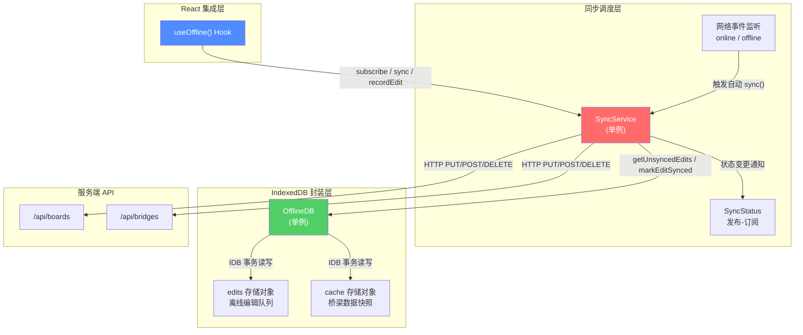
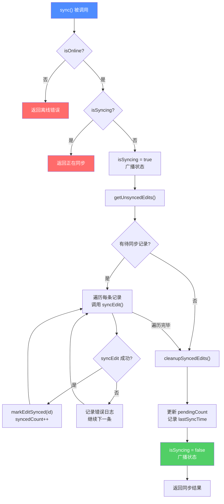
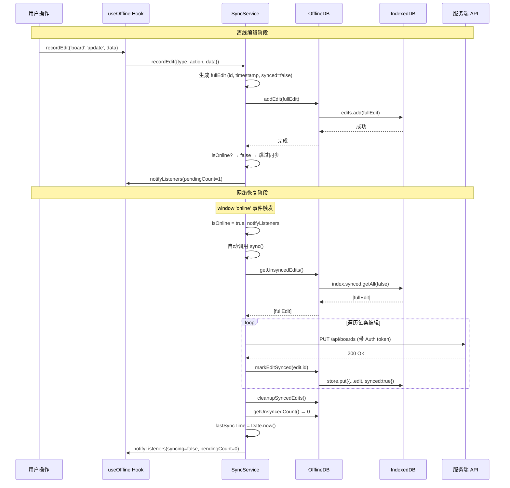

本系统为铁路明桥面步行板管理场景中的**现场巡检离线操作**提供完整基础设施。整个离线支持由三层协作完成：**IndexedDB 封装层**（`OfflineDB`）负责浏览器端结构化数据持久化，**同步调度层**（`SyncService`）管理网络状态感知与增量同步策略，**React 集成层**（`useOffline` Hook）将前两者接入组件生命周期。本页面向高级开发者深入剖析三层架构的设计决策、数据流转与并发控制细节。

Sources: [offline-db.ts](src/lib/offline-db.ts#L1-L206), [sync-service.ts](src/lib/sync-service.ts#L1-L225), [use-offline.ts](src/hooks/use-offline.ts#L1-L75)

## 架构总览

系统采用经典的**分层解耦 + 单例模式**，将浏览器的 IndexedDB 异步 API 封装为 Promise 化的同步调用风格，并在上层以发布-订阅机制驱动 UI 状态更新。下图展示了三个核心模块之间的依赖关系与数据流向：



**关键设计决策**：三个模块均以单例模式导出（`offlineDB`、`syncService`），确保全局唯一实例、避免重复初始化 IndexedDB 连接，同时使 Hook 在组件卸载后仍能保持同步服务运行。`useOffline` Hook 通过 `subscribe` 返回的 `unsubscribe` 函数实现安全的订阅清理，而非停止底层服务本身。

Sources: [offline-db.ts](src/lib/offline-db.ts#L199-L200), [sync-service.ts](src/lib/sync-service.ts#L223-L224), [use-offline.ts](src/hooks/use-offline.ts#L20-L29)

## IndexedDB 封装层：OfflineDB 类

### 数据库与存储结构

`OfflineDB` 类将 IndexedDB 的原生事件回调封装为 Promise 接口，屏蔽了 `onsuccess`/`onerror` 的冗余样板代码。数据库命名为 `bridge-offline-db`，版本号为 1，包含两个 Object Store：

| Object Store | 主键 (`keyPath`) | 索引 | 用途 |
|---|---|---|---|
| **`edits`** | `id`（字符串） | `synced`（非唯一）、`timestamp`（非唯一） | 存储离线编辑操作队列 |
| **`cache`** | `key`（字符串） | 无 | 存储桥梁数据快照及同步时间戳 |

Sources: [offline-db.ts](src/lib/offline-db.ts#L3-L4), [offline-db.ts](src/lib/offline-db.ts#L43-L57)

### 离线编辑记录模型

每条离线编辑记录遵循 `OfflineEdit` 接口定义，承载操作类型、目标数据和同步状态三类信息：

| 字段 | 类型 | 说明 |
|---|---|---|
| `id` | `string` | 全局唯一标识，格式为 `edit-{timestamp}-{random9}` |
| `type` | `'board' \| 'span' \| 'bridge'` | 操作实体类型（步行板 / 桥孔 / 桥梁） |
| `action` | `'create' \| 'update' \| 'delete'` | CRUD 操作类型 |
| `data` | `Record<string, unknown>` | 操作携带的完整业务数据 |
| `timestamp` | `number` | 操作发生时的 `Date.now()` 毫秒时间戳 |
| `synced` | `boolean` | 是否已成功同步到服务端 |

`synced` 索引使得 `getUnsyncedEdits()` 方法能通过 `IDBKeyRange.only(false)` 高效检索所有未同步记录，无需全表扫描。`timestamp` 索引则服务于清理策略——系统保留最近 7 天的已同步记录作为调试追踪依据，超期记录由 `cleanupSyncedEdits()` 通过游标遍历逐一删除。

Sources: [offline-db.ts](src/lib/offline-db.ts#L7-L14), [offline-db.ts](src/lib/offline-db.ts#L110-L135)

### 初始化防重入机制

`init()` 方法通过 **Promise 缓存**模式解决并发初始化问题。首次调用时创建 `initPromise`，后续调用直接返回同一个 Promise 对象，确保 IndexedDB 连接只建立一次：

```
init() → 检查 this.db 是否已存在 → 是：直接返回
                           → 否：检查 this.initPromise 是否已存在 → 是：返回已有 Promise
                                                                    → 否：创建新 Promise 并缓存
```

`onupgradeneeded` 回调仅在首次打开或版本升级时触发，负责创建 `edits` 和 `cache` 两个 Object Store 及其索引。这个设计使得 `OfflineDB` 实例在多次 `init()` 调用下保持幂等性。

Sources: [offline-db.ts](src/lib/offline-db.ts#L26-L61)

### 核心 API 方法一览

| 方法 | 事务模式 | 说明 |
|---|---|---|
| `addEdit(edit)` | `readwrite` | 向 `edits` 存储添加一条离线编辑记录 |
| `getUnsyncedEdits()` | `readonly` | 通过 `synced` 索引检索所有 `synced=false` 的记录 |
| `markEditSynced(id)` | `readwrite` | 读取指定记录，将 `synced` 置为 `true` 后回写 |
| `cleanupSyncedEdits()` | `readwrite` | 游标遍历 `synced=true` 的记录，删除 7 天前的条目 |
| `cacheBridges(bridges)` | `readwrite` | 将桥梁数组以 `{key:'bridges', data, lastSync}` 结构存入 `cache` |
| `getCachedBridges()` | `readonly` | 读取缓存桥梁数据，返回 `{data, lastSync}` 或 `null` |
| `getUnsyncedCount()` | `readonly` | 返回未同步记录数量（基于 `getUnsyncedEdits().length`） |
| `clearAll()` | `readwrite` | 清空 `edits` 和 `cache` 两个存储 |

Sources: [offline-db.ts](src/lib/offline-db.ts#L64-L196)

### 离线 ID 生成策略

`generateOfflineId()` 函数导出为独立的工具函数（非类方法），采用 `offline-{timestamp}-{random9}` 格式生成唯一标识。其中 `Math.random().toString(36).substr(2, 9)` 利用 36 进制（0-9+a-z）生成 9 位随机字符，在时间戳前缀的隔离下，冲突概率可忽略不计。该函数供上层业务在创建离线实体时使用，与 `OfflineEdit.id`（格式 `edit-{timestamp}-{random9}`）形成命名空间区分。

Sources: [offline-db.ts](src/lib/offline-db.ts#L202-L205)

## 同步调度层：SyncService 类

### 状态模型：SyncStatus

`SyncService` 维护一个 `SyncStatus` 状态对象，通过发布-订阅模式向所有订阅者广播状态变更：

| 字段 | 类型 | 初始值 | 说明 |
|---|---|---|---|
| `isOnline` | `boolean` | `navigator.onLine` | 当前网络连接状态 |
| `isSyncing` | `boolean` | `false` | 是否正在执行同步操作 |
| `pendingCount` | `number` | `0` | 待同步的编辑记录数量 |
| `lastSyncTime` | `number \| null` | 从 `localStorage` 恢复 | 上次成功同步的时间戳 |
| `error` | `string \| null` | `null` | 最近一次同步错误信息 |

Sources: [sync-service.ts](src/lib/sync-service.ts#L5-L11), [sync-service.ts](src/lib/sync-service.ts#L16-L22)

### 网络状态感知

`SyncService` 构造函数中注册 `window` 的 `online` 和 `offline` 事件监听器，实现两个关键行为：

- **上线恢复（`handleOnline`）**：将 `isOnline` 设为 `true`，通知所有订阅者，**立即触发一次 `sync()` 调用**。这确保网络恢复后离线积压的编辑记录能尽快同步到服务端。
- **下线检测（`handleOffline`）**：将 `isOnline` 设为 `false`，通知所有订阅者。此时不会中断任何进行中的同步操作（因为 `fetch` 请求可能已在传输中）。

构造函数中的 `typeof window !== 'undefined'` 守卫确保代码在 SSR 环境下安全运行，不会因 `window` 未定义而抛出异常。

Sources: [sync-service.ts](src/lib/sync-service.ts#L26-L49)

### 发布-订阅机制

`subscribe(callback)` 方法将回调函数注册到 `Set<SyncStatusCallback>` 集合中，**注册后立即以当前状态调用一次回调**（行 58），使订阅者在首次挂载时即获得完整状态快照。返回的 `unsubscribe` 函数从集合中删除对应回调，供 React 的 `useEffect` 清理函数使用。

`notifyListeners()` 方法通过 `this.listeners.forEach(listener => listener({ ...this.status }))` 广播**浅拷贝**的状态对象，防止订阅者意外修改内部状态。

Sources: [sync-service.ts](src/lib/sync-service.ts#L51-L60)

### 自动同步调度

`startAutoSync(intervalMs)` 方法接受一个以毫秒为单位的间隔参数（默认 30000ms，即 30 秒），通过 `setInterval` 建立周期性同步调度。每次触发时仅在 `isOnline === true` 且 `isSyncing === false` 的双重条件下执行 `sync()`，避免网络断开时的无效请求和并发同步冲突。

`stopAutoSync()` 清除定时器并置空引用。`startAutoSync` 内部在创建新定时器前会先清除已有定时器，保证全局只有一个活跃的调度周期。

Sources: [sync-service.ts](src/lib/sync-service.ts#L63-L80)

### 同步核心流程：sync()

`sync()` 方法是整个离线同步机制的核心，其执行流程如下：



**并发控制**：`isSyncing` 标志位作为互斥锁，确保同一时刻只有一个 `sync()` 流程在执行。即使在自动同步定时器触发、网络恢复触发、手动同步触发三者并发的情况下，也不会出现多个同步流程竞争同一批编辑记录的问题。

**容错策略**：单条记录同步失败不会中断整体流程。`syncEdit` 抛出异常时被 `catch` 捕获并记录日志（行 108-109），循环继续尝试剩余记录。整个 `sync()` 方法的外层 `try/catch/finally` 确保无论同步是否成功，`isSyncing` 都会在 `finally` 块中被重置为 `false`。

**持久化**：`lastSyncTime` 通过 `localStorage.setItem('lastSyncTime', ...)` 持久化到浏览器本地存储。`SyncService` 构造函数在初始化时从 `localStorage.getItem('lastSyncTime')` 恢复上次同步时间，使页面刷新后仍能向用户展示最近一次同步时间。

Sources: [sync-service.ts](src/lib/sync-service.ts#L82-L130), [sync-service.ts](src/lib/sync-service.ts#L32-L37)

### 编辑记录到 API 的映射

`syncEdit()` 方法将离线编辑记录映射为对应的 HTTP API 请求：

| `type` | `action` | HTTP 方法 | API 路径 |
|---|---|---|---|
| `board` | `create` | `POST` | `/api/boards` |
| `board` | `update` | `PUT` | `/api/boards` |
| `board` | `delete` | `DELETE` | `/api/boards?id={id}` |
| `bridge` | `create` | `POST` | `/api/bridges` |
| `bridge` | `update` | `PUT` | `/api/bridges` |
| `bridge` | `delete` | `DELETE` | `/api/bridges?id={id}` |

认证 token 从 `localStorage.getItem('token')` 获取，以 `Authorization: Bearer {token}` 头注入每个同步请求。`type` 为 `'span'` 的记录当前不产生任何 API 请求（`default` 分支返回 `false`），属于预留的扩展点。

Sources: [sync-service.ts](src/lib/sync-service.ts#L133-L189)

### 即时同步策略

`recordEdit()` 方法在将编辑记录写入 IndexedDB 后，如果检测到当前在线（`this.status.isOnline`），会立即调用 `this.sync()` 尝试同步。这意味着**在线状态下的编辑操作实际上是即时同步的**——编辑记录先持久化到本地（保证离线安全），然后立即推送到服务端。这种"先本地后远程"的双重写入策略，既保证了离线场景下的数据不丢失，又避免了在线场景下用户感知到延迟。

Sources: [sync-service.ts](src/lib/sync-service.ts#L193-L209)

## React 集成层：useOffline Hook

### 生命周期管理

`useOffline` Hook 在组件挂载时执行以下初始化序列：

1. 调用 `offlineDB.init()` 确保 IndexedDB 连接就绪
2. 调用 `syncService.refreshPendingCount()` 从 IndexedDB 读取实际未同步数量
3. 设置 `isInitialized` 标志为 `true`
4. 调用 `syncService.subscribe(setStatus)` 注册状态订阅
5. 调用 `syncService.startAutoSync(30000)` 启动 30 秒间隔的自动同步

组件卸载时执行清理：
1. 调用 `unsubscribe()` 移除状态订阅
2. 调用 `syncService.stopAutoSync()` 停止定时器

Sources: [use-offline.ts](src/hooks/use-offline.ts#L12-L30)

### 导出 API 接口

Hook 返回一个包含以下属性和方法的对象：

| 属性/方法 | 类型 | 说明 |
|---|---|---|
| `status` | `SyncStatus` | 完整的同步状态对象（响应式） |
| `isInitialized` | `boolean` | IndexedDB 是否已初始化完成 |
| `isOnline` | `boolean` | 当前网络状态（从 `status` 解构） |
| `isSyncing` | `boolean` | 是否正在同步（从 `status` 解构） |
| `pendingCount` | `number` | 待同步数量（从 `status` 解构） |
| `sync()` | `() => Promise<SyncResult>` | 手动触发同步 |
| `recordEdit(type, action, data)` | `AsyncFunction` | 记录一条离线编辑 |
| `getCachedBridges()` | `AsyncFunction` | 读取缓存的桥梁数据 |
| `cacheBridges(bridges)` | `AsyncFunction` | 写入桥梁数据缓存 |
| `getUnsyncedCount()` | `AsyncFunction` | 查询未同步编辑数量 |
| `generateOfflineId` | `Function` | 生成唯一离线 ID 的工具函数 |

`useCallback` 包裹所有方法引用，确保在组件重渲染时保持引用稳定，避免触发下游组件的不必要更新。

Sources: [use-offline.ts](src/hooks/use-offline.ts#L32-L74)

## 数据缓存与离线读取

### 桥梁数据缓存机制

`cache` Object Store 以 `key-value` 模式存储桥梁数据快照。当前实现中仅使用 `key='bridges'` 一个键，存储结构为：

```typescript
{
  key: 'bridges',
  data: unknown[],   // 桥梁数据数组
  lastSync: number   // 缓存写入时间戳
}
```

`cacheBridges()` 使用 `store.put()` 语义（覆盖写入），而非 `store.add()`，因此多次调用不会产生重复记录。`getCachedBridges()` 返回 `{data, lastSync}` 或 `null`（当缓存不存在时），供上层判断数据新鲜度。

**设计意图**：当用户处于离线环境时，页面仍可通过 `getCachedBridges()` 渲染最后一次在线时的桥梁数据，提供基本的只读浏览能力。这是一种**乐观缓存**策略——系统假设离线期间服务端数据未发生重大变化。

Sources: [offline-db.ts](src/lib/offline-db.ts#L138-L174)

## 数据流转全景

将一次典型的离线编辑 → 上线同步场景串联起来，完整的数据流转路径如下：



Sources: [sync-service.ts](src/lib/sync-service.ts#L40-L44), [sync-service.ts](src/lib/sync-service.ts#L82-L129), [offline-db.ts](src/lib/offline-db.ts#L64-L88)

## 设计权衡与扩展点

### 当前架构的取舍

| 设计选择 | 优势 | 代价 |
|---|---|---|
| 单例模式导出 | 全局唯一状态，避免连接竞争 | 测试时需要 mock 模块级导出 |
| 30 秒轮询同步 | 实现简洁，无服务端依赖 | 非实时，存在最大 30 秒延迟窗口 |
| 逐条同步 + 容错 | 单条失败不影响其他记录 | 无批量提交能力，大量积压时请求较多 |
| `span` 类型预留 | 架构可扩展 | 当前同步时静默丢弃 `span` 类型记录 |
| 乐观缓存策略 | 离线浏览体验流畅 | 无冲突检测，多人编辑同一数据时可能覆盖 |

### 已预留的扩展接口

- **`span` 类型同步**：`syncEdit()` 的 `switch(type)` 中 `span` 分支尚未实现，可作为桥孔级别离线操作的扩展入口。[sync-service.ts](src/lib/sync-service.ts#L163)
- **缓存键空间**：`cache` Store 使用 `keyPath: 'key'` 设计，可扩展为缓存多种业务数据（如 `bridges`、`boards:{bridgeId}`、`inspection-logs` 等），当前仅使用 `bridges` 一个键。[offline-db.ts](src/lib/offline-db.ts#L54-L56)
- **版本升级路径**：`DB_VERSION` 为常量 1，未来的 schema 变更可通过递增版本号在 `onupgradeneeded` 中处理迁移。[offline-db.ts](src/lib/offline-db.ts#L4)

## 与系统其他模块的关系

离线模块作为基础设施层，设计上可被任何需要离线能力的业务模块集成。目前系统中的 CRUD 操作（如 [useBoardEditing](src/hooks/useBoardEditing.ts) 和 [useBridgeCRUD](src/hooks/useBridgeCRUD.ts)）仍直接通过 `authFetch` 调用 API，尚未接入 `recordEdit` 进行离线缓冲。这种设计使得离线能力可以**渐进式集成**——开发者只需在现有的 `catch` 分支中增加 `recordEdit` 调用，即可为对应操作赋予离线支持。

下一步建议阅读 [巡检任务管理：创建、分配与状态流转](26-xun-jian-ren-wu-guan-li-chuang-jian-fen-pei-yu-zhuang-tai-liu-zhuan)，了解巡检场景如何与离线能力结合；或参考 [自定义 Hooks 架构设计模式](14-zi-ding-yi-hooks-jia-gou-she-ji-mo-shi) 理解 `useOffline` 在整体 Hooks 体系中的定位。