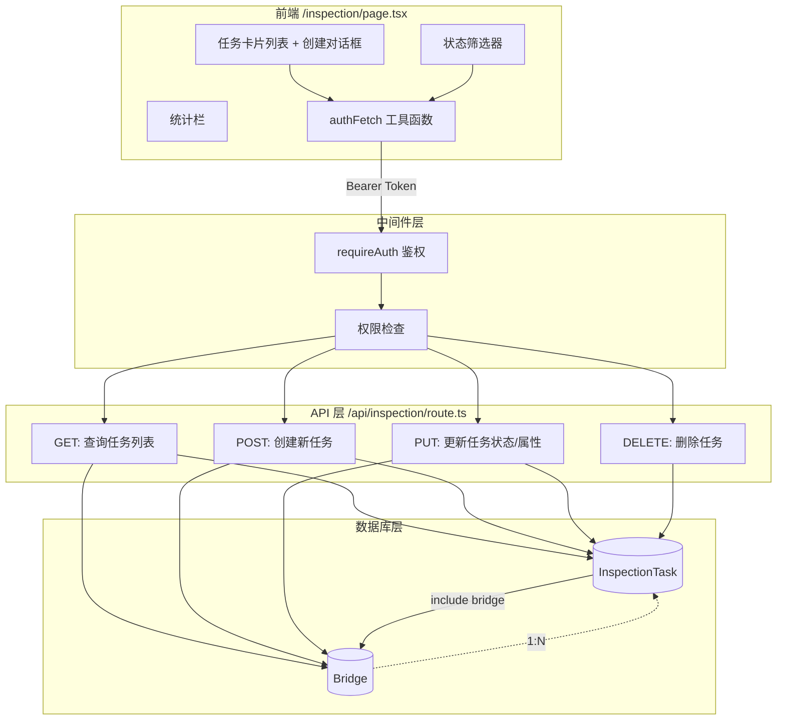

巡检任务管理模块是桥梁步行板可视化系统中负责**巡检工作调度**的核心子系统。它提供了一套完整的任务生命周期管理能力：从任务创建、负责人指派、优先级设定，到执行中的状态推进，再到完成记录。整个模块由三层构成——Prisma 数据模型层定义持久化结构，RESTful API 路由层封装业务逻辑与权限校验，Next.js 客户端页面层提供交互界面。本页将逐一剖析这三个层次的实现细节，帮助开发者理解巡检任务的架构设计与状态流转机制。

Sources: [schema.prisma](prisma/schema.prisma#L151-L164), [route.ts](src/app/api/inspection/route.ts#L1-L177), [page.tsx](src/app/inspection/page.tsx#L1-L109)

## 数据模型：InspectionTask

巡检任务的数据持久化由 Prisma ORM 管理，底层使用 SQLite 数据库。`InspectionTask` 模型通过 `bridgeId` 外键与 `Bridge` 模型建立多对一关联——一座桥梁可以拥有多个巡检任务，而每个任务必须归属于一座具体桥梁。模型的删除策略采用 `onDelete: Cascade`，即桥梁被删除时其关联的所有巡检任务将级联删除，避免产生孤立数据。

Sources: [schema.prisma](prisma/schema.prisma#L151-L164)

模型字段结构如下：

| 字段 | 类型 | 默认值 | 说明 |
|------|------|--------|------|
| `id` | `String` | `cuid()` | 主键，自动生成的唯一标识 |
| `bridgeId` | `String` | — | 外键，关联 `Bridge.id` |
| `assignedTo` | `String?` | `null` | 负责人姓名（纯文本，非外键） |
| `dueDate` | `DateTime` | — | 截止日期，必填 |
| `status` | `String` | `"pending"` | 任务状态：pending / in_progress / completed |
| `priority` | `String` | `"normal"` | 优先级：low / normal / high / urgent |
| `notes` | `String?` | `null` | 备注信息 |
| `completedAt` | `DateTime?` | `null` | 完成时间，状态变为 completed 时自动写入 |
| `createdAt` | `DateTime` | `now()` | 创建时间 |
| `updatedAt` | `DateTime` | `@updatedAt` | 最后更新时间，Prisma 自动维护 |

**设计要点**：`assignedTo` 字段采用纯文本字符串而非外键关联 `User` 表，这是一个有意为之的轻量化设计。它允许系统在负责人尚未注册为系统用户时也能灵活指派（例如填写"张工"即可），降低了巡检任务与用户管理的耦合度。代价是牺牲了用户维度的任务聚合查询能力，但在当前的业务规模下，这种取舍是合理的。

Sources: [schema.prisma](prisma/schema.prisma#L151-L164)

## 三态流转模型

巡检任务的状态流转采用**单向线性三态模型**，状态只能向前推进，不支持回退。这种设计确保了任务执行过程的不可逆性，符合巡检工作的实际业务逻辑——一个已开始执行的巡检任务不应被退回到"待处理"状态。

```
pending ──→ in_progress ──→ completed
(待处理)    (进行中)        (已完成)
```

三个状态的语义定义和系统行为如下表所示：

| 状态 | 中文标签 | 视觉标识 | 触发动作 | 系统行为 |
|------|----------|----------|----------|----------|
| `pending` | 待处理 | 黄色 Badge + Clock 图标 | 创建时自动进入 | 等待执行；逾期检测生效 |
| `in_progress` | 进行中 | 蓝色 Badge + Timer 图标 | 点击"开始执行"按钮 | 执行中；逾期检测生效 |
| `completed` | 已完成 | 绿色 Badge + CheckCircle 图标 | 点击"标记完成"按钮 | 自动写入 `completedAt` 时间戳；逾期检测失效 |

状态流转的映射关系在前端通过 `NEXT_STATUS` 常量字典硬编码，确保每个状态只能流转到唯一的下一个状态。当任务处于 `completed` 状态时，`NEXT_STATUS` 中无对应键值，前端自动隐藏推进按钮：

Sources: [page.tsx](src/app/inspection/page.tsx#L103-L107), [page.tsx](src/app/inspection/page.tsx#L89-L93), [route.ts](src/app/api/inspection/route.ts#L120-L123)

```typescript
const NEXT_STATUS: Record<string, string> = {
  pending: 'in_progress',
  in_progress: 'completed'
}
```

服务端在 `PUT` 接口中实现了与状态关联的副作用——当检测到 `status` 变更为 `completed` 且原状态不是 `completed` 时，自动将 `completedAt` 字段设置为当前时间。这一逻辑确保了**完成时间戳只记录一次**，即使客户端意外发送重复的 completed 状态更新，也不会覆盖已有的完成时间：

Sources: [route.ts](src/app/api/inspection/route.ts#L120-L123)

```typescript
// 状态变为已完成时记录完成时间
if (status === 'completed' && existing.status !== 'completed') {
  data.completedAt = new Date()
}
```

## 完整数据流架构

巡检任务管理的数据流可以用下面的架构图来概括，展示了从前端页面发起请求到数据库持久化的完整路径：



Sources: [route.ts](src/app/api/inspection/route.ts#L1-L177), [page.tsx](src/app/inspection/page.tsx#L78-L86)

## API 路由详解

巡检任务的 API 路由集中在 `/api/inspection`，通过 HTTP 方法区分四种操作。所有接口均经过 `requireAuth` 中间件进行身份验证和权限检查。以下是四个端点的完整解析：

### GET —— 查询任务列表

`GET /api/inspection` 支持按 `bridgeId` 和 `status` 两个维度进行筛选，通过 URL 查询参数传入。响应数据通过 Prisma 的 `include` 机制**预加载关联的桥梁信息**，同时在桥梁层级嵌套加载了桥孔及其步行板状态数据，使得前端可以在任务卡片上直接展示桥梁的健康概况而无需额外的网络请求。查询结果按 `createdAt` 降序排列，确保最新创建的任务排在前面。

Sources: [route.ts](src/app/api/inspection/route.ts#L6-L46)

### POST —— 创建新任务

`POST /api/inspection` 接收 `bridgeId`、`assignedTo`、`dueDate`、`priority`、`notes` 五个字段。其中 `bridgeId` 和 `dueDate` 为**必填项**，服务端会进行校验并返回 400 错误。创建前还会验证 `bridgeId` 对应的桥梁是否存在，不存在则返回 404。新任务的 `status` 始终为 `pending`，`priority` 默认为 `normal`。

Sources: [route.ts](src/app/api/inspection/route.ts#L48-L93)

### PUT —— 更新任务属性

`PUT /api/inspection` 采用**局部更新**策略，只修改请求体中传入的字段。可更新字段包括 `status`、`assignedTo`、`priority`、`notes`、`dueDate`。更新前会先查询原记录，确认任务存在后才执行更新操作。关键的副作用逻辑：当 `status` 变为 `completed` 时自动写入 `completedAt` 时间戳。

Sources: [route.ts](src/app/api/inspection/route.ts#L95-L152)

### DELETE —— 删除任务

`DELETE /api/inspection` 通过查询参数 `id` 指定要删除的任务。这是一个**硬删除**操作，直接从数据库中移除记录，不提供软删除或回收站机制。删除操作需要 `bridge:delete` 权限，这是四个操作中权限要求最高的。

Sources: [route.ts](src/app/api/inspection/route.ts#L154-L177)

**权限矩阵汇总**：

| HTTP 方法 | 所需权限 | admin | manager | user | viewer |
|-----------|----------|-------|---------|------|--------|
| GET | `bridge:read` | ✅ | ✅ | ✅ | ✅ |
| POST | `bridge:write` | ✅ | ✅ | ❌ | ❌ |
| PUT | `bridge:write` | ✅ | ✅ | ❌ | ❌ |
| DELETE | `bridge:delete` | ✅ | ✅ | ❌ | ❌ |

Sources: [route.ts](src/app/api/inspection/route.ts#L8), [route.ts](src/app/api/inspection/route.ts#L51), [route.ts](src/app/api/inspection/route.ts#L98), [route.ts](src/app/api/inspection/route.ts#L157), [index.ts](src/lib/auth/index.ts#L27-L48)

## 前端页面架构

巡检任务管理页面 `/inspection` 是一个完全独立的客户端渲染页面（`'use client'`），不依赖于系统主页面的布局结构。它拥有自己的顶部导航栏、主题切换、认证检查和数据加载逻辑，构成了一个功能完备的单页应用模块。

Sources: [page.tsx](src/app/inspection/page.tsx#L1-L109)

### 页面组成结构

页面的视觉布局自上而下分为四个区域：

| 区域 | 组件 | 功能说明 |
|------|------|----------|
| 顶部导航栏 | `<header>` sticky | 返回按钮、页面标题、当前用户名、主题切换、退出登录 |
| 统计栏 | 4 列 `<Card>` 网格 | 显示全部/待处理/进行中/已完成的任务数量，每张卡片配有专属图标和颜色 |
| 筛选与操作栏 | `<Filter>` + `<Dialog>` | 按状态筛选任务列表（带计数徽标）；"创建任务"按钮弹出对话框 |
| 任务列表区 | `<ScrollArea>` + 网格 | 三列响应式卡片列表，每张卡片展示任务详情和操作按钮 |

Sources: [page.tsx](src/app/inspection/page.tsx#L316-L670)

### 认证与数据加载

页面通过 `useEffect` 钩子在挂载时从 `localStorage` 读取 `token` 和 `user` 信息进行前端认证检查。若 token 不存在或 user JSON 解析失败，直接重定向到 `/login` 页面。认证通过后，`loadData` 函数使用 `Promise.all` **并行请求** `/api/inspection` 和 `/api/bridges` 两个接口，减少数据加载的等待时间。所有 API 请求均通过页面内定义的 `authFetch` 工具函数发起，自动在请求头中注入 `Authorization: Bearer <token>`。

Sources: [page.tsx](src/app/inspection/page.tsx#L78-L86), [page.tsx](src/app/inspection/page.tsx#L131-L192)

### 任务创建对话框

创建任务对话框基于 shadcn/ui 的 `Dialog` 组件实现，表单包含以下五个字段：

| 字段 | 组件 | 必填 | 说明 |
|------|------|------|------|
| 选择桥梁 | `<Select>` | 是 | 下拉选择系统中的桥梁，显示"名称 (编号)"格式 |
| 负责人 | `<Input>` | 否 | 自由文本输入负责人姓名 |
| 截止日期 | `<Input type="date">` | 是 | HTML 原生日期选择器 |
| 优先级 | `<Select>` | 否 | 低/中/高/紧急，默认"中" |
| 备注 | `<Textarea>` | 否 | 多行文本，最多显示 2 行（CSS line-clamp） |

创建成功后，表单自动重置为初始状态，对话框关闭，并触发 `loadData()` 刷新任务列表。创建过程中按钮显示 loading 状态，防止重复提交。

Sources: [page.tsx](src/app/inspection/page.tsx#L214-L246), [page.tsx](src/app/inspection/page.tsx#L422-L529)

### 任务卡片与交互

每张任务卡片是一个 `motion.div` 动画容器（基于 Framer Motion），在进入/退出时执行平滑动画。卡片内容分为四个层次：

**头部**：桥梁名称（Building2 图标 + 名称）和桥梁编号，右上角显示优先级徽标。优先级的颜色编码如下：

| 优先级 | 标签 | 颜色 | CSS 类 |
|--------|------|------|--------|
| `low` | 低 | 灰色 | `bg-slate-500/15 text-slate-400` |
| `normal` | 中 | 蓝色 | `bg-blue-500/15 text-blue-400` |
| `high` | 高 | 橙色 | `bg-orange-500/15 text-orange-400` |
| `urgent` | 紧急 | 红色 | `bg-red-500/15 text-red-400` |

**状态区**：状态徽标和逾期标记。逾期检测逻辑 `isOverdue()` 判断：任务未完成（status ≠ completed）且当前时间已超过 `dueDate`，则在卡片上显示红色的"已逾期"警告徽标，同时卡片整体边框变为红色高亮。

**详情区**：负责人（User 图标）、截止日期（Calendar 图标）、完成时间（CheckCircle2 图标，仅已完成任务显示）、备注内容（斜体，最多 2 行）。

**操作栏**：卡片底部的分割线下方，左侧是状态推进按钮（pending 时显示"开始执行"，in_progress 时显示"标记完成"，completed 时隐藏），右侧是删除按钮（红色 Trash2 图标）。删除操作有 `confirm()` 二次确认。

Sources: [page.tsx](src/app/inspection/page.tsx#L536-L645), [page.tsx](src/app/inspection/page.tsx#L89-L101), [page.tsx](src/app/inspection/page.tsx#L208-L211)

### 逾期检测机制

逾期判断是前端纯逻辑实现，不依赖后端定时任务或数据库计算。函数 `isOverdue` 接收一个任务对象，当任务状态为 `completed` 时直接返回 `false`（已完成任务不判断逾期），否则比较 `dueDate` 与当前时间：

Sources: [page.tsx](src/app/inspection/page.tsx#L208-L211)

```typescript
const isOverdue = (task: InspectionTask) => {
  if (task.status === 'completed') return false
  return new Date(task.dueDate) < new Date()
}
```

这种前端实时计算的方式意味着逾期标记会随页面刷新动态更新，但也意味着如果用户长时间停留在页面上不刷新，逾期状态可能不会即时反映——这是当前实现的已知局限性。

## 状态流转的完整生命周期

将前述各层组合在一起，一个巡检任务从创建到完成的完整生命周期如下：

```mermaid
flowchart TD
    A[管理员点击"创建任务"] --> B[填写表单：桥梁 / 负责人 / 截止日期 / 优先级]
    B --> C{前端校验}
    C -->|bridgeId 为空| D[提示：请选择桥梁]
    C -->|dueDate 为空| E[提示：请选择截止日期]
    C -->|校验通过| F[POST /api/inspection]
    
    F --> G{requireAuth bridge:write}
    G -->|401 未登录| H[重定向到 /login]
    G -->|403 无权限| I[返回权限错误]
    G -->|校验通过| J{桥梁是否存在?}
    
    J -->|404| K[返回：桥梁不存在]
    J -->|存在| L[创建 InspectionTask<br/>status = pending]
    L --> M[返回任务数据 + 桥梁信息]
    M --> N[刷新任务列表]

    N --> O[任务卡片显示在"待处理"列表]
    O --> P{点击"开始执行"}
    P --> Q[PUT /api/inspection<br/>status: in_progress]
    Q --> R[任务状态变为"进行中"]
    
    R --> S{点击"标记完成"}
    S --> T[PUT /api/inspection<br/>status: completed]
    T --> U[自动写入 completedAt 时间戳]
    U --> V[任务状态变为"已完成"]
    V --> W[卡片显示完成时间<br/>推进按钮隐藏]

    O -.->|超出 dueDate| X[显示"已逾期"红色警告]
    R -.->|超出 dueDate| X
```

Sources: [route.ts](src/app/api/inspection/route.ts#L48-L93), [route.ts](src/app/api/inspection/route.ts#L95-L152), [page.tsx](src/app/inspection/page.tsx#L214-L270), [page.tsx](src/app/inspection/page.tsx#L618-L630)

## 前端类型定义

巡检任务页面在内部定义了专属的 TypeScript 接口，用于约束 API 响应数据的类型安全。这些接口未放置在全局类型文件 [bridge.ts](src/types/bridge.ts) 中，因为它们仅服务于巡检任务页面的组件逻辑：

Sources: [page.tsx](src/app/inspection/page.tsx#L50-L76)

```typescript
interface InspectionTask {
  id: string
  bridgeId: string
  assignedTo: string | null
  dueDate: string
  status: 'pending' | 'in_progress' | 'completed'
  priority: 'low' | 'normal' | 'high' | 'urgent'
  notes: string | null
  completedAt: string | null
  createdAt: string
  updatedAt: string
  bridge: Bridge        // 预加载的桥梁信息
}

interface Bridge {
  id: string
  name: string
  bridgeCode: string
  location: string | null
}
```

值得注意的类型细节：`dueDate` 在 Prisma schema 中是 `DateTime` 类型，但经过 JSON 序列化后在 TypeScript 端表现为 `string`。前端在创建任务时将 HTML `<input type="date">` 的值（`"YYYY-MM-DD"` 格式字符串）直接传给后端，后端通过 `new Date(dueDate)` 进行转换。`status` 和 `priority` 字段使用了**联合字符串字面量类型**，在编译期即可捕获非法值。

Sources: [page.tsx](src/app/inspection/page.tsx#L57-L69), [page.tsx](src/app/inspection/page.tsx#L62-L63)

## 设计决策与边界分析

### assignedTo 为何是文本而非外键

当前 `assignedTo` 字段存储的是负责人姓名的纯文本（如"张工"、"李明"），而非指向 `User` 表的外键。这一设计带来的影响：

**优势**：无需预先创建系统用户即可指派负责人，适合当前系统中巡检人员未必都有账号的实际场景；查询时无需 JOIN User 表，简化了数据获取逻辑。

**代价**：无法通过用户 ID 聚合"某用户的所有任务"；人员重名时无法区分；人员离职后无法自动关联处理。

### 逾期检测的前端局限

当前逾期检测完全在前端通过 `new Date()` 实时计算，没有后端定时扫描或数据库层面的逾期状态持久化。这意味着：逾期能且只能在用户打开巡检页面时被感知，无法触发站内通知或其他自动化动作。若需要逾期自动告警能力，需与[站内通知系统：自动推送与实时轮询](27-zhan-nei-tong-zhi-xi-tong-zi-dong-tui-song-yu-shi-shi-lun-xun)模块集成。

Sources: [page.tsx](src/app/inspection/page.tsx#L208-L211)

### 无软删除与操作日志

巡检任务的删除是硬删除，且 API 路由中未调用 `logOperation` 记录操作日志。这意味着被删除的任务无法恢复，也无法通过操作日志审计追溯。若项目对数据安全有更高要求，可参考系统中其他模块（如步行板编辑）的 `logOperation` 调用模式进行增强。相关权限控制体系请参考 [RBAC 四级角色权限控制体系](10-rbac-si-ji-jiao-se-quan-xian-kong-zhi-ti-xi)。

Sources: [route.ts](src/app/api/inspection/route.ts#L154-L176)

## 扩展阅读

- [三级数据模型：桥梁 → 桥孔 → 步行板](6-san-ji-shu-ju-mo-xing-qiao-liang-qiao-kong-bu-xing-ban) —— 理解 InspectionTask 关联的 Bridge 模型的完整结构
- [requireAuth 统一鉴权中间件](13-requireauth-tong-jian-quan-zhong-jian-jian) —— 深入了解巡检 API 使用的认证与权限校验机制
- [站内通知系统：自动推送与实时轮询](27-zhan-nei-tong-zhi-xi-tong-zi-dong-tui-song-yu-shi-shi-lun-xun) —— 通知系统的基础设施，巡检任务逾期告警的潜在集成点
- [RESTful API 路由结构与设计规范](12-restful-api-lu-you-jie-gou-yu-she-ji-gui-fan) —— 系统全局 API 设计规范，巡检 API 遵循相同模式