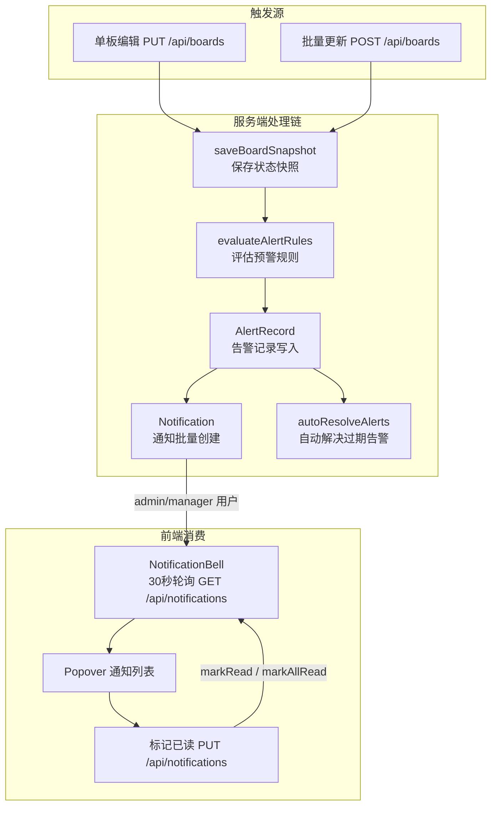

站内通知系统是桥梁管理平台的关键消息管道，负责将预警引擎产生的告警、系统事件等信息以实时通知的形式推送给对应的管理人员。该系统采用 **数据库写入 + 前端轮询** 的架构模式，以 30 秒为周期从服务端拉取未读通知，通过顶部导航栏的铃铛组件以 Popover 弹窗的形式呈现。整个通知链路覆盖了从预警触发、通知记录创建、前端轮询拉取到用户标记已读的完整生命周期。

Sources: [schema.prisma](prisma/schema.prisma#L234-L251), [NotificationBell.tsx](src/components/bridge/NotificationBell.tsx#L1-L261), [route.ts](src/app/api/notifications/route.ts#L1-L101)

## 系统架构概览

站内通知系统并非一个独立的推送服务，而是**嵌入在预警规则引擎的数据管道末端**。当步行板状态变更触发告警时，通知作为告警的"人可读投影"被同步写入数据库，再由前端轮询机制定期消费。这种设计省去了 WebSocket 或 SSE 的基础设施复杂度，在中小规模管理系统中是一种务实的选择。



上图中，**粗实线**代表数据库事务内的同步操作（快照→告警→通知在同一事务中完成），**虚线**代表跨网络的 HTTP 请求（前端轮询）。核心设计原则是：通知创建失败不影响告警流程的主体逻辑，两者在 `try-catch` 中被解耦。

Sources: [alert-engine.ts](src/lib/alert-engine.ts#L329-L448), [route.ts](src/app/api/boards/route.ts#L95-L179)

## 数据模型：Notification

通知的数据模型定义在 Prisma Schema 中，与 `User` 模型通过 `userId` 形成多对一关系，并设置了复合索引以优化高频查询性能。

| 字段 | 类型 | 默认值 | 说明 |
|------|------|--------|------|
| `id` | `String` | `cuid()` | 主键，自动生成 |
| `userId` | `String` | — | 接收通知的用户 ID，外键关联 `User.id` |
| `title` | `String` | — | 通知标题，通常等于告警规则名称 |
| `message` | `String` | — | 通知正文，由消息模板渲染生成 |
| `type` | `String` | `"alert"` | 通知类型：`alert`（预警）、`system`（系统）、`task`（任务） |
| `severity` | `String?` | `null` | 严重等级：`critical`、`warning`、`info` |
| `relatedId` | `String?` | `null` | 关联 ID，可指向 AlertRecord 或其他业务对象 |
| `isRead` | `Boolean` | `false` | 已读标记 |
| `createdAt` | `DateTime` | `now()` | 创建时间 |

Schema 中定义了两个复合索引来支撑核心查询场景：`@@index([userId, isRead])` 服务于"获取某用户未读通知"这一最高频操作，`@@index([userId, createdAt])` 则优化了按时间倒序分页查询的性能。`onDelete: Cascade` 确保用户被删除时其通知记录同步清理。

Sources: [schema.prisma](prisma/schema.prisma#L234-L251)

## 通知的自动生成机制

通知的生成完全由 **预警规则引擎** 驱动，位于 `evaluateAlertRules` 函数的事务尾部。当告警记录被创建后，引擎会查询所有 `role` 为 `admin` 或 `manager` 且 `status` 为 `active` 的用户，为每个用户 × 每条新告警的组合创建一条 `Notification` 记录。

### 通知创建的执行流程

```typescript
// alert-engine.ts 第 418-445 行 —— 通知创建核心逻辑
if (newAlerts.length > 0) {
  const notifyUsers = await tx.user.findMany({
    where: { role: { in: ['admin', 'manager'] }, status: 'active' },
    select: { id: true },
  });

  if (notifyUsers.length > 0) {
    const notifications = notifyUsers.flatMap((user) =>
      newAlerts.map((alert) => ({
        userId: user.id,
        title: alert.title,       // 规则名称
        message: alert.message,   // 模板渲染后的消息
        type: 'alert',
        severity: alert.severity, // critical / warning / info
      }))
    );
    await tx.notification.createMany({ data: notifications });
  }
}
```

关键设计细节有三点值得注意：

**第一，通知与告警在同一数据库事务中创建**。这意味着如果通知写入失败（如数据库异常），整个事务将回滚，告警记录也不会被保存——这保证了数据一致性。但外层有一个 `try-catch` 块专门捕获通知创建异常，使得通知失败不会影响告警流程。这是一个有意的设计权衡：告警记录是核心数据，通知是"锦上添花"的增强功能。

**第二，通知对象被限定为管理角色**。只有 `admin` 和 `manager` 级别的活跃用户才会收到预警通知，普通巡检员（`user`/`viewer`）不在通知列表中。这符合系统的权限分层逻辑——管理角色负责决策和调度，巡检员专注于现场操作。

**第三，通知的 `title` 直接复用告警规则的 `name` 字段，`message` 则经过模板引擎渲染**。模板中的变量（如 `{bridgeName}`、`{damageRate}`）在 `resolveTemplate` 函数中被替换为实际数据，使通知内容具有业务语义。

Sources: [alert-engine.ts](src/lib/alert-engine.ts#L418-L445), [seed-alert-rules.ts](src/lib/seed-alert-rules.ts#L1-L145)

### 触发通知的操作场景

通知的触发源头是步行板状态的变更操作。系统中存在三种触发路径：

| 操作场景 | API 路由 | 触发方式 | 通知创建 |
|----------|----------|----------|----------|
| 单块步行板编辑 | `PUT /api/boards` | `evaluateAlertRules(tx, ctx)` | 事务内批量创建 |
| 批量步行板更新 | `POST /api/boards` | `evaluateAlertRules(tx, ctx)` + 桥梁级规则单独评估 | 事务内批量创建 |
| 整孔/整侧批量操作 | `POST /api/boards` | `evaluateAlertRules(tx, ctx)` | 事务内批量创建 |

每种场景都遵循相同的流程：在 `db.$transaction` 中，先保存旧状态快照，再执行更新，然后调用 `evaluateAlertRules` 评估所有启用的预警规则。如果有规则被触发且不存在重复的活跃告警，就会创建新的 AlertRecord 并同步创建 Notification。

Sources: [route.ts](src/app/api/boards/route.ts#L95-L199), [route.ts](src/app/api/boards/route.ts#L202-L393)

## API 接口设计

通知系统对外暴露一个 RESTful 端点 `/api/notifications`，支持 GET（查询）和 PUT（更新已读状态）两种方法。

### GET /api/notifications — 查询通知列表

该接口在同一个请求中并行返回通知列表和未读计数，减少前端请求次数。

**请求参数（Query String）：**

| 参数 | 类型 | 默认值 | 说明 |
|------|------|--------|------|
| `unreadOnly` | `string` | `"false"` | 设为 `"true"` 仅返回未读通知 |
| `limit` | `number` | `50` | 返回条数上限，硬限制为 100 |

**响应结构：**

```json
{
  "success": true,
  "data": {
    "notifications": [
      {
        "id": "clx...",
        "userId": "clx...",
        "title": "存在断裂风险步行板",
        "message": "京广线K156桥 存在 3 块断裂风险步行板，禁止通行！",
        "type": "alert",
        "severity": "critical",
        "relatedId": null,
        "isRead": false,
        "createdAt": "2025-01-15T10:30:00.000Z"
      }
    ],
    "unreadCount": 5
  }
}
```

接口内部使用 `Promise.all` 并行执行 `findMany` 和 `count` 两个查询，确保列表数据和统计数据的获取不产生串行等待。

### PUT /api/notifications — 标记已读

该接口支持两种已读操作模式：

| `action` 值 | 额外参数 | 行为 |
|-------------|----------|------|
| `markRead` | `ids: string[]` | 批量标记指定 ID 的通知为已读 |
| `markAllRead` | 无 | 标记当前用户所有通知为已读 |

两种操作都通过 `userId` 条件确保用户只能操作自己的通知，防止越权。`markAllRead` 操作返回 `unreadCount: 0`，`markRead` 则返回更新后的实际未读计数。

Sources: [route.ts](src/app/api/notifications/route.ts#L1-L101)

## 前端组件：NotificationBell

`NotificationBell` 是通知系统的前端消费者，以一个铃铛图标的形态嵌入在主页面顶部导航栏的用户菜单区域。它集成了轮询拉取、通知列表展示、已读标记三大功能。

### 组件架构与集成位置

```typescript
// page.tsx 第 942-945 行 —— NotificationBell 在页面中的集成
{currentUser && (
  <NotificationBell userId={currentUser.id} theme={theme} />
)}
```

组件接收两个 Props：`userId`（当前登录用户 ID，用于 API 鉴权）和 `theme`（`"day"` 或 `"night"`，控制视觉风格）。在主页面布局中，NotificationBell 位于用户管理按钮和用户名之间，是桌面端导航栏的固定元素。

### 轮询机制详解

通知的"实时性"通过 **30 秒定时间轮询** 实现，而非 WebSocket 或 Server-Sent Events。这是一种针对中小规模应用的务实选择——在通知量不大、实时性要求为"分钟级"的场景下，轮询方案的实现复杂度和运维成本远低于长连接方案。

```typescript
// NotificationBell.tsx 第 51-81 行 —— 轮询核心逻辑
const fetchNotifications = useCallback(async () => {
  const token = localStorage.getItem('token')
  if (!token) return
  const res = await fetch('/api/notifications', {
    headers: { Authorization: `Bearer ${token}` },
  })
  if (!res.ok) return
  const { data } = await res.json()
  setNotifications(data.notifications || [])
  setUnreadCount(data.unreadCount || 0)
}, [])

// 初始加载 + 30秒轮询
useEffect(() => {
  fetchNotifications()
  const interval = setInterval(fetchNotifications, 30000)
  return () => clearInterval(interval)
}, [fetchNotifications])

// 打开时即时刷新
useEffect(() => {
  if (open) fetchNotifications()
}, [open, fetchNotifications])
```

轮询策略包含三个层次的刷新触发：

1. **初始化加载**：组件挂载时立即发起第一次请求
2. **定时轮询**：每 30 秒通过 `setInterval` 自动拉取最新通知
3. **交互触发**：用户打开通知面板（Popover）时主动刷新，确保展示最新数据

`useCallback` 包裹 `fetchNotifications` 确保函数引用稳定，避免 `useEffect` 的重复注册。组件卸载时通过 cleanup 函数清除 `setInterval`，防止内存泄漏。

Sources: [NotificationBell.tsx](src/components/bridge/NotificationBell.tsx#L44-L81)

### 视觉呈现与交互设计

NotificationBell 的 UI 基于 Shadcn/ui 的 `Popover` 组件构建，分为触发器（铃铛按钮）和弹窗内容（通知列表）两部分。

**触发器状态：**

| 状态 | 图标 | 附加元素 |
|------|------|----------|
| 有未读通知 | `Bell`（实心铃铛） | 红色 Badge 显示未读数，上限显示 `99+` |
| 无未读通知 | `BellOff`（划线铃铛） | 无 |

**通知列表布局：**

弹窗宽度固定 320px，内部使用 `ScrollArea` 组件限制高度为 320px 并提供滚动。每条通知以按钮形式呈现，点击即可标记为已读。单条通知的结构如下：

- 左侧：**SeverityIcon** —— 根据严重等级显示不同图标和颜色
  - `critical` → 红色 `AlertTriangle`
  - `warning` → 黄色 `AlertCircle`
  - `info` → 蓝色 `Info`
- 中间：标题（单行截断）+ 正文（最多两行）+ 相对时间
- 右侧：未读通知显示蓝色圆点指示器

**时间格式化：** `timeAgo` 函数将 ISO 时间戳转换为中文相对时间表达，按照"刚刚 → X 分钟前 → X 小时前 → X 天前 → 具体日期"的阶梯式降级策略渲染，让用户快速感知通知的新鲜度。

Sources: [NotificationBell.tsx](src/components/bridge/NotificationBell.tsx#L16-L42), [NotificationBell.tsx](src/components/bridge/NotificationBell.tsx#L138-L261)

### 已读标记操作

NotificationBell 提供两种标记已读的方式，对应 API 的两种 action：

| 操作 | 触发方式 | 调用 API |
|------|----------|----------|
| 单条标记已读 | 点击某条通知 | `{ action: 'markRead', ids: [notificationId] }` |
| 全部标记已读 | 点击面板顶部的"全部已读"按钮 | `{ action: 'markAllRead' }` |

已读操作采用 **乐观更新** 策略：API 请求成功后，前端立即通过 `setNotifications` 和 `setUnreadCount` 更新本地状态，无需等待下一次轮询。这消除了标记已读后的视觉延迟，提升用户感知的响应速度。操作过程中 `marking` 状态变量用于防止重复点击。

Sources: [NotificationBell.tsx](src/components/bridge/NotificationBell.tsx#L83-L136)

## TypeScript 类型定义

通知相关的 TypeScript 类型定义在 `src/types/bridge.ts` 中，与 Prisma 生成的类型保持一致但独立维护，便于前端在不直接依赖数据库层的情况下使用。

```typescript
// bridge.ts 第 179-189 行
export interface NotificationItem {
  id: string
  userId: string
  title: string
  message: string
  type: string        // 'alert' | 'system' | 'task'
  severity: string | null  // 'critical' | 'warning' | 'info'
  relatedId: string | null
  isRead: boolean
  createdAt: string
}
```

该接口在 `NotificationBell` 组件中作为泛型参数传入 `useState<NotificationItem[]>`，确保通知列表的类型安全。

Sources: [bridge.ts](src/types/bridge.ts#L179-L189)

## 通知类型与预警规则的对应关系

系统预置了 9 条预警规则（由 `seedAlert-rules.ts` 初始化），每条规则触发后都会生成对应的通知。下表展示了规则与通知的映射关系：

| 规则名称 | 严重等级 | 作用域 | 通知消息模板 |
|----------|----------|--------|-------------|
| 存在断裂风险步行板 | `critical` | bridge | `{bridgeName} 存在 {fractureRiskBoards} 块断裂风险步行板，禁止通行！` |
| 桥梁损坏率超 30% | `critical` | bridge | `{bridgeName} 整体损坏率达到 {damageRate}%，超过30%警戒线` |
| 步行板出现断裂风险 | `critical` | board | `{bridgeName} 第{spanNumber}孔 {positionLabel}第{boardNumber}号步行板出现断裂风险！` |
| 步行板缺失 | `critical` | board | `{bridgeName} 第{spanNumber}孔 {positionLabel}第{boardNumber}号步行板缺失！` |
| 桥梁损坏率超 15% | `warning` | bridge | `{bridgeName} 整体损坏率达到 {damageRate}%，超过15%关注线` |
| 步行板严重损坏 | `warning` | board | `{bridgeName} 第{spanNumber}孔 {positionLabel}第{boardNumber}号步行板严重损坏` |
| 防滑等级过低 | `warning` | board | `...步行板防滑等级过低({antiSlipLevel})，存在滑倒风险` |
| 栏杆状态异常 | `warning` | board | `...步行板栏杆异常({railingStatus})，注意安全` |
| 托架锈蚀 | `info` | board | `...步行板托架锈蚀，建议检修` |

通知的 `severity` 直接继承自触发规则的严重等级，前端据此渲染不同的图标和配色。

Sources: [seed-alert-rules.ts](src/lib/seed-alert-rules.ts#L9-L145)

## 设计权衡与局限性

站内通知系统的当前实现基于几个明确的技术权衡，理解这些权衡有助于在后续迭代中做出合理的改进决策。

**轮询 vs 推送：** 30 秒轮询在通知延迟和服务器负载之间取得了平衡。对于管理类系统，30 秒的延迟通常可以接受。若未来需要秒级实时性，可升级为 SSE（Server-Sent Events）方案，API 层增加事件流端点，前端用 `EventSource` 替换 `setInterval`。

**通知对象的静态范围：** 当前只有 `admin` 和 `manager` 角色接收通知。如果需要按桥梁负责人定向推送（如"某桥梁的巡检任务分配给特定用户"），需要在 `evaluateAlertRules` 中扩展用户查询逻辑，引入基于 `InspectionTask.assignedTo` 的定向通知。

**通知的 `type` 字段预留：** Schema 中定义了 `alert | system | task` 三种类型，但当前系统仅使用了 `alert` 类型。`system` 可用于系统升级、维护通知等场景，`task` 可用于巡检任务的状态变更通知——这些扩展点已在数据模型层面预留。

**通知的持久化策略：** 当前没有通知的自动清理机制。随着时间推移，`Notification` 表可能持续增长。建议在生产环境中增加定时任务，定期归档或清理超过一定时间的已读通知。

Sources: [alert-engine.ts](src/lib/alert-engine.ts#L418-L445), [schema.prisma](prisma/schema.prisma#L234-L251)

## 延伸阅读

- **预警规则引擎的完整实现细节**：[预警规则引擎：快照保存、条件评估与自动去重](16-yu-jing-gui-ze-yin-qing-kuai-zhao-bao-cun-tiao-jian-ping-gu-yu-zi-dong-qu-zhong) — 了解通知的上游数据源如何产生
- **步行板编辑触发预警的完整事务流程**：[步行板单块编辑与批量操作流程](15-bu-xing-ban-dan-kuai-bian-ji-yu-pi-liang-cao-zuo-liu-cheng) — 理解从用户操作到通知产生的端到端链路
- **权限体系与通知受众的关系**：[RBAC 四级角色权限控制体系](10-rbac-si-ji-jiao-se-quan-xian-kong-zhi-ti-xi) — 理解为何只有 admin/manager 接收通知
- **数据库模型全貌**：[Prisma 数据库 Schema 设计（11 个模型）](7-prisma-shu-ju-ku-schema-she-ji-11-ge-mo-xing) — Notification 模型在整体数据架构中的位置