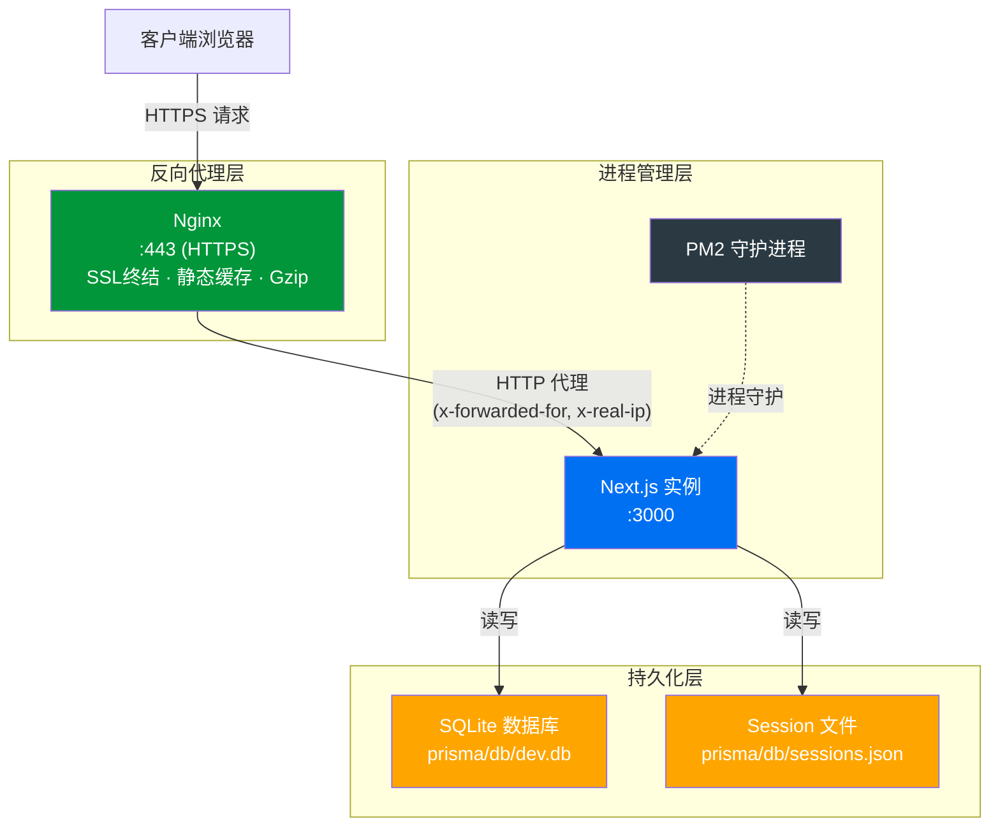
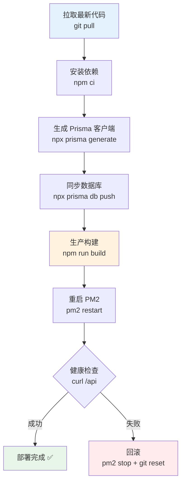

本指南详细阐述如何将铁路明桥面步行板可视化管理系统从开发环境推向生产环境，覆盖 **PM2 进程管理**、**Nginx 反向代理配置**、**SQLite 数据库持久化**以及 **SSL/TLS 安全加固**的完整流程。由于本项目使用基于文件的 Session 会话管理机制和 SQLite 嵌入式数据库，部署架构需遵循特定的约束——这些约束将在下文逐一解析。

Sources: [package.json](package.json#L1-L101), [next.config.ts](next.config.ts#L1-L11), [.env.example](.env.example#L1-L3)

## 部署架构总览

在生产环境中，系统采用 **Nginx → PM2 → Next.js（Standalone）** 的三层架构。Nginx 作为前置反向代理处理 SSL 终结、静态资源缓存和请求分发；PM2 负责 Node.js 进程的守护、自动重启与日志管理；Next.js 以 standalone 模式运行，提供应用服务。



> **架构约束说明**：由于系统使用 [session-store.ts](src/lib/session-store.ts#L1-L170) 进行基于文件的会话管理（依赖 `globalThis` 内存缓存 + JSON 文件持久化），PM2 **必须使用 fork 模式（单实例）** 而非 cluster 模式。多实例会导致各进程的内存缓存不同步，产生会话丢失问题。若需水平扩展，应将会话存储迁移至 Redis 等共享存储方案。

Sources: [src/lib/session-store.ts](src/lib/session-store.ts#L10-L46), [src/lib/auth/index.ts](src/lib/auth/index.ts#L82-L89)

## 前置条件

在开始部署之前，确保目标服务器满足以下条件：

| 条目 | 最低要求 | 推荐配置 |
|------|----------|----------|
| 操作系统 | Ubuntu 20.04 LTS | Ubuntu 22.04 LTS |
| Node.js | v18.x | v20.x LTS |
| 内存 | 1 GB | 2 GB+ |
| 磁盘空间 | 5 GB | 20 GB+（含数据库增长） |
| 网络 | 开放 80/443 端口 | 配置防火墙规则 |

Sources: [package.json](package.json#L64), [package.json](package.json#L69)

## 第一步：构建优化配置

### 修改 next.config.ts 启用 Standalone 输出

生产部署需要修改 [next.config.ts](next.config.ts#L1-L11) 以启用 **standalone 输出模式**，该模式会自动追踪所需依赖并生成最小化的独立部署包，避免将整个 `node_modules` 复制到生产环境：

```typescript
// next.config.ts - 生产环境优化版本
import type { NextConfig } from "next";

const nextConfig: NextConfig = {
  output: 'standalone',        // 关键：生成独立部署包
  typescript: {
    ignoreBuildErrors: true,
  },
  reactStrictMode: false,
};

export default nextConfig;
```

`output: 'standalone'` 的效果是：构建后会在 `.next/standalone` 目录生成一个包含完整运行时的独立 Node.js 服务器，体积通常比完整项目减少 70% 以上。同时 `.next/static` 目录包含所有静态资源，需由 Nginx 直接服务以获得最佳性能。

Sources: [next.config.ts](next.config.ts#L1-L11)

### 环境变量配置

在生产服务器上创建 `.env` 文件（**切勿提交到版本控制**，已在 [.gitignore](.gitignore#L27-L28) 中排除）：

```bash
# .env - 生产环境配置

# 数据库路径（SQLite）
# 使用绝对路径确保 PM2 在任何工作目录下都能正确找到数据库
DATABASE_URL="file:./prisma/db/production.db"

# Node 环境
NODE_ENV="production"
```

> **路径注意**：`DATABASE_URL` 中的相对路径 `./` 是相对于 Prisma schema 文件（`prisma/schema.prisma`）所在的目录解析的。Prisma 在 [schema.prisma](prisma/schema.prisma#L8-L11) 中通过 `env("DATABASE_URL")` 读取此值。建议在生产环境使用绝对路径以避免歧义。

Sources: [.env.example](.env.example#L1-L3), [prisma/schema.prisma](prisma/schema.prisma#L8-L11)

## 第二步：构建与数据库初始化

### 执行生产构建

在项目根目录下依次执行以下命令，完成依赖安装、Prisma 客户端生成和生产构建：

```bash
# 1. 安装依赖（含 PM2）
npm ci

# 2. 生成 Prisma 客户端
npx prisma generate

# 3. 初始化数据库结构
npx prisma db push

# 4. 执行生产构建
npm run build
```

构建完成后，关键产物分布如下：

| 目录/文件 | 用途 | 说明 |
|-----------|------|------|
| `.next/standalone/` | 独立服务器 | 包含最小化的 Node.js 运行时和依赖 |
| `.next/static/` | 静态资源 | JS/CSS/字体等，应由 Nginx 直接服务 |
| `public/` | 公共资源 | favicon、logo 等，应由 Nginx 直接服务 |
| `prisma/db/` | 数据存储 | SQLite 数据库文件和 Session 文件 |

> **首次启动时**，[src/lib/auth/index.ts](src/lib/auth/index.ts#L136-L153) 中的 `createDefaultAdmin()` 函数会自动创建默认管理员账户 `admin / admin123`。**上线前务必立即修改此密码**。

Sources: [package.json](package.json#L7-L8), [src/lib/auth/index.ts](src/lib/auth/index.ts#L136-L153)

## 第三步：PM2 进程管理配置

### 创建生态系统配置文件

PM2 已作为开发依赖安装在项目中（[package.json](package.json#L96) `"pm2": "^6.0.14"`），但生产环境建议全局安装以实现开机自启。在项目根目录创建 `ecosystem.config.js`：

```javascript
// ecosystem.config.js
module.exports = {
  apps: [{
    name: 'bridge-board-system',
    
    // standalone 模式的启动入口
    script: '.next/standalone/server.js',
    
    // 环境变量
    env_production: {
      NODE_ENV: 'production',
      PORT: 3000,
      HOSTNAME: '0.0.0.0'
    },
    
    // 单实例运行（必须！文件级 Session 不支持多实例）
    instances: 1,
    exec_mode: 'fork',
    
    // 自动重启策略
    max_restarts: 10,
    restart_delay: 5000,
    autorestart: true,
    max_memory_restart: '512M',
    
    // 监听文件变化（生产环境关闭）
    watch: false,
    
    // 日志配置
    error_file: './logs/error.log',
    out_file: './logs/out.log',
    log_date_format: 'YYYY-MM-DD HH:mm:ss Z',
    merge_logs: true,
    
    // 优雅关闭
    kill_timeout: 5000,
    listen_timeout: 10000,
  }]
}
```

> **为什么必须是 fork 模式**：[session-store.ts](src/lib/session-store.ts#L31-L46) 使用 `globalThis` 缓存会话数据。在 cluster 模式下，每个 Worker 进程拥有独立的 `globalThis` 命名空间，导致会话在进程间不可见——用户在进程 A 创建的会话，请求被路由到进程 B 时会判定为未登录。虽然代码在 [getSession](src/lib/session-store.ts#L119-L124) 中有文件重读的兜底机制，但性能和一致性仍不如单实例。

Sources: [package.json](package.json#L96), [src/lib/session-store.ts](src/lib/session-store.ts#L10-L46)

### PM2 常用运维命令

| 命令 | 用途 | 说明 |
|------|------|------|
| `pm2 start ecosystem.config.js --env production` | 启动应用 | 使用生产环境配置 |
| `pm2 stop bridge-board-system` | 停止应用 | 优雅停止 |
| `pm2 restart bridge-board-system` | 重启应用 | 用于更新代码后 |
| `pm2 reload bridge-board-system` | 零停机重启 | fork 模式下等同于 restart |
| `pm2 logs bridge-board-system` | 查看实时日志 | `--lines 100` 查看最近 100 行 |
| `pm2 monit` | 监控面板 | CPU/内存实时监控 |
| `pm2 describe bridge-board-system` | 查看进程详情 | 包含重启次数、运行时间等 |
| `pm2 startup` | 开机自启 | 生成系统服务脚本 |
| `pm2 save` | 保存进程列表 | 配合 `pm2 startup` 使用 |

### 配置开机自启

```bash
# 1. 生成启动脚本（按提示执行输出的命令）
pm2 startup

# 2. 启动应用
pm2 start ecosystem.config.js --env production

# 3. 保存当前进程列表（重启后自动恢复）
pm2 save
```

Sources: [src/lib/session-store.ts](src/lib/session-store.ts#L119-L124)

## 第四步：Nginx 反向代理配置

### 基础反向代理配置

以下 Nginx 配置覆盖了本项目的所有关键需求：WebSocket 支持（用于开发环境 HMR，生产环境可保留以备后续需要）、正确的请求头转发（用于 [getClientIP](src/lib/auth/index.ts#L83-L89) 获取真实客户端 IP）、静态资源缓存以及 Gzip 压缩。

```nginx
# /etc/nginx/sites-available/bridge-board-system

# 上游服务器 - PM2 管理的 Next.js
upstream nextjs_upstream {
    server 127.0.0.1:3000;
    keepalive 64;
}

server {
    listen 80;
    server_name your-domain.com;  # 替换为实际域名或 IP
    
    # HTTP 重定向到 HTTPS（生产环境启用）
    return 301 https://$server_name$request_uri;
}

server {
    listen 443 ssl http2;
    server_name your-domain.com;  # 替换为实际域名或 IP
    
    # SSL 证书配置
    ssl_certificate     /etc/nginx/ssl/cert.pem;
    ssl_certificate_key /etc/nginx/ssl/key.pem;
    ssl_protocols       TLSv1.2 TLSv1.3;
    ssl_ciphers         HIGH:!aNULL:!MD5;
    
    # 安全头部
    add_header X-Frame-Options "SAMEORIGIN" always;
    add_header X-Content-Type-Options "nosniff" always;
    add_header X-XSS-Protection "1; mode=block" always;
    add_header Referrer-Policy "strict-origin-when-cross-origin" always;
    
    # Gzip 压缩
    gzip on;
    gzip_vary on;
    gzip_proxied any;
    gzip_comp_level 6;
    gzip_types
        text/plain
        text/css
        text/xml
        application/json
        application/javascript
        application/xml
        image/svg+xml;
    
    # 静态资源 - Next.js 构建产物（由 Nginx 直接服务）
    location /_next/static/ {
        alias /path/to/bridge-board-system/.next/static/;
        expires 365d;
        access_log off;
        add_header Cache-Control "public, immutable";
    }
    
    # 静态资源 - public 目录
    location /favicon.png {
        alias /path/to/bridge-board-system/public/favicon.png;
        expires 30d;
        access_log off;
    }
    
    location /logo.svg {
        alias /path/to/bridge-board-system/public/logo.svg;
        expires 30d;
        access_log off;
    }
    
    location /robots.txt {
        alias /path/to/bridge-board-system/public/robots.txt;
        expires 7d;
        access_log off;
    }
    
    # API 路由 - 禁用缓存，确保数据实时性
    location /api/ {
        proxy_pass http://nextjs_upstream;
        proxy_http_version 1.1;
        
        # 关键：转发真实客户端信息
        proxy_set_header Host              $host;
        proxy_set_header X-Real-IP         $remote_addr;
        proxy_set_header X-Forwarded-For   $proxy_add_x_forwarded_for;
        proxy_set_header X-Forwarded-Proto $scheme;
        
        # 超时配置（AI 分析接口可能需要较长响应时间）
        proxy_read_timeout    120s;
        proxy_connect_timeout 10s;
        proxy_send_timeout    120s;
    }
    
    # 所有其他请求代理到 Next.js
    location / {
        proxy_pass http://nextjs_upstream;
        proxy_http_version 1.1;
        proxy_set_header Upgrade    $http_upgrade;
        proxy_set_header Connection "upgrade";
        proxy_set_header Host              $host;
        proxy_set_header X-Real-IP         $remote_addr;
        proxy_set_header X-Forwarded-For   $proxy_add_x_forwarded_for;
        proxy_set_header X-Forwarded-Proto $scheme;
    }
    
    # 上传文件大小限制（步行板照片等）
    client_max_body_size 10M;
    
    # 日志配置
    access_log /var/log/nginx/bridge-board-access.log;
    error_log  /var/log/nginx/bridge-board-error.log;
}
```

> **`X-Real-IP` 和 `X-Forwarded-For` 的重要性**：系统的 [getClientIP](src/lib/auth/index.ts#L83-L89) 函数依赖这两个请求头来记录真实客户端 IP（用于操作日志和登录审计）。若未正确配置，所有请求的 IP 将显示为 `127.0.0.1`，失去审计追踪能力。

Sources: [src/lib/auth/index.ts](src/lib/auth/index.ts#L82-L94), [prisma/schema.prisma](prisma/schema.prisma#L131-L149)

### 启用 Nginx 配置

```bash
# 创建符号链接启用站点
sudo ln -s /etc/nginx/sites-available/bridge-board-system /etc/nginx/sites-enabled/

# 检查配置语法
sudo nginx -t

# 重新加载配置
sudo nginx -s reload
```

Sources: [src/lib/auth/index.ts](src/lib/auth/index.ts#L83-L89)

## 第五步：SSL 证书配置（Let's Encrypt）

若使用 Let's Encrypt 免费证书，可通过 Certbot 自动获取和续期：

```bash
# 安装 Certbot
sudo apt install certbot python3-certbot-nginx

# 获取证书（自动修改 Nginx 配置）
sudo certbot --nginx -d your-domain.com

# 自动续期测试
sudo certbot renew --dry-run
```

Certbot 会自动在 Nginx 配置中添加 SSL 证书路径和重定向规则。

## 第六步：部署流程自动化

### 完整部署脚本

以下是一键部署脚本，将构建、数据库迁移和应用重启整合为单一操作：

```bash
#!/bin/bash
# deploy.sh - 生产部署脚本

set -e

echo "=== 开始部署 bridge-board-system ==="

# 进入项目目录
cd /path/to/bridge-board-system

# 拉取最新代码
echo "[1/6] 拉取最新代码..."
git pull origin main

# 安装依赖
echo "[2/6] 安装依赖..."
npm ci

# 生成 Prisma 客户端
echo "[3/6] 生成 Prisma 客户端..."
npx prisma generate

# 数据库迁移
echo "[4/6] 同步数据库结构..."
npx prisma db push

# 生产构建
echo "[5/6] 执行生产构建..."
npm run build

# 重启 PM2 进程
echo "[6/6] 重启应用..."
pm2 restart bridge-board-system

echo "=== 部署完成 ==="
pm2 status
```

### 部署流程可视化



Sources: [package.json](package.json#L5-L13)

## 第七步：健康检查与监控

### 健康检查端点

系统的 [API 根路由](src/app/api/route.ts) 可用作基础健康检查端点。Nginx 或外部监控工具可通过请求 `/api` 来判断应用是否正常响应。

### PM2 监控配置

```bash
# 安装 PM2 Logrotate（日志轮转，防止日志文件无限增长）
pm2 install pm2-logrotate
pm2 set pm2-logrotate:max_size 10M
pm2 set pm2-logrotate:retain 7
pm2 set pm2-logrotate:compress true
```

### 关键监控指标

| 监控维度 | 检查方式 | 告警阈值 |
|----------|----------|----------|
| 进程状态 | `pm2 jlist` | status ≠ online |
| 内存占用 | `pm2 monit` | > 450MB（接近 512M 上限） |
| 重启次数 | `pm2 describe` | > 5 次/小时 |
| 磁盘空间 | `df -h` | > 85% 使用率 |
| SQLite 文件大小 | `ls -lh prisma/db/` | > 100MB |
| Session 文件 | `cat prisma/db/sessions.json` | 条目 > 1000 |
| Nginx 错误日志 | `tail /var/log/nginx/bridge-board-error.log` | 出现 502/504 |

## 常见问题排查

| 故障现象 | 可能原因 | 排查步骤 |
|----------|----------|----------|
| **502 Bad Gateway** | PM2 进程未运行 | `pm2 list` 检查进程状态，`pm2 logs` 查看错误 |
| **登录后立即丢失会话** | Session 文件权限问题 | 检查 `prisma/db/` 目录写权限，确保 PM2 运行用户有写权限 |
| **所有操作 IP 显示 127.0.0.1** | Nginx 未转发真实 IP 头 | 检查 Nginx `proxy_set_header` 配置 |
| **静态资源 404** | Nginx alias 路径错误 | 确认 `.next/static/` 的绝对路径与 Nginx 配置一致 |
| **构建内存溢出** | Node.js 堆内存不足 | `NODE_OPTIONS="--max-old-space-size=2048" npm run build` |
| **AI 接口超时** | Nginx 代理超时过短 | 增大 `proxy_read_timeout`（AI 分析可能耗时较长） |
| **数据库锁定错误** | SQLite 并发写入冲突 | 确认单实例运行，检查是否有其他进程访问同一 `.db` 文件 |

> **SQLite 并发限制**：本项目使用 SQLite 作为数据库引擎（[schema.prisma](prisma/schema.prisma#L8-L11)），SQLite 在并发写入场景下可能出现 `SQLITE_BUSY` 错误。由于 PM2 配置为单实例 fork 模式，正常使用不会出现此问题。但如果计划进行大批量数据导入，建议在低峰期操作。

Sources: [prisma/schema.prisma](prisma/schema.prisma#L8-L11), [src/lib/session-store.ts](src/lib/session-store.ts#L92-L101)

## 生产环境安全加固清单

部署上线前，请逐项确认以下安全措施：

- [ ] **修改默认管理员密码**：首次登录后立即修改 `admin / admin123` 默认密码
- [ ] **HTTPS 强制**：所有 HTTP 请求重定向至 HTTPS
- [ ] **环境变量安全**：`.env` 文件权限设为 `600`，禁止其他用户读取
- [ ] **数据库备份**：配置 SQLite 文件定时备份（`cp prisma/db/production.db backup/`）
- [ ] **Session 清理**：系统已内置概率性过期清理（[session-store.ts](src/lib/session-store.ts#L155-L169)），约 1% 的请求触发清理
- [ ] **防火墙**：仅开放 80/443 端口，3000 端口仅允许 localhost 访问
- [ ] **Nginx 安全头**：`X-Frame-Options`、`X-Content-Type-Options` 等已配置
- [ ] **日志审计**：确认 [操作日志记录](src/lib/auth/index.ts#L97-L133) 正常工作，IP 地址正确记录

Sources: [src/lib/auth/index.ts](src/lib/auth/index.ts#L97-L153), [src/lib/session-store.ts](src/lib/session-store.ts#L155-L169)

## 数据库备份策略

SQLite 数据库以单文件形式存储，备份策略简单直接：

```bash
#!/bin/bash
# backup.sh - 数据库定时备份脚本

BACKUP_DIR="/path/to/backups"
DB_FILE="prisma/db/production.db"
DATE=$(date +%Y%m%d_%H%M%S)

# 使用 SQLite 的 .backup 命令确保一致性
sqlite3 "$DB_FILE" ".backup '${BACKUP_DIR}/bridge_${DATE}.db'"

# 压缩备份
gzip "${BACKUP_DIR}/bridge_${DATE}.db"

# 保留最近 30 天的备份
find "$BACKUP_DIR" -name "bridge_*.db.gz" -mtime +30 -delete

echo "备份完成: bridge_${DATE}.db.gz"
```

配合 crontab 每日执行：

```bash
# 每天凌晨 3 点自动备份
0 3 * * * /path/to/bridge-board-system/backup.sh >> /path/to/logs/backup.log 2>&1
```

---

**相关阅读**：如需了解系统如何处理离线数据同步，请参阅 [离线支持：IndexedDB 本地存储与自动同步服务](25-chi-xian-zhi-chi-indexeddb-ben-di-cun-chu-yu-zi-dong-tong-bu-fu-wu)。如需理解权限体系与安全机制的实现原理，请参阅 [基于文件的 Session 会话管理机制](9-ji-yu-wen-jian-de-session-hui-hua-guan-li-ji-zhi) 和 [登录安全：密码哈希与账户锁定策略](11-deng-lu-an-quan-mi-ma-ha-xi-yu-zhang-hu-suo-ding-ce-lue)。