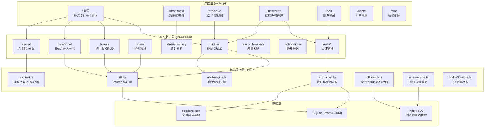
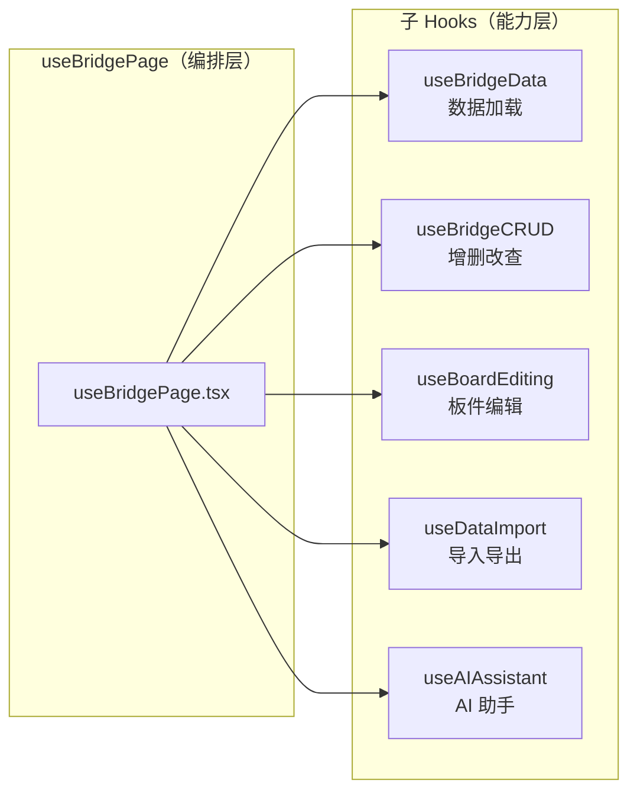
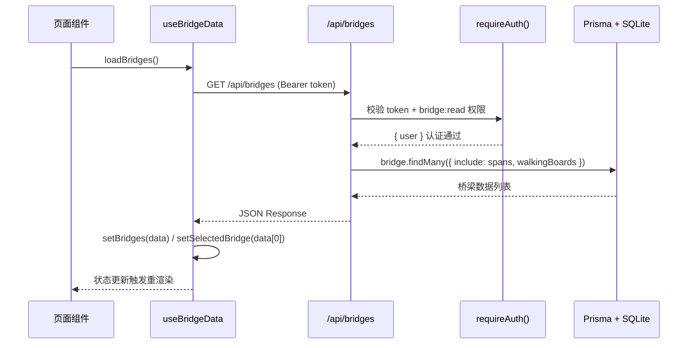

本页系统梳理**铁路明桥面步行板可视化管理系统**的完整目录结构与各模块职责，帮助你快速建立项目全貌认知。我们将从顶层目录出发，逐层深入到每个模块的核心职能，理解代码组织的逻辑关系。掌握目录结构是后续阅读源码、定位问题、扩展功能的基础前提。

## 顶层目录总览

项目根目录包含 **配置文件、数据定义、源代码和静态资源** 四大类内容，采用典型的 Next.js 项目布局：

```
bridge-board-system/
├── prisma/            # 数据库 Schema 定义与本地存储
├── public/            # 静态资源（图标、Logo）
├── src/               # 应用源代码（核心开发区域）
├── .env.example       # 环境变量模板
├── package.json       # 项目依赖与脚本
├── next.config.ts     # Next.js 框架配置
├── tailwind.config.ts # Tailwind CSS 配置
├── tsconfig.json      # TypeScript 编译配置
└── components.json    # shadcn/ui 组件配置
```

| 文件/目录 | 职责 | 重要程度 |
|---|---|---|
| `src/` | 全部业务源码，开发的绝对核心 | ⭐⭐⭐⭐⭐ |
| `prisma/schema.prisma` | 数据库模型定义，ORM 映射的起点 | ⭐⭐⭐⭐⭐ |
| `package.json` | 依赖声明与构建脚本 | ⭐⭐⭐⭐ |
| `next.config.ts` | Next.js 编译行为控制 | ⭐⭐⭐ |
| `public/` | 浏览器可直接访问的静态文件 | ⭐⭐ |

Sources: [package.json](package.json#L1-L102), [next.config.ts](next.config.ts#L1-L12)

## 整体架构关系图

在展开目录细节之前，先通过下图理解各层之间的调用关系。项目遵循 **"路由层 → API 层 → 服务层 → 数据层"** 的分层架构，数据从底层数据库逐层向上输送，最终呈现在页面组件中：



## src/app — 页面路由层

`src/app` 是 Next.js 的 **App Router** 目录，每个子目录对应一个可访问的页面路由。项目共有 **7 个页面路由** 和 **一套完整的 RESTful API**：

| 路由路径 | 对应目录 | 功能描述 |
|---|---|---|
| `/` | `page.tsx`（根目录） | **核心主界面**：桥梁选择、步行板 2D/3D 可视化、编辑操作、AI 助手，是系统功能最密集的页面（约 1900 行） |
| `/login` | `login/` | 用户登录页面，支持账户锁定倒计时、密码可见性切换 |
| `/dashboard` | `dashboard/` | 数据总览仪表盘，展示桥梁统计概览、饼图、柱状图、趋势分析 |
| `/bridge-3d` | `bridge-3d/` | 独立的 3D 桥梁全景视图页面，带步行板点击交互 |
| `/inspection` | `inspection/` | 巡检任务管理页面，创建、分配、追踪巡检任务 |
| `/users` | `users/` | 用户管理页面（仅管理员），增删改查用户、角色分配 |
| `/map` | `map/` | 桥梁地理分布地图视图 |

**根布局文件** [`layout.tsx`](src/app/layout.tsx#L1-L50) 是整个应用的骨架，它加载全局 CSS、配置字体（Geist Sans/Mono），并将所有子页面包裹在 `<Providers>` 组件中（提供主题切换和认证上下文）。

Sources: [layout.tsx](src/app/layout.tsx#L1-L50), [page.tsx](src/app/page.tsx#L1-L50), [dashboard/page.tsx](src/app/dashboard/page.tsx#L1-L60), [login/page.tsx](src/app/login/page.tsx#L1-L40), [bridge-3d/page.tsx](src/app/bridge-3d/page.tsx#L1-L40), [inspection/page.tsx](src/app/inspection/page.tsx#L1-L40), [users/page.tsx](src/app/users/page.tsx#L1-L40), [map/page.tsx](src/app/map/page.tsx#L1-L40)

## src/app/api — API 路由层

`src/app/api` 下存放所有 **Next.js Route Handler** 文件，每个 `route.ts` 导出标准的 `GET/POST/PUT/DELETE` 方法，构成系统的后端接口层。所有受保护的接口统一通过 `requireAuth()` 中间件完成认证和权限校验。

```
api/
├── auth/                  # 认证模块
│   ├── login/route.ts     # 用户登录（密码校验 + 会话创建）
│   ├── logout/route.ts    # 用户登出（会话销毁）
│   ├── me/route.ts        # 获取当前用户信息
│   └── change-password/   # 修改密码
├── bridges/route.ts       # 桥梁增删改查（含批量创建桥孔和步行板）
├── spans/route.ts         # 桥孔管理
├── boards/                # 步行板管理
│   ├── route.ts           # 步行板 CRUD + 快照保存
│   ├── photos/            # 步行板照片上传
│   └── snapshots/         # 历史快照查询
├── data/
│   ├── excel/route.ts     # Excel 批量导入导出（事务保护）
│   └── template/route.ts  # 下载导入模板
├── ai/
│   ├── chat/route.ts      # AI 对话（携带桥梁上下文）
│   ├── analyze/route.ts   # AI 安全分析报告
│   └── models/route.ts    # 获取可用 AI 模型列表
├── alert-rules/route.ts   # 预警规则管理
├── alerts/route.ts        # 预警记录查询与处理
├── notifications/route.ts # 站内通知推送
├── stats/route.ts         # 单桥统计数据
├── summary/route.ts       # 全局汇总统计
├── inspection/route.ts    # 巡检任务管理
├── logs/route.ts          # 操作日志查询
├── users/route.ts         # 用户管理接口
└── route.ts               # 健康检查（Hello World）
```

每个 API 路由的典型模式是：**解析请求 → 鉴权 → 业务逻辑 → 返回 JSON**。例如桥梁列表接口在 [`bridges/route.ts`](src/app/api/bridges/route.ts#L1-L40) 中先调用 `requireAuth(request, 'bridge:read')` 校验读取权限，再通过 Prisma 查询并返回嵌套了桥孔和步行板的完整桥梁数据。

Sources: [api/bridges/route.ts](src/app/api/bridges/route.ts#L1-L40), [api/data/excel/route.ts](src/app/api/data/excel/route.ts#L1-L30), [api/ai/chat/route.ts](src/app/api/ai/chat/route.ts#L1-L30)

## src/components — UI 组件层

组件层按功能域划分为 **5 个子目录**，遵循"业务组件 + 通用 UI 组件"的分离原则：

| 子目录 | 职责 | 关键文件 |
|---|---|---|
| `bridge/` | **桥梁业务组件**——系统最核心的组件集合 | `Bridge2DView.tsx`（2D 网格视图）、`EditBoardDialog.tsx`（单块编辑）、`BatchEditDialog.tsx`（批量编辑）、`ImportDialog.tsx`（数据导入）、`ReportDialog.tsx`（PDF 报告）、`NotificationBell.tsx`（通知铃铛）、`TrendAnalysis.tsx`（趋势图表）等 14 个组件 |
| `auth/` | **认证相关组件** | `AuthProvider.tsx`（认证上下文 + 路由守卫）、`ChangePasswordDialog.tsx`（修改密码弹窗） |
| `3d/` | **Three.js 3D 渲染组件** | `HomeBridge3D.tsx`（程序化桥梁模型渲染，约 1500 行，含 SimplexNoise 地形生成） |
| `user/` | **用户管理组件** | `UserManagementDialog.tsx`、`OperationLogDialog.tsx` |
| `ui/` | **shadcn/ui 通用组件库** | 50+ 个基础 UI 组件（Button、Dialog、Table、Tabs 等），由脚手架生成，非手写业务代码 |

**特别注意**：`Providers.tsx` 是应用级组件包装器，将 `ThemeProvider`（明暗主题）和 `AuthProvider`（认证上下文）嵌套组合，在 [`layout.tsx`](src/app/layout.tsx#L42-L47) 中作为全局 Provider 使用。

Sources: [Providers.tsx](src/components/Providers.tsx#L1-L14), [auth/AuthProvider.tsx](src/components/auth/AuthProvider.tsx#L1-L40), [3d/HomeBridge3D.tsx](src/components/3d/HomeBridge3D.tsx#L1-L40)

## src/hooks — 自定义 Hooks 层

自定义 Hooks 是本项目前端架构的**核心设计模式**，将页面组件中的复杂状态逻辑抽离为可复用、可组合的函数。主页面的 `useBridgePage` 通过组合调用其他 5 个子 Hook，实现了约 540 行的状态编排，使近 2000 行的主页面组件得以聚焦于渲染逻辑：

| Hook 文件 | 职责 | 导出核心能力 |
|---|---|---|
| `useBridgePage.tsx` | **页面级编排 Hook**，组合所有子 Hook | 统一导出认证状态、视图状态、移动端适配、虚拟滚动列表等，供主页面组件直接解构使用 |
| `useBridgeData.ts` | **桥梁数据加载与缓存** | `loadBridges()`、`loadStats()`、`loadSummary()`、`refreshAllData()` |
| `useBridgeCRUD.ts` | **桥梁/桥孔增删改查操作** | `handleCreateBridge()`、`handleEditBridge()`、`handleDeleteSpan()` 等 12 个操作函数 |
| `useBoardEditing.ts` | **步行板单块/批量编辑** | 编辑表单状态管理、`handleSaveBoard()`、`handleBatchUpdate()` |
| `useDataImport.ts` | **Excel 导入导出流程** | 文件选择、导入配置、模板下载、数据导出 |
| `useAIAssistant.ts` | **AI 对话与安全分析** | 对话消息管理、AI 配置、模型列表获取 |
| `useResponsive.ts` | **响应式设备检测与手势** | 移动端检测、屏幕方向、捏合缩放、网络状态监控 |



Sources: [useBridgePage.tsx](src/hooks/useBridgePage.tsx#L1-L60), [useBridgeData.ts](src/hooks/useBridgeData.ts#L1-L50), [useBridgeCRUD.ts](src/hooks/useBridgeCRUD.ts#L1-L60), [useBoardEditing.ts](src/hooks/useBoardEditing.ts#L1-L50), [useDataImport.ts](src/hooks/useDataImport.ts#L1-L50), [useAIAssistant.ts](src/hooks/useAIAssistant.ts#L1-L50), [useResponsive.ts](src/hooks/useResponsive.ts#L1-L50)

## src/lib — 核心服务层

`src/lib` 是后端业务逻辑和前端工具函数的聚集地，是连接 API 路由和数据库的关键桥梁层。这里的文件既运行在服务端（被 API 路由导入），也运行在客户端（被 Hooks 和组件导入）：

| 文件 | 运行环境 | 职责描述 |
|---|---|---|
| `db.ts` | 服务端 | Prisma 客户端单例，使用 `globalThis` 避免开发环境重复实例化 |
| `auth/index.ts` | 服务端 | 密码哈希（PBKDF2）、RBAC 权限配置（四级角色）、`requireAuth()` 统一鉴权中间件、操作日志记录 |
| `session-store.ts` | 服务端 | 基于 JSON 文件的会话存储（`prisma/db/sessions.json`），内存缓存 + 定时持久化写入 |
| `ai-client.ts` | 服务端 | 通用 AI 客户端，支持 GLM/OpenAI/Claude/DeepSeek/MiniMax/Kimi 6 个服务商的 OpenAI 兼容 API |
| `alert-engine.ts` | 服务端 | 预警规则引擎——步行板状态快照保存、条件评估（9 种操作符）、预警自动去重 |
| `offline-db.ts` | 客户端 | IndexedDB 封装，提供离线编辑记录存储和桥梁数据缓存 |
| `sync-service.ts` | 客户端 | 离线同步服务，网络恢复时自动将 IndexedDB 中的编辑记录推送到服务端 |
| `bridge3d-store.ts` | 客户端 | Zustand 状态管理，持久化 3D 渲染配置（材质、护栏样式、磨损参数等） |
| `bridge-constants.ts` | 双端 | 步行板状态配置（6 种状态的颜色/图标）、认证请求封装 `authFetch()`、角色标签映射 |
| `pdf-export.ts` | 客户端 | 基于 html2canvas + jsPDF 的 PDF 报告生成 |
| `utils.ts` | 双端 | Tailwind CSS 类名合并工具 `cn()` |
| `seed-alert-rules.ts` | 服务端 | 9 条内置预警规则种子数据定义 |

Sources: [db.ts](src/lib/db.ts#L1-L13), [auth/index.ts](src/lib/auth/index.ts#L1-L60), [session-store.ts](src/lib/session-store.ts#L1-L50), [ai-client.ts](src/lib/ai-client.ts#L1-L50), [alert-engine.ts](src/lib/alert-engine.ts#L1-L50), [offline-db.ts](src/lib/offline-db.ts#L1-L50), [sync-service.ts](src/lib/sync-service.ts#L1-L50), [bridge3d-store.ts](src/lib/bridge3d-store.ts#L1-L60), [bridge-constants.ts](src/lib/bridge-constants.ts#L1-L80), [seed-alert-rules.ts](src/lib/seed-alert-rules.ts#L1-L30)

## src/types — 类型定义层

`src/types/bridge.ts` 是整个前端共享的 **TypeScript 类型定义中心**，定义了系统全部核心业务类型：

| 类型名 | 用途 |
|---|---|
| `Bridge` / `BridgeSpan` / `WalkingBoard` | 三级核心数据模型：桥梁 → 桥孔 → 步行板 |
| `BridgeStats` / `BridgeSummary` / `OverallSummary` | 统计汇总类型（损坏率、高风险率等） |
| `AlertRecord` / `AlertSummary` | 预警记录与汇总 |
| `SnapshotTrendPoint` | 历史快照趋势数据点 |
| `ChatMessage` / `AIConfig` | AI 对话消息与多服务商配置 |
| `CurrentUser` / `NotificationItem` | 当前用户信息与站内通知 |
| `MobileTab` | 移动端底部导航栏标签类型 |

这些类型被 Hooks、组件、API 路由广泛引用，确保了前后端数据结构的一致性。

Sources: [bridge.ts](src/types/bridge.ts#L1-L190)

## prisma — 数据层

`prisma/` 目录管理数据库的所有事宜，使用 **SQLite + Prisma ORM** 方案：

| 文件/目录 | 职责 |
|---|---|
| `schema.prisma` | Prisma Schema 定义，包含 11 个数据模型（Bridge、BridgeSpan、WalkingBoard、User、AlertRule、AlertRecord、OperationLog、Notification、BoardSnapshot、BoardPhoto、InspectionTask） |
| `db/sessions.json` | 用户会话文件存储（运行时自动生成和维护） |
| `prisma/` | Prisma 迁移文件目录 |

[`schema.prisma`](prisma/schema.prisma#L1-L100) 采用 SQLite 作为数据库（轻量部署），定义了从 `Bridge` 到 `WalkingBoard` 的三级级联关系（`onDelete: Cascade`），以及用户、预警、巡检、通知等辅助模型。

Sources: [schema.prisma](prisma/schema.prisma#L1-L100)

## public — 静态资源

`public/` 存放浏览器可直接访问的静态文件，目前包含：

| 文件 | 用途 |
|---|---|
| `favicon.png` | 浏览器标签页图标 |
| `logo.jpg` / `logo.svg` | 系统品牌 Logo |
| `robots.txt` | 搜索引擎爬虫规则 |

Sources: [public/](public/)

## 数据流向总结

理解了各层职责后，一条典型的数据请求路径如下（以"加载桥梁列表"为例）：

1. **用户打开首页** → 浏览器加载 [`page.tsx`](src/app/page.tsx#L1-L50)
2. **组件初始化** → [`useBridgePage`](src/hooks/useBridgePage.tsx#L34) 调用 [`useBridgeData`](src/hooks/useBridgeData.ts#L38) 的 `loadBridges()`
3. **发起请求** → `loadBridges()` 通过 [`authFetch`](src/lib/bridge-constants.ts#L1-L20) 向 `/api/bridges` 发送 GET 请求
4. **API 鉴权** → [`bridges/route.ts`](src/app/api/bridges/route.ts#L14) 调用 [`requireAuth()`](src/lib/auth/index.ts#L88) 验证 token 和权限
5. **查询数据库** → 通过 [`db.ts`](src/lib/db.ts#L8) 的 Prisma 客户端查询 SQLite
6. **返回 JSON** → 嵌套了桥孔和步行板的完整桥梁数据
7. **状态更新** → `useBridgeData` 设置 `bridges` 和 `selectedBridge` 状态
8. **UI 渲染** → React 组件根据新状态重新渲染 2D/3D 视图



## 下一步阅读建议

掌握了目录结构后，建议按以下顺序深入了解各模块的内部实现：

1. **[技术栈总览：Next.js 16 + Prisma + Three.js](4-ji-zhu-zhan-zong-lan-next-js-16-prisma-three-js)** — 理解技术选型背后的逻辑
2. **[三级数据模型：桥梁 → 桥孔 → 步行板](6-san-ji-shu-ju-mo-xing-qiao-liang-qiao-kong-bu-xing-ban)** — 深入核心数据结构设计
3. **[自定义 Hooks 架构设计模式](14-zi-ding-yi-hooks-jia-gou-she-ji-mo-shi)** — 理解前端状态管理的核心模式
4. **[RESTful API 路由结构与设计规范](12-restful-api-lu-you-jie-gou-yu-she-ji-gui-fan)** — 理解后端接口的设计哲学