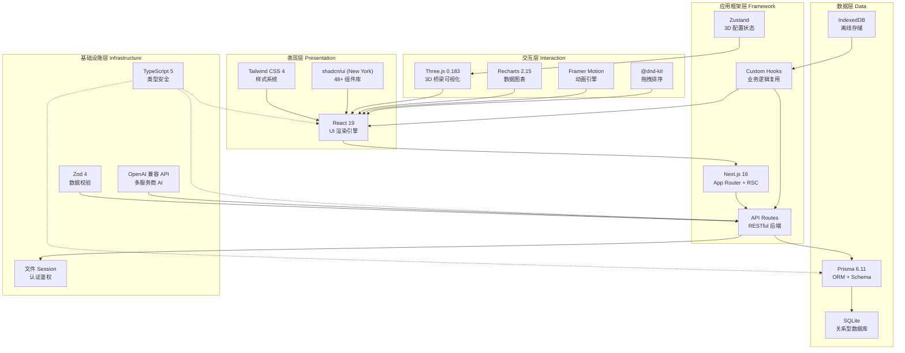
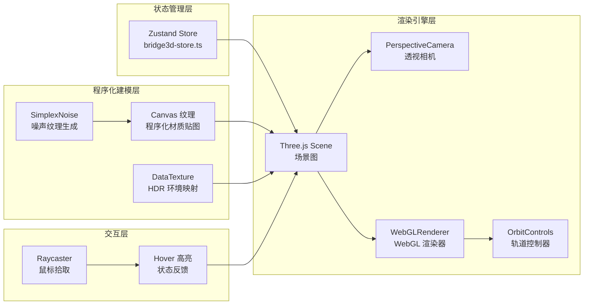
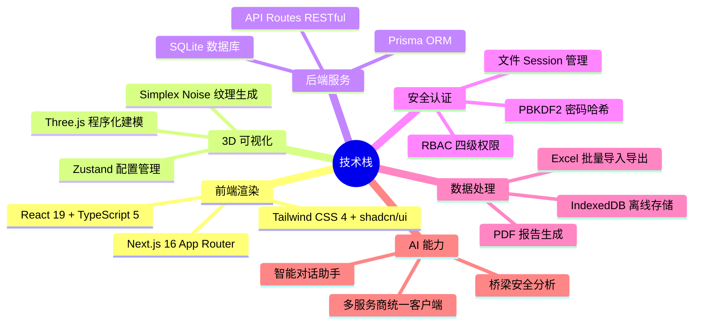

本文档从**宏观架构视角**出发，对铁路明桥面步行板可视管理系统所采用的全部技术选型进行系统梳理。你将了解每一项技术的**角色定位**、它们之间的**协作关系**，以及项目整体的技术分层架构。阅读完本页后，你将具备理解后续深度文档所需的全局技术语境。

Sources: [package.json](package.json#L1-L101), [next.config.ts](next.config.ts#L1-L11)

## 架构全景图

系统的技术架构可以划分为五个清晰的层级，每一层承担不同的职责，层与层之间通过明确的接口协作。下图展示了从前端渲染到数据持久化的完整技术栈分层：



Sources: [package.json](package.json#L15-L88), [tsconfig.json](tsconfig.json#L1-L42)

## 核心框架：Next.js 16 + React 19

**Next.js 16** 是整个系统的基础运行框架，基于 **React 19** 构建，采用 **App Router** 模式组织路由结构。系统的核心配置如下：

| 配置项 | 值 | 含义 |
|--------|-----|------|
| Next.js 版本 | `^16.1.1` | 最新一代全栈 React 框架 |
| React 版本 | `^19.0.0` | 支持 Server Components、Actions 等新特性 |
| TypeScript 目标 | `ES2017` | 编译目标版本，确保浏览器兼容性 |
| 模块解析 | `bundler` 模式 | 由 Next.js 内部 bundler 负责模块解析 |
| 路径别名 | `@/* → ./src/*` | 所有 `@/` 导入映射到 `src/` 目录 |
| React 严格模式 | 关闭 (`false`) | 当前未启用严格模式渲染 |
| TypeScript 构建检查 | 跳过 (`ignoreBuildErrors`) | 加速构建流程，类型错误不阻断构建 |

项目使用 **App Router** 的目录式路由约定，每个路由由 `page.tsx` 文件定义。服务端页面通过 `layout.tsx` 实现根布局，客户端组件通过 `'use client'` 指令标记。3D 渲染组件使用 `dynamic()` 导入并禁用 SSR，避免 Three.js 在服务端渲染时出错：

```typescript
// 动态导入 3D 组件（禁用 SSR）
const HomeBridge3D = dynamic(() => import('@/components/3d/HomeBridge3D'), {
  ssr: false,
  loading: () => <div>加载3D场景...</div>
})
```

这种模式确保 Three.js 的 WebGL 上下文仅在浏览器环境中初始化，是 3D 应用在 Next.js 中的标准做法。

Sources: [next.config.ts](next.config.ts#L1-L11), [tsconfig.json](tsconfig.json#L1-L42), [src/app/layout.tsx](src/app/layout.ts#L1-L49), [src/app/page.tsx](src/app/page.tsx#L129-L141)

## UI 系统：Tailwind CSS 4 + shadcn/ui

系统的视觉层由 **Tailwind CSS 4** 驱动，配合 **shadcn/ui (New York 风格)** 提供开箱即用的高质量组件。这种组合的核心优势是：所有组件代码直接存在于项目中（而非 npm 包），可以根据业务需求自由定制。

### 样式架构

项目采用 **CSS 变量 + HSL 色值** 的主题系统。通过 `globals.css` 中定义的 `:root` 变量层，所有颜色均以 CSS 自定义属性形式声明，Tailwind 通过 `hsl(var(--*))` 引用：

```css
/* 科技未来感主题变量 */
:root {
  --background: #0a0f1a;      /* 深色背景 */
  --foreground: #e2e8f0;      /* 浅色前景 */
  --primary: #00f0ff;         /* 青色主色 */
  --card: rgba(17, 24, 39, 0.8); /* 半透明卡片 */
}
```

系统支持**日夜双主题切换**，通过 `ThemeProvider` 组件管理 `theme-day` / `theme-night` CSS 类名切换。默认使用 `night`（深色科技风）主题，搭配 `#00f0ff` 青色主色调，营造专业的工业监控视觉氛围。

### 组件库规模

`src/components/ui/` 目录下包含 **48 个** shadcn/ui 组件文件，覆盖了系统所需的几乎所有 UI 元素。核心组件包括：

| 组件类别 | 代表组件 | 用途 |
|----------|----------|------|
| 布局容器 | `Card`, `Sheet`, `Tabs`, `ScrollArea` | 页面布局与内容组织 |
| 表单控件 | `Input`, `Select`, `Switch`, `Textarea`, `Checkbox` | 数据录入 |
| 反馈提示 | `Dialog`, `AlertDialog`, `Toast`, `Sonner`, `Tooltip` | 用户反馈与确认 |
| 数据展示 | `Table`, `Badge`, `Progress`, `Chart` | 数据可视化 |
| 导航交互 | `DropdownMenu`, `Command`, `NavigationMenu` | 菜单与导航 |

所有组件基于 **Radix UI** 原语构建（项目引入了 25 个 `@radix-ui/*` 包），确保无障碍访问（a11y）合规，并通过 `class-variance-authority` + `tailwind-merge` 实现 `cn()` 工具函数，优雅处理样式合并。

Sources: [tailwind.config.ts](tailwind.config.ts#L1-L64), [components.json](components.json#L1-L21), [src/app/globals.css](src/app/globals.css#L1-L44), [src/lib/utils.ts](src/lib/utils.ts#L1-L7), [src/components/ThemeProvider.tsx](src/components/ThemeProvider.tsx#L1-L49)

## 3D 可视化引擎：Three.js

**Three.js `^0.183.2`** 是系统最核心的可视化引擎，用于渲染铁路桥梁的程序化 3D 模型。3D 子系统的架构设计如下：

### 3D 架构分层



3D 配置通过 **Zustand** 状态管理库持久化到 `localStorage`，存储键名为 `bridge-3d-config`。配置项涵盖步行板参数（尺寸、数量）、材质类型（镀锌钢/防腐木/复合材料/铝合金）、渲染模式（照片级真实感/线框/安全检测）以及磨损参数（划痕/污渍/锈蚀等级）等完整场景参数。

### 程序化渲染特色

系统不加载外部 3D 模型文件，而是通过 **程序化建模** 实时生成桥梁几何体和纹理。核心实现包括：内置 **Simplex Noise** 噪声算法生成逼真的金属划痕与锈蚀纹理；使用 `THREE.DataTexture` 手动构建 HDR 环境贴图实现物理级光照反射；6 种步行板状态通过 `STATUS_COLORS` 映射为不同颜色的 3D 材质。

Sources: [src/components/3d/HomeBridge3D.tsx](src/components/3d/HomeBridge3D.tsx#L1-L165), [src/lib/bridge3d-store.ts](src/lib/bridge3d-store.ts#L1-L113)

## 数据持久化：Prisma + SQLite

数据层采用 **Prisma `^6.11.1`** 作为 ORM 框架，底层使用 **SQLite** 作为数据库引擎（零配置、文件级存储，非常适合单机部署场景）。

### 数据库连接模式

项目使用 **全局单例模式** 管理 PrismaClient 实例，避免在 Next.js 开发环境的热重载过程中创建过多数据库连接：

```typescript
const globalForPrisma = globalThis as unknown as {
  prisma: PrismaClient | undefined
}
export const db =
  globalForPrisma.prisma ??
  new PrismaClient({ log: ['query'] })
if (process.env.NODE_ENV !== 'production') globalForPrisma.prisma = db
```

数据库文件路径通过环境变量 `DATABASE_URL` 配置，默认指向 `file:./prisma/dev.db`。

### 数据模型概览

Prisma Schema 定义了 **11 个数据模型**，构成完整的数据体系：

| 模型 | 职责 | 关键关联 |
|------|------|----------|
| `Bridge` | 桥梁主记录 | → `BridgeSpan[]`, → `InspectionTask[]` |
| `BridgeSpan` | 桥孔信息 | → `Bridge`, → `WalkingBoard[]` |
| `WalkingBoard` | 步行板状态 | → `BridgeSpan`, → `BoardPhoto[]` |
| `BoardPhoto` | 步行板照片 | → `WalkingBoard` |
| `User` | 用户账户 | → `OperationLog[]`, → `Notification[]` |
| `OperationLog` | 操作审计日志 | → `User?` |
| `InspectionTask` | 巡检任务 | → `Bridge` |
| `BoardStatusSnapshot` | 状态快照 | 独立存储（无外键） |
| `AlertRule` | 预警规则 | → `AlertRecord[]` |
| `AlertRecord` | 告警记录 | → `AlertRule` |
| `Notification` | 站内通知 | → `User` |

数据模型间的核心关系链为：**Bridge → BridgeSpan → WalkingBoard → BoardPhoto**，实现了"桥梁—桥孔—步行板—照片"的四级层级结构。

Sources: [prisma/schema.prisma](prisma/schema.prisma#L1-L251), [src/lib/db.ts](src/lib/db.ts#L1-L13), [.env.example](.env.example#L1-L3)

## 状态管理与数据流

系统的状态管理采用了**分层策略**，不同类型的状态使用不同的管理方案：

| 状态类型 | 管理方案 | 典型场景 |
|----------|----------|----------|
| 全局认证状态 | React Context (`AuthProvider`) | 用户登录态、角色权限 |
| 主题状态 | React Context (`ThemeProvider`) | 日/夜主题切换 |
| 3D 场景配置 | Zustand + `localStorage` 持久化 | 材质、渲染模式、磨损参数 |
| 业务数据 | 自定义 Hooks (`useBridgeData` 等) | 桥梁列表、统计数据 |
| 离线编辑队列 | IndexedDB (`OfflineDB` 类) | 断网时的本地修改 |
| 表单状态 | react-hook-form + Zod | 编辑对话框的数据校验 |

`Providers` 组件作为根级包装器，将 `ThemeProvider` 和 `AuthProvider` 组合注入到整个组件树：

```typescript
export function Providers({ children }: { children: ReactNode }) {
  return (
    <ThemeProvider>
      <AuthProvider>{children}</AuthProvider>
    </ThemeProvider>
  )
}
```

Sources: [src/components/Providers.tsx](src/components/Providers.tsx#L1-L13), [src/lib/auth/context.tsx](src/lib/auth/context.tsx#L1-L159), [src/components/ThemeProvider.tsx](src/components/ThemeProvider.tsx#L1-L49), [src/hooks/useBridgeData.ts](src/hooks/useBridgeData.ts#L1-L28)

## 认证与安全体系

系统未使用 NextAuth.js（虽然 `package.json` 中存在该依赖），而是实现了**自定义的基于文件的 Session 会话管理**机制。安全体系由以下核心模块组成：

- **密码哈希**：使用 Node.js `crypto` 模块的 `pbkdf2Sync`，以 `sha512` 算法、10000 次迭代、16 字节随机盐值生成密码哈希
- **会话管理**：`session-store.ts` 提供基于内存/文件的 Token 会话创建、查询与删除
- **统一鉴权中间件**：`requireAuth()` 函数封装了"认证检查 + 权限校验"两步流程，被所有需要鉴权的 API 路由复用
- **RBAC 四级角色**：`admin`（系统管理员）、`manager`（桥梁管理者）、`user`（普通用户）、`viewer`（只读用户），每种角色对应不同的权限集合
- **操作审计**：`logOperation()` 函数记录所有关键操作的完整上下文（操作人、动作、前后值、IP 等）

Sources: [src/lib/auth/index.ts](src/lib/auth/index.ts#L1-L80), [src/lib/auth/context.tsx](src/lib/auth/context.tsx#L1-L159)

## API 架构与通信

后端基于 **Next.js API Routes** 构建 RESTful 风格的接口层。`src/app/api/` 目录下按资源划分了 **16 个 API 模块**：

| API 模块 | 路径 | 职责 |
|----------|------|------|
| 桥梁管理 | `/api/bridges` | 桥梁 CRUD |
| 桥孔管理 | `/api/spans` | 桥孔 CRUD |
| 步行板管理 | `/api/boards` | 步行板 CRUD + 快照 |
| 用户管理 | `/api/users` | 用户管理 |
| 认证鉴权 | `/api/auth/*` | 登录/登出/验证/改密 |
| 数据统计 | `/api/stats`, `/api/summary` | 统计汇总 |
| Excel 导入导出 | `/api/data/excel`, `/api/excel/export` | 批量数据处理 |
| PDF 导出 | `/api/export` | 报告生成 |
| AI 分析 | `/api/ai/chat`, `/api/ai/analyze` | AI 对话与桥梁分析 |
| 预警规则 | `/api/alert-rules` | 预警规则管理 |
| 告警记录 | `/api/alerts` | 告警查询 |
| 巡检任务 | `/api/inspection` | 任务管理 |
| 操作日志 | `/api/logs` | 审计日志查询 |
| 通知系统 | `/api/notifications` | 站内通知 |

前端通过 `authFetch` 工具函数（定义于 `bridge-constants.ts`）统一携带 Bearer Token 与后端通信，所有请求均经过 `requireAuth` 鉴权。

Sources: [src/app/api](src/app/api), [src/lib/auth/index.ts](src/lib/auth/index.ts#L68-L80)

## 离线支持与数据同步

系统实现了完整的**离线优先**架构，确保在网络不稳定的环境下（如野外桥梁巡检场景）仍可正常操作：

- **IndexedDB 本地存储**：`OfflineDB` 类封装了 IndexedDB 操作，维护 `edits`（离线编辑队列）和 `cache`（数据缓存）两个对象存储
- **自动同步服务**：`SyncService` 单例监听浏览器的 `online`/`offline` 事件，网络恢复时自动将离线编辑推送至后端 API
- **编辑队列管理**：每条离线编辑记录包含 `type`（board/bridge/span）、`action`（create/update/delete）、`data`（完整负载）和 `synced` 状态标记
- **定期清理**：已同步超过 7 天的编辑记录自动清理，避免存储膨胀

Sources: [src/lib/offline-db.ts](src/lib/offline-db.ts#L1-L200), [src/lib/sync-service.ts](src/lib/sync-service.ts#L1-L130)

## AI 集成能力

系统内置了**多服务商 AI 客户端**，基于 OpenAI 兼容的 Chat Completions API 协议，支持 6 个主流 AI 服务商及自定义接入：

| 服务商 | 默认 Base URL | 协议 |
|--------|---------------|------|
| 智谱 GLM | `open.bigmodel.cn/api/paas/v4` | OpenAI 兼容 |
| OpenAI | `api.openai.com/v1` | 原生 |
| Claude (Anthropic) | `api.anthropic.com/v1` | **专用 Messages API** |
| DeepSeek | `api.deepseek.com/v1` | OpenAI 兼容 |
| MiniMax | `api.minimax.chat/v1` | OpenAI 兼容 |
| Kimi (月之暗面) | `api.moonshot.cn/v1` | OpenAI 兼容 |

Claude 由于 API 协议不同，使用专用的 `callClaudeAPI` 函数处理，其他服务商统一走 `callOpenAICompatible` 通道。AI 能力应用于**桥梁安全分析**和**智能对话助手**两个场景。

Sources: [src/lib/ai-client.ts](src/lib/ai-client.ts#L1-L147)

## 辅助工具库一览

除了上述核心框架，项目还集成了大量辅助工具库，各司其职：

| 库 | 版本 | 职责 |
|----|------|------|
| `zod` | `^4.0.2` | 运行时数据校验（配合 react-hook-form） |
| `react-hook-form` | `^7.60.0` | 表单状态管理 |
| `@tanstack/react-table` | `^8.21.3` | 高性能表格渲染 |
| `@tanstack/react-virtual` | `^3.13.23` | 虚拟滚动（大数据量步行板列表） |
| `recharts` | `^2.15.4` | 数据趋势图表 |
| `xlsx` | `^0.18.5` | Excel 文件解析与生成 |
| `jspdf` + `html2canvas` | `^4.2.1` / `^1.4.1` | PDF 报告导出 |
| `framer-motion` | `^12.23.2` | 组件动画过渡 |
| `sonner` | `^2.0.6` | Toast 消息提示 |
| `lucide-react` | `^0.525.0` | 图标库（300+ 图标） |
| `date-fns` | `^4.1.0` | 日期格式化与计算 |
| `sharp` | `^0.34.3` | 服务端图片处理 |
| `uuid` | `^11.1.0` | 唯一标识符生成 |
| `cmdk` | `^1.1.1` | 命令面板组件 |
| `embla-carousel-react` | `^8.6.0` | 轮播组件 |
| `react-markdown` | `^10.1.0` | AI 回复 Markdown 渲染 |
| `react-syntax-highlighter` | `^15.6.1` | 代码语法高亮 |
| `@reactuses/core` | `^6.0.5` | 实用 Hooks 集合 |
| `vaul` | `^1.1.2` | 抽屉组件（移动端） |
| `react-resizable-panels` | `^3.0.3` | 可调整大小的面板布局 |

Sources: [package.json](package.json#L15-L88)

## 技术栈选型总结

下表从**解决的核心问题**角度，对整个技术栈进行一图总结：



## 下一步阅读建议

现在你已经对项目的技术栈有了全局认知，建议按照以下路径深入理解各技术层的具体实现：

1. **理解数据结构**：先阅读 [三级数据模型：桥梁 → 桥孔 → 步行板](6-san-ji-shu-ju-mo-xing-qiao-liang-qiao-kong-bu-xing-ban)，掌握数据层级关系
2. **深入 Schema**：然后阅读 [Prisma 数据库 Schema 设计（11 个模型）](7-prisma-shu-ju-ku-schema-she-ji-11-ge-mo-xing)，了解每个模型的字段设计
3. **类型体系**：接着阅读 [TypeScript 类型定义体系](8-typescript-lei-xing-ding-yi-ti-xi)，理解前后端类型契约
4. **认证机制**：再阅读 [基于文件的 Session 会话管理机制](9-ji-yu-wen-jian-de-session-hui-hua-guan-li-ji-zhi)，了解安全实现细节
5. **视觉核心**：最后阅读 [Three.js 程序化 3D 桥梁模型渲染](21-three-js-cheng-xu-hua-3d-qiao-liang-mo-xing-xuan-ran)，深入 3D 渲染实现