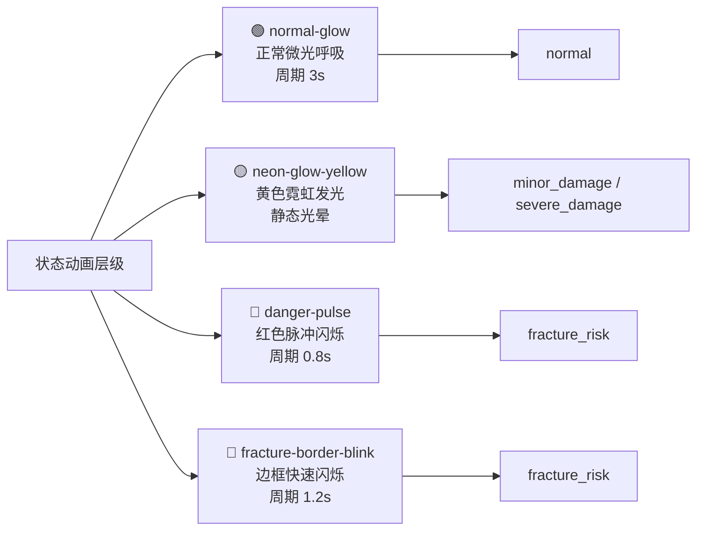
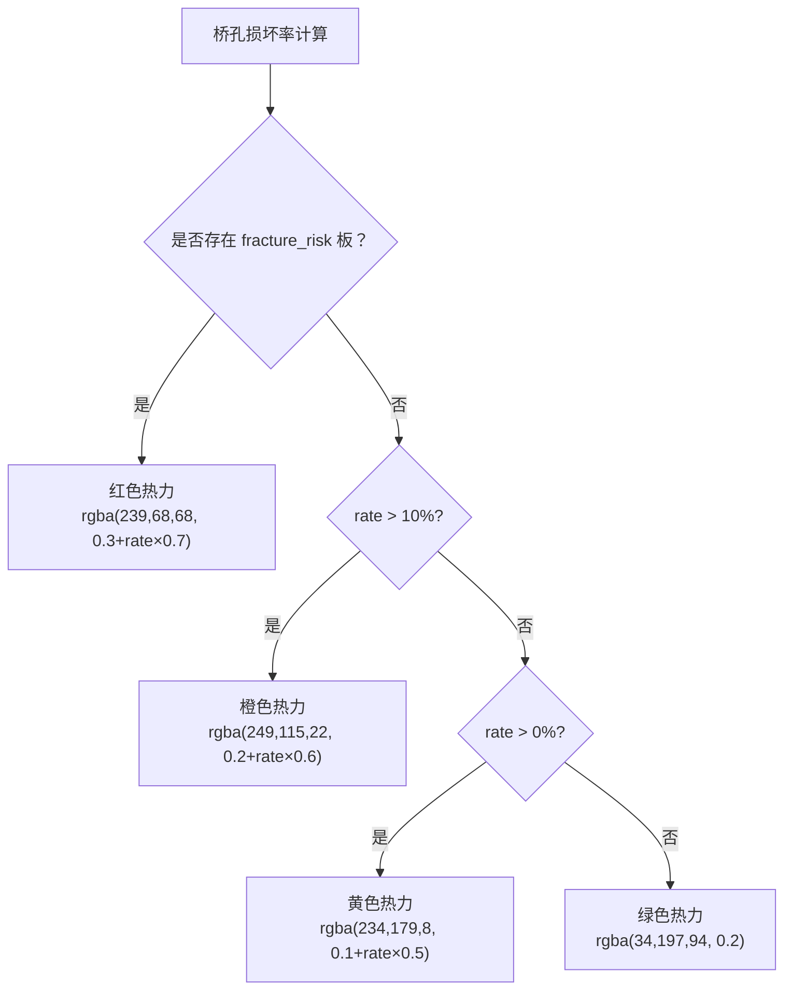
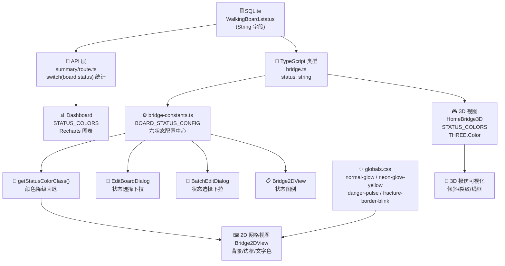

本文详细阐述铁路明桥面步行板可视化管理系统中步行板状态的完整定义——从数据库层面的六种状态枚举值，到前端展示层的颜色配置、CSS 动画特效、2D/3D 视图渲染规则，再到统计计算与风险过滤逻辑。理解这套状态-颜色映射体系是阅读后续所有业务逻辑文档的前提基础。

## 六种步行板状态定义

系统在 `Prisma Schema` 中为 `WalkingBoard` 模型的 `status` 字段定义了六种合法枚举值，默认值为 `normal`。这些值以纯字符串形式存储于 SQLite 数据库中，没有使用数据库级枚举约束，所有校验均在前端表单与 API 层完成。六种状态的完整定义如下表所示：

| 状态键值（status） | 中文标签 | 语义说明 | 数据库默认 |
|---|---|---|---|
| `normal` | 正常 | 步行板完好无损，可安全通行 | ✅ |
| `minor_damage` | 轻微损坏 | 表面有轻微划痕或磨损，不影响通行安全 | ❌ |
| `severe_damage` | 严重损坏 | 明显变形、开裂或大面积锈蚀，需关注 | ❌ |
| `fracture_risk` | 断裂风险 | 存在断裂可能，属于最高危险等级 | ❌ |
| `replaced` | 已更换 | 原步行板已拆除并替换为新板 | ❌ |
| `missing` | 缺失 | 步行板已被拆除或丢失，该位置无板 | ❌ |

Sources: [schema.prisma](prisma/schema.prisma#L53-L98)

前端对这六种状态进行了集中化配置管理，通过 `BOARD_STATUS_CONFIG` 常量统一定义每个状态的标签、颜色方案、图标和动画效果：

```typescript
// src/lib/bridge-constants.ts
export const BOARD_STATUS_CONFIG: Record<string, {
  label: string
  color: string
  bgColor: string
  borderColor: string
  icon: typeof CheckCircle
  glowClass: string
}> = {
  normal:        { label: '正常',     color: '#22c55e', bgColor: 'rgba(34, 197, 94, 0.2)',   ... },
  minor_damage:  { label: '轻微损坏', color: '#eab308', bgColor: 'rgba(234, 179, 8, 0.25)',  ... },
  severe_damage: { label: '严重损坏', color: '#f97316', bgColor: 'rgba(249, 115, 22, 0.2)',  ... },
  fracture_risk: { label: '断裂风险', color: '#ef4444', bgColor: 'rgba(239, 68, 68, 0.3)',   ... },
  replaced:      { label: '已更换',   color: '#3b82f6', bgColor: 'rgba(59, 130, 246, 0.2)',  ... },
  missing:       { label: '缺失',     color: '#6b7280', bgColor: 'rgba(107, 114, 128, 0.3)', ... },
}
```

Sources: [bridge-constants.ts](src/lib/bridge-constants.ts#L18-L74)

## 颜色编码体系与设计语义

系统采用**交通信号灯式**的颜色编码逻辑，遵循"绿 → 黄 → 橙 → 红"的直觉危险递增梯度，同时为"已更换"和"缺失"两种非损坏状态分配了独立的语义色彩。下表展示了每种状态的完整颜色参数：

| 状态 | 主色 | 背景色（bg） | 边框色（border） | Lucide 图标 | 设计语义 |
|---|---|---|---|---|---|
| **正常** | `#22c55e` 绿色 | `rgba(34,197,94,0.2)` | `rgba(34,197,94,0.5)` | `CheckCircle` | 安全通行，稳定状态 |
| **轻微损坏** | `#eab308` 黄色 | `rgba(234,179,8,0.25)` | `rgba(234,179,8,0.6)` | `AlertCircle` | 预警提示，需巡检关注 |
| **严重损坏** | `#f97316` 橙色 | `rgba(249,115,22,0.2)` | `rgba(249,115,22,0.5)` | `AlertTriangle` | 明显危险，需维修计划 |
| **断裂风险** | `#ef4444` 红色 | `rgba(239,68,68,0.3)` | `rgba(239,68,68,0.8)` | `XCircle` | 紧急危险，立即处理 |
| **已更换** | `#3b82f6` 蓝色 | `rgba(59,130,246,0.2)` | `rgba(59,130,246,0.5)` | `Wrench` | 维修完成，信息标记 |
| **缺失** | `#6b7280` 灰色 | `rgba(107,114,128,0.3)` | `rgba(107,114,128,0.6)` | `Minus` | 空缺位置，非损坏状态 |

这套颜色方案在系统中有一个核心的**降级规则**：当遇到未知状态值时，`getStatusColorClass` 函数会回退到 `normal` 配置作为默认值，确保任何异常数据都不会导致 UI 渲染崩溃。

```typescript
export function getStatusColorClass(status: string) {
  const config = BOARD_STATUS_CONFIG[status] || BOARD_STATUS_CONFIG.normal
  return { bg: config.bgColor, border: config.borderColor, color: config.color }
}
```

Sources: [bridge-constants.ts](src/lib/bridge-constants.ts#L139-L146)

## CSS 动画效果与视觉警示层级

状态不仅通过静态颜色传递信息，还通过 CSS 动画在视觉上体现**危险紧急程度**的差异。系统定义了四层动画效果，分别映射到不同严重级别的状态：



各动画的具体 CSS 实现如下：

**正常微光（normal-glow）**：3 秒周期的绿色柔和呼吸效果，`box-shadow` 在 5px 到 15px 之间缓动变化，传递"安全、稳定"的视觉感受。

**霓虹黄光（neon-glow-yellow）**：静态的黄色多层光晕，通过叠加 10px、20px、30px 三层 `box-shadow` 形成霓虹灯效果，用于 `minor_damage` 和 `severe_damage` 两种状态，表达"需要关注"的警示。

**危险脉冲（danger-pulse）**：0.8 秒快速周期的红色背景脉冲，背景透明度在 0.2 到 0.4 之间剧烈交替，`box-shadow` 强度同步变化。此效果专属于 `fracture_risk` 状态，制造紧急感的视觉冲击。

**断裂边框闪烁（fracture-border-blink）**：1.2 秒周期的红色边框明暗闪烁，边框透明度在 0.8 到 1.0 之间变化，配合 8px 到 20px 的发光范围扩展。此效果叠加在 `danger-pulse` 之上，为 `fracture_risk` 状态提供双重动画警示。

Sources: [globals.css](src/app/globals.css#L507-L551), [bridge-constants.ts](src/lib/bridge-constants.ts#L26-L73)

## 2D 网格视图中的状态渲染

2D 网格视图（`Bridge2DView` 组件）是步行板状态可视化的核心场景。每块步行板渲染为一个可点击的小方格按钮，通过 `getStatusColorClass` 获取背景色、边框色和文字色，同时根据状态应用不同的 CSS 类名和内联样式。

渲染逻辑遵循以下关键规则：

**高危过滤（highRiskFilter）**：当用户启用"仅显示高危"筛选时，系统仅保留 `severe_damage` 和 `fracture_risk` 两种状态的步行板，其余状态方格变为低透明度（`opacity-30`）的灰色占位，引导注意力聚焦于高风险区域。

**断裂风险专属样式**：`fracture_risk` 状态的步行板边框宽度为 3px（其余状态为 2px），并自动附加 `fracture-border-blink` CSS 类实现红色边框闪烁。其 `box-shadow` 使用内联样式实现 `0 0 12px rgba(239,68,68,0.5)` 的红色光晕。

**悬停信息卡片**：每块步行板绑定了 `HoverCard` 组件，延迟 200ms 显示详情气泡，包含位置标签、列号、板号、状态徽章（使用对应状态颜色）、检查人、检查时间和损坏描述。

**状态图例**：在整桥模式和单孔模式底部，系统遍历 `BOARD_STATUS_CONFIG` 所有条目渲染颜色图例，帮助用户建立颜色与状态的映射认知。

Sources: [Bridge2DView.tsx](src/components/bridge/Bridge2DView.tsx#L74-L134), [Bridge2DView.tsx](src/components/bridge/Bridge2DView.tsx#L493-L501)

## 3D 视图中的状态可视化

Three.js 3D 渲染模块（`HomeBridge3D` 组件）维护了一套独立的 `STATUS_COLORS` 映射，将状态键值转换为 `THREE.Color` 对象，用于 PBR 材质的颜色与自发光控制：

```typescript
const STATUS_COLORS: Record<string, THREE.Color> = {
  normal:        new THREE.Color(0x22c55e),
  minor_damage:  new THREE.Color(0xf59e0b),  // 注意：此处为 0xf59e0b
  severe_damage: new THREE.Color(0xf97316),
  fracture_risk: new THREE.Color(0xef4444),
  missing:       new THREE.Color(0x6b7280),
  replaced:      new THREE.Color(0x3b82f6)
}
```

3D 视图中状态差异不仅体现在颜色上，还通过**几何变形**和**附加装饰**来强化视觉表达：

| 状态 | 颜色覆盖 | 几何变形 | 附加装饰 |
|---|---|---|---|
| `normal` | 保持材质原色 | 无 | 板号标签（白色） |
| `minor_damage` | 状态色覆盖 + 自发光 | 无 | 板号标签（状态色） |
| `severe_damage` | 状态色覆盖 + 自发光 | 无 | 裂纹线段 + ⚠ 警告图标 |
| `fracture_risk` | 红色覆盖 + 高自发光 | `rotation.z = 0.05`（倾斜） | ⚠ 警告图标 |
| `replaced` | 蓝色覆盖 + 自发光 | 无 | 板号标签（蓝色） |
| `missing` | 灰色覆盖 | 半透明线框模式 | ⚠ 警告图标 |

对于 `missing` 状态，3D 模型会将材质设为透明线框模式（`opacity: 0.3, wireframe: true`），直观展示"此处无板"的空缺状态。对于 `fracture_risk` 状态，模型会施加微小旋转（`rotation.z = 0.05`），模拟板体倾斜松动效果。`severe_damage` 状态则通过随机生成的裂纹线段（`LineSegments`）模拟表面破损。

Sources: [HomeBridge3D.tsx](src/components/3d/HomeBridge3D.tsx#L85-L92), [HomeBridge3D.tsx](src/components/3d/HomeBridge3D.tsx#L564-L643)

## 风险热力图与损坏率计算

在整桥模式下的风险热力图中，系统为每个桥孔计算一个损坏率，并将其映射为热力颜色。热力图采用四级颜色梯度，直接复用状态主色的 RGBA 值：



**损坏率的计算公式**在 API 层定义，遵循以下规则：

- **分子**：`minorDamageBoards + severeDamageBoards + fractureRiskBoards`（三种损坏状态之和）
- **分母**：`totalBoards - replacedBoards - missingBoards`（排除已更换和缺失的有效板数）
- **高危率**：`fractureRiskBoards / effectiveBoards`
- **高危阈值**：`hasHighRisk = fractureRiskBoards > 0 || severeDamageBoards > 0`

当某个桥孔的损坏率超过 10% 时，系统会在该孔位上方叠加红色半透明遮罩并显示"损坏率 >10%"的警告标签。

Sources: [summary/route.ts](src/app/api/summary/route.ts#L86-L148), [Bridge2DView.tsx](src/components/bridge/Bridge2DView.tsx#L296-L345)

## 编辑对话框中的状态选择

单块编辑（`EditBoardDialog`）和批量编辑（`BatchEditDialog`）两个对话框均通过遍历 `BOARD_STATUS_CONFIG` 来动态渲染状态下拉选项，每个选项前方显示一个对应颜色的圆点，确保编辑操作中的颜色认知一致性。

单块编辑对话框中状态下拉是必填项，直接绑定到 `form.status`，所有六种状态均可选择。批量编辑对话框则增加了一个"保持不变"选项（`value="keep"`），允许用户在不改变原有状态的前提下修改其他属性。

Sources: [EditBoardDialog.tsx](src/components/bridge/EditBoardDialog.tsx#L66-L82), [BatchEditDialog.tsx](src/components/bridge/BatchEditDialog.tsx#L59-L80)

## 仪表盘图表中的颜色一致性

数据总览仪表盘（Dashboard）维护了独立的 `STATUS_COLORS` 常量用于 Recharts 图表渲染，其颜色值与 `BOARD_STATUS_CONFIG` 完全一致：

```typescript
const STATUS_COLORS: Record<string, { label: string; color: string; chartColor: string }> = {
  normal:        { label: '正常',     color: '#22c55e', chartColor: '#22c55e' },
  minor_damage:  { label: '轻微损坏', color: '#eab308', chartColor: '#eab308' },
  severe_damage: { label: '严重损坏', color: '#f97316', chartColor: '#f97316' },
  fracture_risk: { label: '断裂风险', color: '#ef4444', chartColor: '#ef4444' },
  replaced:      { label: '已更换',   color: '#3b82f6', chartColor: '#3b82f6' },
  missing:       { label: '缺失',     color: '#6b7280', chartColor: '#6b7280' }
}
```

饼图（`PieChart`）和柱状图（`BarChart`）均使用这些颜色作为 `Cell` 的 `fill` 值，保证 2D 视图、3D 视图和统计图表之间的颜色语义完全统一。

Sources: [dashboard/page.tsx](src/app/dashboard/page.tsx#L98-L105)

## 附属状态枚举体系

除核心的步行板状态外，系统还为步行板的附属设施定义了独立的子状态枚举，这些枚举同样集中在 `bridge-constants.ts` 中管理：

**栏杆状态（RAILING_STATUS_OPTIONS）**：

| 值 | 标签 | 说明 |
|---|---|---|
| `normal` | 正常 | 无损坏 |
| `loose` | 松动 | 固定件松动 |
| `damaged` | 损坏 | 变形或断裂 |
| `missing` | 缺失 | 已拆除或丢失 |

**托架状态（BRACKET_STATUS_OPTIONS）**：

| 值 | 标签 | 说明 |
|---|---|---|
| `normal` | 正常 | 无问题 |
| `loose` | 松动 | 螺栓松动 |
| `damaged` | 损坏 | 变形开裂 |
| `corrosion` | 锈蚀 | 严重锈蚀 |
| `missing` | 缺失 | 已拆除 |

这些附属状态目前在 UI 中仅通过表单下拉选择和悬停卡片文字描述展示，未关联独立的颜色编码，但它们与核心步行板状态共同构成完整的巡检数据模型。

Sources: [bridge-constants.ts](src/lib/bridge-constants.ts#L77-L91)

## 架构总结：状态数据的流转路径



这套状态体系的核心设计原则是**单一数据源**——`BOARD_STATUS_CONFIG` 作为唯一的配置中心，通过 `getStatusColorClass` 工具函数和直接遍历两种方式，将颜色方案分发到 2D 视图、编辑对话框和图例等所有需要状态可视化的 UI 组件。3D 视图和仪表盘因技术栈差异（Three.js Color / Recharts）维护了独立的颜色映射，但确保了十六进制色值的一致性。

---

**下一步阅读建议**：理解了状态编码体系后，建议按以下顺序深入：
- [三级数据模型：桥梁 → 桥孔 → 步行板](6-san-ji-shu-ju-mo-xing-qiao-liang-qiao-kong-bu-xing-ban) — 了解状态字段在数据模型中的位置
- [步行板单块编辑与批量操作流程](15-bu-xing-ban-dan-kuai-bian-ji-yu-pi-liang-cao-zuo-liu-cheng) — 状态变更的交互流程
- [2D 网格视图与整桥模式](22-2d-wang-ge-shi-tu-yu-zheng-qiao-mo-shi) — 状态在视图层的完整渲染逻辑