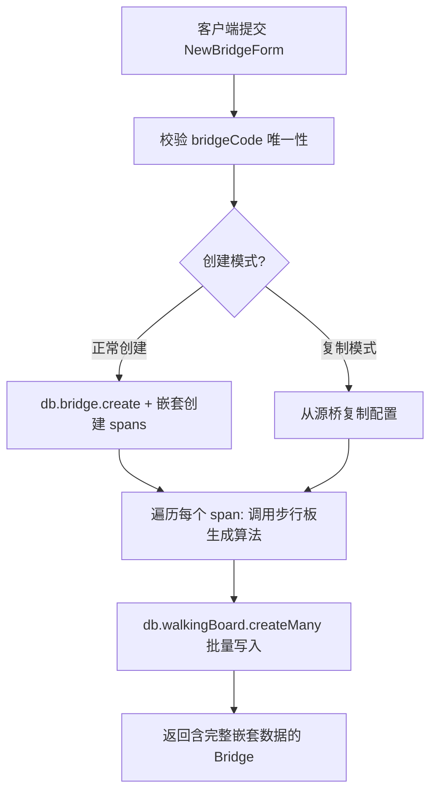

本文深入解析铁路明桥面步行板可视化管理系统中最核心的数据架构——**三级层次化数据模型**。该模型以物理桥梁结构为蓝本，将业务实体严格映射为 Bridge → BridgeSpan → WalkingBoard 三层嵌套关系，通过 Prisma ORM 的级联删除、事务保护和自动步行板生成机制，实现从宏观桥梁管理到微观步行板状态追踪的全链路数据一致性。理解这三级模型的字段语义、关联约束和生成逻辑，是掌握整个系统 API 设计、Hook 状态管理和可视化渲染的先决条件。

Sources: [schema.prisma](prisma/schema.prisma#L1-L98), [bridge.ts](src/types/bridge.ts#L1-L52)

## 模型全景：实体关系与层次结构

系统使用 SQLite 作为持久化存储，通过 Prisma Client 访问数据库。数据库实例以单例模式创建并挂载到 `globalThis` 上，避免 Next.js 开发模式下的重复初始化问题。三级核心模型之间构成严格的 **一对多聚合关系**：一座 Bridge 拥有多个 BridgeSpan，一个 BridgeSpan 拥有多个 WalkingBoard。所有外键关联均配置 `onDelete: Cascade`，意味着删除父级实体时子级数据自动清除，这在业务上对应"删除桥梁即清除其全部孔位和步行板数据"的预期行为。

Sources: [db.ts](src/lib/db.ts#L1-L13), [schema.prisma](prisma/schema.prisma#L14-L98)

下面的 Mermaid 图展示了三级模型的核心字段、关联关系以及辅助实体（BoardPhoto、BoardStatusSnapshot）的连接方式：

```mermaid
erDiagram
    Bridge ||--o{ BridgeSpan : "1:N spans"
    Bridge ||--o{ InspectionTask : "1:N tasks"
    BridgeSpan ||--o{ WalkingBoard : "1:N boards"
    WalkingBoard ||--o{ BoardPhoto : "1:N photos"
    WalkingBoard ..> BoardStatusSnapshot : "快照引用(boardId)"

    Bridge {
        String id PK "cuid()"
        String name "桥梁名称"
        String bridgeCode UK "桥梁编号(唯一)"
        String location "桥梁位置"
        Int totalSpans "总孔数"
        String lineName "线路名称"
        DateTime createdAt "创建时间"
        DateTime updatedAt "更新时间"
    }

    BridgeSpan {
        String id PK "cuid()"
        String bridgeId FK "所属桥梁"
        Int spanNumber "孔号(第几孔)"
        Float spanLength "孔长度(米)"
        Int upstreamBoards "上行步行板数量"
        Int downstreamBoards "下行步行板数量"
        Int upstreamColumns "上行列数(default:1)"
        Int downstreamColumns "下行列数(default:1)"
        String shelterSide "避车台(none/single/double)"
        Int shelterBoards "避车台板数/侧"
        String boardMaterial "材质类型"
    }

    WalkingBoard {
        String id PK "cuid()"
        String spanId FK "所属桥孔"
        Int boardNumber "板编号(第几块)"
        String position "位置(upstream/downstream/shelter_left/shelter_right)"
        Int columnIndex "列号"
        String status "状态(normal/minor_damage/severe_damage/fracture_risk/missing/replaced)"
        String damageDesc "损坏描述"
        Int antiSlipLevel "防滑等级0-100"
        String connectionStatus "连接状态"
        String railingStatus "栏杆状态"
        String bracketStatus "托架状态"
        Float boardLength "板长(cm)"
        Float boardWidth "板宽(cm)"
        Float boardThickness "板厚(cm)"
    }
```

**图中补充说明**：`BoardStatusSnapshot` 通过 `boardId` 字段关联 WalkingBoard，但**不使用外键约束**（注释明确标注"无外键，避免级联删除"），这是刻意的设计——即使步行板被删除，其历史状态快照仍需保留以供趋势分析和审计追溯。

Sources: [schema.prisma](prisma/schema.prisma#L166-L195)

## 第一级：Bridge（桥梁）—— 聚合根与身份锚点

Bridge 是整个聚合的根实体，承载桥梁的**身份标识和基本属性**。其 `bridgeCode` 字段设置 `@unique` 约束，作为业务层面的自然键，确保每座桥梁在系统内有唯一编号。`totalSpans` 字段冗余存储总孔数——虽然可以通过关联的 `spans` 数组长度动态计算，但显式存储简化了查询逻辑，同时在孔位增删操作中由后端事务自动维护其一致性。

| 字段 | 类型 | 约束 | 语义说明 |
|------|------|------|----------|
| `id` | String | `@id @default(cuid())` | Prisma 自动生成的唯一标识符 |
| `name` | String | 必填 | 桥梁的人类可读名称，如"京广线K102+500桥" |
| `bridgeCode` | String | `@unique` | 业务编号，创建时校验唯一性 |
| `location` | String? | 可空 | 桥梁地理位置描述 |
| `totalSpans` | Int | 必填 | 冗余存储的总孔数，增删孔位时由事务更新 |
| `lineName` | String? | 可空 | 所属铁路线路名称 |

TypeScript 前端类型定义与 Prisma Schema 精确对齐，通过 `spans: BridgeSpan[]` 嵌套体现层次关系，使得一次 API 调用即可获取完整的桥梁聚合数据。

Sources: [schema.prisma](prisma/schema.prisma#L14-L25), [bridge.ts](src/types/bridge.ts#L44-L52)

## 第二级：BridgeSpan（桥孔）—— 结构分区与配置单元

BridgeSpan 是连接桥梁和步行板的中间层，它的核心职责是**定义单个桥孔的物理参数和步行板生成规则**。每个桥孔通过 `bridgeId` 外键关联到所属桥梁，`spanNumber` 字段标识该孔在桥梁中的顺序位置（第 1 孔、第 2 孔……）。后端在增删孔位时使用事务进行**孔号重排**：添加新孔位时，先递增后续孔位的编号再插入；删除孔位时，先删除再递减后续编号，确保孔号始终连续且从 1 开始。

Sources: [spans/route.ts](src/app/api/spans/route.ts#L249-L260), [spans/route.ts](src/app/api/spans/route.ts#L362-L384)

### 步行板布局配置

BridgeSpan 通过以下字段精确控制步行板的生成方式：

| 字段 | 默认值 | 说明 |
|------|--------|------|
| `upstreamBoards` / `downstreamBoards` | — | 上行/下行方向的步行板总数 |
| `upstreamColumns` / `downstreamColumns` | 1 | 上行/下行方向的列数（支持多列并排） |
| `shelterSide` | `"none"` | 避车台配置：`none`（无）、`single`（单侧）、`double`（双侧） |
| `shelterBoards` | 0 | 每侧避车台的步行板数量 |
| `boardMaterial` | `"galvanized_steel"` | 步行板材质，影响 3D 渲染外观 |

**多列分配算法**：步行板按列均分，公式为 `boardsPerColumn = Math.ceil(totalBoards / totalColumns)`，超出总数时自动截断。例如 10 块板分配到 3 列，结果为 4+3+3 的布局。这一逻辑在 `generateWalkingBoards` 辅助函数中统一实现，被桥梁创建、孔位新增和孔位编辑三个场景复用。

Sources: [spans/route.ts](src/app/api/spans/route.ts#L6-L78), [bridge-constants.ts](src/lib/bridge-constants.ts#L93-L106)

## 第三级：WalkingBoard（步行板）—— 状态追踪的最小单元

WalkingBoard 是三级模型中的**叶子实体**，承载所有巡检业务的状态数据。每块步行板通过 `spanId` 外键关联到所属桥孔，通过 `position` 字段标识其物理位置（上行 `upstream`、下行 `downstream`、左侧避车台 `shelter_left`、右侧避车台 `shelter_right`），`columnIndex` 标识所属列号，`boardNumber` 标识在该位置/列中的序号。

### 状态维度矩阵

WalkingBoard 的状态被划分为**五个维度**，每个维度独立评估：

| 维度 | 关键字段 | 可选值 |
|------|----------|--------|
| **主体状态** | `status` | `normal` / `minor_damage` / `severe_damage` / `fracture_risk` / `replaced` / `missing` |
| **防滑性能** | `antiSlipLevel` (0-100) | 数值型，100 为最佳 |
| **连接状态** | `connectionStatus` | `normal` / `loose` / `gap_large` |
| **环境因素** | `weatherCondition` + `visibility` | `normal` / `rain` / `snow` / `fog` / `ice` + 能见度 0-100 |
| **附属设施** | `railingStatus` + `bracketStatus` | 栏杆和托架各自的状态枚举 |

此外还有**杂物积水**（`hasObstacle` / `hasWaterAccum`）和**独立尺寸**（`boardLength` / `boardWidth` / `boardThickness`，可为 null 表示使用全局默认值）等扩展字段。这种多维状态设计为后续的预警规则引擎提供了丰富的评估维度。

Sources: [schema.prisma](prisma/schema.prisma#L53-L98), [bridge-constants.ts](src/lib/bridge-constants.ts#L18-L74)

## 数据加载：全量嵌套查询策略

系统采用**全量嵌套加载**策略获取三级聚合数据。GET `/api/bridges` 端点一次性返回所有桥梁及其嵌套的孔位和步行板：

```
Bridge[]
  └─ spans: BridgeSpan[] (orderBy: spanNumber ASC)
       └─ walkingBoards: WalkingBoard[] (orderBy: position ASC, columnIndex ASC, boardNumber ASC)
```

GET `/api/boards?bridgeId=xxx` 端点则返回**单座桥梁的完整聚合**（同样三级嵌套），用于选中桥梁后的详细视图刷新。步行板的排序规则——先按位置、再按列号、最后按板号——保证了前端网格视图中步行板的渲染顺序与物理布局一致。

前端 `useBridgeData` Hook 在初始加载时并行调用 `/api/bridges` 和 `/api/summary`，选桥后自动触发 `/api/stats` 统计加载。`refreshAllData` 方法在导入、创建等操作后执行全量刷新，确保客户端状态与服务器端同步。

Sources: [bridges/route.ts](src/app/api/bridges/route.ts#L6-L26), [boards/route.ts](src/app/api/boards/route.ts#L13-L51), [useBridgeData.ts](src/hooks/useBridgeData.ts#L40-L60)

## 实体生命周期：创建、编辑与级联删除

### 桥梁创建与步行板自动生成

创建桥梁时，客户端通过 `useBridgeCRUD` 的 `NewBridgeForm` 提交桥梁基本信息和**孔位模板参数**（默认孔长、默认上下行板数等），后端在单个事务中完成：



**避车台周期性配置**是创建流程的亮点：`shelterEvery` 参数控制每隔几孔设置避车台（如 `shelterEvery: 2` 表示第 2、4、6…孔设置避车台），通过 `spanNumber % shelterEvery === 0` 判定。

Sources: [useBridgeCRUD.ts](src/hooks/useBridgeCRUD.ts#L153-L206), [bridges/route.ts](src/app/api/bridges/route.ts#L28-L246)

### 孔位编辑与步行板重生成

孔位编辑（`PUT /api/spans`）实现了**智能重生成检测**：当影响步行板数量的字段（`upstreamBoards`、`downstreamBoards`、`upstreamColumns`、`downstreamColumns`、`shelterSide`、`shelterBoards`）发生变化时，后端自动在事务中先删除旧步行板、再按新配置重新生成。前端也可通过 `forceRegenerate` 参数强制重生成。不涉及板数变化的编辑（如仅修改 `spanLength`）则不会触碰步行板数据。

Sources: [spans/route.ts](src/app/api/spans/route.ts#L80-L200)

### 级联删除保护

删除操作依赖 Prisma Schema 中声明的 `onDelete: Cascade` 链：删除 Bridge → 自动删除所有 BridgeSpan → 自动删除所有 WalkingBoard → 自动删除所有 BoardPhoto。但 `BoardStatusSnapshot` 故意不设外键约束，因此历史快照在步行板被删除后仍然保留。前端 `useBridgeCRUD` 中的 `handleDeleteSpan` 额外增加了**最小孔数保护**（至少保留一个孔位），防止误删导致数据不完整。

Sources: [schema.prisma](prisma/schema.prisma#L48), [useBridgeCRUD.ts](src/hooks/useBridgeCRUD.ts#L449-L456)

## 统计聚合：三级数据到业务指标的映射

`GET /api/stats` 端点从三级嵌套数据中**实时计算**业务指标。它遍历 Bridge → Span → Board 的全量数据，按孔位和整体两个维度汇总六种状态的步行板数量，并计算**损坏率**（`minor_damage + severe_damage + fracture_risk` 占有效板数的百分比）和**高风险率**（仅 `fracture_risk` 占有效板数的百分比）。其中"有效板数"排除了 `replaced` 和 `missing` 状态，因为这两种状态不代表实际损坏风险。TypeScript 类型 `BridgeStats` 精确定义了这一统计结构，包含 `spanStats` 子数组实现孔位级别的下钻分析。

Sources: [stats/route.ts](src/app/api/stats/route.ts#L1-L139), [bridge.ts](src/types/bridge.ts#L54-L81)

## 前端类型体系：从 Prisma Schema 到 TypeScript Interface

前端类型定义在 [bridge.ts](src/types/bridge.ts) 中，三个核心接口 `Bridge`、`BridgeSpan`、`WalkingBoard` 与 Prisma 模型字段一一对应，但省略了 `createdAt`/`updatedAt` 等 Prisma 内部字段（API 响应中仍包含但前端不消费）。嵌套关系通过接口属性直接表达：`Bridge.spans: BridgeSpan[]`、`BridgeSpan.walkingBoards: WalkingBoard[]`。

此外还定义了多个**派生类型**用于不同场景：`BridgeSummary` 为桥梁列表提供摘要视图（含统计指标），`OverallSummary` 为仪表盘提供全局汇总，`SnapshotTrendPoint` 为趋势图提供时序数据点。这些类型不直接映射数据库模型，而是 API 计算后的聚合结果。

Sources: [bridge.ts](src/types/bridge.ts#L1-L116)

## 离线支持中的模型投影

在离线场景下，三级模型的编辑操作被抽象为 `OfflineEdit` 记录，存储到 IndexedDB 中。该记录通过 `type` 字段（`'board' | 'span' | 'bridge'`）和 `action` 字段（`'create' | 'update' | 'delete'`）标识操作类型，`data` 字段以通用 `Record<string, unknown>` 承载操作载荷。这种设计将三级模型的操作统一为单一编辑记录格式，简化了离线同步逻辑——同步服务只需按时间戳顺序回放编辑记录即可。

Sources: [offline-db.ts](src/lib/offline-db.ts#L7-L14)

## 延伸阅读

- 了解全部 11 个 Prisma 模型的完整定义和关联关系，参见 [Prisma 数据库 Schema 设计（11 个模型）](7-prisma-shu-ju-ku-schema-she-ji-11-ge-mo-xing)
- 了解 TypeScript 类型定义与 Prisma Schema 的映射细节，参见 [TypeScript 类型定义体系](8-typescript-lei-xing-ding-yi-ti-xi)
- 了解步行板状态颜色编码和渲染规则，参见 [步行板状态体系与颜色编码规范](5-bu-xing-ban-zhuang-tai-ti-xi-yu-yan-se-bian-ma-gui-fan)
- 了解步行板编辑的交互流程和批量操作，参见 [步行板单块编辑与批量操作流程](15-bu-xing-ban-dan-kuai-bian-ji-yu-pi-liang-cao-zuo-liu-cheng)