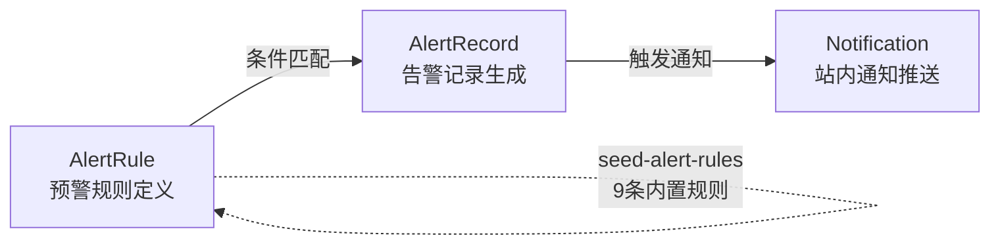

本页深入解析 `prisma/schema.prisma` 中定义的 11 个数据模型——从底层的 ORM 配置到模型间的级联关系，再到每个字段的设计意图。阅读本文后，你将清晰理解整个系统的数据骨架如何支撑桥梁巡检、预警引擎、用户管理等核心业务流程。在继续之前，建议先阅读 [三级数据模型：桥梁 → 桥孔 → 步行板](6-san-ji-shu-ju-mo-xing-qiao-liang-qiao-kong-bu-xing-ban) 以建立业务领域的上下文认知。

Sources: [schema.prisma](prisma/schema.prisma#L1-L251)

## 全局配置：SQLite + Prisma Client

项目选用 **SQLite** 作为数据库引擎，通过 `DATABASE_URL` 环境变量指定数据库文件路径。这一选择降低了部署门槛——无需独立的数据库服务，单个文件即可承载全部数据。Prisma Client 作为 ORM 层自动生成类型安全的查询 API，在开发模式下启用 `log: ['query']` 输出 SQL 日志便于调试。

```prisma
generator client {
  provider = "prisma-client-js"
}

datasource db {
  provider = "sqlite"
  url      = env("DATABASE_URL")   // 例：file:./prisma/dev.db
}
```

数据库连接采用**全局单例模式**：在开发环境下将 `PrismaClient` 实例挂载到 `globalThis`，避免 Next.js 热重载时反复创建连接导致连接池耗尽。

Sources: [schema.prisma](prisma/schema.prisma#L4-L11), [db.ts](src/lib/db.ts#L1-L13), [.env.example](.env.example#L1-L3)

## 11 个模型总览与分层架构

11 个模型可按职责分为 **四个层次**，各层之间通过外键或冗余字段建立关联：

| 层次 | 模型 | 核心职责 |
|------|------|----------|
| **核心业务层** | `Bridge`、`BridgeSpan`、`WalkingBoard` | 三级实体：桥梁 → 桥孔 → 步行板 |
| **数据附件层** | `BoardPhoto`、`BoardStatusSnapshot` | 步行板照片与历史状态快照 |
| **用户与审计层** | `User`、`OperationLog` | 用户账户与全量操作审计 |
| **预警与通知层** | `AlertRule`、`AlertRecord`、`Notification`、`InspectionTask` | 规则引擎、告警记录、站内通知、巡检任务 |

下面的 ER 图展示了全部 11 个模型之间的关系拓扑。实线箭头表示 Prisma 外键关联（`@relation`），虚线箭头表示逻辑引用（无外键约束）。**Cascade** 标签代表级联删除，**SetNull** 代表置空处理。

```mermaid
erDiagram
    Bridge ||--o{ BridgeSpan : "spans (Cascade)"
    Bridge ||--o{ InspectionTask : "inspectionTasks (Cascade)"
    BridgeSpan ||--o{ WalkingBoard : "walkingBoards (Cascade)"
    WalkingBoard ||--o{ BoardPhoto : "photos (Cascade)"

    User ||--o{ OperationLog : "operations (SetNull)"
    User ||--o{ Notification : "notifications (Cascade)"

    AlertRule ||--o{ AlertRecord : "alertRecords"

    BoardStatusSnapshot ..> WalkingBoard : "boardId (逻辑引用)"
    BoardStatusSnapshot ..> BridgeSpan : "spanId (冗余)"
    BoardStatusSnapshot ..> Bridge : "bridgeId (冗余)"

    AlertRecord ..> Bridge : "bridgeId"
    AlertRecord ..> Notification : "relatedId (触发通知)"
```

> **前置说明**：Mermaid ER 图是 Prisma Schema 的可视化表达，箭头方向从"一"端指向"多"端，连线上的标注表示 Prisma 的删除策略。

Sources: [schema.prisma](prisma/schema.prisma#L13-L251)

## 核心业务层：Bridge → BridgeSpan → WalkingBoard

### Bridge（桥梁）

`Bridge` 是整个三级数据的顶层实体，每座桥梁通过 `bridgeCode` 唯一标识，`totalSpans` 记录桥孔总数。`name` 和 `location` 提供人类可读的标识信息，`lineName` 标注所属铁路线路。

| 字段 | 类型 | 约束 | 说明 |
|------|------|------|------|
| `id` | `String` | `@id @default(cuid())` | 主键，自动生成 CUID |
| `name` | `String` | — | 桥梁名称 |
| `bridgeCode` | `String` | `@unique` | 桥梁编号，全局唯一 |
| `location` | `String?` | 可选 | 桥梁位置 |
| `totalSpans` | `Int` | — | 总孔数 |
| `lineName` | `String?` | 可选 | 线路名称 |
| `createdAt` | `DateTime` | `@default(now())` | 创建时间 |
| `updatedAt` | `DateTime` | `@updatedAt` | 自动更新时间 |

**关键设计决策**：`totalSpans` 虽然可以通过 `BridgeSpan` 的数量计算得出，但作为冗余字段直接存储在 `Bridge` 上，避免了每次查询时的 `COUNT` 聚合操作，属于经典的**读优化反范式设计**。

Sources: [schema.prisma](prisma/schema.prisma#L13-L25)

### BridgeSpan（桥孔）

`BridgeSpan` 描述桥梁的每一孔——它不仅记录孔号和长度，还完整定义了该孔的**步行板布局模板**：上行/下行各有多少块板、多少列，以及避车台的配置。

| 字段 | 类型 | 默认值 | 说明 |
|------|------|--------|------|
| `spanNumber` | `Int` | — | 孔号（第几孔） |
| `spanLength` | `Float` | — | 孔长度（米） |
| `upstreamBoards` | `Int` | — | 上行步行板数量 |
| `downstreamBoards` | `Int` | — | 下行步行板数量 |
| `upstreamColumns` | `Int` | `1` | 上行列数 |
| `downstreamColumns` | `Int` | `1` | 下行列数 |
| `shelterSide` | `String` | `"none"` | 避车台位置：`none`/`single`/`double` |
| `shelterBoards` | `Int` | `0` | 每侧避车台步行板数量 |
| `shelterMaxPeople` | `Int` | `4` | 避车台建议最大站立人数 |
| `boardMaterial` | `String` | `"galvanized_steel"` | 材质类型 |

**布局语义**：`upstreamBoards × upstreamColumns` 计算出上行侧的步行板总数，同理下行侧。`shelterSide` 控制是否在孔的两端配置避车台——这是一个铁路桥面的安全规范字段，决定了工人在列车通过时的避险空间。

Sources: [schema.prisma](prisma/schema.prisma#L27-L50)

### WalkingBoard（步行板）

`WalkingBoard` 是系统中字段最丰富的模型，承载了步行板的**完整健康画像**。字段按职责分为五大类：

**基本标识**

| 字段 | 类型 | 说明 |
|------|------|------|
| `boardNumber` | `Int` | 步行板编号（第几块） |
| `position` | `String` | 位置：`upstream`/`downstream`/`shelter_left`/`shelter_right` |
| `columnIndex` | `Int` | 列号（多列场景下的第几列），默认 `1` |

**核心状态**

| 字段 | 类型 | 说明 |
|------|------|------|
| `status` | `String` | 六种状态：`normal`/`minor_damage`/`severe_damage`/`fracture_risk`/`missing`/`replaced` |
| `damageDesc` | `String?` | 损坏描述（自由文本） |
| `inspectedBy` | `String?` | 检查人 |
| `inspectedAt` | `DateTime?` | 检查时间 |

**安全检测维度**

| 字段 | 类型 | 默认值 | 说明 |
|------|------|--------|------|
| `antiSlipLevel` | `Int?` | `100` | 防滑等级 0–100 |
| `connectionStatus` | `String?` | `"normal"` | 连接状态：`normal`/`loose`/`gap_large` |
| `railingStatus` | `String?` | `"normal"` | 栏杆状态：`normal`/`loose`/`damaged`/`missing` |
| `bracketStatus` | `String?` | `"normal"` | 托架状态：`normal`/`loose`/`damaged`/`corrosion`/`missing` |

**环境因素**

| 字段 | 类型 | 默认值 | 说明 |
|------|------|--------|------|
| `weatherCondition` | `String?` | `"normal"` | 天气：`normal`/`rain`/`snow`/`fog`/`ice` |
| `visibility` | `Int?` | `100` | 能见度 0–100 |
| `hasObstacle` | `Boolean` | `false` | 是否有杂物 |
| `hasWaterAccum` | `Boolean` | `false` | 是否有积水 |
| `waterAccumDepth` | `Float?` | — | 积水深度（cm） |

**物理尺寸**（可选，为 `null` 时使用全局默认值）

| 字段 | 类型 | 说明 |
|------|------|------|
| `boardLength` | `Float?` | 长度（cm） |
| `boardWidth` | `Float?` | 宽度（cm） |
| `boardThickness` | `Float?` | 厚度（cm） |

这五类字段的设计体现了**巡检业务的多维评估需求**：一块板的健康状态不仅仅是"好/坏"二值判断，而是包含结构安全（status + connectionStatus + bracketStatus）、表面安全（antiSlipLevel + railingStatus）、环境风险（weather + obstacle + water）等维度的综合评估矩阵。

Sources: [schema.prisma](prisma/schema.prisma#L52-L98)

## 数据附件层：BoardPhoto 与 BoardStatusSnapshot

### BoardPhoto（步行板照片）

一个轻量级附件模型，以 **Base64 编码**直接存储在数据库中。这一设计避开了文件系统的依赖，使得整个 SQLite 数据库文件成为完整的可移植数据包。

| 字段 | 类型 | 说明 |
|------|------|------|
| `photo` | `String` | Base64 编码的照片数据 |
| `description` | `String?` | 照片描述 |
| `uploadedBy` | `String?` | 上传人 |
| `uploadedAt` | `DateTime` | 上传时间 |

**注意**：`BoardPhoto` 通过 `onDelete: Cascade` 绑定到 `WalkingBoard`——当步行板被删除时，其关联照片自动清除，无孤立数据残留。

Sources: [schema.prisma](prisma/schema.prisma#L100-L109)

### BoardStatusSnapshot（步行板状态快照）

`BoardStatusSnapshot` 是整个 Schema 中设计最精巧的模型。它在每次步行板状态变更前，将旧状态的**完整副本**保存下来，实现了轻量级的**时序数据版本化**。

关键设计要点：

**无外键约束**。`boardId`、`spanId`、`bridgeId` 均为普通 `String` 字段，不使用 Prisma 的 `@relation`。这是刻意的架构决策——步行板可能被删除，但其历史快照必须保留。如果使用外键 + 级联删除，删除一块板就会丢失所有历史记录。

**冗余存储上下文**。`spanId` 和 `bridgeId` 虽然可以通过 `WalkingBoard → BridgeSpan → Bridge` 间接获取，但快照模型直接存储这些 ID，确保即使关联的板/孔/桥已被删除，快照数据仍然可定位。

| 字段 | 类型 | 说明 |
|------|------|------|
| `boardId` / `spanId` / `bridgeId` | `String` | 冗余存储三级关联 ID |
| `status` ~ `boardThickness` | 各类型 | 完整复刻 `WalkingBoard` 的所有状态字段 |
| `snapshotReason` | `String` | 快照原因：`update`/`batch_update`/`import` |

`snapshotReason` 字段区分了三种触发场景：单块编辑（`update`）、批量操作（`batch_update`）、Excel 导入（`import`），为后续的审计追溯提供了上下文信息。

Sources: [schema.prisma](prisma/schema.prisma#L166-L195), [alert-engine.ts](src/lib/alert-engine.ts#L106-L183)

## 用户与审计层：User 与 OperationLog

### User（用户）

`User` 模型承载了身份认证和授权两个维度的信息。`password` 字段存储的是 **bcrypt 哈希值**（而非明文），`role` 字段驱动 RBAC 四级权限体系（`admin`/`manager`/`user`/`viewer`），`status` 字段控制账户生命周期（`active`/`inactive`/`locked`）。

| 字段 | 类型 | 约束 | 说明 |
|------|------|------|------|
| `username` | `String` | `@unique` | 登录用户名 |
| `password` | `String` | — | bcrypt 密码哈希 |
| `email` | `String?` | `@unique` | 邮箱（可选但唯一） |
| `role` | `String` | 默认 `"user"` | 角色：`admin`/`manager`/`user`/`viewer` |
| `status` | `String` | 默认 `"active"` | 状态：`active`/`inactive`/`locked` |
| `loginCount` | `Int` | 默认 `0` | 累计登录次数 |

`lastLoginAt` 和 `lastLoginIp` 提供了基础的安全审计能力，可用于异常登录检测。

Sources: [schema.prisma](prisma/schema.prisma#L111-L129)

### OperationLog（操作日志）

`OperationLog` 是一个**全量审计模型**，记录系统中每一次有意义的状态变更。它采用了"**修改前后双快照**"模式——`oldValue` 和 `newValue` 以 JSON 格式存储变更前后的完整状态，使得任何数据变更都可以精确回溯。

| 字段 | 类型 | 说明 |
|------|------|------|
| `userId` | `String?` | 操作用户 ID（系统操作时为 `null`） |
| `action` | `String` | 操作类型：`create`/`update`/`delete`/`import`/`export`/`login`/`logout` 等 |
| `module` | `String` | 模块：`bridge`/`span`/`board`/`user`/`system` 等 |
| `oldValue` / `newValue` | `String?` | JSON 格式的变更前后值 |
| `status` | `String` | 操作结果：`success`/`failed` |

**删除策略**：`userId` 关联使用 `onDelete: SetNull`——当用户被删除时，其操作日志不丢失，仅将 `userId` 置空。这确保了审计日志的完整性不受人员变动影响。

Sources: [schema.prisma](prisma/schema.prisma#L131-L149)

## 预警与通知层：AlertRule → AlertRecord → Notification

这三个模型构成了一个完整的**事件驱动预警流水线**：规则定义 → 条件评估 → 告警生成 → 通知推送。



### AlertRule（预警规则）

`AlertRule` 采用 **JSON 条件表达式** 实现灵活的规则配置，而非硬编码在业务逻辑中。

| 字段 | 类型 | 说明 |
|------|------|------|
| `name` | `String` | 规则名称（唯一标识） |
| `severity` | `String` | 严重级别：`critical`/`warning`/`info` |
| `scope` | `String` | 评估范围：`bridge`（桥梁级）/`span`（孔级）/`board`（板级） |
| `condition` | `String` | JSON 条件，如 `{"field":"damageRate","operator":">","value":30}` |
| `messageTemplate` | `String` | 消息模板，支持占位符如 `{bridgeName}`、`{damageRate}` |
| `isSystem` | `Boolean` | 系统内置标记，`true` 时禁止删除 |
| `priority` | `Int` | 优先级排序（数值越小越优先） |

系统通过 `seed-alert-rules.ts` 预置了 **9 条内置规则**，覆盖了从断裂风险（critical）到托架锈蚀（info）的全频谱安全场景。种子数据采用幂等逻辑——重复调用不会创建重复规则。

Sources: [schema.prisma](prisma/schema.prisma#L197-L212), [seed-alert-rules.ts](src/lib/seed-alert-rules.ts#L1-L170)

### AlertRecord（告警记录）

每当 `AlertRule` 的条件被满足时，系统创建一条 `AlertRecord`。它不仅记录告警本身，还通过 `triggerData` 字段保存触发时的**数据快照**（JSON 格式），实现了"告警时刻的数据冻结"。

| 字段 | 类型 | 说明 |
|------|------|------|
| `severity` | `String` | 继承自规则的严重级别 |
| `status` | `String` | 生命周期：`active` → `resolved`/`dismissed` |
| `resolvedBy` / `resolvedAt` / `resolveNote` | — | 处理闭环信息 |
| `triggerData` | `String?` | 触发时的完整数据快照（JSON） |

**状态流转**：`active`（活跃）→ `resolved`（已解决）或 `dismissed`（已忽略）。`resolvedBy` 和 `resolveNote` 字段确保每条告警的处理过程可追溯。

Sources: [schema.prisma](prisma/schema.prisma#L214-L232)

### Notification（站内通知）

`Notification` 是预警流水线的最后一环，将告警事件转化为面向用户的**可读通知**。它同时也承载 `system` 和 `task` 类型的非告警通知。

| 字段 | 类型 | 说明 |
|------|------|------|
| `type` | `String` | 通知类型：`alert`/`system`/`task` |
| `severity` | `String?` | 严重级别（仅 alert 类型有值） |
| `relatedId` | `String?` | 关联的 `AlertRecord.id` 或其他 ID |
| `isRead` | `Boolean` | 已读标记，默认 `false` |

**索引设计**：模型上声明了两个复合索引 `@@index([userId, isRead])` 和 `@@index([userId, createdAt])`，分别优化"未读通知查询"和"按时间排序"两个高频查询场景。

Sources: [schema.prisma](prisma/schema.prisma#L234-L251)

## InspectionTask（巡检任务）

`InspectionTask` 将桥梁与巡检工作流连接起来。一条任务关联一座桥梁（`bridgeId`），由指定人员（`assignedTo`）在截止日期前完成。

| 字段 | 类型 | 说明 |
|------|------|------|
| `bridgeId` | `String` | 关联桥梁（Cascade 删除） |
| `assignedTo` | `String?` | 被分配人（用户名或 ID） |
| `dueDate` | `DateTime` | 截止日期 |
| `status` | `String` | 状态：`pending`/`in_progress`/`completed` |
| `priority` | `String` | 优先级：`low`/`normal`/`high`/`urgent` |

**注意**：`assignedTo` 是一个自由文本字段而非外键引用 `User`——这是一个有意的灵活设计，允许将任务分配给系统外的人员或工作组。

Sources: [schema.prisma](prisma/schema.prisma#L151-L164)

## 级联删除策略与数据完整性

系统采用三种不同的删除策略，根据业务语义精确匹配：

| 策略 | 应用场景 | 行为 |
|------|----------|------|
| **Cascade** | `Bridge→BridgeSpan→WalkingBoard→BoardPhoto`、`Bridge→InspectionTask`、`User→Notification` | 父记录删除时，所有子记录自动删除 |
| **SetNull** | `User→OperationLog` | 用户删除时，日志的 `userId` 置空，日志本身保留 |
| **无外键** | `BoardStatusSnapshot`、`AlertRecord` | 通过字符串字段逻辑关联，不受级联影响 |

**核心业务实体链**（`Bridge → BridgeSpan → WalkingBoard → BoardPhoto`）全部使用 **Cascade** 策略，形成了严格的拥有关系——桥梁不存在了，其下的一切数据都应清除。这种"主从生命周期一致"的设计简化了数据管理，但也意味着删除操作不可逆（除非通过备份恢复）。

**审计与历史数据**（`BoardStatusSnapshot`、`AlertRecord`）则完全**不使用外键约束**。这确保了即使业务实体被删除，历史快照和告警记录依然完整保留，满足了安全审计的合规要求。

Sources: [schema.prisma](prisma/schema.prisma#L48-L251)

## 设计模式总结

在整个 Schema 设计中，可以识别出以下关键设计模式：

**反范式读优化**。`Bridge.totalSpans` 是可计算字段，但直接存储以避免聚合查询。`BoardStatusSnapshot` 冗余存储 `spanId` 和 `bridgeId`，使得不依赖 JOIN 即可定位上下文。

**事件溯源快照**。`BoardStatusSnapshot` 在每次状态变更前保存完整副本，配合 `snapshotReason` 字段实现了轻量级的时序数据追踪。这是 Event Sourcing 模式的简化版本——不存储事件本身，而是存储状态快照。

**规则引擎数据驱动**。`AlertRule.condition` 使用 JSON 字符串存储可配置的条件表达式，而非硬编码在 TypeScript 中。这使得新增预警规则无需修改代码，只需在数据库中插入一条记录。`seed-alert-rules.ts` 的幂等种子机制确保了系统首次运行时自动初始化 9 条核心规则。

**审计闭环设计**。`OperationLog` 的 `oldValue`/`newValue` 双快照 + `AlertRecord` 的 `triggerData` 数据冻结，构成了从操作到告警的完整审计链。`User → OperationLog` 的 `SetNull` 策略确保人员变动不影响历史审计数据。

Sources: [schema.prisma](prisma/schema.prisma#L1-L251), [seed-alert-rules.ts](src/lib/seed-alert-rules.ts#L1-L170), [alert-engine.ts](src/lib/alert-engine.ts#L1-L183)

## 延伸阅读

- 了解 Prisma 生成的 TypeScript 类型如何映射这些模型，请阅读 [TypeScript 类型定义体系](8-typescript-lei-xing-ding-yi-ti-xi)
- 了解 Schema 中 RBAC 四级角色如何在前端和 API 层生效，请阅读 [RBAC 四级角色权限控制体系](10-rbac-si-ji-jiao-se-quan-xian-kong-zhi-ti-xi)
- 了解 `AlertRule` 的条件表达式如何在运行时被评估，请阅读 [预警规则引擎：快照保存、条件评估与自动去重](16-yu-jing-gui-ze-yin-qing-kuai-zhao-bao-cun-tiao-jian-ping-gu-yu-zi-dong-qu-zhong)
- 了解 `OperationLog` 如何被 API 中间件自动记录，请阅读 [requireAuth 统一鉴权中间件](13-requireauth-tong-jian-quan-zhong-jian-jian)