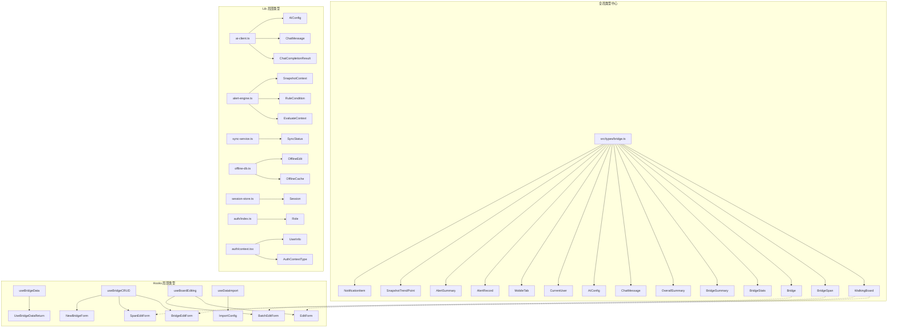

本项目的 TypeScript 类型定义采用 **"集中声明 + 局部扩展"** 的分层架构。核心业务实体类型统一收拢在 [`src/types/bridge.ts`](src/types/bridge.ts) 中，供前端组件、自定义 Hooks 和工具函数跨模块共享；而各 Hook 和 Lib 模块内部则按需定义局部接口（表单结构、函数参数/返回值等），不对外暴露。这种策略在保证类型一致性的同时，避免了单一文件无限膨胀的问题。

Sources: [bridge.ts](src/types/bridge.ts)

## 类型体系全览

在深入每个具体类型之前，先通过下图了解整个类型体系的组织关系——哪些是集中定义的全局类型，哪些是散布在各个模块中的局部类型：



Sources: [bridge.ts](src/types/bridge.ts), [ai-client.ts](src/lib/ai-client.ts#L6-L20), [alert-engine.ts](src/lib/alert-engine.ts#L13-L80), [offline-db.ts](src/lib/offline-db.ts#L7-L20), [sync-service.ts](src/lib/sync-service.ts#L5-L11), [session-store.ts](src/lib/session-store.ts#L4-L8), [auth/context.tsx](src/lib/auth/context.tsx#L6-L23), [auth/index.ts](src/lib/auth/index.ts#L50)

## 核心三级数据模型类型

项目的核心业务围绕 **桥梁 → 桥孔 → 步行板** 三级实体展开，它们在 TypeScript 中通过三个 `interface` 逐层嵌套，形成一棵从根到叶的完整数据树。

### WalkingBoard — 步行板

`WalkingBoard` 是数据树的最底层叶子节点，描述单块步行板的完整状态信息，包含 27 个字段，覆盖了基础标识、巡检状态、防滑性能、环境因素、附属设施和杂物积水等六大维度：

| 字段分组 | 关键字段 | 类型 | 说明 |
|---------|---------|------|------|
| **基础标识** | `id`, `boardNumber`, `position`, `columnIndex` | `string` / `number` | 唯一 ID、板号、上下游位置、列号 |
| **巡检状态** | `status`, `damageDesc`, `inspectedBy`, `inspectedAt` | `string` / `null` | 状态码、损坏描述、检查人、检查时间 |
| **防滑性能** | `antiSlipLevel`, `antiSlipLastCheck` | `number` / `null` | 防滑等级 0-100、上次检查时间 |
| **连接/环境** | `connectionStatus`, `weatherCondition`, `visibility` | `string` / `number` / `null` | 连接状态、天气条件、能见度 |
| **附属设施** | `railingStatus`, `bracketStatus` | `string` / `null` | 栏杆状态、托架状态 |
| **杂物积水** | `hasObstacle`, `obstacleDesc`, `hasWaterAccum`, `waterAccumDepth` | `boolean` / `string` / `number` / `null` | 是否有障碍物、积水信息 |
| **尺寸备注** | `boardLength`, `boardWidth`, `boardThickness`, `remarks` | `number` / `string` / `null` | 长宽厚（cm）和备注 |

值得注意的是，几乎所有描述性字段都声明为 `string | null`，这是因为新建的步行板在初始状态下这些属性尚未填写，使用联合类型精确地反映了"有值或未填"的真实业务状态。

Sources: [bridge.ts](src/types/bridge.ts#L3-L27)

### BridgeSpan — 桥孔

`BridgeSpan` 描述桥梁的一"孔"，包含该孔的几何参数和下属所有步行板。其核心设计在于 **对称布局建模**——上行（upstream）和下行（downstream）各自拥有独立的板数和列数配置，加上可选的避车台（shelter）区域：

```typescript
export interface BridgeSpan {
  id: string
  spanNumber: number          // 孔号（第几孔）
  spanLength: number           // 孔长度（米）
  upstreamBoards: number       // 上行步行板数量
  downstreamBoards: number     // 下行步行板数量
  upstreamColumns: number      // 上行列数
  downstreamColumns: number    // 下行列数
  shelterSide: string          // 避车台位置: none / single / double
  shelterBoards: number        // 每侧避车台板数
  shelterMaxPeople: number     // 避车台建议最大人数
  boardMaterial?: string       // 步行板材质（可选）
  walkingBoards: WalkingBoard[] // 该孔下属所有步行板
}
```

`walkingBoards` 数组将子实体直接嵌入父级，使得前端组件拿到一个 `BridgeSpan` 对象后无需再发起额外请求即可渲染整孔的步行板网格视图。`boardMaterial` 是唯一标记为可选（`?`）的字段，这是因为历史数据可能尚未录入材质信息。

Sources: [bridge.ts](src/types/bridge.ts#L29-L42)

### Bridge — 桥梁

`Bridge` 是数据树的根节点，仅保留桥梁的身份信息和下属桥孔列表：

```typescript
export interface Bridge {
  id: string
  name: string            // 桥梁名称
  bridgeCode: string      // 唯一编号
  location: string | null // 桥梁位置
  totalSpans: number      // 总孔数
  lineName: string | null // 所属线路
  spans: BridgeSpan[]     // 下属所有桥孔
}
```

这三个接口形成了一条清晰的 **包含链**：`Bridge` → `BridgeSpan[]` → `WalkingBoard[]`，前端任何层级的数据渲染都能从 `Bridge` 对象一路向下导航，体现了 GraphQL 式的嵌套数据获取思想。

Sources: [bridge.ts](src/types/bridge.ts#L44-L52)

## 统计聚合类型

在三级实体之外，系统还定义了一组统计聚合类型，用于仪表盘和趋势图表的数据传输。它们从原始实体数据中提炼出聚合指标，不再包含嵌套的子实体数组。

### BridgeStats 与 BridgeSummary

`BridgeStats` 提供单座桥梁的详细统计视图，包含桥梁级别指标和按孔位细分的 `spanStats` 数组；而 `BridgeSummary` 是精简版，仅保留桥梁级别指标（无孔位细分），用于列表页的全桥概览。两者共享以下核心字段：

| 指标 | 类型 | 含义 |
|------|------|------|
| `totalBoards` | `number` | 步行板总数 |
| `normalBoards` | `number` | 正常数量 |
| `minorDamageBoards` | `number` | 轻微损坏数量 |
| `severeDamageBoards` | `number` | 严重损坏数量 |
| `fractureRiskBoards` | `number` | 断裂风险数量 |
| `replacedBoards` | `number` | 已更换数量 |
| `missingBoards` | `number` | 缺失数量 |
| `damageRate` | `number` | 损坏率（百分比数值） |
| `highRiskRate` | `number` | 高风险率 |

`BridgeStats.spanStats` 中额外包含 `hasHighRisk: boolean` 布尔标记，方便 UI 层快速高亮风险孔位，无需在前端重复计算。

Sources: [bridge.ts](src/types/bridge.ts#L54-L100)

### OverallSummary — 全局总览

`OverallSummary` 是最高层级的聚合类型，汇总所有桥梁的整体健康指标，用于首页仪表盘：

```typescript
export interface OverallSummary {
  totalBridges: number
  totalSpans: number
  totalBoards: number
  // ... 各状态计数 ...
  overallDamageRate: number
  overallHighRiskRate: number
  highRiskBridges: string[]     // 高风险桥梁名称列表
  bridgeSummaries: BridgeSummary[]  // 每座桥的精简摘要
}
```

`highRiskBridges` 字段直接存储桥梁名称字符串数组，避免了前端再次遍历 `bridgeSummaries` 来筛选高风险项，体现了 API 层为前端消费场景优化数据结构的设计思路。

Sources: [bridge.ts](src/types/bridge.ts#L102-L116)

## AI 相关类型

AI 功能模块涉及两个核心类型——`ChatMessage` 和 `AIConfig`，它们在前端 `bridge.ts` 和后端 `ai-client.ts` 中分别有定义，但存在微妙的差异。

### ChatMessage — 对话消息

前端版本仅包含 `user` 和 `assistant` 两种角色，用于 UI 展示：

```typescript
// src/types/bridge.ts
export interface ChatMessage {
  role: 'user' | 'assistant'
  content: string
}
```

后端版本增加了 `system` 角色，用于构建发送给 AI 服务商的完整提示上下文：

```typescript
// src/lib/ai-client.ts
export interface ChatMessage {
  role: 'system' | 'user' | 'assistant'
  content: string
}
```

这种 **前端窄类型、后端宽类型** 的设计是有意为之——前端用户永远不会直接发送 `system` 角色的消息，因此在类型层面就限制了这种可能性；而后端需要注入系统提示词，所以扩展了角色枚举。

Sources: [bridge.ts](src/types/bridge.ts#L118-L121), [ai-client.ts](src/lib/ai-client.ts#L13-L16)

### AIConfig — AI 配置

`AIConfig` 同样在两处定义，内容完全一致，通过联合字面量类型约束 `provider` 只能是七个预定义值之一：

```typescript
export interface AIConfig {
  provider: 'glm' | 'openai' | 'claude' | 'deepseek' | 'minimax' | 'kimi' | 'custom'
  model: string
  apiKey: string
  baseUrl: string
}
```

后端 `ai-client.ts` 额外定义了 `ChatCompletionResult` 接口（`{ content: string }`），封装 AI 返回的文本结果，使 API 函数的返回类型明确且稳定。

Sources: [bridge.ts](src/types/bridge.ts#L123-L128), [ai-client.ts](src/lib/ai-client.ts#L6-L11), [ai-client.ts](src/lib/ai-client.ts#L18-L20)

## 认证与权限类型

### CurrentUser vs UserInfo

系统中存在两个用户信息接口，分别服务于不同的使用场景。`CurrentUser` 定义在全局类型文件中，仅包含最基本的信息（id、用户名、姓名、角色），用于前端页面级的状态管理：

```typescript
export interface CurrentUser {
  id: string
  username: string
  name: string | null
  role: string
}
```

`UserInfo` 定义在认证上下文 [`src/lib/auth/context.tsx`](src/lib/auth/context.tsx) 中，扩展了邮箱、电话、部门等字段，并服务于 `AuthProvider` 的全局状态树和 `useAuth` Hook。两者的 `role` 字段都是 `string` 类型，而非联合字面量——这是因为权限校验逻辑集中在后端的 [`requireAuth`](src/lib/auth/index.ts#L68-L80) 中，前端仅做简单的角色比对（如 `user.role === 'admin'`）。

### Role 类型别名

在 [`src/lib/auth/index.ts`](src/lib/auth/index.ts) 中，角色类型通过 `as const` 推断结合类型别名实现：

```typescript
export const ROLE_PERMISSIONS = {
  admin: { label: '系统管理员', permissions: ['*'], ... },
  manager: { label: '桥梁管理者', permissions: [...], ... },
  user: { label: '普通用户', permissions: [...], ... },
  viewer: { label: '只读用户', permissions: [...], ... },
} as const

export type Role = keyof typeof ROLE_PERMISSIONS
```

`Role` 被推导为 `'admin' | 'manager' | 'user' | 'viewer'` 四个字符串字面量的联合类型。这种从常量对象自动推断类型的方式，确保了权限配置与类型定义永远同步——新增角色只需修改 `ROLE_PERMISSIONS` 对象，类型会自动更新。

Sources: [bridge.ts](src/types/bridge.ts#L130-L135), [auth/context.tsx](src/lib/auth/context.tsx#L6-L23), [auth/index.ts](src/lib/auth/index.ts#L27-L50)

### AuthContextType

认证上下文接口 `AuthContextType` 定义了 `AuthProvider` 向子组件暴露的完整 API 契约：

```typescript
interface AuthContextType {
  user: UserInfo | null
  token: string | null
  loading: boolean
  login: (token: string, user: UserInfo) => void
  logout: () => Promise<void>
  checkAuth: () => Promise<void>
}
```

其中 `user` 初始值为 `null`（未登录态），`token` 持有 JWT 令牌字符串，`loading` 标识初始化鉴权检查的异步过程。这种 `null` 与具体类型的联合，是 React 认证上下文的标准模式。

Sources: [auth/context.tsx](src/lib/auth/context.tsx#L16-L23)

## 预警系统类型

预警引擎 [`src/lib/alert-engine.ts`](src/lib/alert-engine.ts) 定义了三个仅在服务端使用的接口，构成了快照保存 → 条件匹配 → 告警触发的完整类型链。

### SnapshotContext — 快照上下文

记录步行板被修改前的完整状态，用于每次更新操作前保存历史快照。`reason` 字段使用联合字面量 `'update' | 'batch_update' | 'import'` 精确区分三种触发来源，方便审计追踪。

### EvaluateContext — 评估上下文

包含桥梁级统计、被更新的步行板信息以及各孔位统计，供预警规则引擎的条件评估器使用。`updatedBoard` 使用了索引签名 `[key: string]: unknown`，为未来扩展新的评估维度预留了灵活性。

### RuleCondition — 规则条件（内部类型）

`RuleCondition` 未导出（`interface` 而非 `export interface`），仅在引擎内部使用，定义了预警规则的单个条件单元——字段名、比较运算符和目标值，对应 Prisma 中 `AlertRule.condition` 的 JSON 结构。

Sources: [alert-engine.ts](src/lib/alert-engine.ts#L13-L80)

## 离线支持类型

### OfflineEdit — 离线编辑记录

`OfflineEdit` 描述一条待同步到服务端的离线操作记录，存储在 IndexedDB 中：

```typescript
export interface OfflineEdit {
  id: string
  type: 'board' | 'span' | 'bridge'   // 操作对象类型
  action: 'create' | 'update' | 'delete' // 操作动作
  data: Record<string, unknown>        // 操作数据
  timestamp: number                     // 时间戳
  synced: boolean                       // 是否已同步
}
```

`type` 和 `action` 的联合字面量类型确保同步服务在构造 API 请求时只能使用合法的组合（如 `board` + `update` → `PUT /api/boards`），从类型层面排除了非法操作。

### SyncStatus — 同步状态

`SyncStatus` 描述离线同步的运行时状态，由 `SyncService` 单例维护并通过发布-订阅模式通知 UI：

| 字段 | 类型 | 含义 |
|------|------|------|
| `isOnline` | `boolean` | 当前是否在线 |
| `isSyncing` | `boolean` | 是否正在同步 |
| `pendingCount` | `number` | 待同步记录数 |
| `lastSyncTime` | `number \| null` | 上次同步时间戳 |
| `error` | `string \| null` | 最近一次同步错误 |

Sources: [offline-db.ts](src/lib/offline-db.ts#L7-L20), [sync-service.ts](src/lib/sync-service.ts#L5-L11)

### OfflineCache — 离线缓存

`OfflineCache` 是一个简单的缓存结构，仅包含 `bridges` 数组和 `lastSync` 时间戳，用于在断网时为前端提供最近一次的桥梁数据快照。

Sources: [offline-db.ts](src/lib/offline-db.ts#L17-L20)

## 通知与趋势类型

### NotificationItem — 站内通知

`NotificationItem` 映射 Prisma 的 `Notification` 模型到前端类型，包含通知的标题、内容、类型、严重程度、关联 ID 和已读状态。

### SnapshotTrendPoint — 快照趋势数据点

`SnapshotTrendPoint` 为趋势图表提供单个时间点的聚合数据，包含日期、各状态板数、损坏率和高风险率。每个数据点对应一次历史快照时刻的系统状态，前端按时间顺序排列后绘制折线图。

### AlertRecord 与 AlertSummary

`AlertRecord` 是预警记录的完整类型，其中的 `severity` 和 `status` 字段使用了联合字面量类型精确约束取值范围。`AlertSummary` 则是轻量级的计数汇总，仅包含三个数字字段：`activeCritical`、`activeWarning` 和 `activeInfo`。

Sources: [bridge.ts](src/types/bridge.ts#L137-L189)

## 其他全局类型

### MobileTab — 移动端标签页

```typescript
export type MobileTab = 'bridge' | 'alert' | 'detail' | 'ai' | 'profile'
```

这是整个项目中唯一使用 `type` 别名（而非 `interface`）定义的全局类型。`MobileTab` 约束了移动端底部导航栏的五个固定标签页，`useResponsive` Hook 和 `useBridgePage` 均依赖此类型进行标签切换的状态管理。

Sources: [bridge.ts](src/types/bridge.ts#L137)

### Session — 服务端会话

`Session` 定义在 [`src/lib/session-store.ts`](src/lib/session-store.ts) 中，仅服务端使用，包含用户 ID、创建时间和过期时间三个字段。它不导出，是文件级私有类型，仅供会话存储模块内部使用。

Sources: [session-store.ts](src/lib/session-store.ts#L4-L8)

## Hooks 局部类型模式

每个自定义 Hook 都遵循统一的 **Params + Return** 类型声明模式：在 Hook 函数上方定义 `UseXxxParams` 和 `UseXxxReturn` 接口，分别描述输入参数和解构返回值。这种模式将 Hook 的公共契约显式化，IDE 可以精确提示每个返回属性的类型和含义。

以 `useBoardEditing` 为例：

```typescript
interface UseBoardEditingParams {
  selectedBridge: Bridge | null
  selectedSpanIndex: number
  refreshBridgeData: () => Promise<void>
}

interface UseBoardEditingReturn {
  editingBoard: WalkingBoard | null
  editDialogOpen: boolean
  // ... 20+ 个返回属性
}
```

各 Hook 还定义了专用的表单接口（`EditForm`、`BatchEditForm`、`BridgeEditForm`、`SpanEditForm`、`NewBridgeForm`、`ImportConfig`），这些接口的字段名与对应 Prisma 模型的字段名保持一致，确保 `JSON.stringify(form)` 后可以直接作为 API 请求体使用，无需手动映射。

| Hook | 表单接口 | 对应实体 |
|------|---------|---------|
| `useBoardEditing` | `EditForm`, `BatchEditForm` | `WalkingBoard` |
| `useBridgeCRUD` | `BridgeEditForm`, `SpanEditForm`, `NewBridgeForm` | `Bridge`, `BridgeSpan` |
| `useDataImport` | `ImportConfig` | 无（纯配置） |

Sources: [useBoardEditing.ts](src/hooks/useBoardEditing.ts#L8-L80), [useBridgeCRUD.ts](src/hooks/useBridgeCRUD.ts#L8-L111), [useDataImport.ts](src/hooks/useDataImport.ts#L7-L31)

## 全局类型与 Prisma Schema 的映射关系

前端全局类型并非 Prisma 模型的直接镜像——它们经过了有意的简化和重组。理解两者的映射关系，有助于在修改数据库 Schema 后正确同步前端类型。

```mermaid
graph LR
    subgraph Prisma Models
        P_Bridge["Bridge<br/>+ createdAt, updatedAt"]
        P_Span["BridgeSpan<br/>+ bridgeId, createdAt, updatedAt"]
        P_Board["WalkingBoard<br/>+ spanId, photoUrl, createdAt, updatedAt"]
        P_Snapshot["BoardStatusSnapshot"]
        P_User["User<br/>+ password, loginCount..."]
    end

    subgraph TS Types
        T_Bridge["Bridge"]
        T_Span["BridgeSpan"]
        T_Board["WalkingBoard"]
        T_Stats["BridgeStats"]
        T_User["CurrentUser"]
    end

    P_Bridge -->|"省略时间戳<br/>+ 嵌入 spans"--> T_Bridge
    P_Span -->|"省略外键<br/>+ 嵌入 walkingBoards"--> T_Span
    P_Board -->|"省略外键<br/>+ DateTime→string"--> T_Board
    P_Snapshot -->|"聚合计算"--> T_Stats
    P_User -->|"省略敏感字段"--> T_User
```

关键映射规则总结如下：

| Prisma → TypeScript | 说明 |
|---------------------|------|
| `DateTime?` → `string \| null` | 前端不使用 `Date` 对象，统一用 ISO 字符串表示时间 |
| 外键字段（`bridgeId`, `spanId`） | 在嵌套类型中通常省略，因为父对象已经提供了上下文 |
| `createdAt`, `updatedAt` | 前端类型中不包含审计字段，减少传输体积 |
| `password` 等敏感字段 | 完全不暴露到前端类型 |
| 关联字段（`spans`, `walkingBoards`） | 从 `Relation[]` 变为嵌套数组 |

Sources: [bridge.ts](src/types/bridge.ts), [schema.prisma](prisma/schema.prisma)

## 类型定义的设计原则总结

纵观整个类型体系，可以归纳出以下五条贯穿始终的设计原则：

1. **集中与分散的平衡**：跨模块共享的实体类型集中在 `src/types/bridge.ts`，模块内部使用的表单和参数类型就近定义在各自文件中，保持内聚性。

2. **联合字面量代替枚举**：项目全程使用 `'user' | 'assistant'` 等字符串联合类型而非 TypeScript `enum`，这与 Prisma 的字符串枚举策略保持一致，同时避免了枚举在运行时的额外代码。

3. **`null` 表示"未填"而非 `undefined`**：可选字段统一使用 `string | null` 而非 `string | undefined`，这是因为 JSON 序列化中 `undefined` 会被自动忽略，而 `null` 能明确传达"值为空"的语义。

4. **表单类型与实体类型的字段名对齐**：Hook 中定义的 `EditForm`、`SpanEditForm` 等表单接口，其字段名与对应的全局类型完全一致，使得 `JSON.stringify(form)` 可以直接作为 API 请求体，零映射成本。

5. **Params + Return 契约模式**：每个自定义 Hook 通过显式的 `UseXxxParams` 和 `UseXxxReturn` 接口声明其输入输出契约，替代了松散的 `any` 或内联类型，为 Hook 的组合调用提供了类型安全保障。

Sources: [bridge.ts](src/types/bridge.ts), [useBoardEditing.ts](src/hooks/useBoardEditing.ts#L8-L80), [useBridgeCRUD.ts](src/hooks/useBridgeCRUD.ts#L8-L111)

## 延伸阅读

- 了解这些类型背后的 Prisma 数据库模型设计，请参阅 [Prisma 数据库 Schema 设计（11 个模型）](7-prisma-shu-ju-ku-schema-she-ji-11-ge-mo-xing)
- 了解类型在自定义 Hooks 中的具体使用模式，请参阅 [自定义 Hooks 架构设计模式](14-zi-ding-yi-hooks-jia-gou-she-ji-mo-shi)
- 了解预警系统的类型如何参与条件评估，请参阅 [预警规则引擎：快照保存、条件评估与自动去重](16-yu-jing-gui-ze-yin-qing-kuai-zhao-bao-cun-tiao-jian-ping-gu-yu-zi-dong-qu-zhong)
- 了解离线类型如何驱动 IndexedDB 存储与同步，请参阅 [离线支持：IndexedDB 本地存储与自动同步服务](25-chi-xian-zhi-chi-indexeddb-ben-di-cun-chu-yu-zi-dong-tong-bu-fu-wu)