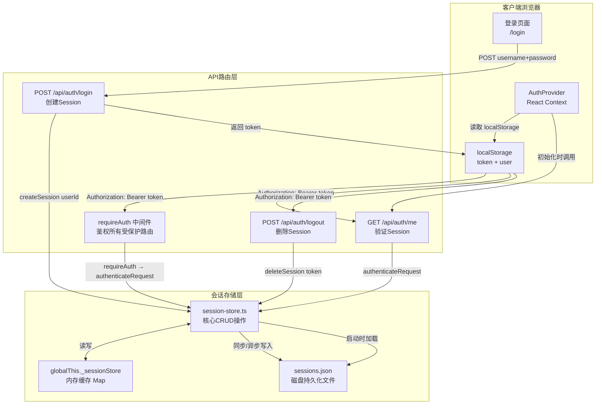
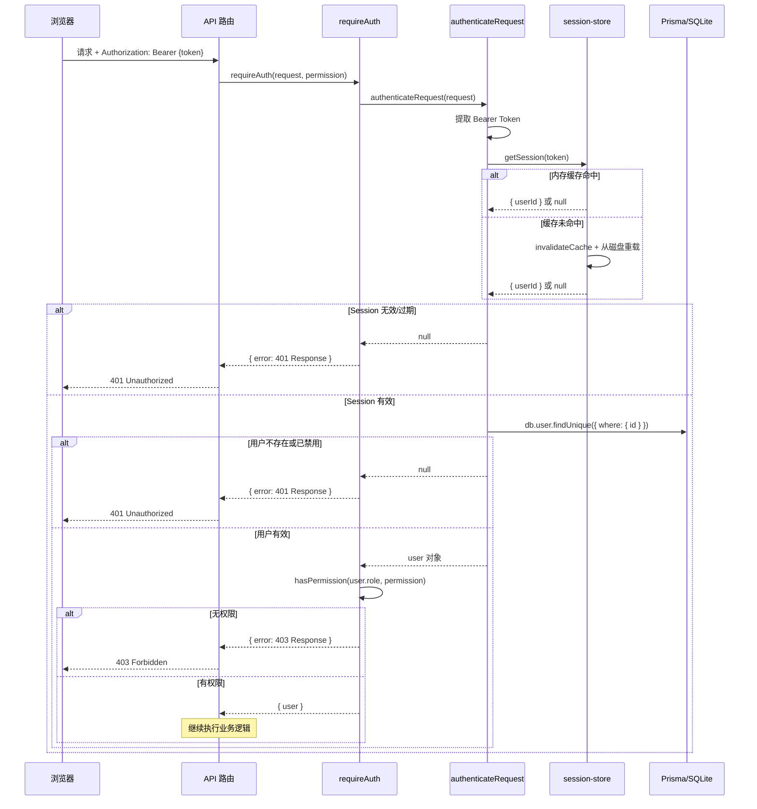

本系统采用**基于 JSON 文件的 Session 会话管理方案**，而非传统的 Redis/数据库 Session 存储。这是一种面向中小规模内部系统的轻量级设计——所有会话以 `{token: sessionData}` 结构持久化到磁盘文件 `prisma/db/sessions.json`，同时在内存中通过 `globalThis` 单例缓存保持高速读取。本文将解析这套机制的核心架构、读写策略、过期清理，以及前后端在 Token 传递中的完整协作流程。

Sources: [session-store.ts](src/lib/session-store.ts#L1-L170), [sessions.json](prisma/db/sessions.json#L1-L17)

## 架构总览：文件存储 + 内存缓存双层模型

在深入每个细节之前，先从宏观层面理解整个会话管理系统的数据流向与模块关系。下图展示了从用户登录到后续鉴权请求的完整生命周期：



从图中可以看出三层清晰的职责划分：**客户端**负责 Token 的持久存储与自动附加、**API 路由层**负责 Session 的创建/验证/销毁、**会话存储层**负责内存缓存与磁盘文件的协调管理。

Sources: [session-store.ts](src/lib/session-store.ts#L1-L170), [auth/index.ts](src/lib/auth/index.ts#L1-L182), [AuthProvider.tsx](src/components/auth/AuthProvider.tsx#L65-L150)

## 核心数据结构

会话系统涉及两类关键数据结构：**Session 数据模型**和**存储文件格式**。

### Session 接口定义

每个会话由三个字段组成，精简而完备：

| 字段 | 类型 | 说明 | 示例值 |
|------|------|------|--------|
| `userId` | `string` | 关联的用户 ID（Prisma 生成的 CUID） | `"cmnbd4zq200clunx8cdnhaqm2"` |
| `createdAt` | `string` | 会话创建时间（ISO 8601） | `"2026-03-31T22:39:03.573Z"` |
| `expiresAt` | `string` | 会话过期时间（ISO 8601，创建时间 +7 天） | `"2026-04-07T22:39:03.573Z"` |

Sources: [session-store.ts](src/lib/session-store.ts#L4-L8)

### 磁盘文件格式

`prisma/db/sessions.json` 以扁平的 JSON 对象存储，Key 为 64 位十六进制 Token，Value 为上述 Session 对象：

```json
{
  "07326077342a4ac65cf55b633ef78d2b...": {
    "userId": "cmnbd4zq200clunx8cdnhaqm2",
    "createdAt": "2026-03-29T15:44:52.354Z",
    "expiresAt": "2026-04-05T15:44:52.354Z"
  },
  "425fe08033672ce6d03f3f13bf8145ce...": {
    "userId": "cmnbd4zq200clunx8cdnhaqm2",
    "createdAt": "2026-03-29T16:51:31.415Z",
    "expiresAt": "2026-04-05T16:51:31.415Z"
  }
}
```

这种扁平结构意味着同一用户可以在多个设备上持有多个有效 Session——系统按 Token 维度而非用户维度管理会话，天然支持多点登录。

Sources: [sessions.json](prisma/db/sessions.json#L1-L17)

## 内存缓存机制：globalThis 单例模式

Next.js 在开发模式下会为不同的 API 路由创建独立的模块实例，这会导致普通的模块级变量无法在路由间共享。系统通过 `globalThis` 全局对象解决了这一问题：

```typescript
const globalForSessions = globalThis as unknown as {
  _sessionStore: {
    cache: Map<string, Session> | null   // 内存中的会话缓存
    lastSaveTime: number                  // 上次写入磁盘的时间戳
  }
}
```

**`cache`** 是一个 `Map<string, Session>` 实例，以 Token 为 Key 进行 O(1) 查找。**`lastSaveTime`** 配合 5 秒的 `SAVE_INTERVAL` 实现写入防抖。首次访问时两个值分别为 `null` 和 `0`，触发从磁盘文件加载会话数据。这种设计确保无论 Next.js 创建多少个模块实例，它们始终读写同一块内存区域。

Sources: [session-store.ts](src/lib/session-store.ts#L12-L26), [session-store.ts](src/lib/session-store.ts#L28-L47)

## Token 生成与安全特性

Session Token 的生成使用了密码学安全的随机数生成器，而非普通的 `Math.random()`：

```typescript
const token = Array.from(crypto.getRandomValues(new Uint8Array(32)))
  .map(b => b.toString(16).padStart(2, '0'))
  .join('')
```

这段代码从 `crypto.getRandomValues` 生成 32 字节（256 位）的随机数据，再将每个字节转换为 2 位十六进制字符串，最终拼接为 **64 个字符的 Token**。`crypto.getRandomValues` 是 Web Crypto API 的一部分，在 Node.js 运行时中同样可用，它使用操作系统的密码学安全随机数生成器（CSPRNG），保证了 Token 的不可预测性和不可暴力枚举性。会话有效期固定为 **7 天**（`7 * 24 * 60 * 60 * 1000` 毫秒），在创建时即确定过期时间，不做续期操作。

Sources: [session-store.ts](src/lib/session-store.ts#L77-L107)

## 四大核心操作详解

### createSession —— 创建会话（同步写入）

`createSession` 是唯一一个**同步写入磁盘**的操作。这是经过深思熟虑的设计决策：用户登录后可能立即发起下一个请求（如获取用户信息），如果采用异步写入，后续请求可能因为文件尚未更新而认为 Token 无效。因此创建会话时直接调用 `fs.writeFileSync` 确保数据落盘，同时更新 `lastSaveTime` 防止后续的 `scheduleSave` 重复写入。

创建流程如下：首先生成 Token 并计算过期时间 → 将 Session 写入内存 Map → 立即同步序列化 Map 为 JSON 并写入文件 → 返回 Token 给调用方。

Sources: [session-store.ts](src/lib/session-store.ts#L77-L107)

### getSession —— 获取会话（概率性清理 + 二次加载）

`getSession` 是整个会话系统中调用频率最高的操作——每个需要鉴权的 API 请求都会调用它。其逻辑包含两层防御：

**第一层：内存缓存命中后检查过期**。从 Map 中取出 Session，若已过期则删除并返回 `null`。

**第二层：缓存未命中时的磁盘回退**。如果内存中没有找到该 Token，调用 `invalidateCache()` 将缓存置为 `null`，然后重新从磁盘文件加载。这是因为 Next.js 可能存在多个模块实例，其他实例写入的新 Session 可能尚未反映到当前实例的内存中。

此外还有一个巧妙的**概率性过期清理**机制：每次调用 `getSession` 时以 1% 的概率（`Math.random() < 0.01`）触发 `cleanExpiredSessions()`。这意味着在日均有 1000 次请求的系统中，大约每 100 次请求会触发一次全量过期清理，既避免了过期 Session 无限堆积，又不会每次请求都付出 O(n) 的清理代价。

Sources: [session-store.ts](src/lib/session-store.ts#L110-L135)

### deleteSession —— 删除会话（同步写入）

登出操作调用 `deleteSession`，它从内存 Map 中移除指定 Token 后**立即同步写入磁盘**。这与 `createSession` 同理：确保登出操作立即生效，不会被其他 API 路由误判为仍处于登录状态。在登出 API 路由中，先通过 `authenticateRequest` 验证用户身份，然后提取 Token 调用 `deleteSession`，同时记录操作日志。

Sources: [session-store.ts](src/lib/session-store.ts#L138-L153), [logout/route.ts](src/app/api/auth/logout/route.ts#L1-L42)

### cleanExpiredSessions —— 清理过期会话（防抖写入）

过期清理遍历整个 Map，删除所有 `expiresAt` 早于当前时间的条目。如果确实有删除操作发生（`changed === true`），则调用 `scheduleSave()` 进行写入——这是一个带防抖的异步写入函数，仅在距离上次写入超过 **5 秒**（`SAVE_INTERVAL = 5000`）时才真正执行文件写入。这种设计在清理操作频繁但数据变化微小时有效减少磁盘 I/O。

Sources: [session-store.ts](src/lib/session-store.ts#L156-L169), [session-store.ts](src/lib/session-store.ts#L55-L74)

## 写入策略对比：同步 vs 防抖

不同操作对数据一致性的要求不同，系统为此设计了两种写入策略：

| 写入策略 | 适用操作 | 写入时机 | 设计理由 |
|----------|---------|----------|----------|
| **同步写入** (`writeFileSync`) | `createSession`、`deleteSession` | 立即执行 | 登录/登出必须立即可见，防止后续请求读取到过期状态 |
| **防抖写入** (`scheduleSave`) | `cleanExpiredSessions`、`getSession` 中触发过期删除 | 距上次写入 ≥5 秒时执行 | 清理操作频率低但可能批量发生，减少不必要的磁盘 I/O |

Sources: [session-store.ts](src/lib/session-store.ts#L55-L74), [session-store.ts](src/lib/session-store.ts#L92-L104)

## 完整请求鉴权流程

理解了核心操作后，让我们追踪一个典型的鉴权请求从发起到响应的全过程。以下是 `requireAuth` 中间件的调用链路：



值得注意的是，`authenticateRequest` 不仅验证 Session 本身的有效性，还会**查询数据库确认用户状态**——即使用户的 Session 未过期，如果管理员已将该用户禁用（`user.status !== 'active'`），该请求仍会被拒绝。这提供了一层即时生效的管理控制能力。

Sources: [auth/index.ts](src/lib/auth/index.ts#L159-L181), [auth/index.ts](src/lib/auth/index.ts#L68-L80)

## 客户端 Token 管理

客户端通过 `localStorage` 存储 Token 和用户信息，并通过两层 React Context 提供 Token 给所有组件使用。

### Token 存储与传递

登录成功后，页面将服务端返回的 `token` 和 `user` 对象存入 `localStorage`：

```typescript
localStorage.setItem('token', result.data.token)
localStorage.setItem('user', JSON.stringify(result.data.user))
```

后续所有 API 请求通过 `Authorization: Bearer {token}` 请求头传递 Token。这一机制由 `AuthProvider` 组件统一管理——它从 `localStorage` 读取 Token 并通过 React Context 分发给所有子组件。

Sources: [login/page.tsx](src/app/login/page.tsx#L88-L90), [AuthProvider.tsx](src/components/auth/AuthProvider.tsx#L72-L97)

### AuthProvider 初始化流程

`AuthProvider` 组件在应用启动时执行以下初始化逻辑：检查 `localStorage` 中是否存在 `token` 和 `user` → 如果不存在且当前不在登录页，则重定向到 `/login` → 如果存在，解析用户数据存入组件状态。与 `src/lib/auth/context.tsx` 中的旧版实现不同，新版 `AuthProvider` 不在初始化时调用 `/api/auth/me` 接口验证 Token——它信任 `localStorage` 中的数据，将验证推迟到实际发起 API 请求时由 `requireAuth` 中间件完成。这是一种**延迟验证**策略，减少了应用启动时的网络请求。

Sources: [AuthProvider.tsx](src/components/auth/AuthProvider.tsx#L65-L150)

### 登出流程

登出操作分为两步：首先调用 `POST /api/auth/logout` 将服务端 Session 删除，然后清除 `localStorage` 中的 `token` 和 `user`。即使服务端请求失败（如网络中断），`finally` 块仍会清除本地存储并跳转到登录页，确保客户端总是干净地退出。服务端在收到登出请求后，通过 `authenticateRequest` 确认身份，再调用 `deleteSession(token)` 同步删除会话记录，同时记录操作日志。

Sources: [AuthProvider.tsx](src/components/auth/AuthProvider.tsx#L99-L115), [logout/route.ts](src/app/api/auth/logout/route.ts#L5-L41)

## 文件存储方案的适用场景与局限

### 适用场景

基于文件的 Session 存储方案在以下条件下表现优异：

- **单实例部署**：应用只运行在一个 Node.js 进程中（如 PM2 单实例模式），无需跨进程同步会话
- **中小规模用户量**：会话数量在数百到数千量级，JSON 文件的读写性能完全足够
- **内部管理系统**：无需分布式 Session 共享，部署架构简单可控
- **快速迭代阶段**：无需引入 Redis 等外部依赖，降低了部署和维护复杂度

### 已知局限

| 局限 | 原因 | 影响 | 缓解措施 |
|------|------|------|----------|
| **不支持多实例** | 会话存储在本地文件系统，各实例无法共享 | 水平扩展时用户可能被路由到不同实例导致登出 | 使用粘性会话或升级为 Redis 存储 |
| **无原子性保证** | JSON 文件读写不是原子操作 | 极端并发下可能出现数据不一致 | 写入操作加了 `lastSaveTime` 防抖，降低冲突概率 |
| **全量读写** | 每次写入都是序列化整个 Map | 会话数量极大时性能下降 | 概率性清理控制 Map 大小，7 天自然过期 |
| **进程重启丢失缓存** | 内存缓存在进程重启后清空 | 首次请求需要从磁盘加载，启动稍慢 | 磁盘文件作为持久备份，启动时自动加载 |

Sources: [session-store.ts](src/lib/session-store.ts#L1-L47)

## 模块依赖关系

会话管理涉及以下核心文件，各自职责明确：

| 文件 | 职责 | 核心导出 |
|------|------|----------|
| [session-store.ts](src/lib/session-store.ts) | 会话 CRUD 与文件读写 | `createSession`, `getSession`, `deleteSession`, `cleanExpiredSessions` |
| [auth/index.ts](src/lib/auth/index.ts) | 认证中间件、密码验证、权限检查 | `requireAuth`, `authenticateRequest`, `hashPassword`, `verifyPassword` |
| [auth/context.tsx](src/lib/auth/context.tsx) | 旧版客户端认证 Context（已被 AuthProvider 替代） | `AuthProvider`, `useAuth`, `usePermission` |
| [auth/AuthProvider.tsx](src/components/auth/AuthProvider.tsx) | 新版客户端认证 Context，管理 Token 生命周期 | `AuthProvider`, `useAuthContext` |
| [auth/login/route.ts](src/app/api/auth/login/route.ts) | 登录 API，调用 `createSession` | `POST` |
| [auth/logout/route.ts](src/app/api/auth/logout/route.ts) | 登出 API，调用 `deleteSession` | `POST` |
| [auth/me/route.ts](src/app/api/auth/me/route.ts) | 当前用户信息 API，调用 `authenticateRequest` | `GET` |

Sources: [auth/index.ts](src/lib/auth/index.ts#L155-L156)

## 延伸阅读

会话管理是认证体系的基础层，理解本页内容后，建议继续阅读以下相关主题：

- **[RBAC 四级角色权限控制体系](10-rbac-si-ji-jiao-se-quan-xian-kong-zhi-ti-xi)**：解析 `requireAuth` 中 `hasPermission` 背后的 admin/manager/user/viewer 四级权限模型
- **[登录安全：密码哈希与账户锁定策略](11-deng-lu-an-quan-mi-ma-ha-xi-yu-zhang-hu-suo-ding-ce-lue)**：深入 `pbkdf2Sync` 密码哈希和 5 次失败锁定 15 分钟的防暴力破解机制
- **[requireAuth 统一鉴权中间件](13-requireauth-tong-jian-quan-zhong-jian-jian)**：详解每个受保护 API 路由如何通过 `requireAuth` 实现声明式权限校验
- **[生产部署指南（PM2 + 反向代理）](28-sheng-chan-bu-shu-zhi-nan-pm2-fan-xiang-dai-li)**：在单实例 PM2 部署下，文件型 Session 的最佳配置实践